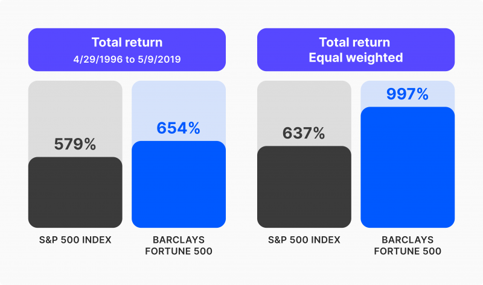

## Table of Contents

## What is the S&P 500?

The S&P 500 is a stock market index that measures the performance of 500 large companies listed on stock exchanges in the United States. It is considered a good indicator of how the overall U.S. economy is doing because it includes companies from many different industries, like technology, healthcare, and finance. The index is managed by a company called Standard & Poor's, which is why it's called the S&P 500.

When people talk about "the market" going up or down, they often mean the S&P 500. Investors use this index to see if their investments are doing well compared to the market as a whole. If the S&P 500 goes up, it usually means that the economy is growing and companies are making more money. If it goes down, it can mean that people are worried about the economy and are selling their stocks.

## What is the Fortune 500?

The Fortune 500 is a list of the 500 biggest companies in the United States. It is made by a magazine called Fortune. The list comes out every year and shows which companies made the most money in the last year. It is a good way to see which companies are doing well and which ones are growing.

The list includes companies from many different kinds of businesses, like making cars, selling things in stores, and technology. Being on the Fortune 500 list is a big deal for a company because it shows that they are one of the top businesses in the country. People use the list to learn about the biggest companies and how they are doing.

## How are companies selected for the S&P 500?

Companies are picked for the S&P 500 by a group of people at Standard & Poor's. They look at a few things to decide if a company should be in the index. The most important thing is that the company must be big and have a lot of its stock owned by the public. They also check if the company is based in the U.S. and if it's doing well financially.

The group also makes sure that the companies in the S&P 500 come from many different kinds of businesses. This way, the index shows how the whole economy is doing, not just one part of it. If a company is doing really well and meets all the rules, it might be added to the S&P 500. If a company is not doing well anymore, it might be taken out and replaced with a better one.

## How are companies selected for the Fortune 500?

Companies are chosen for the Fortune 500 list based on how much money they made in the last year. The list is made by the magazine called Fortune. They look at the total revenue of companies that are based in the United States. Revenue is the money a company gets from selling its products or services. The 500 companies with the highest revenue make it onto the list.

The list is updated every year, so a company might be on the list one year but not the next if its revenue goes down. Fortune uses information from the companies themselves and from other sources to make sure the numbers are correct. Being on the Fortune 500 list is a big deal because it shows that a company is one of the biggest in the country.

## What are the main differences between the S&P 500 and the Fortune 500?

The S&P 500 and the Fortune 500 are two different lists that tell us about big companies in the U.S., but they focus on different things. The S&P 500 is a stock market index that tracks the performance of 500 large companies listed on U.S. stock exchanges. These companies are chosen by a group at Standard & Poor's, who look at things like the size of the company, how much of its stock is owned by the public, and how well it's doing financially. The S&P 500 tries to show how the whole U.S. economy is doing by including companies from many different industries.

On the other hand, the Fortune 500 is a list made by the magazine Fortune that ranks the 500 biggest companies in the U.S. based on their total revenue from the past year. Revenue is the money a company makes from selling its products or services. The list is updated every year, and being on it means a company is one of the top earners in the country. Unlike the S&P 500, the Fortune 500 doesn't look at how the companies are doing in the stock market; it just looks at how much money they made.

So, the main difference is that the S&P 500 focuses on how well companies are doing in the stock market and includes a mix of industries to reflect the overall economy, while the Fortune 500 is all about which companies made the most money, no matter what industry they're in or how their stocks are doing.

## How do the performance metrics of the S&P 500 and Fortune 500 companies compare?

The S&P 500 and the Fortune 500 measure different things about big companies in the U.S. The S&P 500 looks at how well companies are doing in the stock market. It tracks the price of stocks from 500 large companies and shows if those stocks are going up or down. This helps investors see if the economy is doing well because the S&P 500 includes companies from many different kinds of businesses. If the S&P 500 goes up, it usually means people think the economy is growing and companies are making more money. If it goes down, it can mean people are worried about the economy and are selling their stocks.

The Fortune 500, on the other hand, focuses on how much money companies make from selling their products or services. It lists the 500 companies with the highest revenue in the U.S. each year. Revenue is the total amount of money a company brings in before it pays for things like making the product or running the business. The Fortune 500 doesn't care about stock prices; it just looks at how much money a company made. So, a company can be on the Fortune 500 if it has a lot of revenue, even if its stock price isn't doing well.

Comparing the two, the S&P 500 gives us a picture of how the stock market is doing, which can be a sign of how investors feel about the economy. The Fortune 500 tells us which companies are the biggest in terms of money made, but it doesn't tell us anything about their stock performance. Both lists are important, but they show different sides of how big companies are doing in the U.S.

## Can you invest directly in the S&P 500 and the Fortune 500, and if so, how?

You can invest directly in the S&P 500 by buying an index fund or an [ETF](/wiki/etf-trading-strategies) (Exchange-Traded Fund) that tracks the S&P 500. An index fund is like a basket of stocks that tries to match the performance of the S&P 500. You can buy these funds through a brokerage account, which is like a special bank account for buying and selling investments. ETFs work a bit like stocks, so you can buy and sell them during the day just like you would with any other stock. This way, you can own a little piece of all the companies in the S&P 500 without having to buy each stock separately.

You cannot invest directly in the Fortune 500 because it's just a list of companies based on their revenue, not a stock market index. But you can invest in the individual companies that are on the Fortune 500 list. You would need to look up each company, see if it's publicly traded, and then buy its stock through a brokerage account. This means you have to pick and choose which companies you want to invest in, and it can be more work than investing in something like the S&P 500.

## What industries are most represented in the S&P 500 compared to the Fortune 500?

In the S&P 500, the industries that are most represented are technology, healthcare, and finance. These industries have a lot of big companies that are doing well in the stock market. The S&P 500 tries to show how the whole U.S. economy is doing, so it includes companies from many different kinds of businesses. But because the index looks at how well companies are doing in the stock market, industries like technology and finance often have more companies in the S&P 500 because their stocks can go up a lot.

The Fortune 500, on the other hand, is all about which companies made the most money last year. The industries that are most represented in the Fortune 500 are often retail, healthcare, and energy. These industries have a lot of big companies that make a lot of money from selling things or services. The Fortune 500 doesn't care about stock prices, so it can include companies that are big because they sell a lot, even if their stocks aren't doing well. This means you might see more companies from industries like retail and energy on the Fortune 500 list.

## How have the S&P 500 and Fortune 500 evolved over time in terms of composition?

The S&P 500 has changed a lot over time. It started in 1957 with 500 companies, but the companies in it have changed as the economy and businesses have grown and changed. At first, there were more companies from industries like manufacturing and heavy industry. But over time, as technology and finance became bigger parts of the economy, more companies from those industries got into the S&P 500. The people who manage the S&P 500 look at how well companies are doing and might add new companies or take out old ones to make sure the index still shows a good picture of the U.S. economy.

The Fortune 500 has also changed a lot since it started in 1955. At first, it had a lot of companies from industries like oil, steel, and cars. But as time went on, and new kinds of businesses grew, the list started to include more companies from technology, healthcare, and retail. The Fortune 500 list changes every year because it looks at how much money companies made in the last year. So, if a company starts making more money, it might get on the list, and if it makes less money, it might get taken off. This means the list always shows the biggest companies at that time, but the companies on it can change a lot from year to year.

## What impact do economic cycles have on the S&P 500 versus the Fortune 500?

Economic cycles can really change how the S&P 500 does. When the economy is doing well and growing, the S&P 500 usually goes up because people feel good about buying stocks. Companies in the S&P 500 make more money, and their stock prices go up. But when the economy is not doing so well, like during a recession, the S&P 500 can go down. People might start selling their stocks because they're worried about the economy, and this can make stock prices fall. The S&P 500 is all about how stocks are doing, so it can go up and down a lot with the economy.

The Fortune 500 is different because it's about how much money companies make, not just how their stocks are doing. During a good economic time, companies on the Fortune 500 list might make more money because people are buying more things. But even in tough times, some companies on the Fortune 500 can still make a lot of money. For example, people might still need to buy food or medicine, so those companies can stay on the list. The Fortune 500 changes every year based on revenue, so it can show how companies are doing over time, but it doesn't go up and down as quickly as the S&P 500.

## How do global economic factors influence the performance of the S&P 500 and Fortune 500 differently?

Global economic factors can really change how the S&P 500 does. If other countries are doing well, their economies might buy more from U.S. companies, making their stocks go up. But if other countries are not doing well, like if they have a recession, it can hurt U.S. companies because they might sell less stuff overseas. The S&P 500 is all about how stocks are doing, so if global news makes people worry, they might sell their stocks, making the S&P 500 go down. Things like trade wars, changes in oil prices, or big events like a global health crisis can also make the S&P 500 move up or down a lot.

The Fortune 500 is different because it's about how much money companies make, not just how their stocks are doing. Global economic factors can still affect the companies on the Fortune 500 list, but in a different way. If other countries are doing well, companies might make more money because they can sell more stuff overseas. But if other countries are not doing well, it might be harder for companies to make as much money. The Fortune 500 list changes every year based on how much money companies made, so it can take a bit longer to see the effects of global economic changes. But big global events, like changes in oil prices or trade policies, can still make a big difference in which companies make it onto the list each year.

## What advanced metrics or analytical tools can be used to compare the S&P 500 and Fortune 500 more deeply?

To compare the S&P 500 and Fortune 500 more deeply, you can use advanced metrics like the Price-to-Earnings (P/E) ratio for the S&P 500 companies. This ratio tells you how much people are willing to pay for a dollar of the company's earnings. A high P/E ratio might mean people think the company will grow a lot in the future. For the Fortune 500, you can look at the revenue growth rate, which shows how much more money a company is making compared to last year. You can also use the Return on Assets (ROA) to see how well a company is using its money to make more money. These metrics can help you understand how the companies are doing in different ways.

Another tool you can use is a sector analysis. This means looking at how different industries are doing in both the S&P 500 and the Fortune 500. You might find that some industries are doing better in one list than the other. For example, tech companies might be doing great in the S&P 500 because their stocks are going up, but they might not be making as much money as retail companies on the Fortune 500. By comparing the sectors, you can see where the big differences are between the two lists.

You can also use a correlation analysis to see how the S&P 500 and Fortune 500 move together over time. This can show you if changes in the stock market (S&P 500) are related to changes in company revenues (Fortune 500). If the correlation is high, it means that when the stock market goes up or down, company revenues might do the same. If the correlation is low, it means that the two lists might be affected by different things. This can help you understand how global or economic events might affect the S&P 500 and Fortune 500 differently.

## How can one decipher the S&P 500?

The S&P 500, formally known as the Standard & Poor's 500, is a prominent stock market index comprising 500 of the largest publicly traded companies in the United States. Unlike the Fortune 500, which ranks companies based on total revenue, the S&P 500 is market-capitalization weighted. This means the index is calculated according to the market value of its constituent companies, where market capitalization is determined by multiplying the share price by the number of outstanding shares. The formula for a company's market capitalization is as follows:

$$
\text{Market Capitalization} = \text{Share Price} \times \text{Number of Outstanding Shares}
$$

The market-capitalization approach ensures that companies with a higher market value have a more significant impact on the index's movements. This weighting system contrasts with an equal-weighted index, where each company contributes equally regardless of size.

The S&P 500 is widely regarded as a reliable indicator of the general health of the U.S. stock market and the broader economy. It provides a snapshot of the performance of large-cap U.S. equities, making it a critical benchmark for investors and policymakers alike. The index's broad representation of diverse sectors offers insight into economic trends and investor sentiment.

One of the reasons for the popularity of the S&P 500 among investors, especially those interested in passive investment strategies, is its role as a benchmark for index funds and exchange-traded funds (ETFs). These investment vehicles track the S&P 500, offering investors a diversified portfolio with relatively low management fees. The index's long-term performance historically reflects overall market trends, making it an attractive option for those seeking steady growth with lower risk compared to actively managed funds.

The composition of the S&P 500 is determined by a committee at S&P Dow Jones Indices, which evaluates companies based on criteria such as market capitalization, [liquidity](/wiki/liquidity-risk-premium), and financial viability. To be eligible for inclusion, a company must be based in the United States, have a market capitalization above a minimum threshold, and demonstrate sufficient liquidity, typically measured by the value of shares traded over a six-month period. The selection process ensures that the index represents leading companies across a range of industries, reflecting the evolving landscape of the U.S. economy.

The S&P 500's impact on the investment community is profound, offering insights into market conditions and providing a benchmark for evaluating investment strategies. As an essential reference point, it influences investment decision-making, particularly in constructing portfolios that align with long-term financial goals.

## References & Further Reading

[1]: Kirilenko, A. A., Kyle, A. S., Samadi, M., & Tuzun, T. (2017). ["The Flash Crash: High-Frequency Trading in an Electronic Market."](https://onlinelibrary.wiley.com/doi/abs/10.1111/jofi.12498) Journal of Finance, 72(3), 967-998.

[2]: Aldridge, I. (2013). ["High-Frequency Trading: A Practical Guide to Algorithmic Strategies and Trading Systems."](https://www.ahmetbeyefendi.com/wp-content/uploads/2020/07/High-Frequency-Trading-Irene-Aldridge.pdf) Wiley Finance.

[3]: Easley, D., López de Prado, M. M., & O'Hara, M. (2012). ["The Volume Clock: Insights into the High-Frequency Paradigm."](https://www.semanticscholar.org/paper/Flow-Toxicity-and-Liquidity-in-a-High-Frequency-Easley-Prado/9369430bd005d194f9332ae7cbd5a57ace5e9ab3) Journal of Portfolio Management, 39(1), 19-29.