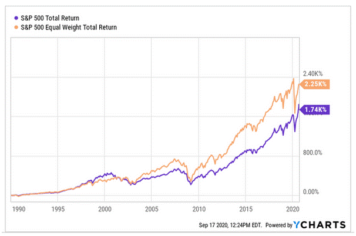

In the world of finance and investment, understanding the distinctions between major indices like the Fortune 500 and the S&P 500, alongside the impact of technological advancements such as algorithmic trading, is crucial. The Fortune 500 and the S&P 500 represent two distinct measures of corporate influence and market performance. The Fortune 500, compiled annually by Fortune magazine, ranks the top 500 U.S. companies based on total revenue, offering insights into the largest corporations across different sectors. On the other hand, the S&P 500 includes 500 publicly traded U.S. companies, ranked by market capitalization, providing a barometer for the U.S. stock market and economy.

Algorithmic trading has transformed the landscape by introducing advanced computational techniques for executing trading strategies at high speed. It leverages complex algorithms and caters to exploiting market opportunities that may arise in fractions of a second. This form of trading has augmented liquidity and efficiency in financial markets while also introducing concerns about increased volatility and potential systemic risks.



Recognizing the interactions between these indices and algorithmic trading is instrumental for investors aiming to understand market dynamics and the forces of economic growth. Both experienced traders and novice investors can benefit from grasping how these elements intersect, thereby enhancing their capacity to make informed decisions. By analyzing these components, investors can gain insights into how they collectively shape the financial landscape and drive strategic investment choices.

## Table of Contents

## Understanding the Fortune 500

The Fortune 500 is a prestigious annual ranking compiled and published by Fortune magazine that identifies the top 500 U.S. companies based on total revenue. First introduced in 1955, this list provides valuable insights into the economic landscape of the United States by highlighting the largest corporations that are instrumental in driving the national economy. The Fortune 500 encompasses both public and private companies and is not limited to any specific industry, making it a comprehensive overview of corporate America.

Unlike stock market indices, which often focus solely on publicly traded companies and rely on market capitalization as a ranking criterion, the Fortune 500 delivers a broader perspective. It captures a wide array of industries, from technology and finance to manufacturing and retail, offering a snapshot of economic power and market influence across diverse sectors. This makes the list an invaluable resource for understanding industry trends and the overall health of the economy.

The methodology for compiling the Fortune 500 is straightforward, with companies ranked on reported total revenues over the fiscal year. Revenue serves as a crucial indicator of a company's market size and operational scale. However, the list does not consider profitability or stock market performance, which differentiates it from indices like the S&P 500.

For investors, the Fortune 500 serves as a tool to identify corporations with substantial revenue streams and significant market influence. Companies that make this list are generally perceived as stable and influential within their sectors. This recognition often enhances their reputation, attracting investors and talented employees alike.

Over the years, the Fortune 500 has evolved to reflect the changing dynamics of the American business environment. With the rise of technology and globalization, new industries have emerged, while traditional sectors have either adapted or declined. Such shifts are mirrored in the composition of the list, providing insights into broader economic trends. Furthermore, in recent years, there has been an increasing emphasis on diversity and inclusion, with more female-led and minority-owned businesses being recognized.

The relevance of the Fortune 500 in today's business environment remains significant. It is not only a measure of company size but also a benchmark for business success and industry leadership. As the global economic landscape continues to evolve, the Fortune 500 serves as an essential reference point for business analysts, policymakers, and investors focused on understanding market dynamics and identifying growth opportunities in the U.S. economy.

## Deciphering the S&P 500

The S&P 500, formally known as the Standard & Poor's 500, is a prominent stock market index comprising 500 of the largest publicly traded companies in the United States. Unlike the Fortune 500, which ranks companies based on total revenue, the S&P 500 is market-capitalization weighted. This means the index is calculated according to the market value of its constituent companies, where market capitalization is determined by multiplying the share price by the number of outstanding shares. The formula for a company's market capitalization is as follows:

$$
\text{Market Capitalization} = \text{Share Price} \times \text{Number of Outstanding Shares}
$$

The market-capitalization approach ensures that companies with a higher market value have a more significant impact on the index's movements. This weighting system contrasts with an equal-weighted index, where each company contributes equally regardless of size.

The S&P 500 is widely regarded as a reliable indicator of the general health of the U.S. stock market and the broader economy. It provides a snapshot of the performance of large-cap U.S. equities, making it a critical benchmark for investors and policymakers alike. The index's broad representation of diverse sectors offers insight into economic trends and investor sentiment.

One of the reasons for the popularity of the S&P 500 among investors, especially those interested in passive investment strategies, is its role as a benchmark for index funds and exchange-traded funds (ETFs). These investment vehicles track the S&P 500, offering investors a diversified portfolio with relatively low management fees. The index's long-term performance historically reflects overall market trends, making it an attractive option for those seeking steady growth with lower risk compared to actively managed funds.

The composition of the S&P 500 is determined by a committee at S&P Dow Jones Indices, which evaluates companies based on criteria such as market capitalization, [liquidity](/wiki/liquidity-risk-premium), and financial viability. To be eligible for inclusion, a company must be based in the United States, have a market capitalization above a minimum threshold, and demonstrate sufficient liquidity, typically measured by the value of shares traded over a six-month period. The selection process ensures that the index represents leading companies across a range of industries, reflecting the evolving landscape of the U.S. economy.

The S&P 500's impact on the investment community is profound, offering insights into market conditions and providing a benchmark for evaluating investment strategies. As an essential reference point, it influences investment decision-making, particularly in constructing portfolios that align with long-term financial goals.

## Algorithmic Trading: Modernizing the Markets

Algorithmic trading employs sophisticated computer algorithms to execute trading orders at high speeds and frequencies, capabilities far beyond human traders. At its core, this method utilizes complex mathematical models and formulas to make rapid trading decisions, often optimizing for market inefficiencies and short-term opportunities. By exploiting even minor price discrepancies, [algorithmic trading](/wiki/algorithmic-trading) aims to capitalize on [arbitrage](/wiki/arbitrage) and other strategic approaches to maximize returns.

The introduction of algorithmic trading has significantly reshaped financial markets. On one hand, it has enhanced market efficiency and liquidity by ensuring that trades are executed quickly and frequently. This efficiency translates to reduced transaction costs and tighter bid-ask spreads, creating a more fluid market environment. However, it has also sparked concerns about increased market [volatility](/wiki/volatility-trading-strategies). The rapid execution of large volumes of trades by algorithms can sometimes lead to dramatic price swings and flash crashes, as seen in events like the 2010 Flash Crash.[1]

The influence of algorithmic trading on indices such as the Fortune 500 and S&P 500 is profound. Although the Fortune 500 is not a stock market index but a ranking based on revenue, the companies within this list can be indirectly affected as algorithmic trading strategies impact their stock prices and investors' perceptions. In contrast, the S&P 500, being a stock index, experiences direct impacts through changes in stock liquidity and price volatility driven by high-frequency trading ([HFT](/wiki/high-frequency-trading-strategies)).

High-frequency trading, a prominent type of algorithmic trading, leverages the tiniest of pricing differentials via high-speed data networks and minimal latency computation. These strategies require cutting-edge technology and infrastructure, such as colocation services, which place traders' computers closer to stock exchange servers to minimize execution times.[2]

Despite the advancements brought by algorithmic trading, its adoption comes with disadvantages, including the potential for systemic risk. The algorithms' reliance on predefined rules and heuristics can lead to erroneous trades if market conditions shift unexpectedly, triggering large-scale, unintended market movements.[3] The ethical considerations of such automated decision-making processes also pose regulatory challenges, necessitating tighter controls and oversight.

In conclusion, algorithmic trading continues to redefine modern trading landscapes with innovations that streamline processes and improve trading efficiency. However, it presents challenges that require careful management to mitigate risks associated with fast-paced, automated financial interactions.

### References:
1. Kirilenko, A. A., Kyle, A. S., Samadi, M., & Tuzun, T. (2017). "The Flash Crash: High-Frequency Trading in an Electronic Market." *Journal of Finance*, 72(3), 967-998.
2. Aldridge, I. (2013). "High-Frequency Trading: A Practical Guide to Algorithmic Strategies and Trading Systems." Wiley Finance.
3. Easley, D., López de Prado, M. M., & O'Hara, M. (2012). "The Volume Clock: Insights into the High-Frequency Paradigm." *Journal of Portfolio Management*, 39(1), 19-29.

## Comparison of the Fortune 500 and S&P 500

The Fortune 500 and the S&P 500 are both indices that spotlight leading corporations, yet their purposes and compositions display distinct differences. The Fortune 500 list, compiled annually by Fortune magazine, ranks the top 500 U.S. companies based on total revenue regardless of whether they are public or private. This broad inclusion provides a comprehensive view of the economic influence exerted by the largest revenue-generating entities across diverse sectors.

In contrast, the S&P 500, managed by Standard & Poor’s, concentrates solely on the largest publicly traded companies, ranking them by market capitalization. This focus on market value, rather than revenue, means the S&P 500 offers a more nuanced depiction of U.S. stock market dynamics and economic health. The index is weighted, which implies that companies with larger market capitalizations have a more significant impact on the index’s overall performance.

The Fortune 500’s broad approach captures varied economic sectors, encompassing industries such as healthcare, technology, and retail, without the constraint of excluding privately held companies. This diversity reflects different business strategies, often emphasizing sheer revenue generation over market presence. Meanwhile, the market-capitalization weighting of the S&P 500 means it often highlights sectors with significant public market valuations, such as technology and finance, providing analysts and investors with insights into market trends and sectors driving market growth.

Algorithmic trading impacts these indices in diverse ways. In the S&P 500, algorithmic trading can significantly affect stock prices and trading volumes due to the market liquidity of its listed companies. The active trading nature of these stocks makes them prime targets for high-frequency trading algorithms, which can exploit short-term inefficiencies or trends. For instance, rapid algorithm-driven trades can lead to increased volatility and altered stock valuations, influencing how the index is perceived and reacted to by investors.

Although the Fortune 500 is not a stock market index, the companies listed are not immune to the effects of algorithmic trading. The trading behavior inspired by algorithms can shift market perceptions and valuations of public companies within the list, indirectly impacting their strategic decisions and investor appeal. For private companies, while direct effects are less prominent, market trends driven by algorithmic interventions can nonetheless shape economic conditions and competitive landscapes.

Ultimately, understanding these differences enables investors and analysts to align their strategies with the appropriate index characteristics, while acknowledging the evolving influence of algorithmic trading in both contexts. This comprehension is key to navigating the modern financial ecosystem effectively.

## The Role of Algorithmic Trading in Both Indices

Algorithmic trading, a cornerstone of modern financial markets, plays a pivotal role in influencing the dynamics of both the Fortune 500 and the S&P 500 indices. These algorithmic systems, capable of executing orders at speeds far exceeding human capacity, bring significant changes to stock prices and trading volumes.

In the S&P 500, an index weighted by market capitalization and comprising 500 of the largest publicly traded companies in the U.S., algorithmic trading is integral to market dynamics. The S&P 500 is particularly susceptible to algorithmic trading due to its focus on liquidity and the high trading frequency of the listed stocks. Algorithms identify arbitrage opportunities by quickly reacting to market events and exploiting small price discrepancies, thus enhancing market efficiency. However, the rapid pace at which these trades occur can occasionally lead to increased volatility. Events such as the "Flash Crash" of May 6, 2010, highlighted how algorithmic trades can cause sudden and significant price shifts, temporarily unsettling market stability.

While the Fortune 500 is not a stock index but a revenue-based ranking of the largest U.S. companies, algorithmic trading indirectly impacts its constituents. By influencing market behavior, algorithms shape the investor perceptions and valuations of Fortune 500 companies. For instance, when algorithmic strategies focus on specific industries or sectors, they can cause substantial capital flow changes, affecting the market positioning and financial evaluations of companies within those sectors.

The impact of algorithmic trading has led to new investor strategies and adaptations. Traditional trading paradigms are challenged by developments in [machine learning](/wiki/machine-learning) and [artificial intelligence](/wiki/ai-artificial-intelligence), which improve the predictive accuracy of algorithmic models. Machine learning algorithms can analyze vast datasets, identifying trends that inform trading decisions. A basic example of such an algorithm in Python might be a linear regression model predicting stock prices based on historical data. Here's a simple Python example using scikit-learn:

```python
from sklearn.model_selection import train_test_split
from sklearn.linear_model import LinearRegression
import numpy as np

# Assume stock_prices is your dataset with features and labels
# features = stock_prices[['feature1', 'feature2', ...]] 
# labels = stock_prices['price']

# Splitting data
X_train, X_test, y_train, y_test = train_test_split(features, labels, test_size=0.2, random_state=42)

# Creating linear regression model
model = LinearRegression()
model.fit(X_train, y_train)

# Predicting prices
predictions = model.predict(X_test)
```

Such algorithmic innovations allow for adaptive strategies that maintain competitiveness amidst rapidly evolving market conditions.

Overall, algorithmic trading's role in the S&P 500 and the Fortune 500 signifies a broader shift towards automated and data-driven trading approaches. While these systems enhance market functionality and open new avenues for investment strategies, they also necessitate stringent regulatory oversight to mitigate potential risks. As algorithms continue to evolve, understanding their influence and developing robust trading strategies remains crucial for all market participants.

## Conclusion

Both the Fortune 500 and the S&P 500 provide unique perspectives on the economic landscape, emphasizing either total revenue or market capitalization. These differing emphases highlight the diverse structures and purposes of these well-known indices. While the Fortune 500 offers insight into the largest companies by revenue, it includes both public and private entities, offering a broad view of economic magnitude. In contrast, the S&P 500 narrows in on publicly traded companies, prioritizing market capitalization to gauge the economic weight and investor confidence in these entities.

With algorithmic trading gaining traction, its influence on these indices demonstrates the critical need for financial literacy regarding technological developments. As algorithms increasingly dictate market behaviors by optimizing trade executions and capitalizing on minuscule price movements, understanding their role and repercussions becomes essential. These advanced trading strategies can introduce additional volatility and liquidity, reshaping how investors approach the market.

Investors today must not only discern between the fundamental differences of these indices but also grasp how algorithmic trading transforms each. This awareness allows for more strategic, informed decision-making. By considering both historical data and the dynamic capabilities of algorithmic trading, investors are better positioned to interpret market signals and refine their approaches.

This article has outlined key elements vital to understanding how these financial indices and technological forces intersect. For both experienced and new investors, maintaining an awareness of these dynamics is crucial. As you navigate investment landscapes, applying this knowledge will not only bolster your financial acumen but also potentially enhance your returns in the perpetual ebb and flow of the financial world.

## References & Further Reading

[1]: Kirilenko, A. A., Kyle, A. S., Samadi, M., & Tuzun, T. (2017). ["The Flash Crash: High-Frequency Trading in an Electronic Market."](https://onlinelibrary.wiley.com/doi/abs/10.1111/jofi.12498) Journal of Finance, 72(3), 967-998.

[2]: Aldridge, I. (2013). ["High-Frequency Trading: A Practical Guide to Algorithmic Strategies and Trading Systems."](https://www.ahmetbeyefendi.com/wp-content/uploads/2020/07/High-Frequency-Trading-Irene-Aldridge.pdf) Wiley Finance.

[3]: Easley, D., López de Prado, M. M., & O'Hara, M. (2012). ["The Volume Clock: Insights into the High-Frequency Paradigm."](https://www.semanticscholar.org/paper/Flow-Toxicity-and-Liquidity-in-a-High-Frequency-Easley-Prado/9369430bd005d194f9332ae7cbd5a57ace5e9ab3) Journal of Portfolio Management, 39(1), 19-29.