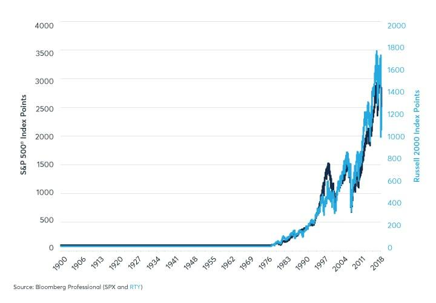

## Table of Contents

## What are the S&P 500 and Russell 2000 indexes?

The S&P 500 is a stock market index that measures the performance of 500 large companies listed on stock exchanges in the United States. It is considered a good indicator of the overall health of the U.S. economy because it includes companies from various industries like technology, healthcare, and finance. Many investors use the S&P 500 as a benchmark to see how well their own investments are doing compared to the market as a whole.

The Russell 2000 is another stock market index, but it focuses on smaller companies. It includes the smallest 2000 stocks from the Russell 3000 index, which represents about 10% of the total market value of the U.S. stock market. The Russell 2000 is often used to gauge the performance of small-cap stocks, which can be more volatile but also offer potential for higher growth compared to larger companies. This index is important for investors interested in smaller, potentially faster-growing businesses.

## How many companies are included in each index?

The S&P 500 includes 500 companies. These are big companies from the United States that trade on stock exchanges. The index helps people see how well these large companies are doing overall.

The Russell 2000 includes 2000 companies. These are smaller companies compared to those in the S&P 500. The Russell 2000 shows how well small companies in the U.S. are doing in the stock market.

## What types of companies are typically found in the S&P 500?

The S&P 500 includes big companies from many different kinds of businesses in the United States. You can find companies that make things like cars and computers, and others that provide services like banking and healthcare. These companies are all very large and well-known, which is why they are part of the S&P 500.

These companies are chosen because they are important to the U.S. economy. They come from industries like technology, where companies make smartphones and software, and energy, where companies find and sell oil and gas. By looking at the S&P 500, people can see how well the biggest parts of the economy are doing.

## What types of companies are typically found in the Russell 2000?

The Russell 2000 includes smaller companies in the U.S. These companies are often called "small-cap" because they have a smaller total value than the big companies in the S&P 500. They come from many different types of businesses, like making things, selling services, and even new technology startups.

These companies might not be as well-known as the big ones, but they can grow a lot faster. Because they are smaller, they can change and adapt more quickly. The Russell 2000 helps people see how these smaller companies are doing in the stock market and can be a good way to find new, growing businesses.

## How is the performance of the S&P 500 calculated?

The performance of the S&P 500 is calculated by looking at the total value of all the companies in the index. Each company's value is figured out by multiplying the number of its shares by the price of each share. The S&P 500 is a market-cap weighted index, which means that bigger companies have a bigger impact on the index's performance. If a big company's stock price goes up or down a lot, it will affect the S&P 500 more than if a smaller company's stock price changes.

To find out how the S&P 500 is doing over time, people compare its value now to what it was before. They use something called the index level, which is like a score that shows how all the companies together are doing. If the index level goes up, it means the total value of the companies in the S&P 500 has gone up, and the index is performing well. If it goes down, it means the total value has dropped, and the index is not doing as well.

## How is the performance of the Russell 2000 calculated?

The performance of the Russell 2000 is calculated by looking at the total value of all the smaller companies in the index. Each company's value is found by multiplying the number of its shares by the price of each share. The Russell 2000 is also a market-cap weighted index, which means that companies with a bigger total value have a bigger effect on the index's performance. If a company's stock price goes up or down, it will change the index's value based on how big that company is.

To see how the Russell 2000 is doing over time, people compare its current value to what it was before. They use something called the index level, which is like a score that shows how all the small companies together are doing. If the index level goes up, it means the total value of the companies in the Russell 2000 has increased, and the index is doing well. If it goes down, it means the total value has decreased, and the index is not doing as well.

## What are the key differences in market capitalization between the S&P 500 and Russell 2000?

The S&P 500 focuses on big companies, which means it includes companies with a high market capitalization. Market capitalization is found by multiplying the number of a company's shares by the price of each share. Because the S&P 500 includes the biggest companies in the U.S., the total market value of all the companies in the index is very large. This is why the S&P 500 is often used to see how the biggest parts of the economy are doing.

The Russell 2000, on the other hand, focuses on smaller companies. These companies have a lower market capitalization compared to those in the S&P 500. The Russell 2000 includes the smallest 2000 companies from the Russell 3000 index, which means the total market value of all the companies in the Russell 2000 is much smaller than the S&P 500. This index helps people see how smaller, potentially faster-growing companies are doing in the stock market.

## How do the sector allocations differ between the S&P 500 and Russell 2000?

The S&P 500 has companies from many different kinds of businesses, but it is often heavy on big industries like technology, healthcare, and finance. These big industries make up a large part of the U.S. economy, so they have a lot of weight in the S&P 500. For example, big tech companies like Apple and Microsoft are in the S&P 500 and can really affect how the whole index does. The S&P 500 is good for seeing how the biggest and most important parts of the economy are doing.

The Russell 2000, on the other hand, includes smaller companies from a wider range of industries. Because these are smaller businesses, the Russell 2000 might have more companies from industries like manufacturing, retail, and healthcare, but they are smaller in size. The smaller companies in the Russell 2000 can come from new or growing areas of the economy, which means the index can be more spread out across different sectors. This makes the Russell 2000 a good way to see how smaller, possibly faster-growing parts of the economy are doing.

## What are the historical performance trends of the S&P 500 and Russell 2000?

The S&P 500 has a long history of going up over time. It includes big companies that are important to the U.S. economy. Over many years, the S&P 500 has usually grown, but it can go down during times like a big economic problem or a stock market crash. For example, it went down a lot during the financial crisis in 2008, but then it came back up over time. People often look at the S&P 500 to see how the biggest parts of the economy are doing over the long run.

The Russell 2000, which focuses on smaller companies, can be more up and down than the S&P 500. It can grow a lot when the economy is doing well and small businesses are growing fast. But it can also go down a lot during tough times because smaller companies can be more affected by economic problems. For example, during the dot-com bubble in the early 2000s and the financial crisis in 2008, the Russell 2000 went down a lot. But it also can bounce back quickly when things get better. The Russell 2000 is good for seeing how the smaller, growing parts of the economy are doing over time.

## How do the S&P 500 and Russell 2000 respond differently to economic cycles?

The S&P 500, which includes big companies, usually does well when the economy is growing. Big companies have more money and can keep going even if the economy slows down a bit. But when there's a big economic problem, like a recession, the S&P 500 can go down a lot. This is because big companies can be affected by big changes in the economy. Over time, though, the S&P 500 tends to go back up as the economy gets better.

The Russell 2000, made up of smaller companies, can go up and down more than the S&P 500 during economic cycles. When the economy is doing well, small companies can grow a lot faster than big ones. But when the economy gets bad, small companies can have a harder time because they don't have as much money to keep going. So, the Russell 2000 might go down more during a recession but can also bounce back faster when things start to get better.

## What are the implications of investing in the S&P 500 versus the Russell 2000 for portfolio diversification?

Investing in the S&P 500 can help spread out your money across many big companies in the U.S. This can be good for making your portfolio more stable because big companies tend to be less risky than smaller ones. The S&P 500 includes companies from different industries like technology, healthcare, and finance, which means you're not putting all your money into just one type of business. If one industry does badly, the others might still do well, helping to balance out your investments.

On the other hand, adding the Russell 2000 to your portfolio can give you a chance to invest in smaller, growing companies. This can add more variety to your investments because the Russell 2000 includes companies from different sectors that might not be in the S&P 500. While smaller companies can be riskier and their stock prices can go up and down more, they also have the potential to grow faster. By including both the S&P 500 and the Russell 2000, you can balance the stability of big companies with the growth potential of smaller ones, making your portfolio more diversified.

## How have changes in index methodology affected the composition and performance of the S&P 500 and Russell 2000 over time?

Changes in how the S&P 500 is put together have had a big effect on which companies are in it and how it does over time. The S&P 500 used to focus just on the biggest companies in the U.S., but now it also looks at how much a company is worth and how much it is traded. This means that sometimes, new companies can be added to the S&P 500, and old ones can be taken out. For example, when tech companies like Apple and Microsoft got bigger, they were added to the S&P 500 and now have a big impact on how the whole index does. These changes help make sure the S&P 500 is a good way to see how the biggest parts of the U.S. economy are doing.

The Russell 2000 has also changed over time because of how it is made. It started by just looking at the smallest 2000 companies in the Russell 3000, but now it pays more attention to how companies are doing and how they fit into the economy. This means the Russell 2000 can include new kinds of businesses, like tech startups, that might not have been in it before. Because of these changes, the Russell 2000 can go up and down more than the S&P 500, but it also gives investors a chance to see how smaller, growing parts of the economy are doing. These changes help make the Russell 2000 a good way to see how small companies are doing in the U.S.

## What are Algorithmic Trading Strategies Using the Russell 2000 and S&P 500?

Various [algorithmic trading](/wiki/algorithmic-trading) strategies utilize data from the Russell 2000 and S&P 500 to enhance trading outcomes and exploit market opportunities. These strategies, supported by sophisticated algorithms, are pivotal in modern finance.

### Index Arbitrage

Index [arbitrage](/wiki/arbitrage) takes advantage of the price discrepancies between index futures and the constituent stocks within the index. For instance, if the calculated price of an S&P 500 futures contract diverges significantly from the combined value of the stocks in the S&P 500, an arbitrage opportunity arises. Traders execute buy or sell orders to capitalize on this discrepancy, securing profits from aligning these prices. The formula for index arbitrage profitability can be simplified as:

$$
\text{Profit} = (\text{Futures Price} - \text{Spot Price}) - \text{Transaction Costs}
$$

This requires real-time monitoring and rapid execution, achieved through automated trading systems.

### Statistical Arbitrage

Statistical arbitrage involves utilizing historical correlations and patterns between indexes and individual stocks to forecast future price movements. This method relies on quantitative models to identify mean-reverting spreads and mispriced securities. A basic strategy could include running a linear regression to predict stock returns:

```python
import numpy as np
from sklearn.linear_model import LinearRegression

# Sample data
X = np.random.rand(100, 1) * 10  # Feature: Independent variable, e.g., past index returns
y = 2.5 * X + np.random.randn(100, 1) * 5  # Dependent variable: Stock returns with noise

# Linear regression model
model = LinearRegression()
model.fit(X, y)

# Predicted values
predicted = model.predict(X)
```

This code snippet highlights the underpinnings of statistical relationships that can be leveraged for trade signals.

### Spread Trading Strategies

Spread trading focuses on the price difference between two correlated indexes, such as the Russell 2000 and the S&P 500. Traders aim to profit from changes in the spread due to market inefficiencies. By employing a pairs trading strategy, one might buy the undervalued index while shorting the overvalued one. The success of spread trading often relies on the spread's mean reversion tendency, with profits realized when the spread converges to its historical mean.

### Implementation

These algorithmic strategies are managed using cutting-edge technology and are designed to react promptly to shifting market dynamics using real-time data. Speed and efficiency are critical, as markets can shift within milliseconds, necessitating algorithms that are both highly optimized and adaptive. Automated trading platforms continually assess numerous potential trades simultaneously, ensuring that traders maintain a competitive edge.

By leveraging the insights from the Russell 2000 and S&P 500, traders can construct robust algorithmic strategies that capitalize on both short-term fluctuations and long-term trends. Advanced computing and programming underpin these strategies, enabling precise market engagement with minimal human intervention.

## References & Further Reading

[1]: Bergstra, J., Bardenet, R., Bengio, Y., & Kégl, B. (2011). ["Algorithms for Hyper-Parameter Optimization."](https://papers.nips.cc/paper/4443-algorithms-for-hyper-parameter-optimization) Advances in Neural Information Processing Systems 24.

[2]: ["Advances in Financial Machine Learning"](https://www.amazon.com/Advances-Financial-Machine-Learning-Marcos/dp/1119482089) by Marcos Lopez de Prado

[3]: ["Evidence-Based Technical Analysis: Applying the Scientific Method and Statistical Inference to Trading Signals"](https://www.amazon.com/Evidence-Based-Technical-Analysis-Scientific-Statistical/dp/0470008741) by David Aronson

[4]: ["Machine Learning for Algorithmic Trading"](https://github.com/stefan-jansen/machine-learning-for-trading) by Stefan Jansen

[5]: ["Quantitative Trading: How to Build Your Own Algorithmic Trading Business"](https://github.com/LucindaYa/quant-resources/blob/master/Quantitative%20Trading%20How%20to%20Build%20Your%20Own%20Algorithmic%20Trading%20Business.pdf) by Ernest P. Chan