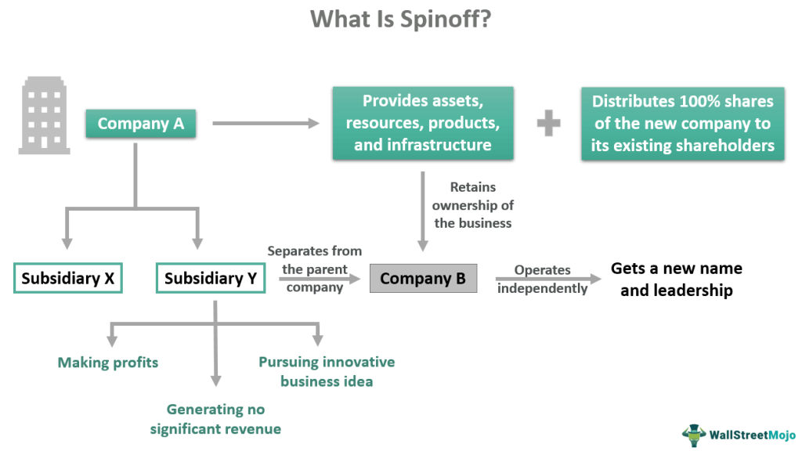

Initial Public Offerings (IPOs) and spinoffs are two significant methods companies employ to transition into public entities. Each of these pathways involves unique procedures, objectives, and implications that affect both businesses and investors. Understanding the distinctions and similarities between IPOs and spinoffs is essential for stakeholders navigating the corporate finance landscape.

An IPO represents the first time a private company offers its shares to the public, allowing it to raise capital by entering the public markets. This transition not only enables companies to access a broader pool of investors but also requires them to adhere to rigorous regulatory demands and transparency standards. On the other hand, a spinoff involves a public company creating a new, independent entity from one of its existing segments or subsidiaries. This strategy is often used to increase focus on core business operations or to unlock value within a particular division.



For investors, both IPOs and spinoffs present unique opportunities and challenges. IPOs can offer the potential for high returns as companies expand their market presence, but they also carry risks given the possible volatility associated with newly issued stocks. Spinoffs, meanwhile, can allow for the optimization of business segments, potentially leading to enhanced performance and shareholder value appreciation.

The advent of algorithmic trading has further influenced the dynamics of IPOs and spinoffs. By utilizing advanced computational models, market participants can rapidly process market data and execute trades, thereby affecting share price and liquidity. Consequently, algorithmic trading plays a crucial role in shaping investor sentiment and market behavior during these pivotal corporate events.

In summary, while IPOs and spinoffs serve as mechanisms for companies to become publicly listed entities, they cater to distinct strategic needs and operate under varying market conditions. Recognizing these nuances, along with the impact of algorithmic trading, is vital for corporate decision-makers and investors aiming to leverage the opportunities inherent in today's intricate financial environment.

## Table of Contents

## Understanding IPOs and Spinoffs

Initial Public Offerings (IPOs) and spinoffs are two distinct methodologies employed by companies to transition into publicly traded entities, each serving unique strategic objectives while following divergent pathways.

An Initial Public Offering, or IPO, represents the initial distribution of a private company’s shares to the public. This method is primarily aimed at raising capital. By transitioning to a public company, firms gain access to the capital markets, providing them with a broader base of financial resources. The IPO process involves several key steps such as selecting underwriters, engaging in detailed valuation processes, and fulfilling regulatory prerequisites, including the submission of a comprehensive registration statement to securities regulators like the U.S. Securities and Exchange Commission (SEC) in the United States. An IPO not only facilitates the inflow of capital but also enhances the visibility and credibility of the company within the financial markets. Through public trading, these entities can achieve improved [liquidity](/wiki/liquidity-risk-premium) of assets, potentially broadening their investment appeal.

Conversely, a spinoff involves a public company disentangling part of its operations to create a new, distinct public entity. Unlike IPOs that introduce private entities to the public, a spinoff is initiated by companies already possessing public status. This strategic realignment allows the parent company to focus more intently on its core operations, while the newly formed company operates independently, potentially unlocking value by concentrating on specific market segments. Spinoffs can result from strategic reevaluations or the recognition that independent governance and distinctive financial strategies might better serve a particular division’s objectives.

Despite both processes ultimately resulting in the establishment of a new public entity, IPOs and spinoffs are strategically executed based on the differing foundational situations and corporate goals. While IPOs emphasize capital generation and market entry, spinoffs focus on operational refocus and value realization from specialized business segments. These distinct strategies underscore the adaptive approaches companies might undertake in structuring their growth and focus in the competitive corporate landscape.

## The Mechanics of IPOs

Initial Public Offerings (IPOs) are a vital mechanism through which private companies transition to public ownership by offering shares for sale to the public. The process of conducting an IPO is complex and involves several critical steps, each contributing to the successful issuance of shares on public markets.

The first step in an IPO is often engaging an investment bank to serve as the underwriter. The underwriter's role is crucial as it helps determine the initial offer price of the company's shares. This valuation process considers various factors including the company's financial performance, industry conditions, and market sentiment. Investment banks use methods such as discounted cash flow (DCF) analysis and comparables to assess the company's value and decide on an appropriate share price. 

Once valuation is complete, the company must meet regulatory requirements set by financial authorities, such as the U.S. Securities and Exchange Commission (SEC). This involves preparing a detailed prospectus that provides potential investors with comprehensive information about the company's business model, financial condition, and risk factors. The transparency required in this documentation not only helps in fulfilling legal requirements but also enhances the credibility of the company in the eyes of prospective investors.

Following regulatory approval, the underwriter and the company decide on the final price of the IPO shares and begin the marketing process. This stage involves roadshows, where company executives present their business to institutional investors to generate interest and secure investments. Roadshows are a critical component of the book-building process as they gauge demand for the company's shares, which can further influence the final pricing.

Finally, on the day of the offering, shares are made available to the public, marking the company's entry into the public markets. Successfully executing an IPO provides the company with capital to fund expansion, pay down debt, or invest in research and development. Moreover, becoming a publicly traded entity can enhance a company's visibility and prestige, potentially leading to broader investment opportunities and improved liquidity of its shares on the public markets.

In essence, the IPO process is not merely a fundraising exercise but also a transformational step for a company, enhancing its market position and financial flexibility. The transparency and scrutiny involved in going public can also serve as a catalyst for improved corporate governance and operational efficiency.

## The Strategic Role of Spinoffs

Spinoffs are strategic maneuvers used by companies to optimize their operational focus and capitalize on specific business segments. By spinning off a division into an independent entity, a parent company can streamline its operations, aligning more closely with its core business activities. This segregation often results in enhanced managerial focus, as each entity targets its respective operational goals without the distraction of unrelated segments.

Furthermore, spinoffs unlock potential value that might be latent within a conglomerate. When diverse business units are bundled together, their individual performance can be obscured by the overarching corporate structure. A spinoff allows for clearer visibility into the standalone performance and value of a particular division. As a separate public entity, the spinoff can pursue its strategic goals with greater agility, unencumbered by the priorities of the parent company's other business units.

Spinoffs also provide financial and strategic flexibility. For investors, spinoffs present an opportunity to invest directly in a specific business model or market segment they find most promising. This separation can lead to distinct stock valuations reflecting each unit's particular growth prospects and risk profile. As a result, the market might price the spinoff entity more accurately, potentially leading to value realization that was previously masked within the parent company.

A key advantage of spinoffs is their ability to attract specialized management teams focused on unlocking the full potential of the newly independent entity. With tailored strategies that cater to the specific operational needs and market conditions of each business unit, companies that undergo successful spinoffs often experience increased efficiency and competitiveness.

Moreover, companies may use spinoffs as a method to respond to regulatory requirements or mitigate organizational risks. By segregating operations, risks can be isolated, reducing the potential impact on the parent company. This strategic partitioning enhances both entities' resilience in adapting to regulatory changes or market [volatility](/wiki/volatility-trading-strategies).

In conclusion, spinoffs are powerful tools for companies aiming to refine their strategic focus, increase operational efficiency, and unlock hidden value within their existing business structures. Through careful planning and execution, these newly formed entities can thrive independently, benefiting both the parent company and its shareholders.

## IPO and Spinoff Trends and Statistics

Recent trends within global financial markets reveal a discernible pivot from initial public offerings (IPOs) to spinoff activities. This shift can be attributed to various market conditions and the strategic benefits that spinoffs present companies. In recent years, the IPO market has encountered fluctuating dynamics influenced by factors such as economic uncertainty, regulatory changes, and investor sentiment, all of which have contributed to a reassessment of preferred market entry strategies.

Spinoffs have emerged as a favorable alternative, offering companies the ability to restructure and focus on core competencies. The inherent flexibility of spinoffs, allowing parent companies to unlock value and improve operational efficiency, is increasingly attractive in volatile markets. According to data compiled in recent financial reports, there has been a noticeable uptick in the frequency of spinoff transactions. For instance, a study by Deloitte in 2023 noted that spinoffs had increased by nearly 15% over the previous two years, signaling a growing trend among corporations to leverage this strategy for shareholder value enhancement.

Additionally, spinoffs provide tax benefits and can often be executed with reduced regulatory scrutiny compared to IPOs. This advantage is significant in markets where regulatory frameworks have tightened post the financial crises and amid ongoing global economic challenges. Moreover, spinoffs often receive favorable reception from institutional investors seeking concentrated exposure to distinct business units, which can result in a more stable price performance post-transaction relative to IPOs.

These trends are aligned with the strategic moves by corporations aiming to navigate an ever-evolving economic landscape, emphasizing adaptability and focused investment strategies. In essence, the shifting preference from IPOs to spinoffs underscores how companies are increasingly prioritizing strategic restructuring over traditional capital-raising avenues in response to market demands and economic variability.

## Impact of Algorithmic Trading on IPOs and Spinoffs

Algorithmic trading, characterized by the use of advanced algorithms to conduct trading at high speeds, has significantly influenced the pricing and liquidity of shares during Initial Public Offerings (IPOs) and spinoffs. The deployment of such trading strategies involves analyzing vast datasets in real time, enabling traders to execute orders with precision and speed that surpasses human capability.

The impact on IPOs is profound. During an IPO, shares of a company are made available to the public for the first time, and the initial pricing is crucial for both the company and investors. Algorithmic trading can cause rapid shifts in demand and supply dynamics. When algorithms detect favorable conditions, they can swiftly initiate large volumes of trades, leading to increased liquidity and potentially more volatility in the share price.

Moreover, these algorithms can [factor](/wiki/factor-investing) in a multitude of variables, including market sentiment, economic indicators, and minute price fluctuations, to determine their trading strategies. This capability amplifies the market's response to new information, causing swift changes in share prices post-IPO. A clear algorithmic strategy might include:

```python
import numpy as np

# Simulated price data
price_data = np.random.normal(loc=100, scale=5, size=1000)

# Example of a simple moving average crossover strategy
window_short = 5
window_long = 20

short_mavg = np.convolve(price_data, np.ones(window_short)/window_short, mode='valid')
long_mavg = np.convolve(price_data, np.ones(window_long)/window_long, mode='valid')

# Generating buy/sell signals
signals = np.where(short_mavg > long_mavg[:len(short_mavg)], 1, -1)
```

In the context of spinoffs, [algorithmic trading](/wiki/algorithmic-trading) also plays a critical role. When a parent company spins off a division, creating a new publicly traded entity, algorithms can assess the impact of the spinoff on both the parent and the new entity’s valuations. The ability to quickly process the implications of such corporate restructuring allows traders to capitalize on opportunities emerging from mispricings or market inefficiencies. 

Algorithmic trading can influence investor behavior, as it often sets the pace for trading activity, with other market participants reacting to the swift movements initiated by algorithms. High-frequency traders, in particular, deploy strategies to capitalize on the minute discrepancies that occur during these events, further contributing to liquidity and price movements.

The prevalence of algorithmic trading has necessitated enhanced risk management practices. Companies undergoing IPOs or spinoffs must be aware of the potential for heightened volatility, preparing strategies to mitigate adverse impacts on their stock prices. For investors, understanding the role of algorithmic trading can provide insights into price movements and potential investment opportunities during these pivotal events.

Ultimately, the role of algorithmic trading in IPOs and spinoffs highlights its importance in modern capital markets. It affects market efficiency and liquidity while shaping the strategies of traders, investors, and companies navigating these complex financial undertakings.

## Conclusion: Navigating the Corporate Finance Landscape

Both Initial Public Offerings (IPOs) and spinoffs represent critical avenues through which companies transition to or expand within public markets. While both mechanisms facilitate the emergence of publicly traded entities, they achieve distinct strategic goals and adapt to varying market conditions. An IPO typically aims to raise capital by offering shares to the public for the first time, thereby providing companies with resources to expand operations, innovate, or reduce existing debt. Conversely, spinoffs enable companies to streamline operations by creating independent entities from existing divisions, allowing for increased focus and potential value realization.

The decision between pursuing an IPO or a spinoff depends on a company’s strategic intentions, market conditions, and investor sentiment. In recent years, shifts toward spinoffs have been observed, driven by these factors and the desire for strategic flexibility. Both processes feature complex considerations, including regulatory compliance, market timing, and investment community reception.

Algorithmic trading has introduced a transformative element to these corporate finance events. The capacity of algorithms to process extensive datasets at breakneck speed allows for swift reactions to IPOs and spinoffs, influencing their pricing dynamics and affecting liquidity. Algorithmic trading creates an environment where investment behaviors can rapidly adapt to new information, highlighting the importance of understanding these mechanisms for investors and corporate decision-makers. The market's demand-supply equilibrium, especially during significant announcements, emphasizes the role algorithms play in maintaining price stability through technical methods such as market-making and statistical [arbitrage](/wiki/arbitrage).

For both investors and corporate leaders, comprehending the nuances of IPOs and spinoffs and the impact of algorithmic trading is essential for capitalizing on opportunities within the finance landscape. Informed decision-making requires a careful balance of strategic objectives, market analysis, and technological considerations. Ultimately, the ability to navigate these complex financial processes can significantly influence the success and growth trajectory of companies entering the public domain.

## References & Further Reading

[1]: ["The New Financial Capitalists: Kohlberg Kravis Roberts and the Creation of Corporate Value"](https://www.amazon.com/New-Financial-Capitalists-Kohlberg-Corporate/dp/0521642604) by George P. Baker and George David Smith

[2]: ["The IPO Decision: Why and How Companies Go Public"](https://www.amazon.com/IPO-Decision-Why-Companies-Public/dp/184542638X) by Michelle Lowry, Roni Michaely, and Ekaterina Volkova, Financial Management Association International Survey and Synthesis Series

[3]: ["Demystifying the Impact of Spin-Offs on Capital Markets"](https://fastercapital.com/content/Spin-off--Corporate-Actions-Decoded--Understanding-the-Impact-of-Spin-offs.html) by Mikko Puhakka, Research in International Business and Finance, Volume 57, December 2021

[4]: ["Algorithmic Trading and DMA: An Introduction to Direct Access Trading Strategies"](https://www.amazon.com/Algorithmic-Trading-DMA-introduction-strategies/dp/0956399207) by Barry Johnson

[5]: ["Investment Banks, Hedge Funds, and Private Equity"](https://www.amazon.com/Investment-Banks-Hedge-Private-Equity/dp/0128047232) by David P. Stowell