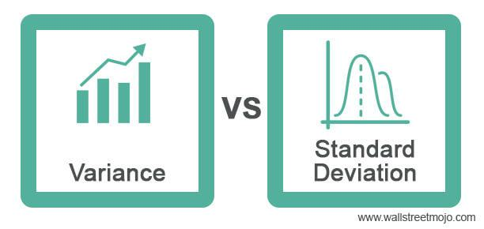

In the rapidly changing finance sector, algorithmic trading has become a crucial component for both institutional and individual investors. By leveraging computer algorithms to execute a large volume of trades at speeds and frequencies that are impossible for human traders, algorithmic trading optimizes market opportunities. At the heart of these sophisticated trading systems lie fundamental mathematical concepts, among which standard deviation and variance play pivotal roles.

Standard deviation and variance are statistical tools that measure data dispersion, providing critical insights into market volatility and the associated risks of trading strategies. Standard deviation quantifies the variation or spread of a set of data points around their mean value, serving as a gauge for market volatility. A higher standard deviation indicates greater price fluctuation, signaling increased risk, but also potentially higher returns. Variance, the square of standard deviation, offers insights into risk assessment, though its squared nature makes it less intuitive for immediate interpretation.



Understanding these concepts is essential for traders who aim to manage risk and optimize trading strategies effectively. As the backbone of many quantitative models, standard deviation and variance help traders evaluate the potential price movement of assets, aiding in the anticipation of trends and thus enhancing trading efficiency.

This article aims to provide a comprehensive exploration of these mathematical principles and their application in algorithmic trading, offering insights into their critical role in developing trading strategies that can adapt to and capitalize on market volatility. By mastering these tools, traders can improve their capacity to make informed decisions in the dynamic trading environment.

## Table of Contents

## Understanding Standard Deviation and Variance

Standard deviation and variance are fundamental concepts in statistics, particularly relevant in fields such as finance for assessing risk and volatility. These measures reflect the degree of variation or dispersion in a set of data points relative to their average value, known as the mean.

Standard deviation provides a precise gauge of volatility, indicating the extent to which each data point in a data set deviates from the mean. A higher standard deviation signifies greater volatility, showing that the data points are spread out over a wider range of values. Conversely, a lower standard deviation indicates that the data points are closer to the mean, suggesting more stability and predictability. In mathematical terms, the standard deviation (σ) is represented as:

$$
\sigma = \sqrt{\frac{1}{N} \sum_{i=1}^{N} (x_i - \mu)^2}
$$

Here, $x_i$ represents each data point, $N$ is the number of data points, and $\mu$ is the mean of the data set. This formula calculates the square root of the average squared differences from the mean, giving a clear indicator of [volatility](/wiki/volatility-trading-strategies).

Variance, on the other hand, is simply the square of the standard deviation. It quantifies the squared deviations from the mean, providing a measure of how much the observations in the data set differ from the mean in squared units. Mathematically, the variance ($\sigma^2$) is expressed as:

$$
\sigma^2 = \frac{1}{N} \sum_{i=1}^{N} (x_i - \mu)^2
$$

While variance effectively measures risk by illustrating data variability, it can be less intuitive due to its squared units, which do not directly correspond to the scale of the data. This is where standard deviation, which maintains the original units of measurement, often provides a more accessible interpretation of volatility.

In financial contexts, these statistical tools are indispensable for analyzing market behaviors and forecasting future movements. Variance and standard deviation help researchers and traders to evaluate the potential risks associated with different securities, enabling the development of strategies that account for expected fluctuations in asset prices. Understanding these core principles is crucial for anyone participating in [algorithmic trading](/wiki/algorithmic-trading), as they offer foundational insights into market dynamics and risk management.

## Importance of Standard Deviation in Algo Trading

In algorithmic trading, standard deviation plays a pivotal role in risk assessment and informed decision-making. As a measure of volatility, standard deviation provides traders with valuable insights into the extent to which a security's price deviates from its average value. This information is critical, as it helps traders identify the level of uncertainty or risk associated with a particular asset.

The core principle of using standard deviation in trading is to measure and anticipate market volatility. Calculating the standard deviation involves computing the average (mean) of a series of price data and then determining the average deviation from this mean. Mathematically, this is represented as:

$$
\sigma = \sqrt{\frac{1}{N} \sum_{i=1}^{N} (x_i - \mu)^2}
$$

where $\sigma$ is the standard deviation, $N$ is the number of data points, $x_i$ represents each individual data point, and $\mu$ is the mean of these data points.

By gauging the volatility of an asset through its standard deviation, traders can tailor their strategies to the current market conditions. For instance, a high standard deviation suggests a volatile market, which might prompt a trader to adopt a more conservative strategy to manage risk. Conversely, a low standard deviation indicates a more stable market, potentially allowing for more aggressive trading approaches.

Understanding deviations from the mean enables traders to develop strategies that can anticipate and capitalize on price movements. For example, during periods of low volatility, a trader might expect smaller price swings and opt for strategies focusing on incremental gains. In contrast, high volatility might lead to strategies aimed at capturing larger price movements.

Implementing such strategies effectively requires not only understanding these deviations but also the capability to rapidly adjust trading algorithms in response to market changes. Python, with its robust libraries like NumPy, provides essential tools for calculating standard deviation and integrating these calculations into automated trading systems:

```python
import numpy as np

# Sample data representing asset prices
prices = np.array([100, 102, 101, 105, 107, 106])

# Calculate the mean
mean_price = np.mean(prices)

# Calculate the standard deviation
standard_deviation = np.std(prices)

print(f"Mean Price: {mean_price}")
print(f"Standard Deviation: {standard_deviation}")
```

This information enables traders to set appropriate stop-loss and take-profit levels, enhancing risk management and trading efficiency. By integrating standard deviation into their trading models, algorithmic traders can make more informed decisions, optimize their strategies, and ultimately improve their performance in the financial markets.

## How to Calculate Standard Deviation and Variance

Calculating standard deviation and variance is fundamental in evaluating the [dispersion](/wiki/dispersion-trading) of data points in a set, especially in financial contexts like algorithmic trading. Understanding these calculations informs traders about market volatility and potential risk.

To calculate the standard deviation, begin by determining the mean (average) of the data set. The mean is evaluated as:

$$
\text{Mean} (\mu) = \frac{1}{N} \sum_{i=1}^N x_i
$$

where $N$ is the total number of data points and $x_i$ are the values in the dataset.

The next step is to compute the variance, which measures the average of the squared differences from the mean. The formula for variance ($\sigma^2$) is:

$$
\sigma^2 = \frac{1}{N} \sum_{i=1}^N (x_i - \mu)^2
$$

Variance provides insight into the dataset's variability but is expressed in squared units, making it less intuitive for direct interpretation.

The standard deviation ($\sigma$), being the square root of the variance, converts this measure back to the original units, making it more interpretable:

$$
\sigma = \sqrt{\sigma^2} = \sqrt{\frac{1}{N} \sum_{i=1}^N (x_i - \mu)^2}
$$

For practical calculations, traders and analysts often resort to tools like Excel or Python, which help automate and simplify these processes. In Python, the numpy library provides efficient methods to compute these [statistics](/wiki/bayesian-statistics):

```python
import numpy as np

# Example data set
data = [10, 12, 23, 23, 16, 23, 21, 16]

# Calculating the mean
mean = np.mean(data)

# Calculating the variance
variance = np.var(data)

# Calculating the standard deviation
standard_deviation = np.std(data)

print(f"Mean: {mean}")
print(f"Variance: {variance}")
print(f"Standard Deviation: {standard_deviation}")
```

This code snippet calculates the mean, variance, and standard deviation of a given dataset, demonstrating the practical application using numpy. The results guide traders in assessing data dispersion, enhancing their decision-making and risk management strategies in financial markets.

## Applications in Algorithmic Trading

Standard deviation and variance are critical tools in algorithmic trading for constructing models that forecast asset price movements using historical volatility data. These mathematical measures allow traders to quantify and interpret the variability of asset prices, providing a foundation for creating strategies that respond to market conditions effectively.

In algorithmic trading, understanding the standard deviation of an asset's price helps traders determine the level of market volatility. A higher standard deviation signifies greater volatility, indicating that prices can fluctuate widely over a short period. This information is crucial when developing algorithms programmed to execute trades when price movements reach certain thresholds.

For instance, consider a trading algorithm that uses Bollinger Bands, a technique that relies on standard deviation. Bollinger Bands create upper and lower bands around a moving average of the asset's price. The width of these bands is determined by the standard deviation, allowing the algorithm to identify potential entry and [exit](/wiki/exit-strategy) points when price movements extend beyond these bands.

```python
import numpy as np

def calculate_bollinger_bands(prices, window, num_std_dev):
    """
    Calculate Bollinger Bands for a given price dataset.

    Args:
    prices (list): Historical price data.
    window (int): The number of observations used for calculating the moving average and standard deviation.
    num_std_dev (float): The number of standard deviations to set the band width.

    Returns:
    tuple: (moving_avg, upper_band, lower_band)
    """
    if len(prices) < window:
        raise ValueError("The length of prices must be at least equal to the specified window.")

    moving_avg = np.mean(prices[-window:])
    std_dev = np.std(prices[-window:])
    upper_band = moving_avg + (num_std_dev * std_dev)
    lower_band = moving_avg - (num_std_dev * std_dev)

    return moving_avg, upper_band, lower_band

prices = [100, 102, 101, 103, 108, 107, 109, 105, 110]
moving_avg, upper_band, lower_band = calculate_bollinger_bands(prices, window=5, num_std_dev=2)
print(f"Moving Average: {moving_avg}, Upper Band: {upper_band}, Lower Band: {lower_band}")
```

Using this algorithm, traders can automate buy or sell decisions based on the volatility dynamics captured by the Bollinger Bands, optimizing trade execution timing.

Variance, although less intuitive due to its squared units, plays an integral role in risk management strategies. By analyzing variance, traders can set more precise stop-loss and take-profit levels. A high variance suggests that an asset's price might experience larger swings, prompting the algorithm to adjust stop-loss levels to prevent premature exits from profitable trades.

In summary, the application of standard deviation and variance in algorithmic trading enables the formulation of strategies that are both profitable and robust. These tools allow traders to balance the dichotomy of risk and reward effectively, improving their chances of achieving long-term success in financial markets.

## Case Studies

Algorithmic traders frequently employ standard deviation and variance to make informed trading decisions by analyzing historical data to assess volatility and predict price trends. This strategy allows them to adjust their algorithms to capitalize on expected market movements.

One notable case study involves a trading firm that used a combination of historical price data and statistical measures to develop a [momentum](/wiki/momentum)-based algorithmic trading strategy. The algorithm was designed to trade in the foreign exchange market, focusing on currency pairs with high volatility. By calculating the standard deviation of price movements over a specified period, the algorithm could determine the expected range of future price fluctuations. If the current volatility was significantly higher than the calculated standard deviation, the algorithm interpreted this as a potential price trend and executed buy or sell orders accordingly.

To enhance the efficacy of their trading strategy, traders implemented a [machine learning](/wiki/machine-learning) model that continuously updated the parameters of their algorithms based on real-time data. This included recalculating the standard deviation and variance at regular intervals, allowing the algorithm to adapt to changing market conditions. The updated model enabled the traders to maintain a high level of accuracy in predicting market trends, thus optimizing their entries and exits to maximize profits while minimizing risk. 

Another case study focuses on equity trading, where a [hedge fund](/wiki/hedge-fund-trading-strategies) utilized standard deviation to develop a statistical [arbitrage](/wiki/arbitrage) strategy. In this approach, traders selected pairs of stocks with historically correlated price movements. By calculating the standard deviation of the price ratio between the two stocks, the algorithm identified deviations from their historical correlation. When the ratio moved outside a predefined range of one or two standard deviations, the algorithm executed trades anticipating a reversion to the mean. This method effectively capitalized on temporary price inefficiencies, achieving consistent returns.

These case studies demonstrate the practical application of mathematical concepts like standard deviation and variance in algorithmic trading. By harnessing these statistical tools, traders can devise strategies that enhance their ability to predict market movements, thereby optimizing their trading performance.

## Challenges and Considerations

In algorithmic trading, standard deviation and variance are pivotal tools for assessing risk and market volatility. However, their effectiveness can be curbed by inherent limitations. One of the primary challenges is the reliance on historical data, which may not always predict future market behaviors accurately. Financial markets are influenced by a myriad of unforeseen economic factors, such as geopolitical events, policy changes, and unexpected market-moving news, which historical data cannot always encapsulate. As a result, algorithms based solely on past data can become obsolete or produce erroneous predictions during volatile or unanticipated market shifts.

To navigate this challenge, traders must frequently recalibrate their models to align with prevailing market conditions. This requires a dynamic approach to model development, where inputs and assumptions are regularly updated to reflect new information. It is not sufficient to rely solely on static algorithms; instead, sophisticated models often incorporate machine learning techniques that allow for continuous learning and adaptation.

Moreover, the computational nature of variance, which involves squared differences, can sometimes lead to misinterpretations. While variance provides a mathematical measure of variability, its squared units can make the data less intuitive for financial analysis. This is often mitigated by using standard deviation, which, being the square root of variance, reverts data to its original units, facilitating more intuitive interpretations.

Despite these challenges, understanding the limitations of standard deviation and variance informs better trading strategy development. Integrating additional quantitative measures, such as skewness or kurtosis, and employing robust machine learning algorithms can offer a more comprehensive approach to risk management. Traders savvy in these areas continuously refine their models, ensuring they remain resilient in the face of ever-evolving market dynamics.

## Conclusion

The integration of mathematics in algorithmic trading is indispensable, with standard deviation and variance serving as cornerstones for developing robust trading algorithms. These mathematical concepts allow traders to quantify risk and assess market volatility, which are critical elements for making informed decisions. Standard deviation, which provides insights into the dispersion of data points from the mean, is directly applicable in evaluating historical price volatility. This understanding aids in the development of trading strategies that anticipate and react to market fluctuations effectively.

Variance, the square of standard deviation, takes analysis a step further by providing a measure of risk associated with different securities. Despite its less intuitive nature due to squared units, variance helps traders understand how much a security's price can deviate, providing additional depth to risk assessment. Traders leverage these metrics to adjust algorithmic models, ensuring trades are executed at optimal times to maximize profits and minimize exposure to undesirable market movements.

As trading environments and technologies continue to evolve, the ability to adapt remains paramount. Continuous learning in mathematical applications ensures that traders can refine their models to reflect current market dynamics. Proficiency in tools such as Excel or Python's numpy library, which streamline the calculation of standard deviation and variance, further empowers traders to enhance and optimize their strategies. Mastery of these statistical tools thus becomes a competitive advantage, enabling traders to navigate the complexities of algorithmic trading successfully.

## References & Further Reading

[1]: Bergstra, J., Bardenet, R., Bengio, Y., & Kégl, B. (2011). ["Algorithms for Hyper-Parameter Optimization."](https://papers.nips.cc/paper/4443-algorithms-for-hyper-parameter-optimization) Advances in Neural Information Processing Systems 24.

[2]: ["Advances in Financial Machine Learning"](https://www.amazon.com/Advances-Financial-Machine-Learning-Marcos/dp/1119482089) by Marcos Lopez de Prado

[3]: ["Evidence-Based Technical Analysis: Applying the Scientific Method and Statistical Inference to Trading Signals"](https://www.amazon.com/Evidence-Based-Technical-Analysis-Scientific-Statistical/dp/0470008741) by David Aronson

[4]: ["Machine Learning for Algorithmic Trading"](https://github.com/stefan-jansen/machine-learning-for-trading) by Stefan Jansen

[5]: ["Quantitative Trading: How to Build Your Own Algorithmic Trading Business"](https://www.amazon.com/Quantitative-Trading-Build-Algorithmic-Business/dp/1119800064) by Ernest P. Chan