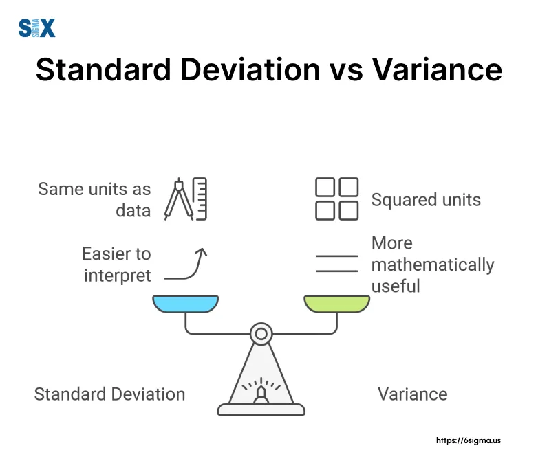

## Table of Contents

## What is standard deviation and how is it calculated?

Standard deviation is a way to measure how spread out numbers are in a group. It tells you how much the numbers differ from the average (mean) of the group. If the standard deviation is small, it means the numbers are close to the average. If it's big, the numbers are more spread out.

To calculate the standard deviation, first find the average of all the numbers. Then, for each number, find out how far it is from the average. Square that distance, add up all those squared distances, and divide by the number of items minus one (this gives you the variance). Finally, take the square root of that result to get the standard deviation.

## What is variance and how is it calculated?

Variance is a measure that tells us how much the numbers in a group are spread out from their average. It's like a way to see if the numbers are close together or all over the place. When the variance is small, it means the numbers are pretty close to the average. When it's big, the numbers are more spread out.

To calculate variance, first find the average of all the numbers in the group. Then, for each number, figure out how far it is from the average. Square that distance (because we want all distances to be positive and to give more weight to bigger differences). Add up all these squared distances. Finally, divide this total by the number of items in the group minus one. This gives you the variance.

## How do standard deviation and variance relate to each other mathematically?

Standard deviation and variance are closely related. Variance is the average of the squared differences from the mean, while standard deviation is the square root of the variance. This means that if you know the variance, you can find the standard deviation by taking its square root. On the other hand, if you know the standard deviation, you can find the variance by squaring it.

In simple terms, variance gives you a measure of how spread out the numbers are, but it's in squared units, which can be hard to understand. Standard deviation, being the square root of variance, brings the measure back to the same units as the original numbers, making it easier to interpret. So, they are two sides of the same coin, helping us understand the spread of data in different but related ways.

## Why are standard deviation and variance important in statistics?

Standard deviation and variance are important in statistics because they help us understand how spread out the data is. Imagine you have a bunch of test scores from a class. If everyone scored around the same number, the standard deviation and variance would be small, showing that the scores are close together. But if the scores are all over the place, with some high and some low, the standard deviation and variance would be big, showing that the scores are spread out a lot. This helps us see if the data is consistent or if there's a lot of variation.

These measures are also useful for comparing different sets of data. For example, if you want to compare test scores from two different classes, looking at the standard deviation and variance can tell you which class had more consistent scores and which had more variation. This can be really helpful in fields like science, business, and education, where understanding the spread of data can lead to better decisions and insights.

## Can you explain the concept of dispersion using standard deviation and variance?

Dispersion is all about how spread out the numbers in a group are. Think of it like this: if you have a bunch of kids standing in a line and they're all about the same height, there's not much dispersion. But if some kids are really tall and others are really short, then there's a lot of dispersion. In statistics, we use standard deviation and variance to measure this spread. Standard deviation tells us how far, on average, the numbers are from the middle (the mean). Variance is similar, but it squares the distances first, so it's in different units.

Standard deviation and variance help us understand if the data is bunched up close together or spread out all over the place. If the standard deviation is small, it means the numbers are pretty close to the average. If it's big, the numbers are more spread out. Variance works the same way, but because it's the square of the standard deviation, it can be harder to understand directly. By using these measures, we can get a clear picture of how much the data varies, which is super helpful in all sorts of situations, like figuring out if a new medicine works the same for everyone or if test scores in a class are all over the place.

## How do standard deviation and variance help in understanding data distribution?

Standard deviation and variance are like tools that help us see how spread out the numbers in a group are. Imagine you're looking at the scores of a test. If everyone got around the same score, the standard deviation and variance would be small, showing that the scores are close together. But if some people got really high scores and others got really low scores, then the standard deviation and variance would be big, showing that the scores are spread out a lot.

These measures are really useful because they help us understand the shape of the data. For example, if the standard deviation is small, it tells us that most of the data is packed around the average, which might mean the data follows a bell-shaped curve, like in a normal distribution. On the other hand, if the standard deviation is large, it suggests that the data is more spread out, which could mean the data has a different shape, like a wider or flatter distribution. By looking at standard deviation and variance, we can get a better picture of how the data is distributed and make smarter decisions based on that information.

## What are the practical applications of standard deviation and variance in different fields?

In the world of finance, standard deviation and variance are super important. They help investors figure out how risky an investment might be. If a stock's returns have a big standard deviation, it means the stock's price jumps around a lot, which is riskier. On the other hand, if the standard deviation is small, the stock's price stays pretty steady, which is less risky. This helps people decide if they want to invest in something that might give them big wins but also big losses, or something safer but with smaller gains. Companies also use these measures to see how their profits change from year to year, which helps them plan better.

In science, standard deviation and variance are used to check if experiments are reliable. Scientists run experiments over and over to see if they get the same results each time. If the standard deviation of their results is small, it means the experiment is consistent and they can trust the results. If it's big, it means there's a lot of variation, and they might need to look into why the results are all over the place. This is really important in fields like medicine, where doctors need to know if a new drug works the same for everyone or if it's all over the map.

In education, teachers use standard deviation and variance to understand how students are doing on tests. If the standard deviation of test scores is small, it means most students scored around the same, which could mean the test was fair and the teaching was effective. If the standard deviation is large, it means some students did really well while others struggled, which might suggest the test was too hard or the teaching didn't reach everyone. This helps teachers figure out if they need to change how they teach or if the test needs to be adjusted to better match what students have learned.

## How does the choice between standard deviation and variance affect the interpretation of data?

Standard deviation and variance both tell us how spread out the numbers in a group are, but they do it a bit differently. Standard deviation is easier to understand because it's in the same units as the numbers you started with. If you're looking at test scores, the standard deviation will be in points, just like the scores. This makes it easier to see how far the scores are from the average. On the other hand, variance is in squared units, which can be confusing. If you're looking at test scores, the variance would be in points squared, which doesn't make as much sense to most people. So, standard deviation is usually the go-to choice when you want to explain the spread of data to others because it's easier to grasp.

The choice between standard deviation and variance can affect how you interpret data because they give you different perspectives on the spread. Standard deviation is great for comparing the spread of different groups of data because it's in the same units as the data. For example, if you're comparing test scores from two different classes, you can easily see which class has more spread-out scores. Variance, on the other hand, is useful when you're doing more advanced math or statistics because it's part of many formulas. But when you need to explain the spread of data to people who aren't math experts, standard deviation is usually the better choice because it's more straightforward and easier to understand.

## What are the advantages of using standard deviation over variance in data analysis?

Standard deviation is easier to understand than variance because it's in the same units as the numbers you're looking at. If you're studying the heights of people, the standard deviation will be in inches or centimeters, just like the heights. This makes it simple to see how spread out the heights are. On the other hand, variance is in squared units, which can be confusing. If you're looking at heights, the variance would be in square inches or square centimeters, which doesn't make sense in everyday terms. So, when you want to explain how spread out the data is to people who aren't math experts, standard deviation is the better choice because it's more straightforward.

Another advantage of using standard deviation is that it's easier to compare the spread of different sets of data. If you're comparing test scores from two different classes, you can easily see which class has more spread-out scores by looking at the standard deviations. Since standard deviation is in the same units as the scores, you can directly compare them. Variance, being in squared units, makes these comparisons harder because you'd have to convert back to the original units, which adds an extra step and can lead to confusion. So, standard deviation helps make data analysis more clear and easier to communicate to others.

## In what scenarios might variance be preferred over standard deviation?

Variance is preferred over standard deviation when you're doing more advanced math or statistics. Many formulas in statistics use variance because it's easier to work with mathematically. For example, when you're calculating things like the covariance between two sets of numbers or when you're doing analysis of variance (ANOVA), variance is the go-to measure. It's also used a lot in probability and theoretical statistics because squaring the differences from the mean makes the math simpler and more consistent.

In some situations, variance can be more useful for understanding how data behaves over time. If you're looking at how a stock's price changes every day, using variance can help you see how much the price jumps around on average. This is important for figuring out how risky the stock is. While standard deviation is easier to understand, variance can give you a clearer picture of the ups and downs in the data, which can be crucial in fields like finance and engineering where precise calculations are needed.

## How do outliers affect standard deviation and variance, and how can this impact data analysis?

Outliers are numbers that are way different from most of the others in a group. They can really change how spread out the data looks when you use standard deviation and variance. If you have a bunch of test scores that are all around 70, but one score is 100, that 100 is an outlier. It will make the standard deviation and variance bigger because it's so far away from the average. This means the data will look more spread out than it really is if you just look at most of the scores.

This can mess up data analysis a lot. If you're trying to figure out how well a class did on a test, a few really high or low scores can make it seem like the class did worse or better than they actually did. It's like if you're trying to see how tall kids are in a class, but one kid is much taller than everyone else. The average height will go up, and the standard deviation and variance will show more spread than if you just looked at the other kids. So, when you see big standard deviation or variance, it's a good idea to check for outliers to make sure you're getting the right picture of the data.

## What advanced statistical techniques use standard deviation and variance, and how are they applied?

Standard deviation and variance are key parts of many advanced statistical techniques. One common technique is called Analysis of Variance (ANOVA), which helps compare the means of different groups to see if they're really different or if the differences could just be by chance. ANOVA uses variance to figure this out. It looks at how much the data within each group varies (within-group variance) and how much the group means vary from each other (between-group variance). If the between-group variance is a lot bigger than the within-group variance, it suggests that the groups are truly different. This is really useful in experiments where you want to see if different treatments or conditions have different effects.

Another technique is regression analysis, which looks at how one variable affects another. In regression, standard deviation and variance help measure how well the model fits the data. The standard deviation of the residuals (the differences between the actual data points and the model's predictions) tells you how spread out the errors are. If the standard deviation of the residuals is small, it means the model fits the data pretty well. Variance is also used to calculate the R-squared value, which shows how much of the variation in the dependent variable is explained by the independent variable. This helps researchers understand how strong the relationship is between the variables they're studying.

In finance, standard deviation and variance are used in portfolio optimization and risk management. The standard deviation of returns for an investment shows how risky it is. A higher standard deviation means the investment's returns are more spread out, which means it's riskier. Variance is used in the calculation of the covariance between different investments, which helps in building a portfolio that balances risk and return. By understanding the variance and standard deviation of different assets, investors can make smarter choices about where to put their money to get the best return for the level of risk they're comfortable with.

## What is the understanding of Standard Deviation and Variance?

Standard deviation and variance are fundamental concepts in statistics, particularly relevant in fields such as finance for assessing risk and volatility. These measures reflect the degree of variation or dispersion in a set of data points relative to their average value, known as the mean.

Standard deviation provides a precise gauge of volatility, indicating the extent to which each data point in a data set deviates from the mean. A higher standard deviation signifies greater volatility, showing that the data points are spread out over a wider range of values. Conversely, a lower standard deviation indicates that the data points are closer to the mean, suggesting more stability and predictability. In mathematical terms, the standard deviation (σ) is represented as:

$$
\sigma = \sqrt{\frac{1}{N} \sum_{i=1}^{N} (x_i - \mu)^2}
$$

Here, $x_i$ represents each data point, $N$ is the number of data points, and $\mu$ is the mean of the data set. This formula calculates the square root of the average squared differences from the mean, giving a clear indicator of [volatility](/wiki/volatility-trading-strategies).

Variance, on the other hand, is simply the square of the standard deviation. It quantifies the squared deviations from the mean, providing a measure of how much the observations in the data set differ from the mean in squared units. Mathematically, the variance ($\sigma^2$) is expressed as:

$$
\sigma^2 = \frac{1}{N} \sum_{i=1}^{N} (x_i - \mu)^2
$$

While variance effectively measures risk by illustrating data variability, it can be less intuitive due to its squared units, which do not directly correspond to the scale of the data. This is where standard deviation, which maintains the original units of measurement, often provides a more accessible interpretation of volatility.

In financial contexts, these statistical tools are indispensable for analyzing market behaviors and forecasting future movements. Variance and standard deviation help researchers and traders to evaluate the potential risks associated with different securities, enabling the development of strategies that account for expected fluctuations in asset prices. Understanding these core principles is crucial for anyone participating in [algorithmic trading](/wiki/algorithmic-trading), as they offer foundational insights into market dynamics and risk management.

## What is the importance of standard deviation in algo trading?

In algorithmic trading, standard deviation plays a pivotal role in risk assessment and informed decision-making. As a measure of volatility, standard deviation provides traders with valuable insights into the extent to which a security's price deviates from its average value. This information is critical, as it helps traders identify the level of uncertainty or risk associated with a particular asset.

The core principle of using standard deviation in trading is to measure and anticipate market volatility. Calculating the standard deviation involves computing the average (mean) of a series of price data and then determining the average deviation from this mean. Mathematically, this is represented as:

$$
\sigma = \sqrt{\frac{1}{N} \sum_{i=1}^{N} (x_i - \mu)^2}
$$

where $\sigma$ is the standard deviation, $N$ is the number of data points, $x_i$ represents each individual data point, and $\mu$ is the mean of these data points.

By gauging the volatility of an asset through its standard deviation, traders can tailor their strategies to the current market conditions. For instance, a high standard deviation suggests a volatile market, which might prompt a trader to adopt a more conservative strategy to manage risk. Conversely, a low standard deviation indicates a more stable market, potentially allowing for more aggressive trading approaches.

Understanding deviations from the mean enables traders to develop strategies that can anticipate and capitalize on price movements. For example, during periods of low volatility, a trader might expect smaller price swings and opt for strategies focusing on incremental gains. In contrast, high volatility might lead to strategies aimed at capturing larger price movements.

Implementing such strategies effectively requires not only understanding these deviations but also the capability to rapidly adjust trading algorithms in response to market changes. Python, with its robust libraries like NumPy, provides essential tools for calculating standard deviation and integrating these calculations into automated trading systems:

```python
import numpy as np

# Sample data representing asset prices
prices = np.array([100, 102, 101, 105, 107, 106])

# Calculate the mean
mean_price = np.mean(prices)

# Calculate the standard deviation
standard_deviation = np.std(prices)

print(f"Mean Price: {mean_price}")
print(f"Standard Deviation: {standard_deviation}")
```

This information enables traders to set appropriate stop-loss and take-profit levels, enhancing risk management and trading efficiency. By integrating standard deviation into their trading models, algorithmic traders can make more informed decisions, optimize their strategies, and ultimately improve their performance in the financial markets.

## How do you calculate standard deviation and variance?

Calculating standard deviation and variance is fundamental in evaluating the [dispersion](/wiki/dispersion-trading) of data points in a set, especially in financial contexts like algorithmic trading. Understanding these calculations informs traders about market volatility and potential risk.

To calculate the standard deviation, begin by determining the mean (average) of the data set. The mean is evaluated as:

$$
\text{Mean} (\mu) = \frac{1}{N} \sum_{i=1}^N x_i
$$

where $N$ is the total number of data points and $x_i$ are the values in the dataset.

The next step is to compute the variance, which measures the average of the squared differences from the mean. The formula for variance ($\sigma^2$) is:

$$
\sigma^2 = \frac{1}{N} \sum_{i=1}^N (x_i - \mu)^2
$$

Variance provides insight into the dataset's variability but is expressed in squared units, making it less intuitive for direct interpretation.

The standard deviation ($\sigma$), being the square root of the variance, converts this measure back to the original units, making it more interpretable:

$$
\sigma = \sqrt{\sigma^2} = \sqrt{\frac{1}{N} \sum_{i=1}^N (x_i - \mu)^2}
$$

For practical calculations, traders and analysts often resort to tools like Excel or Python, which help automate and simplify these processes. In Python, the numpy library provides efficient methods to compute these [statistics](/wiki/bayesian-statistics):

```python
import numpy as np

# Example data set
data = [10, 12, 23, 23, 16, 23, 21, 16]

# Calculating the mean
mean = np.mean(data)

# Calculating the variance
variance = np.var(data)

# Calculating the standard deviation
standard_deviation = np.std(data)

print(f"Mean: {mean}")
print(f"Variance: {variance}")
print(f"Standard Deviation: {standard_deviation}")
```

This code snippet calculates the mean, variance, and standard deviation of a given dataset, demonstrating the practical application using numpy. The results guide traders in assessing data dispersion, enhancing their decision-making and risk management strategies in financial markets.

## References & Further Reading

[1]: Bergstra, J., Bardenet, R., Bengio, Y., & Kégl, B. (2011). ["Algorithms for Hyper-Parameter Optimization."](https://papers.nips.cc/paper/4443-algorithms-for-hyper-parameter-optimization) Advances in Neural Information Processing Systems 24.

[2]: ["Advances in Financial Machine Learning"](https://www.amazon.com/Advances-Financial-Machine-Learning-Marcos/dp/1119482089) by Marcos Lopez de Prado

[3]: ["Evidence-Based Technical Analysis: Applying the Scientific Method and Statistical Inference to Trading Signals"](https://www.amazon.com/Evidence-Based-Technical-Analysis-Scientific-Statistical/dp/0470008741) by David Aronson

[4]: ["Machine Learning for Algorithmic Trading"](https://github.com/stefan-jansen/machine-learning-for-trading) by Stefan Jansen

[5]: ["Quantitative Trading: How to Build Your Own Algorithmic Trading Business"](https://www.amazon.com/Quantitative-Trading-Build-Algorithmic-Business/dp/1119800064) by Ernest P. Chan