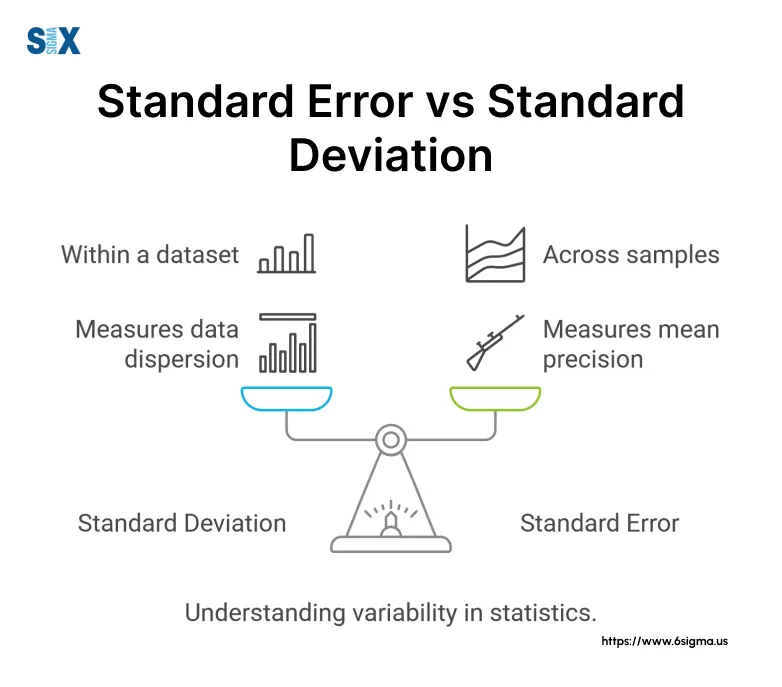

## Table of Contents

## What is standard deviation and how is it calculated?

Standard deviation is a measure that tells us how spread out numbers in a set are. It shows how much the numbers differ from the average (mean) of the set. If the numbers are close to the average, the standard deviation is small. If the numbers are far from the average, the standard deviation is large.

To calculate the standard deviation, first find the mean of the set of numbers. Then, for each number, find the difference between that number and the mean, and square that difference. Next, find the average of all those squared differences. This average is called the variance. Finally, take the square root of the variance to get the standard deviation.

## What is standard error and how is it calculated?

Standard error is a measure that tells us how accurate the mean of a sample is likely to be compared to the true mean of the whole population. It shows how much the sample mean might differ from the population mean if we took many samples. The smaller the standard error, the more precise our sample mean is as an estimate of the population mean.

To calculate the standard error, we first need to find the standard deviation of the sample. Then, we divide this standard deviation by the square root of the sample size. This gives us the standard error. For example, if the standard deviation of a sample is 5 and the sample size is 100, the standard error would be 5 divided by the square root of 100, which is 0.5.

## How do standard deviation and standard error differ in their purpose?

Standard deviation tells us how spread out the numbers in a group are. It shows how much each number in the group differs from the average of the group. If the numbers are close to the average, the standard deviation is small. If the numbers are far from the average, the standard deviation is large. We use standard deviation to understand how much variation there is within a single set of data.

Standard error, on the other hand, tells us how accurate our sample's average is compared to the true average of the whole group. It shows how much the average of our sample might differ from the true average if we took many samples. A small standard error means our sample's average is a good guess for the true average. We use standard error to understand how well our sample represents the whole group.

## Can you explain the relationship between sample size and standard error?

The standard error tells us how accurate our sample's average is compared to the true average of the whole group. It's like a measure of how much our sample's average might be off from the real average if we took many samples. The size of the sample we take plays a big role in the standard error. The bigger the sample, the smaller the standard error gets.

This happens because when we have a bigger sample, we get a better idea of what the whole group looks like. Think of it like this: if you only ask a few people their favorite color, your guess about everyone's favorite color might be way off. But if you ask a lot of people, your guess will be closer to the truth. So, the more people you include in your sample, the less your sample's average will jump around from the true average, making the standard error smaller.

## How does the standard deviation of a population relate to the standard error of the mean?

The standard deviation of a population tells us how spread out the numbers in the whole group are. It shows how much each number differs from the average of the whole group. If the numbers are close to the average, the standard deviation is small. If the numbers are far from the average, the standard deviation is large. We use the standard deviation to understand how much variation there is within the entire group.

The standard error of the mean, on the other hand, tells us how accurate our sample's average is compared to the true average of the whole group. It shows how much the average of our sample might differ from the true average if we took many samples. The standard error is calculated by dividing the standard deviation of the sample by the square root of the sample size. This means that the standard error depends on both the standard deviation of the population (which the sample's standard deviation estimates) and the size of the sample. The bigger the sample, the smaller the standard error gets, because a larger sample gives us a better idea of what the whole group looks like.

## What are the common misconceptions about standard deviation and standard error?

One common misconception is that standard deviation and standard error are the same thing. They are not. Standard deviation tells us how spread out the numbers in a group are. It's like measuring how much each number in a group differs from the average of that group. On the other hand, standard error tells us how accurate our sample's average is compared to the true average of the whole group. It's about how much our sample's average might be off from the real average if we took many samples.

Another misconception is thinking that a smaller standard deviation always means the data is more reliable or accurate. This isn't true because standard deviation only tells us about the spread within one set of data. It doesn't tell us anything about how well that set of data represents the whole group. For that, we need the standard error, which does tell us how well our sample's average represents the true average of the whole group. So, a small standard deviation is good for understanding the consistency within a group, but it doesn't tell us about the accuracy of our sample in representing the entire population.

## How do you interpret standard deviation in the context of a data set?

Standard deviation tells us how spread out the numbers in a data set are. It's like measuring how much each number in the group differs from the average of the group. If the numbers are close to the average, the standard deviation is small, meaning the data points are tightly clustered around the average. If the numbers are far from the average, the standard deviation is large, indicating that the data points are more spread out.

In simple terms, if you have a set of test scores and the standard deviation is small, it means most students scored around the same mark, close to the average score. If the standard deviation is large, it means the scores were all over the place, with some students scoring much higher or lower than the average. This helps us understand the consistency or variability within the data set.

## How do you interpret standard error in the context of a sample mean?

Standard error tells us how accurate our sample's average is compared to the true average of the whole group. It's like a measure of how much our sample's average might be off from the real average if we took many samples. If the standard error is small, it means our sample's average is a good guess for the true average. If it's large, our sample's average might be quite different from the true average.

Think of it like trying to guess the average height of all the students in a school by measuring just a few of them. If you measure a small group and the standard error is low, it means your guess about the average height of all the students is probably pretty close to the truth. But if the standard error is high, your guess might be way off because the small group you measured might not represent the whole school well.

## In what scenarios would you use standard deviation over standard error, and vice versa?

You would use standard deviation when you want to understand how spread out the numbers are within a single group of data. For example, if you're looking at the test scores of a class, the standard deviation tells you how much the scores vary from the average score. It helps you see if most students scored around the same mark or if their scores were all over the place. This is useful in fields like education, where you might want to know how consistent student performance is, or in finance, where you might want to know how much stock prices fluctuate.

On the other hand, you would use standard error when you're trying to estimate how accurate the average of your sample is compared to the true average of the whole population. For instance, if you're conducting a survey and you want to know if the average response from your sample is a good representation of everyone's opinion, the standard error helps you figure that out. A small standard error means your sample's average is likely close to the true average, which is important in areas like medical research, where you might be testing a new drug and need to know how well your sample results predict the drug's effect on the entire population.

## How does the Central Limit Theorem affect the understanding of standard error?

The Central Limit Theorem is a big idea in [statistics](/wiki/bayesian-statistics) that helps us understand how the averages of samples behave. It says that if you take many samples from a population and find the average of each sample, the distribution of those sample averages will look like a bell-shaped curve, no matter what the original population looks like. This is really helpful because it means we can predict how sample averages will spread out around the true population average.

This is where standard error comes in. The Central Limit Theorem tells us that the standard error tells us how spread out those sample averages are around the true population average. If we know the standard deviation of the population and the size of our sample, we can use the Central Limit Theorem to figure out the standard error. This helps us understand how accurate our sample's average is as a guess for the true average of the whole group. So, the Central Limit Theorem makes standard error a powerful tool for making good guesses about populations based on samples.

## What advanced statistical techniques use standard error, and how?

One advanced statistical technique that uses standard error is hypothesis testing. In hypothesis testing, we want to know if the difference we see between two groups, like a treatment group and a control group, is just due to chance or if it's a real difference. We use the standard error to help us figure this out. We calculate the standard error of the difference between the two groups' averages. If this difference is bigger than what we would expect just by chance, given the standard error, we might conclude that there's a real difference between the groups. This helps scientists and researchers make decisions based on data.

Another technique that uses standard error is confidence intervals. When we take a sample from a big group, we want to guess what the true average of the whole group might be. We can use the sample's average and the standard error to create a range of numbers, called a confidence interval, where we think the true average probably falls. If the standard error is small, our confidence interval will be narrow, meaning we're pretty sure about our guess. If the standard error is large, our confidence interval will be wide, showing that our guess isn't as precise. This is useful for understanding how sure we can be about our estimates based on samples.

## How can confidence intervals be constructed using standard error, and what does this tell us about the precision of our estimates?

Confidence intervals are a way to guess where the true average of a whole group might be, based on the average of a smaller sample. To make a confidence interval, we start with the sample's average and then add and subtract a certain number of standard errors. This number depends on how sure we want to be about our guess. For example, if we want to be 95% sure, we usually use about two standard errors. So, if our sample's average is 50 and the standard error is 2, our 95% confidence interval would be from 46 to 54. This means we're pretty sure the true average of the whole group is somewhere between 46 and 54.

The width of the confidence interval tells us about the precision of our estimate. If the confidence interval is narrow, it means our guess about the true average is pretty precise. This happens when the standard error is small, which often means we have a big sample. On the other hand, if the confidence interval is wide, it means our guess isn't as precise. This happens when the standard error is large, which can happen with a small sample. So, by looking at the confidence interval, we can see how sure we can be about our estimate of the true average.

## What is the difference between Standard Error and Standard Deviation?

Standard error and standard deviation are central to understanding variability in data, and they play a critical role in financial analysis. The standard error (SE) quantifies the precision of a sample mean by measuring how much the sample mean of the data is likely to deviate from the true population mean. It is computed as the standard deviation of the sample divided by the square root of the sample size $n$:

$$
\text{SE} = \frac{\sigma}{\sqrt{n}}
$$

where $\sigma$ represents the sample standard deviation. A smaller standard error indicates that the sample mean is a more accurate reflection of the actual population mean, which is vital in making dependable trading decisions based on sampled market data.

Contrarily, standard deviation (SD) illustrates the spread or [dispersion](/wiki/dispersion-trading) of a set of values around the mean. It is a measure of how spread out the numbers are in a data set:

$$
\sigma = \sqrt{\frac{\sum (x_i - \mu)^2}{n}}
$$

where $x_i$ represents each data point, $\mu$ is the mean of the data points, and $n$ is the number of data points. In finance, SD is a widely used metric for assessing volatility; higher standard deviations signify larger variability, implying greater risk and uncertainty in the returns of a financial asset.

Both SE and SD are indispensable tools for evaluating risk and [volatility](/wiki/volatility-trading-strategies) in financial markets. For instance, an asset with a high standard deviation is riskier than one with a low standard deviation, as its price shows more significant fluctuations. 

To illustrate these concepts, consider a scenario where a trader is analyzing stock returns from a sample to infer the behavior of future returns. The standard error might help assess the reliability of the sample mean, influencing decisions about expected future returns. Meanwhile, the standard deviation could be used to evaluate the expected volatility of the asset, guiding risk management strategies.

In summary, understanding both the standard error and standard deviation helps traders quantify uncertainty, making both metrics critical for effective risk assessment and decision-making in trading strategies.

## What is the Role of Standard Error in Algorithmic Trading?

Algorithmic trading systems increasingly depend on advanced statistical models to make decisions based on high volumes of market data. One vital statistical measure used in these models is the standard error, which quantifies the extent of sampling error present in the data used for trading. This is particularly important in trading, where decisions are often based on sample data that may not perfectly represent the entire market or population data.

### Understanding Standard Error

The standard error is essentially a gauge of the variability or precision of a sample statistic, most commonly the sample mean. It is calculated as the standard deviation of the sample divided by the square root of the sample size (n):

$$
\text{Standard Error (SE)} = \frac{\sigma}{\sqrt{n}}
$$

where $\sigma$ is the standard deviation of the sample data.

### Assessing Reliability Through Standard Error

In the context of [algorithmic trading](/wiki/algorithmic-trading), understanding the size of the standard error helps traders assess how closely a sample statistic approximates the population parameter. A smaller standard error indicates that the sample mean is likely a closer estimate of the population mean, thus providing more reliable trading signals. 

### Calculation and Integration in Trading Algorithms

To calculate standard error within an algorithmic trading system, traders can use statistical software or programming languages like Python. Here's a basic illustration of calculating the standard error in Python:

```python
import numpy as np

# Sample data
data = np.array([50, 55, 45, 60, 53])

# Calculate standard deviation
std_dev = np.std(data, ddof=1)  # ddof=1 for sample standard deviation

# Sample size
n = len(data)

# Calculate standard error
standard_error = std_dev / np.sqrt(n)

print(f"Standard Error: {standard_error}")
```

Once calculated, standard error can be integrated into trading algorithms for decision-making processes, providing input on the precision and variability of market predictions.

### Influence on Backtesting and Optimization

The standard error is also crucial during the [backtesting](/wiki/backtesting) phase of developing trading strategies. It allows traders to determine the extent to which historical performance is likely to replicate in the future, acknowledging the potential impact of sampling error. A large standard error may indicate that the backtested results are less reliable and may not perform as expected in actual trading scenarios.

Furthermore, in the optimization of trading strategies, understanding the standard error aids in evaluating different configurations' robustness and stability. For instance, traders can compare the standard errors of multiple sample strategies to identify which model might yield the most consistent returns over time, thereby optimizing for stability and reliability in live trading environments.

In summary, incorporating standard error analysis into algorithmic trading systems helps improve the reliability of market signals, enhances model accuracy through backtesting, and aids in the development of robust trading strategies capable of weathering market volatility.

## What is the significance of standard deviation in trading strategies?

Standard deviation is a critical statistical measure in trading strategies, primarily employed to quantify the volatility of a financial instrument or market. Volatility is indicative of the degree to which the price of a security fluctuates over a given period. A higher standard deviation signifies increased volatility, suggesting greater risk and potential for substantial price movements. This makes standard deviation an essential tool for traders assessing the risk-return profile of various securities and overall portfolio performance.

To understand its application, consider a financial asset's historical price data. The standard deviation ($\sigma$) is calculated as follows:

$$
\sigma = \sqrt{\frac{1}{N} \sum_{i=1}^{N} (X_i - \mu)^2}
$$

where $N$ is the number of data points, $X_i$ represents each individual price, and $\mu$ is the average price over the data set.

Standard deviation is foundational to several trading strategies, with Bollinger Bands being one of the most notable. Bollinger Bands are a type of statistical chart characterized by three lines: a middle simple moving average (SMA) and two outer bands representing standard deviations away from the SMA. These bands expand and contract based on market volatility, thus helping traders identify overbought or oversold conditions. The typical settings for Bollinger Bands are a 20-day SMA with the upper and lower bands set 2 standard deviations away from the SMA.

Python code snippet for Bollinger Bands:

```python
import pandas as pd

def calculate_bollinger_bands(prices, window=20, num_std=2):
    sma = prices.rolling(window=window).mean()
    rolling_std = prices.rolling(window=window).std()
    upper_band = sma + (rolling_std * num_std)
    lower_band = sma - (rolling_std * num_std)
    return sma, upper_band, lower_band

# Example usage with a Pandas Series of prices
# prices = pd.Series([...])
# sma, upper_band, lower_band = calculate_bollinger_bands(prices)
```

Besides Bollinger Bands, standard deviation is effective in diversifying portfolios and managing trading risks. By analyzing the standard deviation of different asset classes, traders can allocate funds to minimize risk through diversification. For example, combining assets with low correlation and varying volatility helps achieve a balanced portfolio. This strategy mitigates the impact of a single asset's volatility on the entire portfolio.

In conclusion, the significance of standard deviation in trading strategies cannot be overstated. It provides quantitative metrics for evaluating market volatility and risk, contributing to more informed and strategic decision-making. By leveraging standard deviation, traders can optimize their trading strategies, manage portfolio risks effectively, and enhance overall investment performance.

## What are the practical applications of statistical measures in algo trading?

Integrating statistical measures such as standard error and standard deviation into algorithmic trading models is a robust approach to enhancing their reliability and performance. These metrics provide insights into market dynamics and help in evaluating risk, which is essential for developing sound trading strategies.

### Step-by-Step Guide on Implementation

1. **Data Collection and Preparation**: The first step in implementing statistical measures in algorithmic trading is to gather historical market data. This data serves as the foundation for computing standard error and standard deviation. Traders can access this data through financial data providers or trading platforms' APIs.

2. **Calculating Standard Error and Standard Deviation**:
   - **Standard Deviation**: It is computed by taking the square root of the variance of a dataset. In mathematical terms, if $x_1, x_2, \ldots, x_n$ are n observations, the standard deviation $\sigma$ is given by:
$$
     \sigma = \sqrt{\frac{1}{n-1} \sum_{i=1}^{n} (x_i - \bar{x})^2}

$$
     where $\bar{x}$ represents the mean of the observations.

   - **Standard Error**: The standard error of the mean (SEM) is given by dividing the standard deviation by the square root of the sample size $n$:
$$
     \text{SEM} = \frac{\sigma}{\sqrt{n}}

$$

   Implementing these calculations in Python can be facilitated by libraries such as NumPy:
   ```python
   import numpy as np

   data = np.array([/* market data */])
   std_dev = np.std(data, ddof=1)
   std_error = std_dev / np.sqrt(len(data))
   ```

3. **Integration into Trading Models**: Once these metrics are calculated, they can be integrated into trading algorithms. Standard deviation, for example, can be used to set trading signal thresholds or to construct technical indicators such as Bollinger Bands. 

4. **Backtesting and Optimization**: Use historical data to backtest trading strategies that incorporate these statistical measures. Backtesting helps in understanding how these strategies would have performed in the past, allowing for optimization of parameters.

### Case Studies in Real-World Trading

Several traders have effectively employed these statistical concepts. For instance, the use of Bollinger Bands, which are constructed using moving averages and standard deviations, has been popular in trend-following strategies. Traders also utilize standard error to refine entry and [exit](/wiki/exit-strategy) points by assessing the reliability of price movements.

### Common Pitfalls and Best Practices

A common pitfall in applying these statistical measures is overfitting trading models to historical data. Overreliance on past data trends can lead to poor model performance in live trading environments. Traders should ensure that models remain adaptable to changing market conditions and continuously validate them with current data.

Best practices include rigorous backtesting, regular model updates, and ensuring diversification in trading strategies to mitigate risk.

### Technological Advancements

Advancements in computational technology and software development have significantly simplified the computation and application of statistical measures. Trading platforms offer integrated tools for statistical analysis. Moreover, [machine learning](/wiki/machine-learning) frameworks now provide automated ways to incorporate statistical insights into trading strategies, further enhancing predictive accuracy and efficiency.

In conclusion, leveraging standard error and standard deviation in algorithmic trading not only enhances model robustness but also aids in developing a deep understanding of market movements. By harnessing technological advancements, traders can effectively deploy these measures to gain a competitive edge in financial markets.

## References & Further Reading

[1]: Niederhoffer, V. R., & Osborne, M. F. M. (1966). ["Market Making and Reversal on the Stock Exchange."](https://www.semanticscholar.org/paper/Market-Making-and-Reversal-on-the-Stock-Exchange-Niederhoffer-Osborne/cde23221cd7035d7ff138277bab2f62d71accfd9) The Journal of the American Statistical Association, 61(316), 897-916.

[2]: Cont, R. (2001). ["Empirical Properties of Asset Returns: Stylized Facts and Statistical Issues."](https://www.tandfonline.com/doi/abs/10.1080/713665670) Quantitative Finance, 1(2), 223-236.

[3]: Hull, J. C. (2021). ["Options, Futures, and Other Derivatives"](https://www.pearson.com/en-us/subject-catalog/p/options-futures-and-other-derivatives/P200000005938/9780136939917). Pearson Education. 

[4]: Taleb, N. N. (2007). ["The Black Swan: The Impact of the Highly Improbable"](https://www.jstor.org/stable/23045073). Random House.

[5]: Tsay, R. S. (2005). ["Analysis of Financial Time Series"](https://onlinelibrary.wiley.com/doi/book/10.1002/9780470644560). Wiley-Interscience.

[6]: Mandelbrot, B. B., & Hudson, R. L. (2004). ["The (Mis)Behavior of Markets: A Fractal View of Risk, Ruin, and Reward"](https://searchworks.stanford.edu/view/9081909). Basic Books.