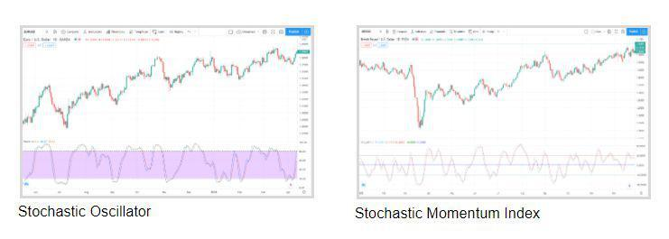

## Table of Contents

## What is a Stochastic Oscillator?

A Stochastic Oscillator is a tool used in trading to help predict where a stock's price might go next. It does this by comparing the closing price of a stock to its price range over a certain period of time, usually 14 days. The idea is that if a stock's price is near the top of its recent range, it might be overbought, meaning it could soon go down. If it's near the bottom, it might be oversold, meaning it could soon go up.

The Stochastic Oscillator gives you two lines on a chart, called %K and %D. These lines move between 0 and 100. When these lines are above 80, it suggests the stock might be overbought. When they are below 20, it suggests the stock might be oversold. Traders watch these lines to decide when to buy or sell. It's not perfect, but it can be a helpful guide when used with other tools.

## What is the Stochastic Momentum Index?

The Stochastic Momentum Index, or SMI, is another tool traders use to guess where a stock's price might go next. It's a bit like the Stochastic Oscillator, but it looks at how far the closing price is from the middle of the price range, not just the top or bottom. This helps traders see if a stock is moving strongly in one direction or if it's just bouncing around.

The SMI also gives you a number between -100 and +100. When the SMI is above +40, it might mean the stock is overbought and could go down soon. When it's below -40, it might mean the stock is oversold and could go up. Traders use these signals to decide when to buy or sell, but like all tools, it's not perfect and works best when used with other information.

## How is the Stochastic Oscillator calculated?

The Stochastic Oscillator is calculated using a simple formula that looks at the closing price of a stock and its price range over a certain period, usually 14 days. The formula for the %K line, which is the main line of the Stochastic Oscillator, is: %K = (Current Close - Lowest Low) / (Highest High - Lowest Low) * 100. Here, "Current Close" is the most recent closing price of the stock, "Lowest Low" is the lowest price the stock reached during the period, and "Highest High" is the highest price the stock reached during the period.

The %D line, which is the signal line, is a smoothed version of the %K line. It's calculated by taking the average of the last three %K values. So, %D = (%K today + %K yesterday + %K two days ago) / 3. This helps smooth out the %K line, making it easier to spot trends and potential buy or sell signals. Both %K and %D lines move between 0 and 100, helping traders see if a stock might be overbought or oversold.

## How is the Stochastic Momentum Index calculated?

The Stochastic Momentum Index, or SMI, is a bit different from the Stochastic Oscillator. It looks at how far the closing price is from the middle of the price range over a certain time, usually 14 days. To calculate the SMI, you first find the highest high and the lowest low of the stock's price during this time. Then, you figure out the midpoint of this range by adding the highest high and the lowest low and dividing by 2. The difference between the closing price and this midpoint tells you how far the price is from the middle.

Next, you need to find out how big the price range is, which is the highest high minus the lowest low. The SMI is then calculated using this formula: SMI = ((Current Close - Midpoint) / (0.5 * Price Range)) * 100. The SMI value will be between -100 and +100. To smooth out the SMI, traders often use a moving average, like a 3-day simple moving average, to create a signal line. This helps them see trends and decide when to buy or sell based on whether the SMI is above +40 or below -40.

## What are the main differences between the Stochastic Oscillator and the Stochastic Momentum Index?

The Stochastic Oscillator and the Stochastic Momentum Index (SMI) are both tools that traders use to predict where a stock's price might go next. The main difference between them is what they measure. The Stochastic Oscillator looks at where the closing price of a stock is compared to its highest and lowest prices over a certain time, usually 14 days. It tells you if the price is near the top (overbought) or near the bottom (oversold) of its range. On the other hand, the SMI measures how far the closing price is from the middle of the price range. This helps traders see if the price is moving strongly in one direction or just bouncing around.

Another key difference is how they are calculated and the values they give. The Stochastic Oscillator gives you a %K line and a %D line, both moving between 0 and 100. If these lines are above 80, it might mean the stock is overbought, and if below 20, it might mean it's oversold. The SMI, however, gives you a number between -100 and +100. If the SMI is above +40, it might mean the stock is overbought, and if below -40, it might mean it's oversold. Both tools help traders make decisions, but the SMI can show momentum better, while the Stochastic Oscillator is simpler and more direct.

## How does the Stochastic Oscillator help in identifying overbought and oversold conditions?

The Stochastic Oscillator helps traders figure out if a stock might be overbought or oversold by looking at its closing price compared to its price range over a certain time, usually 14 days. If the closing price is near the top of this range, the Stochastic Oscillator shows a high number, usually above 80. This suggests the stock might be overbought, meaning it could be due for a price drop soon. On the other hand, if the closing price is near the bottom of the range, the Stochastic Oscillator shows a low number, usually below 20. This suggests the stock might be oversold, meaning it could be due for a price increase.

Traders use these signals to make decisions about buying or selling stocks. When the Stochastic Oscillator goes above 80, it's a warning that the stock might be too expensive and could go down soon, so traders might think about selling. When it goes below 20, it's a sign that the stock might be too cheap and could go up soon, so traders might consider buying. By watching these levels, traders can try to buy low and sell high, even though it's not a perfect system and works best when used with other tools.

## How does the Stochastic Momentum Index help in identifying overbought and oversold conditions?

The Stochastic Momentum Index, or SMI, helps traders figure out if a stock is overbought or oversold by looking at how far the closing price is from the middle of its price range over a certain time, usually 14 days. If the closing price is far above the middle of the range, the SMI shows a high number, usually above +40. This suggests the stock might be overbought, meaning it could be due for a price drop soon. On the other hand, if the closing price is far below the middle of the range, the SMI shows a low number, usually below -40. This suggests the stock might be oversold, meaning it could be due for a price increase.

Traders use these signals from the SMI to decide when to buy or sell stocks. When the SMI goes above +40, it's a warning that the stock might be too expensive and could go down soon, so traders might think about selling. When it goes below -40, it's a sign that the stock might be too cheap and could go up soon, so traders might consider buying. By watching these levels, traders can try to buy low and sell high, even though it's not a perfect system and works best when used with other tools.

## What are the typical settings used for the Stochastic Oscillator?

The typical settings for the Stochastic Oscillator are 14, 3, and 3. These numbers mean the oscillator looks at the closing price over the last 14 days, then smooths it out with a 3-day moving average for the %K line, and another 3-day moving average for the %D line. These settings help traders see if a stock might be overbought or oversold by comparing the current price to its price range over those 14 days.

Traders can change these settings to fit their needs. If they want to see quicker changes, they might use shorter periods like 5, 3, and 3. If they want to see longer trends, they might use longer periods like 21, 5, and 5. But the 14, 3, 3 settings are the most common because they give a good balance between seeing short-term moves and longer trends.

## What are the typical settings used for the Stochastic Momentum Index?

The typical settings for the Stochastic Momentum Index, or SMI, are 14, 5, and 3. These numbers mean the SMI looks at the closing price over the last 14 days, then uses a 5-day moving average to smooth out the SMI line, and a 3-day moving average for the signal line. These settings help traders see if a stock might be overbought or oversold by comparing the current price to the middle of its price range over those 14 days.

Traders can change these settings to fit their needs. If they want to see quicker changes, they might use shorter periods like 5, 3, and 3. If they want to see longer trends, they might use longer periods like 21, 5, and 5. But the 14, 5, 3 settings are the most common because they give a good balance between seeing short-term moves and longer trends.

## Can you provide examples of trading strategies using the Stochastic Oscillator?

One common trading strategy using the Stochastic Oscillator is called the overbought/oversold strategy. Traders watch for when the Stochastic Oscillator goes above 80, which means the stock might be overbought. When this happens, they might sell the stock or wait for a better time to buy. On the other hand, when the Stochastic Oscillator goes below 20, it means the stock might be oversold. This could be a good time to buy the stock, hoping its price will go up soon. Traders often wait for the Stochastic Oscillator to start moving back up from below 20 or down from above 80 before making their move, to make sure the trend is changing.

Another strategy is called the crossover strategy. This one uses both the %K and %D lines of the Stochastic Oscillator. When the %K line crosses above the %D line, it's a sign that the stock's price might go up, so traders might buy the stock. When the %K line crosses below the %D line, it's a sign that the stock's price might go down, so traders might sell the stock. This strategy helps traders catch the start of new trends. Both strategies can help traders make decisions, but they work best when used with other tools and information to check the signals.

## Can you provide examples of trading strategies using the Stochastic Momentum Index?

One popular strategy using the Stochastic Momentum Index, or SMI, is the overbought/oversold strategy. Traders look at the SMI to see if it goes above +40, which means the stock might be overbought. When this happens, they might decide to sell the stock or wait for a better time to buy. If the SMI goes below -40, it means the stock might be oversold. This could be a good time to buy the stock, hoping its price will go up soon. Traders often wait for the SMI to start moving back up from below -40 or down from above +40 before they make their move, to make sure the trend is really changing.

Another strategy is the crossover strategy, which uses both the SMI line and its signal line. When the SMI line crosses above the signal line, it's a sign that the stock's price might go up, so traders might buy the stock. When the SMI line crosses below the signal line, it's a sign that the stock's price might go down, so traders might sell the stock. This strategy helps traders catch the start of new trends. Both strategies can help traders make decisions, but they work best when used with other tools and information to check the signals.

## How do the Stochastic Oscillator and Stochastic Momentum Index perform in different market conditions, and which might be more suitable for specific scenarios?

The Stochastic Oscillator and the Stochastic Momentum Index both help traders figure out if a stock is overbought or oversold, but they work a bit differently in various market conditions. In a trending market, where prices keep going up or down for a while, the Stochastic Oscillator can sometimes give false signals. It might say a stock is overbought when the price is still going up, or oversold when the price is still going down. This happens because the Stochastic Oscillator only looks at where the price is compared to its highest and lowest points over a certain time. The Stochastic Momentum Index, on the other hand, does better in trending markets because it looks at how far the price is from the middle of its range. This helps it spot strong trends and avoid false signals.

In a sideways market, where prices move up and down but don't go far in either direction, both tools can be useful. The Stochastic Oscillator is simpler and more direct, so it's easier to use for quick trades in a choppy market. It's good at spotting when a stock is overbought or oversold, which can help traders make short-term decisions. The Stochastic Momentum Index is a bit more complex but can be better for traders who want to see the strength of the price moves. It might be more suitable for those who are looking for slightly longer-term trades within the sideways movement. Both tools can help traders, but the choice depends on what kind of market they're in and what they're trying to do.

## What is the Stochastic Oscillator and how does it work?

The stochastic oscillator is a cornerstone in technical analysis, predominantly used to assess market momentum. This momentum indicator evaluates the current price in relation to its high and low over a defined time frame. Such evaluation is pivotal in gauging potential shifts in market dynamics.

Key to its functionality is the mathematical comparison between the closing price and its price range over a set period. The formula for the %K line of the stochastic oscillator can be expressed as:

$$
\%K = \frac{\text{Current Close} - \text{Lowest Low}}{\text{Highest High} - \text{Lowest Low}} \times 100
$$

Here, "Current Close" is today's closing price, "Lowest Low" is the lowest price over the last n sessions, and "Highest High" is the highest price over the same n sessions. The %D line, often a simple moving average of %K, helps smooth out signals:

$$
\%D = \text{SMA}(\%K, \text{period})
$$

Traders analyse crossovers between the %K and %D lines. A crossover where the %K line moves above the %D line may suggest a buying opportunity, while a crossover below might indicate a selling opportunity. This dual-line system provides visual cues on the chart, assisting in market timing and decision-making.

The oscillator is particularly renowned for indicating overbought or oversold conditions. Values above 80 suggest an overbought market, potentially preceding a downward price reversal, while values below 20 indicate oversold conditions, possibly hinting at an upcoming price increase.

Despite its popularity, the reliability of the stochastic oscillator can fluctuate based on market conditions. It performs optimally in range-bound markets where prices oscillate between consistent highs and lows. However, during strong trending markets, the stochastic oscillator may generate false signals, leading traders to complement this tool with other indicators for better accuracy.

Overall, the stochastic oscillator remains a valued instrument for traders aiming to capture [momentum](/wiki/momentum) shifts and anticipate potential price reversals in various market environments. Its straightforward calculation and interpretation make it accessible to both novice and experienced market participants.

## What is the Stochastic Momentum Index (SMI) and how can it be explored?

The stochastic momentum index (SMI) represents an advancement over the traditional stochastic oscillator, distinguished by its enhanced sensitivity and expanded range, which spans from +100 to -100. This formulation enables traders to gain a more nuanced understanding of market conditions. By focusing on the closing price's relation to the median of the high-low range, the SMI aims to reduce the occurrence of false signals that can mislead traders.

The SMI's operational scale provides a clear framework for interpreting market momentum. A value above zero typically indicates bullish momentum, suggesting that prices might continue upward. Conversely, a negative value signals bearish momentum, implying a potential continuation of downward price movement. This range provides a more refined scope of analysis compared to the stochastic oscillator, which typically operates between 0 and 100.

Traders employ the SMI to discern overbought or oversold conditions, using these insights to bolster their assessment of general market trends. When the SMI reaches extreme values near +100 or -100, it suggests that the market may have moved too far in one direction and could be due for a reversal or correction. Such insights are critical for traders aiming to anticipate shifts in market trends.

The SMI's precision in capturing momentum shifts represents a significant advantage. For traders focused on reducing errors in trend predictions, the SMI can be an indispensable component of their analytical toolkit. By integrating the SMI alongside other indicators, traders can develop a comprehensive strategy that accounts for momentum while mitigating the risks of false signals.

To implement the SMI effectively, traders often incorporate the following formula, which considers both the current price relative to its recent historical highs and lows and the average range over a specified period:

$$
SMI = \frac{(C - M)}{HL}
$$

where $C$ represents the closing price, $M$ is the median of the high-low range, and $HL$ is the half-range of the high and low prices over a given period. While individual setups may vary, many traders find that adjusting the parameters of this formula to fit specific market dynamics is crucial for optimal performance. By tailoring the SMI settings, traders can enhance its responsiveness to different asset classes, thereby making informed trading decisions aligned with prevailing market conditions.

## What are the benefits and limitations?

Stochastic indicators offer essential insights into market momentum and potential reversals, thus playing a vital role in technical analysis. Their primary advantage lies in their simplicity, allowing traders to quickly assess price momentum relative to historical high and low prices. The stochastic oscillator, for instance, calculates the relative position of the current closing price within the specified range, often using formulas like:

$$
\%K = \frac{(C - L_{14})}{(H_{14} - L_{14})} \times 100
$$

where $C$ is the most recent closing price, $L_{14}$ is the lowest price over the past 14 sessions, and $H_{14}$ is the highest price over the same period. This mathematical underpinning makes stochastic indicators adaptable to different market conditions and instruments, catering to both novice and seasoned traders.

Despite their benefits, stochastic indicators do have limitations. They are prone to generating false signals, particularly in markets exhibiting strong trends. This susceptibility can lead traders to misinterpret or over-trade if relying solely on stochastic signals. To mitigate this risk, it is advisable to use stochastic indicators in conjunction with other technical tools. For instance, combining stochastic readings with trend-following indicators or volume analysis can provide more robust confirmations of potential reversals or continuations.

Furthermore, the stochastic indicators' basic premise of mean reversion can sometimes lag actual market movements, especially during rapid price shifts. In such instances, traders should be cautious and seek corroboration from other analytical methods to avoid erroneous predictions. While stochastic indicators enhance market analysis, relying entirely on their output without additional context can result in suboptimal trading performance.

## References & Further Reading

[1]: Lane, George. C. ["Lane's Stochastics: A Double Momentum Oscillator."](https://www.bizapedia.com/ma/law-office-of-george-lane-marlette-pc.html) Market Technicians Association Journal, 1995.

[2]: Gliwa, Bartosz. ["The Stochastic Oscillator: A Technical Analysis Indicator and Its Widespread Applications in Financial Markets."](https://bielsk.eu/wiadomosci-sport/50333-miejska-gala-sportu-burmistrz-piotr-wawulski-uhonorowal-wyrozniajacych-sie-sportowcow-foto) IEEE Xplore.

[3]: Pring, Martin J. ["Technical Analysis Explained: The Successful Investor's Guide to Spotting Investment Trends and Turning Points"](https://archive.org/details/technicalanalysi0000prin) by Martin J. Pring.

[4]: Kirkpatrick, Charles D., & Dahlquist, Julie R. ["Technical Analysis: The Complete Resource for Financial Market Technicians"](https://www.amazon.com/Technical-Analysis-Complete-Financial-Technicians/dp/0134137043).

[5]: Murphy, John J. ["Technical Analysis of the Financial Markets: A Comprehensive Guide to Trading Methods and Applications"](https://archive.org/details/technicalanalysi0000murp).

[6]: Achelis, Steven B. ["Technical Analysis from A to Z"](https://archive.org/details/technicalanalysi00ache), 2nd Edition.