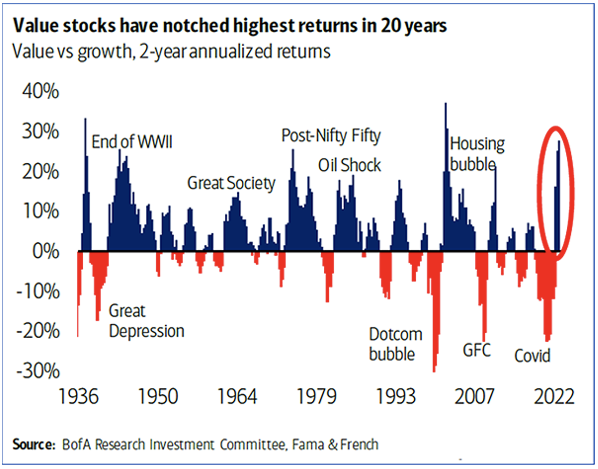

## Table of Contents

## What were the major economic conditions in the 1950s?

In the 1950s, the economy was growing a lot. This time is called the post-war economic boom. After World War II ended, many countries, especially the United States, started to rebuild and make more things. People had more money to spend, and businesses made more products. Jobs were easy to find, and many people moved to the cities to work in factories or offices. The government also helped by spending money on big projects like highways and schools.

There was also a lot of new technology and inventions during this time. Things like TVs, cars, and washing machines became more common in homes. This made life easier and helped the economy grow even more. However, not everything was perfect. Some people, especially African Americans and other minorities, did not have the same opportunities. They often had lower-paying jobs and faced discrimination. Overall, though, the 1950s were a time of growth and prosperity for many.

## What were the major economic conditions in the 1970s?

In the 1970s, the economy faced some big challenges. This time is known for "stagflation," which means the economy was not growing, but prices were going up a lot. This was a big problem because usually, when the economy grows, prices stay the same or go up slowly. But in the 1970s, it was hard to find jobs, and things like food and gas became more expensive. One reason for this was the oil crisis. Countries that produced oil decided to raise their prices, which made everything more expensive because oil is used to make and move many things.

The government tried to fix these problems, but it was hard. They raised interest rates to try to stop prices from going up so fast, but this made it even harder for businesses to grow and for people to borrow money. Many people lost their jobs, and some industries, like car manufacturing, struggled a lot. On the other hand, some new industries, like technology and services, started to grow. By the end of the 1970s, the economy was still not doing well, but people were starting to see some changes that would lead to better times in the future.

## How did the stock market perform overall in the 1950s?

The stock market did really well in the 1950s. This was a time when the economy was growing a lot after World War II. People had more money to spend, and businesses were making more things. This made the stock market go up because companies were doing well and making more profits. The Dow Jones Industrial Average, which is a way to measure how the stock market is doing, started the decade at around 200 points and ended at about 685 points. That's a big increase!

However, the stock market didn't just go up all the time. There were some times when it went down a bit, but these dips were usually short and not too bad. Overall, the 1950s were a good time for the stock market. People who invested in stocks during this time saw their money grow a lot. This helped many people feel more confident about the economy and their future.

## How did the stock market perform overall in the 1970s?

The stock market had a tough time in the 1970s. This decade was marked by economic problems like stagflation, where prices went up a lot but the economy didn't grow. The stock market felt this too. The Dow Jones Industrial Average, which shows how the stock market is doing, started the decade at around 800 points but ended at about 838 points. That's not much of an increase, and when you think about inflation, it actually means the stock market didn't do well at all.

There were some ups and downs during the 1970s. For example, in 1973 and 1974, the stock market dropped a lot because of the oil crisis and other economic problems. Many people lost money during these years. But by the end of the decade, things started to get a little better. The stock market began to recover a bit, but it was still a hard time for investors. Overall, the 1970s were not a good time for the stock market, and many people were happy to see the decade end.

## What were the key industries driving the stock market in the 1950s?

In the 1950s, the stock market was driven by a few key industries. One of the biggest was the automobile industry. Companies like Ford and General Motors were making lots of cars, and people were buying them. This made the stock prices of these companies go up. Another important industry was consumer goods. Companies that made things like TVs, refrigerators, and washing machines did really well because more people had money to spend on these things.

Another industry that helped the stock market in the 1950s was construction. After World War II, the government spent a lot of money on building highways and houses. This helped companies that made building materials and did construction work. The aerospace industry also grew a lot during this time. With the Cold War going on, the government was spending money on planes and rockets, which helped companies like Boeing and Lockheed Martin. Overall, these industries made the stock market strong in the 1950s.

## What were the key industries driving the stock market in the 1970s?

In the 1970s, the stock market was influenced by a few key industries, but it was a tough time for many of them. The oil industry was very important because of the oil crisis. When oil prices went up, companies that found and sold oil did well for a while. But this also made everything more expensive, which hurt other industries. The automobile industry struggled a lot in the 1970s. High gas prices made people buy fewer cars, and companies like Ford and General Motors had a hard time.

Another industry that affected the stock market was technology. Even though the economy was not doing well, new technology companies started to grow. Companies that made computers and electronics, like IBM, began to do better toward the end of the decade. The service industry also became more important. As more people worked in offices and other service jobs, companies in this area started to grow. Overall, the 1970s were a challenging time for the stock market, but some industries like technology and services began to show promise for the future.

## Were there any significant stock market crashes or booms in the 1950s?

In the 1950s, the stock market did not have any big crashes like the one in 1929. Instead, it was a time of steady growth. The economy was doing well after World War II, and more people had money to spend. This helped businesses grow, and their stock prices went up. The Dow Jones Industrial Average, which shows how the stock market is doing, started the decade at around 200 points and ended at about 685 points. That's a big increase! There were some small dips, but they didn't last long and didn't hurt the overall growth of the stock market.

There were no big booms either, but the stock market did have some good years. For example, in 1954, the market went up a lot because people were feeling confident about the economy. Companies in industries like cars, consumer goods, and construction did especially well. Even though there were no big crashes or booms, the 1950s were a good time for the stock market. People who invested in stocks during this time saw their money grow, and this helped many feel more confident about the future.

## Were there any significant stock market crashes or booms in the 1970s?

In the 1970s, the stock market had a big crash. It happened in 1973 and 1974. This was because of the oil crisis and other economic problems. The price of oil went up a lot, which made everything more expensive. People started to spend less money, and businesses didn't do as well. The Dow Jones Industrial Average, which shows how the stock market is doing, dropped a lot during these years. Many people lost money, and it was a tough time for investors.

There were no big booms in the 1970s like in some other decades. The economy was struggling with something called stagflation, where prices went up but the economy didn't grow. This made it hard for the stock market to do well. By the end of the 1970s, things started to get a little better, but the stock market didn't see any big jumps. Overall, the 1970s were a hard time for the stock market, and many people were glad when the decade ended.

## How did government policies affect the stock market in the 1950s?

In the 1950s, government policies helped the stock market a lot. The government spent money on big projects like highways and schools. This made more jobs and helped businesses grow. When businesses did well, their stock prices went up. The government also kept interest rates low, which made it easier for people to borrow money. This meant more people could buy houses and cars, and this helped the economy and the stock market grow.

There were also some rules that helped keep the stock market stable. The government made sure that companies told the truth about how they were doing. This made people feel safer about investing in stocks. Overall, the government's actions in the 1950s made the economy strong and helped the stock market do well. People who invested in stocks during this time saw their money grow, and this made them feel good about the future.

## How did government policies affect the stock market in the 1970s?

In the 1970s, government policies had a big impact on the stock market, but it was not always a good one. The government tried to fight inflation by raising interest rates. This made it harder for people and businesses to borrow money. When borrowing money became expensive, businesses found it tough to grow, and this hurt their stock prices. The government also had to deal with the oil crisis, which made everything more expensive. They tried to help by controlling prices and wages, but this didn't work well and made the economy even slower.

Another way government policies affected the stock market was through spending. The government spent a lot of money on social programs and trying to fix the economy. This made the budget bigger, which worried some people about inflation getting worse. The government also changed some rules about how companies could do business, which made some investors nervous. Overall, the government's actions in the 1970s made the stock market struggle. It was a hard time for investors, and many were happy to see the decade end.

## What were the differences in investor behavior between the 1950s and the 1970s?

In the 1950s, investors were feeling good about the stock market. The economy was growing a lot after World War II, and people had more money to spend. This made businesses do well, and their stock prices went up. Investors were confident and happy to put their money into stocks. They knew that the government was spending on big projects like highways and schools, which helped the economy and the stock market. Because things were going well, investors were more willing to take risks and invest in different kinds of companies.

In the 1970s, things were very different. The economy was not doing well because of something called stagflation, where prices went up but the economy didn't grow. This made investors worried and less confident. The stock market had a big crash in 1973 and 1974 because of the oil crisis and other problems. Many people lost money, and they became more careful about where they put their money. Investors were less likely to take risks and more likely to keep their money in safer places like savings accounts. The government tried to fix the economy by raising interest rates and spending a lot of money, but this made things even harder for the stock market.

## What long-term impacts did the stock market trends of the 1950s and 1970s have on future decades?

The stock market trends of the 1950s had a big impact on future decades. The 1950s were a time of growth and prosperity, and this made people feel good about the stock market. Many people started investing in stocks and saw their money grow. This helped build trust in the stock market and made more people want to invest in the future. The government's policies in the 1950s, like spending on big projects and keeping interest rates low, showed how important government actions can be for the economy and the stock market. This set a pattern for future decades where government policies would continue to play a big role in how the stock market did.

The 1970s had a different kind of impact on future decades. The stock market struggled a lot during this time because of stagflation and the oil crisis. This made people less confident and more careful about investing. Many people lost money, and this made them think twice before putting their money into stocks again. The government's actions, like raising interest rates to fight inflation, showed how hard it can be to fix economic problems. This led to changes in how future governments dealt with the economy and the stock market. Overall, the 1970s taught investors to be more cautious and made governments think more carefully about their policies.

## References & Further Reading

[1]: United States Census Bureau. (2023). [Historical GDP Per Capita Data](https://www.census.gov/data/tables/time-series/demo/income-poverty/historical-income-people.html).

[2]: Dwyer, G. P. (2020). ["The Rise of High-Frequency Trading: The Role of Regulation and Changes in Market Quality"](https://www.researchgate.net/publication/378548435_Algorithmic_Trading_and_AI_A_Review_of_Strategies_and_Market_Impact). Finance Research Letters.

[3]: Malkiel, B. G. (2003). ["The Efficient Market Hypothesis and Its Critics"](https://www.princeton.edu/~ceps/workingpapers/91malkiel.pdf). Journal of Economic Perspectives, 17(1), 59–82.

[4]: O’Sullivan, N. (2005). ["Financial Innovation: Blending Knowledge and Creativity"](https://www.sciepub.com/reference/373190). European Journal of Finance, 11(4), 291-304.

[5]: Black, F. (1976). ["Studies of Stock Price Volatility Changes"](https://www.sciepub.com/reference/195861). Proceedings of the American Statistical Association, Business and Economic Statistics Section.