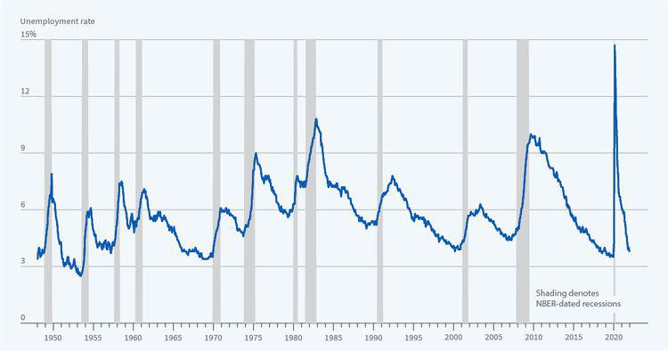

The stock market serves as a crucial indicator of economic health and investor sentiment over various periods. Understanding stock market trends is not only important for investors but is also pivotal in understanding broader financial history. Historically, the market's fluctuations reflect the underlying political, economic, and technological dynamics of each era. The cyclical nature of these market trends offers insights into the past, helping investors and economists anticipate future market behaviors and developments.

The 1950s marked a period of recovery and growth in the stock market as the global economy shifted from the austerity measures of World War II to peacetime expansion. This decade was characterized by increasing consumer spending and industrial growth, setting the stage for a bullish stock market. It was a time when investor confidence began to rebuild after the Great Depression and the crash of 1929, influenced heavily by technological and regulatory developments.

The 1970s presented a stark contrast, dominated by economic challenges such as stagflation—a condition of slow economic growth coupled with high inflation and unemployment. This period saw significant financial regulation changes, including the implementation of the Employee Retirement Income Security Act (ERISA), which had long-lasting impacts on retirement plans and savings. With the advancement towards electronic trading and the establishment of the Depository Trust Company, the decade was pivotal to the evolution of trading practices and market stability.

In the modern era, the rise of algorithmic trading has transformed the landscape of stock markets. Introduced in simplicity with the introduction of the Designated Order Turnaround (DOT) system in the 1970s, algorithmic trading has evolved significantly with technological advancements, impacting market volume and strategies employed by traders. The incorporation of high-frequency trading represents the pinnacle of this transformation, reflecting the increasing complexity and interconnectivity of today's global markets.

Understanding these key periods—namely, the 1950s, 1970s, and the current age of algorithmic trading—provides a comprehensive view of the stock market's evolution. By analyzing past trends, investors can better prepare for future market behavior, adapting to new technologies and regulatory landscapes. This article aims to explore these historical and modern trends, elucidating how past experiences can inform future market strategies and decisions.

## Table of Contents

## Stock Market Trends in the 1950s

The 1950s marked a pivotal era in the history of the stock market, emerging from the challenges of the Great Depression and the impact of World War II. The decade was characterized by significant economic growth and stability, which substantially influenced market sentiments and investor behavior.

Post-World War II, the United States experienced a period of economic expansion, known as the post-war economic boom. This prosperity was fueled by increased consumer spending, rising wages, and a surge in manufacturing. The U.S. Gross Domestic Product (GDP) grew robustly, creating a favorable environment for the stock market [1]. Investor confidence benefited from both this economic vitality and financial innovations, ushering in a bullish market that persisted throughout the decade.

The harrowing experiences of the Great Depression and the stock market crash of 1929 had left a lasting imprint on investors, fostering cautious and conservative investment strategies. In the 1950s, there was a gradual shift as investors regained confidence. Many were drawn back to the market by the potential for substantial returns, albeit with a renewed awareness of the risks involved. The evident recovery and growth of the economy contributed to restoring trust in the stock market as a viable investment avenue.

Technological and regulatory factors also played a crucial role in shaping stock trading during this period. Although electronic trading systems were not yet developed, the infrastructure supporting stock exchanges saw improvements, allowing for more efficient trade execution and information dissemination. Regulation was strengthened to protect investors and restore confidence. The Securities and Exchange Commission (SEC), established in the 1930s, played a pivotal role in ensuring fair and transparent markets, which further influenced investor sentiment positively.

One noteworthy development in the stock market during the 1950s was the introduction of monthly investment plans, which democratized access to stock ownership. These plans allowed individuals to invest small, regular amounts into the market, promoting consistent investment and aiding in the accumulation of wealth over time. This innovation made stock market participation more accessible to the average American, expanding the investor base beyond wealthy individuals and institutional investors. The broader participation helped to increase market [liquidity](/wiki/liquidity-risk-premium), contributing to the upward trajectory of stock prices.

In summary, the 1950s stock market trends were largely shaped by the flourishing economic conditions post-World War II, a cautious yet growing investor confidence recovering from the 1929 crash, and the emergence of financial instruments like monthly investment plans that promoted broader market participation. These factors collectively set the stage for subsequent market developments and laid the foundation for the changes seen in later decades.

[1] United States Census Bureau. (2023). Historical GDP Per Capita Data. Retrieved from [Census.gov](https://www.census.gov).

## The Economic Climate of the 1970s

During the 1970s, the global economy faced significant challenges, notably stagflation—a term describing the dual occurrence of stagnant economic growth and high inflation. This economic condition was primarily driven by the 1973 oil crisis, which saw oil prices quadruple, drastically increasing costs for businesses and consumers alike. The resulting inflation, coupled with slow growth, caused widespread uncertainty in financial markets. The stock market, sensitive to inflationary pressures and sluggish economic indicators, experienced heightened [volatility](/wiki/volatility-trading-strategies). Investors, wary of inflation eroding real returns, often diverted funds away from equities, placing downward pressure on stock prices.

In response to these economic challenges, the United States introduced legislation to bolster financial security and stimulate investment. The Employee Retirement Income Security Act (ERISA) of 1974 was a pivotal development, designed to protect retirement assets. ERISA established standards to ensure that individuals could rely on their pension plans, and it also introduced Individual Retirement Accounts (IRAs). These accounts provided tax advantages, encouraging individuals to save aside from employer-provided pension plans. The introduction of IRAs helped to cushion some of the economic blows by redirecting savings into long-term investments, including stocks, thus injecting liquidity into the market.

The 1970s also marked a crucial period in the transformation of trading technology. The transition from manual to electronic trading systems began, radically altering the speed and efficiency of transactions. This era saw the establishment of the Depository Trust Company (DTC) in 1973, which played a significant role in the modernization of the stock market by providing electronic record-keeping for securities ownership. The DTC facilitated faster and more secure transactions by reducing the need for physical movement of stock certificates, thereby enhancing market liquidity and reducing the costs associated with securities trading.

Amidst these advancements, the decade encountered several major market events, each leaving a distinctive impact on the investor community. The 1973-74 stock market crash, driven by the economic repercussions of the oil crisis, resulted in a significant loss of market value, with the Dow Jones Industrial Average losing nearly 45% of its value over two years. This period of downturn led investors to reassess their strategies, emphasizing diversification and caution in portfolio management.

Overall, the economic climate of the 1970s was characterized by a mix of challenges and innovations, shaping the era's stock market. The convergence of stagflation, legislative reforms like ERISA, and technological advancements in trading infrastructure collectively influenced investor behavior and laid foundational changes for future market dynamics.

## Financial History: Evolution of Trading Practices

The transition from manual to electronic trading systems marked a significant evolution in financial markets, beginning primarily in the 1970s. Before this period, trading was largely conducted through face-to-face transactions and via paper tickets. This manual system was not only time-consuming but also prone to human error and inefficiencies.

The introduction of electronic trading began with significant technological advancements. The Designated Order Turnaround (DOT) system, introduced by the New York Stock Exchange in the late 1970s, enabled orders to be transmitted electronically. This shift allowed for more efficient processing and execution of trades, laying the groundwork for future innovations in trading systems. The advent of electronic communication networks (ECNs) further transformed the trading landscape by allowing the matching of buy and sell orders outside traditional exchanges, reducing transaction costs.

The 1970s also saw the emergence and growth of mutual funds and index funds, significantly altering investment practices. Mutual funds offered investors the ability to pool their resources and invest in diversified portfolios managed by professionals. This democratized access to various asset classes and investment strategies, promoting wider participation in the stock market. Index funds, first introduced by John Bogle in 1976 with the launch of the Vanguard 500 Index Fund, provided investors with a low-cost means to track and invest in market indices, ushering in an era of passive investing.

Key legislative and regulatory changes during this time played a crucial role in shaping trading practices and market structures. The Securities Acts Amendments of 1975 mandated the establishment of a national market system (NMS), promoting competition among exchanges and improving transparency and fairness in the markets. This legislation paved the way for the integration of information technology in trading mechanisms, thereby enhancing market efficiency and investor confidence.

The continuing evolution of trading mechanisms and investor tools is characterized by constant technological advancements. Automated systems, [algorithmic trading](/wiki/algorithmic-trading), and digital platforms have become integral to modern trading practices, providing investors with sophisticated tools for analysis and execution. The rise of online brokerage services has further increased market accessibility, enabling individual investors to participate in trading with minimal barriers. As technology continues to advance, it is likely that trading practices will continue to evolve, driven by the need for speed, efficiency, and cost-effectiveness.

## Algorithmic Trading and Modern Market Dynamics

Algorithmic trading refers to the use of computer algorithms to automate the execution of trading orders with the intent to optimize execution speed, cost, and price. Its origins can be traced back to the late 1960s and early 1970s, with significant advancements marked by the introduction of the Designated Order Turnaround (DOT) system by the New York Stock Exchange (NYSE) in 1976. The DOT system allowed for the electronic routing of buy and sell orders directly to specialists on the trading floor, significantly reducing the time required to process trades.

Technological advancements have played a crucial role in the evolution of algorithmic trading. The development of sophisticated trading platforms, high-speed communication networks, and the proliferation of data have enabled algorithms to process and act on market information in milliseconds. These advancements are powered by improvements in computing power, specifically the use of Application-Specific Integrated Circuits (ASICs) and Field-Programmable Gate Arrays (FPGAs), which optimize latency-sensitive trading strategies.

The impact of algorithmic trading on market [volume](/wiki/volume-trading-strategy) and investor strategies is profound. Algorithmic trading accounts for a significant percentage of trading volume in major exchanges worldwide. It enhances liquidity, making it easier for investors to enter and [exit](/wiki/exit-strategy) positions. However, it also contributes to market complexity and volatility, necessitating new strategies that can handle rapid price changes. Investors now need to consider factors such as order routing efficiency and the potential impact of algorithmic strategies like statistical [arbitrage](/wiki/arbitrage), [market making](/wiki/market-making), and [trend following](/wiki/trend-following).

High-frequency trading ([HFT](/wiki/high-frequency-trading-strategies)) represents a specialized form of algorithmic trading characterized by extremely high speeds, a high order-to-trade ratio, and very short holding periods. HFT firms, often relying on colocated servers to reduce latency, use complex algorithms to capitalize on small price discrepancies across different markets. The significance of HFT in modern markets includes its role in providing liquidity and narrowing spreads, although its contribution to market volatility, notably during events like the Flash Crash of 2010, has raised regulatory concerns.

Overall, algorithmic trading and its subsets, such as HFT, continue to shape modern market dynamics, influencing trading volumes, price discovery processes, and strategic approaches among market participants. As technology advances, the focus remains on balancing the benefits of speed and efficiency against the risks of market disruption and systemic challenges.

## Comparative Analysis: 1950s, 1970s, and Today

The evolution of stock market dynamics from the 1950s to the present day highlights substantial shifts in trading volumes, market accessibility, technological influences, and regulatory frameworks, significantly reshaping investor behavior and market participation.

During the 1950s, the stock market was characterized by relatively low trading volumes, attributed to limited investor participation. The influence of the Great Depression continued to cultivate a cautious investor sentiment, with many individuals preferring secure, conservative investments. Access to the stock market was primarily restricted to affluent individuals and institutional investors, given the high costs and technical barriers involved in trading. The market primarily relied on manual operations, with stock prices updated via ticker tapes—a mechanical means of ensuring trades were reported promptly, albeit constrained by technological limitations of the time.

The 1970s ushered in significant changes, with trading volumes increasing as a broader demographic gained market access. The introduction of the Electronic Quotation System (EQRS) and the Depository Trust Company (DTC) in the early 1970s paved the way for more direct and efficient trading processes, reducing operational costs and broadening market accessibility. Legislative initiatives such as the Employee Retirement Income Security Act (ERISA) and the introduction of Individual Retirement Accounts (IRAs) played pivotal roles in transforming the stock market landscape, as these increased the number of Americans participating in the stock market. These shifts contributed to a more diverse investor base, impacting market behavior through elevated trading activity and a rise in mutual fund and pension fund investments.

Today, the stock market operates on a highly sophisticated technology platform, characterized by electronic trading systems and algorithmic trading largely dominating the trading volume. The evolution toward digital and algorithmic strategies has democratized market access, allowing retail investors to participate with relative ease via online platforms. Trading volumes have increased exponentially compared to prior decades, driven by high-frequency trading (HFT) and market strategies leveraging volume maximization and minimal latency. Regulatory frameworks now play a crucial role in maintaining market integrity and investor protection, with regulations such as the Dodd-Frank Act ensuring transparency and mitigating systemic risks. This evolved regulatory environment balances the need for technological advancement with safeguards against market volatility and unfair practices.

Investor behavior has notably transformed over these decades. In the 1950s, long-term holding strategies and dividend-driven investments shaped investment approaches. However, the 1970s saw diversification and portfolio management evolve, emphasizing capital appreciation through mutual index funds. Currently, strategic shifts focus on leveraging technology, data analytics, and [machine learning](/wiki/machine-learning) for optimized, diversified portfolios—turning towards automated platforms to align with modern market rhythms.

In summary, the comparative analysis of the stock market in the 1950s, 1970s, and today reveals a clear trajectory toward increased accessibility and technological integration, instigating unprecedented changes in trading dynamics and investor behavior. Understanding these developments provides critical insights into contemporary market practices and the drivers of potential future transformations.

## Conclusion

The analysis of historical and modern stock market trends reveals several key insights central to understanding the dynamics of financial markets. During the 1950s, the post-World War II economic boom and the shadow of the Great Depression significantly influenced investor behavior, cultivating a cautious investment atmosphere that gradually transitioned to embrace growth-oriented strategies. The technological and regulatory advancements, including the establishment of monthly investment plans, laid a foundational framework for today's diversified market participation.

Moving into the 1970s, the economic climate was marked by stagflation, challenging traditional market operations, and driving adaptation in investment strategies. Legislative measures such as the Employee Retirement Income Security Act (ERISA) facilitated the growth of Individual Retirement Accounts (IRAs), broadening investor horizons and fostering long-term savings. The era also heralded the transition to electronic trading and brought about significant regulatory frameworks that continue to impact market operations today.

In the modern context, algorithmic trading has revolutionized the stock market, enhancing market liquidity and efficiency through high-frequency trading and complex algorithms. These technological advancements have expanded market volume and influenced investor strategies, creating a dynamic landscape where rapid information processing can yield competitive advantages. However, this evolution also necessitates robust regulatory mechanisms to ensure market integrity and protect investors.

The comparative analysis across these distinct periods highlights considerable shifts in trading volumes, market accessibility, and technological influences. Investor behavior and market participation have evolved, driven by changes in regulatory frameworks and technological innovations. The strategic investment approaches have also varied, adapting to the economic, technological, and regulatory landscapes of each era.

Looking forward, the implications of past trends point towards an increasingly automated and interconnected market. Understanding these historical developments can provide valuable foresight into possible future trajectories. The ongoing influence of technology and regulation will likely shape market dynamics further, emphasizing the need for both investors and policymakers to anticipate changes and adapt proactively. Preparing for future changes in the stock market landscape involves staying informed about technological advancements and understanding regulatory shifts, ensuring that strategies remain relevant in an ever-evolving financial ecosystem.

## References & Further Reading

[1]: United States Census Bureau. (2023). [Historical GDP Per Capita Data](https://www.census.gov/data/tables/time-series/demo/income-poverty/historical-income-people.html).

[2]: Dwyer, G. P. (2020). ["The Rise of High-Frequency Trading: The Role of Regulation and Changes in Market Quality"](https://www.researchgate.net/publication/378548435_Algorithmic_Trading_and_AI_A_Review_of_Strategies_and_Market_Impact). Finance Research Letters.

[3]: Malkiel, B. G. (2003). ["The Efficient Market Hypothesis and Its Critics"](https://www.princeton.edu/~ceps/workingpapers/91malkiel.pdf). Journal of Economic Perspectives, 17(1), 59–82.

[4]: O’Sullivan, N. (2005). ["Financial Innovation: Blending Knowledge and Creativity"](https://www.sciepub.com/reference/373190). European Journal of Finance, 11(4), 291-304.

[5]: Black, F. (1976). ["Studies of Stock Price Volatility Changes"](https://www.sciepub.com/reference/195861). Proceedings of the American Statistical Association, Business and Economic Statistics Section.