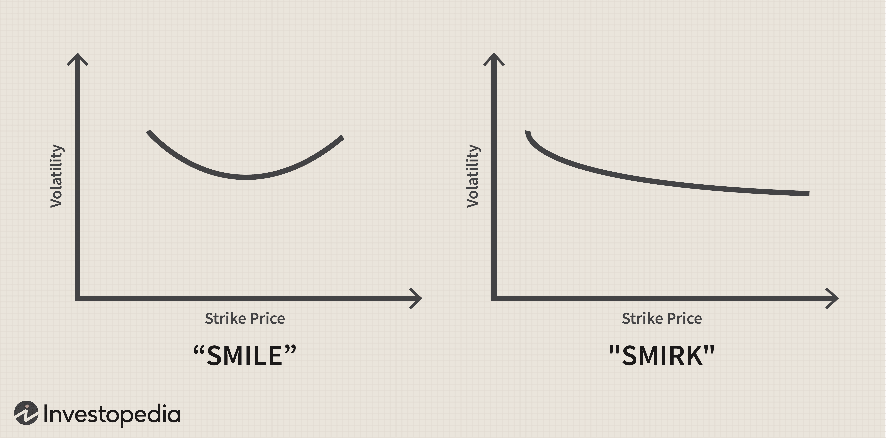

Volatility trading is an essential aspect of financial markets, where traders seek to capitalize on price swings in stocks and options. This method involves devising strategies that exploit fluctuations, potentially leading to profitable outcomes during periods of uncertainty.

Central to volatility trading is the understanding of how market instruments like stocks and options behave under varying volatile conditions. Stocks can exhibit price variability due to factors like earnings reports, geopolitical events, or shifts in monetary policy. Options trading inherently involves volatility, as the value of options—derived from underlying stocks—fluctuates with market movements. This relationship presents opportunities for traders to leverage options to manage risk and enhance returns. Particularly during volatile periods, incorporating options in a trading strategy provides flexibility through various contract types and expiration dates.



Algorithmic trading emerges as a valuable tool in executing volatility strategies efficiently and with precision. By automating trade execution based on pre-set rules and criteria, algorithms can react to market changes faster than manual trading. This automation leads to better management of complex strategies, reduces human error, and optimizes trade performance.

Volatility, options, and algorithmic trading collectively offer powerful avenues for traders to maximize returns while managing risk. By mastering these concepts, one can navigate dynamic market conditions with informed and disciplined trading practices.

## Table of Contents

## Understanding Volatility and its Impact on Trading

Volatility is a crucial concept in financial markets, representing the degree of variation in the price of a security over a specific period. It quantifies the extent of price movements, offering insights into the predictability and potential risk associated with investing in a particular asset. This variability can be measured using standard deviation or variance from the security's average price.

In financial trading, higher volatility often signals a broader potential for profit due to more significant price swings. However, it simultaneously introduces increased risk, necessitating effective risk management strategies to mitigate potential losses. For example, during periods of heightened volatility, there can be rapid and unpredictable price changes, which could either benefit skilled traders or detrimentally impact those unprepared for abrupt market shifts.

Volatility also creates trading opportunities. In stocks and options markets, active traders can capitalize on price fluctuations by buying low and selling high within a relatively short time frame. Options trading is particularly influenced by [volatility](/wiki/volatility-trading-strategies), as it is a key [factor](/wiki/factor-investing) in options pricing models. The Black-Scholes model, a well-known method for options pricing, incorporates volatility to estimate the fair value of options contracts. It accounts for the expected volatility of the underlying asset's price movements in calculating the option's premium, influencing traders' decisions to buy or sell specific options.

Understanding volatility is fundamental for traders aiming to develop robust trading strategies. Recognizing patterns and anticipating market reactions to volatility changes aids in executing precise and timely trades. Furthermore, insights into volatility assist traders in evaluating the appropriate level of risk they are willing to assume, particularly when leveraging derivatives like options. Quantitative models and algorithmic systems frequently rely on volatility metrics to determine optimal trading actions and manage associated risks effectively.

In conclusion, volatility is a double-edged sword in trading. Its thorough understanding is essential for navigating challenges and exploiting the opportunities it presents. By mastering volatility concepts, traders can enhance their strategies, potentially achieving superior results in dynamic market conditions.

## Volatility Trading with Options

Options provide traders with a unique avenue for engaging in volatility trading, offering both flexibility and leverage. These financial instruments are well-suited for managing risk and crafting strategies that can thrive in unpredictable market conditions.

One pivotal aspect of options in volatility trading is the creation of synthetic positions. A synthetic position allows traders to replicate the payoff of a stock position using options. This technique can be particularly advantageous as it generally requires lower capital compared to owning the actual stock, while still granting the ability to manage exposure effectively. For example, a synthetic long stock can be constructed using a call option and a short put option with the same strike price and expiration date.

In addition to synthetic positions, protective put strategies are a reliable method for shielding against unfavorable market movements. By purchasing put options, traders can essentially set a floor on potential losses without having to relinquish the potential for gains. This is especially beneficial in volatile markets where asset prices can fluctuate wildly. Such puts act as an insurance policy, allowing traders to preserve their gains while still participating in possible upside movement of the underlying asset.

Another beneficial concept in options trading is directional neutrality. Strategies such as straddles and strangles enable traders to profit irrespective of the direction in which the market moves. A straddle involves purchasing both a call and a put option at the same strike price and expiration date, allowing traders to benefit from significant price movements in either direction. A strangle, on the other hand, consists of buying a call and a put option with different strike prices. While strangles generally require a larger price move to be profitable compared to straddles, they tend to be cheaper to implement.

Through these strategies, options present a robust framework for capitalizing on volatility in the financial markets. Each strategy provides distinct benefits, allowing traders to leverage positions that are tailored to the market conditions and their individual risk appetite.

## Algorithmic Trading in Volatile Markets

Algorithmic trading automates trading strategies, employing pre-defined rules and criteria to execute trades at optimal times. This automation is particularly advantageous in the fast-paced and volatile options market, where speed and precision are paramount.

Algorithms are designed to enhance both speed and accuracy in executing trades. They achieve this by analyzing vast amounts of market data in real-time and making split-second decisions, which would be impossible for a human trader. For example, high-frequency trading ([HFT](/wiki/high-frequency-trading-strategies)) algorithms can execute thousands of trades per second, capitalizing on small price movements within milliseconds.

One of the significant benefits of [algorithmic trading](/wiki/algorithmic-trading) is the improvement in risk management. Algorithms can be programmed to automatically adjust strategies according to market conditions, ensuring that trades are executed under parameters consistent with the trader's risk tolerance. For instance, if volatility metrics such as the VIX increase beyond a certain threshold, an algorithm might automatically hedge existing positions to mitigate risk.

Moreover, algorithmic trading facilitates the implementation of complex trading strategies that would be challenging to manage manually. Volatility [arbitrage](/wiki/arbitrage) and [market making](/wiki/market-making) are two examples of such strategies. Volatility arbitrage involves exploiting discrepancies between the forecasted future volatility of an asset and the implied volatility derived from options prices. This often requires simultaneous buying and selling of options, which algorithms can handle efficiently.

Market making, another complex strategy, involves providing [liquidity](/wiki/liquidity-risk-premium) to the market by continuously quoting buy and sell prices for a financial instrument and profiting from the spread. This requires rapid calculation and execution capabilities, areas where algorithmic systems excel.

Algorithmic trading systems can also be coded to follow specific mathematical models and parameters that adapt to market changes. For instance, Machine Learning (ML) techniques are increasingly being integrated into algorithmic trading, allowing systems to learn from data patterns and improve their performance over time. Here is a simple example of a Python-based algorithm that could be used for trading based on moving averages:

```python
import numpy as np

def moving_average_strategy(prices, short_window=40, long_window=100):
    signals = np.zeros(len(prices))
    short_mavg = np.zeros(len(prices))
    long_mavg = np.zeros(len(prices))

    # Calculate short and long moving averages
    for i in range(len(prices)):
        if i >= short_window:
            short_mavg[i] = np.mean(prices[i-short_window:i])
        if i >= long_window:
            long_mavg[i] = np.mean(prices[i-long_window:i])

        # Buy signal
        if short_mavg[i] > long_mavg[i]:
            signals[i] = 1

        # Sell signal
        elif short_mavg[i] < long_mavg[i]:
            signals[i] = -1

    return signals
```

In conclusion, by automating trading strategies, algorithmic trading significantly enhances traders' ability to operate effectively in volatile markets. It maximizes the speed and precision of trade execution, improves risk management through dynamic strategy adjustments, and enables the efficient handling of complex strategies like volatility arbitrage and market making. Such capabilities are indispensable for traders seeking to maximize potential returns while managing risk effectively in today's rapidly changing financial markets.

## Combining Options Trading and Algorithmic Trading

The combination of options trading and algorithmic trading represents a remarkable advancement in financial markets, providing traders with sophisticated tools and flexibility. By leveraging the strengths of both options and algorithmic trading, traders can optimize their strategies to capture opportunities in changing market conditions.

Algorithmic trading, which involves using computer systems to follow defined trading rules, significantly enhances the execution of options strategies. Algorithms can quickly respond to changes in market volatility, allowing traders to execute trades at optimal times that capitalize on price fluctuations. This is particularly beneficial in periods of high market volatility, where human reactions might be slower.

One of the most significant advantages of this combination is the ability to automate complex multi-leg strategies such as Iron Condors and Butterflies. These strategies, which involve multiple simultaneous options positions, demand precision in execution to be profitable. Algorithmic systems ensure precise timing and coordination, reducing the risk of manual errors and improving potential returns.

Moreover, real-time monitoring and back-testing are crucial components of algorithmic options trading. They allow traders to continuously refine and enhance their strategies. By analyzing historical data, traders can back-test different algorithms to determine their effectiveness under various market conditions. This continuous feedback loop helps in adjusting strategies dynamically, ensuring they remain optimal as market conditions evolve.

Implementing algorithmic trading in options requires careful consideration of several elements, including the choice of algorithm, parameters, and the computational resources to support real-time analysis. Algorithms must be tailored to address the particular characteristics of options, such as expiration dates and Greek sensitivities.

Python, due to its rich ecosystem of financial libraries and community support, is often the preferred language for developing algorithmic trading systems. Using libraries like NumPy, pandas, and scikit-learn, traders can develop sophisticated models to analyze market data and execute trades. For instance, the use of [machine learning](/wiki/machine-learning) algorithms in Python can help identify patterns in market data that are not apparent through traditional analysis.

In summary, the integration of options trading and algorithmic trading provides a powerful methodology that enables traders to exploit market opportunities with greater efficiency and accuracy. The advanced capabilities of automated trading systems are instrumental in executing complex strategies and managing the intricacies of options markets, ultimately leading to enhanced trading performance.

## Key Strategies for Volatility Trading with Algorithms

Volatility trading with algorithms involves deploying a variety of strategies to capitalize on market movements, whether directional or non-directional. Implementing these strategies requires a deep understanding of the intricacies of the options market and the computational power of algorithmic systems.

### Directional Strategies

Directional strategies focus on predicting market movements and can be segmented into two main categories: [trend following](/wiki/trend-following) and mean reverting. 

1. **Trend Following**: This strategy assumes that current market movements will continue in the same direction. Algorithms can automate buying calls in an upward-trending market or puts when the market is trending downward. This method often involves technical indicators such as moving averages and momentum oscillators. For instance, a simple moving average crossover strategy can be coded as follows in Python:

    ```python
    import pandas as pd

    def moving_average_strategy(data, short_window=40, long_window=100):
        signals = pd.DataFrame(index=data.index)
        signals['price'] = data['Close']
        signals['short_mavg'] = data['Close'].rolling(window=short_window, min_periods=1, center=False).mean()
        signals['long_mavg'] = data['Close'].rolling(window=long_window, min_periods=1, center=False).mean()
        signals['signal'] = 0.0

        signals['signal'][short_window:] = \
            np.where(signals['short_mavg'][short_window:] > signals['long_mavg'][short_window:], 1.0, 0.0)
        signals['positions'] = signals['signal'].diff()
        return signals
    ```

2. **Mean Reverting**: This strategy works on the premise that extreme prices will eventually revert to the mean. It uses statistical measures like standard deviation to determine entry points for trades. A typical strategy might involve selling options when volatility is high, anticipating a return to normal levels.

### Non-Directional Strategies

Non-directional strategies aim to profit from volatility without forecasting market direction. 

- **Iron Condors**: This strategy involves selling an out-of-the-money call and put and simultaneously buying farther out-of-the-money call and put. It profits from low volatility and is most effective in range-bound markets. The maximum profit is limited to the net premium received, and it can be protected against unfavorable movements beyond the set strike prices.

### Volatility Trading Strategies

Volatility expansion strategies are designed to capture profits from significant changes in volatility, independent of price direction.

- **Long Straddles**: A long straddle positions the trader to benefit from volatility by purchasing both a call and a put option at the same strike price and expiration date. This strategy profits from large price movements, regardless of direction, usually following expected significant market events.

### Arbitrage Opportunities

Algorithms are particularly adept at identifying arbitrage opportunities by recognizing market mispricings.

- **Statistical Arbitrage**: This involves using quantitative models to identify and exploit mispriced securities. Algorithms quickly assess vast amounts of data to pinpoint inefficiencies and execute trades, ensuring speed and accuracy. Models such as pairs trading can be implemented with statistical methods, examining historical price spreads between pairs of securities.

Overall, effective use of these key strategies in volatility trading with algorithms hinges on precise execution times and robust risk management protocols, ensuring that traders can navigate complex market conditions while maximizing potential returns.

## Risk Management and Considerations

Effective risk management is critical in volatile markets, particularly when trading with options and utilizing algorithmic trading systems. Proper risk management protocols allow traders to mitigate potential losses and enhance returns.

Dynamic hedging through options Greeks, a set of risk measures, is fundamental in managing the risks associated with options positions. Options Greeks, such as Delta, Gamma, Theta, Vega, and Rho, help traders understand how different factors influence the price of an option. For example, Delta measures the sensitivity of an option's price to a $1 change in the underlying asset's price, while Vega assesses how an option's price changes with each change in implied volatility. By leveraging these metrics, traders can construct strategies that dynamically adjust their options portfolios to minimize risk exposure.

Algorithmic safeguards are essential in mitigating the risks associated with automated trading systems. These safeguards often include stop-loss mechanisms and position sizing strategies, which help control potential losses. Stop-loss mechanisms automatically close a position when it reaches a certain loss threshold, preventing further capital erosion. Position sizing strategies allocate a specific portion of the portfolio to each trade, limiting the financial impact of an adverse price movement. By integrating these safeguards, traders can maintain a disciplined approach that limits downside risk.

Understanding the inherent risks of algorithmic trading is crucial for developing robust risk management strategies. Technical failures, such as software glitches or hardware malfunctions, can disrupt trading operations and lead to significant losses. Additionally, overfitting, a common issue in algorithmic trading, occurs when a trading strategy is tailored too closely to historical data, resulting in poor performance in live markets. Traders must regularly test and validate their algorithms under various market conditions to ensure their effectiveness and reliability.

In conclusion, successful risk management in volatile markets hinges on a comprehensive understanding and application of tools and strategies. By effectively employing options Greeks and algorithmic safeguards, and acknowledging potential risks like technical failures and overfitting, traders can maximize their ability to navigate uncertain market environments.

## Conclusion

Volatility, options, and algorithmic trading represent a robust framework for navigating volatile financial markets. Traders who integrate these elements into their strategies can significantly improve risk management and capitalize on profitable opportunities, even during uncertain market conditions. By strategically employing options, traders gain the ability to hedge against adverse movements and enhance leverage, providing both protection and potential for enhanced returns. Furthermore, the use of algorithmic trading automates complex strategies, ensuring precise and timely execution. This automation permits continuous adaptation to market changes, improving reactivity and optimizing performance.

By comprehensively understanding volatility, and integrating sophisticated options strategies with automation, investors position themselves for more disciplined and informed decision-making. This holistic approach, marrying traditional trading techniques with technological advancements, paves the way for greater success in unpredictable markets. Ultimately, these tools empower traders to not only mitigate risks but also exploit the inevitable fluctuations that characterize dynamic market environments, leading to potential outperformance and sustained trading success.

## References & Further Reading

[1]: "Options, Futures, and Other Derivatives" by John C. Hull

[2]: Black, F., & Scholes, M. (1973). ["The Pricing of Options and Corporate Liabilities."](https://www.cs.princeton.edu/courses/archive/fall09/cos323/papers/black_scholes73.pdf) Journal of Political Economy, 81(3), 637-654.

[3]: Cartea, Á., Jaimungal, S., & Penalva, J. (2015). ["Algorithmic and High-Frequency Trading."](https://assets.cambridge.org/97811070/91146/frontmatter/9781107091146_frontmatter.pdf) Cambridge University Press.

[4]: "Python for Finance: Mastering Data-Driven Finance" by Yves Hilpisch

[5]: Taleb, N. N. (1997). ["Dynamic Hedging: Managing Vanilla and Exotic Options."](https://www.amazon.com/Dynamic-Hedging-Managing-Vanilla-Options/dp/0471152803) John Wiley & Sons.  

[6]: Aldridge, I. (2013). ["High-Frequency Trading: A Practical Guide to Algorithmic Strategies and Trading Systems."](https://books.google.com/books/about/High_Frequency_Trading.html?id=6l0DDQAAQBAJ) Wiley.