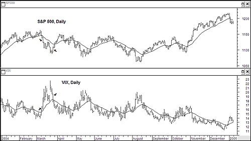

## Table of Contents

## What is stock volatility and how is it measured?

Stock volatility refers to how much and how quickly the price of a stock changes over time. It's a measure of the uncertainty or risk associated with the stock's price movements. When a stock is highly volatile, its price can swing dramatically in a short period, which can be exciting but also risky for investors. On the other hand, a stock with low volatility tends to have more stable price movements, which might be preferred by investors looking for more predictable returns.

Volatility is typically measured using statistical tools. One common method is to calculate the standard deviation of the stock's returns over a specific period, like a month or a year. This number shows how much the stock's price tends to deviate from its average return. Another popular measure is the beta, which compares the stock's volatility to the overall market. A beta greater than 1 means the stock is more volatile than the market, while a beta less than 1 indicates it's less volatile. These measurements help investors understand and manage the risks associated with their investments.

## What are options and how does their volatility differ from stocks?

Options are financial contracts that give the buyer the right, but not the obligation, to buy or sell an asset, like a stock, at a set price before a certain date. They're used by investors to bet on the future price of a stock or to protect against price changes. Options can be complex because their value depends not just on the stock's price, but also on other factors like time until expiration and the stock's volatility.

The [volatility](/wiki/volatility-trading-strategies) of options is different from stocks because options are sensitive to the expected future volatility of the underlying stock. This is called "implied volatility." When people expect a stock's price to move a lot, the implied volatility of its options goes up, making the options more expensive. Unlike stocks, where volatility is usually measured by looking at past price changes, options volatility looks forward and can change quickly based on what investors think might happen next. This makes options both a tool for betting on volatility and a way to manage risk in a portfolio.

## How can beginners start trading stocks based on volatility?

If you're new to trading and want to start trading stocks based on their volatility, it's important to first understand what volatility means. Volatility is how much a stock's price goes up and down. Stocks with high volatility can change a lot in a short time, which can be exciting but also risky. To start, you can look at a stock's standard deviation or beta. Standard deviation tells you how much the stock's price has moved in the past, while beta compares the stock's volatility to the whole market. You can find these numbers on financial websites or in stock analysis tools.

Once you have a basic understanding of volatility, you can start trading. A good way to begin is by using a practice account, often called a "demo" or "paper trading" account, where you can trade with fake money to learn without risking real money. Focus on stocks that interest you and watch how their prices move over time. You might want to start with stocks that have moderate volatility, as they might be less risky than very volatile stocks. As you get more comfortable, you can try trading stocks with higher volatility, but always remember to set a budget for how much you're willing to lose, since high volatility can lead to big losses as well as big gains.

## What are the basic strategies for trading options volatility?

One basic strategy for trading options volatility is called a "straddle." This involves buying both a call option and a put option on the same stock with the same expiration date and strike price. You use this strategy when you think a stock's price will move a lot, but you're not sure which way. If the stock price goes up a lot, the call option will make money. If it goes down a lot, the put option will make money. The key is that the stock needs to move enough to cover the cost of both options.

Another strategy is called a "strangle." This is similar to a straddle but a bit cheaper. Instead of buying options at the same strike price, you buy a call option with a higher strike price and a put option with a lower strike price. This strategy still bets on big price moves, but it's less expensive because the options are less likely to end up "in the money" (meaning they won't be worth anything if the stock price stays in the middle). Both strategies are good for beginners because they help you learn about how options work with volatility, but they also come with risks, so it's important to practice with a demo account first.

## What are the key differences between trading volatility in stocks versus options?

Trading volatility in stocks means looking at how much a stock's price goes up and down. You use things like standard deviation and beta to see how much a stock moves compared to the market. When trading stocks based on volatility, you might buy stocks that you think will move a lot, hoping to make money from the price changes. It's about watching past price movements to guess what might happen next. The risk is that if the stock doesn't move as much as you expect, you could lose money.

Trading volatility in options is different because options are affected by expected future volatility, which is called implied volatility. When people think a stock's price will move a lot, the options on that stock become more expensive. You can use strategies like straddles or strangles to bet on big price moves without knowing which way the stock will go. Options let you make money from volatility, but they're more complex because their value changes based on time and the stock's price, not just past movements. This makes options trading riskier but also gives you more ways to manage that risk.

## How does the VIX index relate to stock and options volatility trading?

The VIX index, often called the "fear gauge," measures how much the market expects the stock market to move over the next 30 days. It's based on the prices of options on the S&P 500, which means it's looking at the expected volatility of the whole market, not just one stock. When the VIX is high, it means people think the market will move a lot, which can make stocks and options more volatile. If the VIX is low, it suggests the market will be calmer, and stocks and options might not move as much.

Traders use the VIX to help them decide when to buy or sell stocks and options. If the VIX is high, some traders might buy stocks because they think prices will go back up after the market calms down. Others might buy options to bet on the big moves they expect to happen. When the VIX is low, traders might sell options because they're cheaper and they think the market won't move much. Understanding the VIX can help traders make better decisions about trading based on how volatile they think the market will be.

## What are implied volatility and historical volatility, and how are they used in trading?

Implied volatility and historical volatility are two ways to measure how much a stock or the market might move. Implied volatility is what traders think will happen in the future. It's based on the price of options and tells you how much people expect a stock's price to go up or down. When implied volatility is high, it means traders think the stock will move a lot, and options become more expensive. If it's low, they think the stock will stay pretty stable, and options are cheaper. Traders use implied volatility to help decide whether to buy or sell options.

Historical volatility looks at how much a stock's price has moved in the past. It's calculated using past price data, like standard deviation, to show how much the stock has gone up and down over a certain time. This helps traders see how much a stock typically moves. If a stock's historical volatility is high, it means it has moved a lot in the past. Traders use this information to guess how much a stock might move in the future, but it doesn't always predict what will happen. Both types of volatility help traders make better decisions about trading stocks and options.

## How can advanced traders use volatility skew to their advantage in options trading?

Volatility skew is a fancy term that means different options on the same stock can have different levels of expected volatility. It's like how some options might be more expensive than others because people think certain price moves are more likely. Advanced traders can use this to their advantage by looking at the skew and figuring out what other traders are expecting. For example, if the skew shows that options for a big drop in the stock's price are more expensive, it means people are worried about the stock falling. A smart trader might then buy options that would make money if the stock stays the same or goes up a little, since they're cheaper.

By understanding and using volatility skew, traders can make trades that take advantage of what other people are thinking. If the skew shows that everyone is betting on the stock going up a lot, a trader might sell those expensive options and buy cheaper ones that pay off if the stock doesn't move as much. This way, they can make money no matter which way the stock goes, as long as it doesn't move as much as everyone else expects. It's like playing a game where you're betting on what other players will do, and using that information to make smarter moves.

## What role do volatility ETFs and ETNs play in a trader's portfolio?

Volatility ETFs and ETNs are special kinds of investments that let traders bet on how much the market will move. They're based on indexes like the VIX, which measures how much people expect the stock market to go up and down. If you think the market is going to be really wild and move a lot, you can buy these ETFs or ETNs to make money from that volatility. They're a way to add some excitement to your portfolio because they can go up when the market is all over the place, even if stock prices are going down.

But, these investments can be tricky. They're not for everyone because they can be really risky. Volatility ETFs and ETNs can lose a lot of value quickly if the market calms down. They're often used by experienced traders who know how to handle the ups and downs. If you're thinking about adding them to your portfolio, it's a good idea to understand how they work and maybe start with a small amount to see how they fit with your other investments.

## How can one use volatility arbitrage strategies in both stocks and options?

Volatility [arbitrage](/wiki/arbitrage) is a fancy way of saying you're trying to make money from the difference between what people think will happen and what actually happens with stock or option prices. In stocks, you might see that a stock's price has been jumping around a lot lately, but the market thinks it will calm down soon. If you think the stock will keep being wild, you could buy the stock and sell it later when it moves a lot, making money from the difference. It's like betting that the stock will keep being exciting when others think it will get boring.

In options, volatility arbitrage is a bit trickier but can be more rewarding. You look at the implied volatility, which is what people expect the stock to do in the future, and compare it to the historical volatility, which is what the stock has done in the past. If you think the stock will move more than what the options' prices suggest, you could buy options that will make money if the stock moves a lot. Or, if you think the stock will stay calm but the options are expensive because people are worried, you could sell those options and make money if the stock doesn't move much. It's like playing a game where you're betting on whether the stock will be calm or wild, and using options to make money from your guess.

## What are the risks associated with high volatility trading in stocks and options?

High volatility trading in stocks and options can be really exciting, but it comes with a lot of risks. When you trade stocks with high volatility, their prices can go up and down a lot in a short time. This means you could make a lot of money quickly, but you could also lose a lot just as fast. If you buy a stock expecting it to go up and it drops instead, you might lose more money than you planned. It's like riding a roller coaster – it can be fun, but it's also scary and unpredictable.

The same goes for options. Options are even riskier because their value can change based on the stock's price, how much time is left before they expire, and what people think will happen next. If you buy options hoping the stock will move a lot and it doesn't, you could lose all the money you spent on those options. And if you're selling options, you could end up losing a lot more than you expected if the stock moves in a way you didn't predict. It's like betting on a game where the rules keep changing, and you need to be really careful and know what you're doing.

## How do professional traders manage and hedge volatility risk in complex portfolios?

Professional traders manage and hedge volatility risk in complex portfolios by using a mix of strategies and tools. They often use options to protect their investments. For example, if they own a stock and are worried about it losing value, they might buy a put option, which gives them the right to sell the stock at a certain price. This can help limit their losses if the stock's price drops a lot. They also use other financial instruments like futures contracts to hedge against big market moves. By carefully choosing these tools, they can balance the risk in their portfolio and protect their money from big swings in the market.

Another way professional traders manage volatility risk is by diversifying their investments. They spread their money across different stocks, industries, and even countries. This way, if one part of their portfolio goes down because of high volatility, other parts might stay stable or even go up, helping to balance out the risk. They also keep a close eye on market trends and use advanced computer models to predict how volatile the market might be. By staying informed and using these models, they can make quick adjustments to their portfolio to manage risk better and protect their investments.

## References & Further Reading

[1]: "Options, Futures, and Other Derivatives" by John C. Hull

[2]: Black, F., & Scholes, M. (1973). ["The Pricing of Options and Corporate Liabilities."](https://www.cs.princeton.edu/courses/archive/fall09/cos323/papers/black_scholes73.pdf) Journal of Political Economy, 81(3), 637-654.

[3]: Cartea, Á., Jaimungal, S., & Penalva, J. (2015). ["Algorithmic and High-Frequency Trading."](https://assets.cambridge.org/97811070/91146/frontmatter/9781107091146_frontmatter.pdf) Cambridge University Press.

[4]: "Python for Finance: Mastering Data-Driven Finance" by Yves Hilpisch

[5]: Taleb, N. N. (1997). ["Dynamic Hedging: Managing Vanilla and Exotic Options."](https://www.amazon.com/Dynamic-Hedging-Managing-Vanilla-Options/dp/0471152803) John Wiley & Sons.  

[6]: Aldridge, I. (2013). ["High-Frequency Trading: A Practical Guide to Algorithmic Strategies and Trading Systems."](https://books.google.com/books/about/High_Frequency_Trading.html?id=6l0DDQAAQBAJ) Wiley.