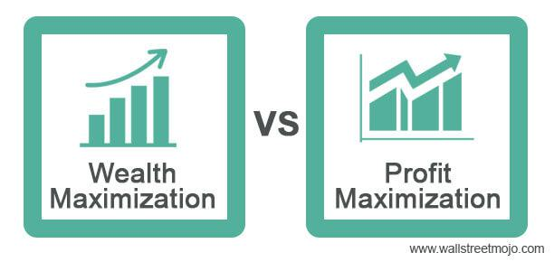

Algorithmic trading has fundamentally transformed the landscape of stock trading by employing sophisticated computer programs to execute trades with remarkable speed and precision. This modern approach promises efficiency and has become a pivotal tool for maximizing stock price profits. At its core, algorithmic trading leverages mathematical models and computational algorithms to make informed trading decisions, far surpassing the capabilities of traditional manual trading methods.

The essence of algorithmic trading lies in its potential to capitalize on fleeting market opportunities that human traders might miss. The automation and speed inherent in these systems allow traders to react instantaneously to market movements, thus maximizing potential profits. Moreover, the emotional neutrality offered by algorithmic systems eliminates human biases that can often cloud judgment and lead to poor trading decisions.



This article aims to unravel the complexities of algorithmic trading, emphasizing its implications for enhancing stock price maximization. The intention is to provide insights into the popular strategies employed, such as trend following and statistical arbitrage, which capitalize on market momentum and inefficiencies, respectively. Additionally, the technical requirements for implementing an effective algorithmic trading system will be explored, highlighting the importance of robust programming platforms and reliable data management strategies.

Risk management is an integral component of any trading endeavor, more so in algorithmic trading, where large volumes of capital are at play. The ability to dynamically adjust leverage and enforce automated risk controls is crucial for sustainable trading operations. Furthermore, adherence to regulatory frameworks is essential to ensure both ethical trading practices and compliance with global trading standards.

For seasoned traders and newcomers alike, this comprehensive overview seeks to equip readers with the necessary knowledge to navigate the intricacies of algorithmic trading. With a balanced approach that includes technical skills, risk management, and regulatory awareness, traders can potentially harness the full power of algorithmic systems to achieve consistent stock price profit maximization.

## Table of Contents

## Understanding Stock Price Maximization and Profit

Maximizing stock prices and profits is a shared aspiration for both companies and investors, serving as a cornerstone of financial strategy. At its core, this objective hinges on the intricate relationship between a company's profitability and its market valuation. Profit, often quantified through earnings reports, plays a pivotal role in driving stock prices. When a company reports higher-than-expected earnings, this typically results in a positive market reaction as investors interpret these results as a reflection of robust business health and potential for continued growth. This phenomenon is due largely to market perceptions, where investor sentiment and confidence can amplify the effects of earnings on stock prices.

The correlation between profit and stock prices isn't linear but is heavily influenced by external factors such as industry trends and macroeconomic conditions. For example, during periods of economic growth, positive earnings reports can significantly bolster stock prices as optimism tends to be higher. Conversely, in a recessionary environment, the impact of earnings on stock prices might be muted, as fears of broader economic instability prevail.

Understanding this nuanced relationship is crucial for developing effective trading strategies. An investor or [algorithmic trading](/wiki/algorithmic-trading) system must consider not only the direct impacts of financial performance indicators like earnings per share (EPS) but also how these numbers fit into the broader market context. This requires an analytical approach that integrates both quantitative financial metrics and qualitative assessments of market sentiment.

For investors focused on algorithmic trading, creating models that can parse through these variables to predict stock price movements is essential. Such models might utilize historical data to identify patterns in how earnings announcements affect stock prices under varying market conditions. A simple way to model this relationship in Python might involve linear regression analysis, where one could assess the strength and nature of the relationship between historical earnings data and stock price movements:

```python
import pandas as pd
from sklearn.linear_model import LinearRegression
import numpy as np

# Load your historical data
data = pd.read_csv("historical_stock_data.csv")

# Assuming data has columns 'Earnings' and 'StockPrice'
X = np.array(data['Earnings']).reshape(-1, 1)
y = np.array(data['StockPrice'])

# Create the model
model = LinearRegression()
model.fit(X, y)

# Predict stock prices based on future earnings
future_earnings = np.array([upcoming_earnings_value]).reshape(-1, 1)
predicted_price = model.predict(future_earnings)

print("Predicted Stock Price:", predicted_price)
```

Investors can thus position themselves in anticipation of stock price movements based on projected earnings, contingent upon their alignment with broader market trends. This understanding and the application of algorithmic strategies inspired by it serve as foundational elements for those seeking to maximize stock price profits effectively.

 to Algorithmic Trading Strategies

Algorithmic trading employs automated strategies to execute trades based on predefined rules that are often guided by complex mathematical models. This method of trading capitalizes on the capacity of computer programs to process vast amounts of data and execute trades with high speed and precision, which are beyond human capability. The primary advantage of algorithmic trading is its ability to operate at speeds and with accuracy levels unattainable by human traders. This enables traders to exploit even the smallest market inefficiencies and hence enhance profitability.

One of the main advantages of algorithmic trading is execution speed. Due to technological advancements, sophisticated algorithms can analyze multiple markets simultaneously and make split-second decisions. For instance, latency, which refers to the delay before data is processed, is minimized through efficient algorithms, allowing trades to be executed at near-instantaneous speeds. This marginal timing advantage can be crucial in high-frequency trading environments where price discrepancies can be capitalized on.

Algorithmic trading also provides emotional neutrality, which reduces the psychological biases that can affect human traders. Automated strategies adhere strictly to coded rules, thereby eliminating emotional reactions to market fluctuations. This consistency in decision-making can be particularly beneficial in volatile markets.

Additionally, algorithmic trading allows for continuous market monitoring, operating 24/7. With markets operating globally and in different time zones, algorithmic trading strategies can be set to continuously monitor and act upon trading opportunities, thereby offering greater flexibility and control over trading operations.

Key components of algorithmic trading strategies include data input systems, signal generation, risk management, and performance analytics. Data input systems collect and process market data that inform decision-making processes. Signal generation involves applying mathematical models to identify trading opportunities based on predetermined criteria. Risk management is integrated into algorithms to manage potential losses and adjust trading parameters as per market conditions, thereby preserving capital. Performance analytics evaluate the efficacy of the trading strategy, offering insights into performance metrics and areas for improvement.

Despite these benefits, algorithmic trading is not without its limitations. One significant limitation is technology risk. Algorithmic trading systems can be susceptible to glitches, bugs, or system failures that could lead to unintended trading outcomes. Furthermore, market changes can impact the effectiveness of a given algorithm. Algorithm models that perform well under certain conditions might not adapt well to new information or altering market environments, requiring continuous optimization and updates to stay relevant. This dynamic nature of markets necessitates constant monitoring and tweaking of algorithms to ensure continued success in trading. 

Thus, while algorithmic trading offers profound benefits in terms of speed, neutrality, and constant market engagement, it also demands a high degree of technical proficiency and a robust infrastructure capable of mitigating inherent risks.

## Popular Algorithmic Trading Strategies

Algorithmic trading strategies are essential for capturing trading opportunities in dynamic financial markets. Among these, [trend following](/wiki/trend-following), mean reversion, and statistical [arbitrage](/wiki/arbitrage) stand out due to their effectiveness and popularity.

**Trend Following**:

Trend following is a strategy that capitalizes on consistent price movements by aligning trades with the prevailing market direction. This approach is grounded in the concept that assets in motion tend to remain in motion. Traders using this strategy identify trends through various technical indicators such as moving averages, trendlines, and [momentum](/wiki/momentum) oscillators. For instance, a common trend-following signal might involve taking long positions when the short-term moving average crosses above the long-term average and short positions when the reverse occurs. This strategy requires rigorous data analysis and statistical validation, often employing lagging indicators to confirm the presence of a trend. While effective in trending markets, this strategy can lead to false signals in ranging markets, necessitating strong risk management protocols.

**Mean Reversion**:

The mean reversion strategy is based on the hypothesis that asset prices will return to their historical averages over time. Traders employing mean reversion strategies look for price levels that significantly deviate from a defined equilibrium or benchmark, anticipating a reversal back to the mean. Indicators such as Bollinger Bands, the Relative Strength Index (RSI), and z-scores are commonly used to identify overbought or oversold conditions. For example, a mean reversion signal might occur when prices close outside of the Bollinger Bands, suggesting a potential pullback. Despite its potential, this strategy demands careful attention to market conditions, as external factors can lead to sustained deviations from historical norms that invalidate reversion assumptions.

**Statistical Arbitrage**:

Statistical arbitrage involves identifying and exploiting market inefficiencies through the paired trading of statistically correlated assets. This strategy is grounded in quantitative models such as cointegration, which assesses the extent to which the prices of two or more assets move together over time. Statistical arbitrageurs utilize computational algorithms to perform high-frequency [pair trading](/wiki/pair-trading), subtly profiting from temporary mispricings. The strategy often involves pairs trading, where traders short one asset while going long on another correlated one, expecting the price gap to close. For example, if two stocks typically exhibit a stable price ratio, a divergence might be seen as an arbitrage opportunity. The strategy requires sophisticated mathematical modeling and high-performance platforms to swiftly identify and capitalize on fleeting opportunities.

Each of these strategies is underpinned by advanced data analysis and robust computational infrastructure to manage and execute trades efficiently. They require continuous refinement and risk assessment to adapt to ever-changing market conditions.

## Technical Requirements for Algo Trading

Building an efficient algorithmic trading infrastructure necessitates the implementation of sophisticated tools and platforms that cater to the complexities of automated trading. Programming languages like Python are widely favored due to their extensive libraries such as NumPy, pandas, and TA-Lib, which facilitate numerical computations, data manipulation, and technical analysis. Platforms like MetaTrader offer comprehensive environments for developing, testing, and executing trading strategies with features such as [backtesting](/wiki/backtesting) frameworks and real-time analytics.

Key to successful algo trading operations are several critical components:

1. **Data Feeds**: High-quality data inputs are essential for strategy execution. Traders require access to reliable market data, which includes price quotes, volumes, and news feeds. Data providers like Bloomberg or Reuters offer comprehensive datasets necessary for both backtesting and live trading.

2. **High-Performance Computing**: Algorithmic trading demands significant computational power to process large datasets and execute complex algorithms efficiently. Utilizing high-performance servers or cloud computing services such as Amazon AWS or Google Cloud allows for the rapid execution of trades and the handling of multiple strategies simultaneously.

3. **Network Connectivity**: Reliable and low-latency network connectivity is crucial to minimize information and execution delays. Direct Market Access (DMA) services provide traders with high-speed access to financial markets, reducing the time between decision-making and trade execution.

4. **Data Management**: Efficient handling of data is critical for real-time trading operations. Time-series databases like InfluxDB or kdb+ are optimized for storing and querying large volumes of sequential data. These databases support fast retrieval and analysis of price series, which is fundamental for executing time-sensitive trading strategies.

To illustrate, consider the following Python snippet for querying historical stock data:

```python
import pandas as pd
import yfinance as yf  # For more datasets, visit: https://paperswithbacktest.com/datasets

# Fetch historical data for a specific stock
data = yf.download('AAPL', start='2022-01-01', end='2023-01-01')

# Display the closing prices
print(data['Close'])
```

This code demonstrates a basic approach to accessing historical stock data using the `yfinance` library, which can be further utilized for developing and backtesting trading algorithms.

Overall, constructing a robust algorithmic trading infrastructure requires a strategic combination of technological resources and tools that ensure high performance, reliability, and scalability. By effectively integrating these components, traders can enhance the precision and efficiency of their trading operations.

## Risk Management in Algorithmic Trading

Proper risk management is a critical aspect of algorithmic trading, directly influencing the success and sustainability of trading strategies. At its core, risk management involves systematically identifying, analyzing, and mitigating potential losses while aiming to achieve the desired returns.

Position sizing and strategic stop-loss placements are fundamental components of effective risk management. Position sizing determines the amount of capital allocated for each trade, balancing the potential for profit against the risk of loss. Techniques such as the Kelly Criterion can be employed to optimize position size by maximizing the expected logarithm of wealth growth. The Kelly Criterion can be expressed as:

$$
f^* = \frac{bp - q}{b}
$$

where:
- $f^*$ is the fraction of the capital to wager,
- $b$ is the odds received on the wager (i.e., the profit per unit wagered),
- $p$ is the probability of winning,
- $q$ is the probability of losing (i.e., $q = 1 - p$).

Strategic stop-loss orders are designed to limit losses by automatically closing a position when its market price reaches a predetermined level. This prevents excessive loss during unfavorable market conditions and ensures capital preservation, aiding in maintaining trading strategy efficacy over time.

Algorithmic trading systems can dynamically adjust leverage and exposure based on market [volatility](/wiki/volatility-trading-strategies), a vital mechanism to mitigate risk. By employing volatility-based position sizing, algorithms can reduce exposure during high-volatility periods and increase it during low-volatility periods, thus optimizing capital deployment and reducing the risk of large losses. This dynamic adjustment can be implemented using the concept of volatility scaling:

$$
\text{Scaled Position} = \frac{\text{Target Volatility} \times \text{Current Position Size}}{\text{Current Volatility}}
$$

Automated risk controls further enhance the resilience of trading strategies. This includes pre-programmed rules to cease trading activities when specific drawdown levels or market volatility thresholds are breached. By establishing rigorous automated controls, traders can effectively protect investments from unexpected market movements, thereby enhancing long-term strategy sustainability and reducing potential financial loss.

In conclusion, robust risk management techniques such as position sizing, stop-loss strategies, and leverage adjustments are essential for preserving capital and sustaining profitability in algorithmic trading. These methods, when combined with automated risk controls, provide a comprehensive framework for confronting market risks, ensuring both the protection of capital and the longevity of trading strategies.

## Backtesting and Strategy Optimization

Backtesting is a fundamental process in algorithmic trading that involves evaluating a trading strategy using historical data to determine its viability and potential profitability. This process allows traders to simulate how a strategy would have performed in the past, providing insights into future performance. A well-conducted backtest can guide traders in refining their strategies, minimizing risks, and optimizing profit potential.

An effective backtesting process relies on key performance metrics. The **Sharpe Ratio** is one such metric that measures the excess return per unit of risk. It is calculated using the formula:

$$

\text{Sharpe Ratio} = \frac{(R_p - R_f)}{\sigma_p} 
$$

where $R_p$ is the return of the portfolio, $R_f$ is the risk-free rate, and $\sigma_p$ is the standard deviation of the portfolio's excess return. A higher Sharpe Ratio indicates a more favorable risk-adjusted return, suggesting a potentially successful trading strategy.

Another essential metric is the **Maximum Drawdown**, which assesses the largest peak-to-trough decline over a specific period. It helps in understanding the potential downward risk and capital loss a strategy might incur. Keeping the Maximum Drawdown within acceptable limits is crucial for the sustainability and confidence in a trading strategy.

Avoiding overfitting is a critical aspect of successful backtesting. Overfitting occurs when a trading strategy is excessively tailored to the historical data, capturing noise instead of the underlying trend. This can result in a strategy that performs well on past data but fails in live trading conditions due to its lack of generalizability. Strategies should be validated using out-of-sample data or walk-forward analysis to ensure their robustness and prevent overfitting.

Additionally, transaction costs are a significant [factor](/wiki/factor-investing) that can affect the profitability of a trading strategy. Ignoring these costs during backtesting can lead to overly optimistic performance estimates. It is crucial to incorporate realistic transaction costs, including slippage and commissions, into the backtesting model to ensure that the projected outcomes closely align with real-world trading scenarios.

In summary, thorough backtesting and strategy optimization involve evaluating the performance of trading strategies through historical data analysis, leveraging key metrics like the Sharpe Ratio and Maximum Drawdown, and accounting for realistic transaction costs. By doing so, traders can enhance their strategies to maximize potential returns while minimizing risks.

## Navigating Regulatory Considerations

Compliance with trading regulations is critical for the sustainable operation of algorithmic trading systems. Adhering to the requirements set forth by major regulatory bodies like the Securities and Exchange Commission (SEC) in the United States and the Markets in Financial Instruments Directive II (MiFID II) in the European Union is essential for gaining and maintaining access to financial markets. These regulations are designed to promote market integrity, protect investors, and ensure fair trading conditions.

Participation in the U.S. market typically necessitates registration with the SEC as a broker-dealer, investment adviser, or alternative trading system, depending on the nature of the algorithmic trading activities. The SEC imposes strict obligations on registered entities, including maintaining detailed records, ensuring cybersecurity measures are in place, and disclosing potential conflicts of interest. The Customer Due Diligence Rule, part of the Bank Secrecy Act, also mandates robust identity verification processes to prevent money laundering.

Similarly, MiFID II imposes comprehensive requirements across the European financial markets. It addresses the intricacies of algorithmic trading by mandating transparency in trading activities, especially for high-frequency trading ([HFT](/wiki/high-frequency-trading-strategies)) firms. Under MiFID II, firms must demonstrate the resilience and capacity of their trading algorithms, implement real-time monitoring of trading strategies, and maintain robust pre- and post-trade transparency measures. Additionally, this regulatory framework emphasizes transaction reporting to improve oversight and prevent market abuse.

Constructing ethical and compliant trading strategies necessitates a thorough understanding of these regulatory frameworks. It is essential to incorporate compliance from the design phase of the algorithm, ensuring all trading strategies are in line with legal requirements. This integration not only guards against legal penalties and reputational harm but also fosters trust among market participants. Compliance technologies, often referred to as RegTech, have emerged as vital tools. These technologies leverage [machine learning](/wiki/machine-learning) and data analytics to automate compliance processes, identify potential breaches, and ensure real-time adherence to regulatory standards.

In conclusion, navigating the complexities of trading regulations involves more than simple adherence; it requires a proactive approach to understanding and integrating these requirements into the fundamental operations of algorithmic trading practices. Continuous updates and adaptations to regulatory changes are necessary to maintain market participation and uphold ethical trading standards.

## Conclusion

Algorithmic trading offers distinct advantages due to its speed and efficiency, significantly reducing the impact of human error. The automated nature allows for rapid execution and the ability to capitalize on transient market opportunities, providing a competitive edge to traders. However, success in algorithmic trading is contingent upon a synergistic blend of technical proficiency, comprehensive market insights, and meticulous risk management strategies. 

Technical skill involves designing, implementing, and maintaining reliable trading algorithms capable of processing large datasets and executing transactions with minimal latency. Traders need to have a deep understanding of programming languages such as Python or C++, as well as proficiency in data science and quantitative analysis. This technical prowess must be matched with a thorough understanding of market dynamics, enabling traders to configure their algorithms to respond effectively to various market conditions and price movements.

Risk management plays a pivotal role in sustaining profitability and ensuring the longevity of trading strategies. Effective risk management involves dynamic position sizing, judicious use of leverage, and the implementation of automated stop-loss mechanisms to protect against market volatility.

Continuous learning and adaptation are essential as market conditions evolve and present new challenges and opportunities. Traders must remain vigilant to changes in market regulations, technological advancements, and emerging financial instruments. This necessitates ongoing education, strategy refinement, and backtesting to ensure that trading algorithms maintain their edge.

Ultimately, the goal of leveraging algorithmic trading strategies is to achieve consistent profit maximization of stock prices. This objective demands a disciplined approach, combining systematic execution with adaptability to the ever-changing market landscape. Through the integration of advanced technological solutions and strategic foresight, algorithmic trading can be a powerful tool for sustained financial success.

## References & Further Reading

[1]: Bergstra, J., Bardenet, R., Bengio, Y., & Kégl, B. (2011). ["Algorithms for Hyper-Parameter Optimization."](https://dl.acm.org/doi/10.5555/2986459.2986743) Advances in Neural Information Processing Systems 24.

[2]: ["Advances in Financial Machine Learning"](https://www.amazon.com/Advances-Financial-Machine-Learning-Marcos/dp/1119482089) by Marcos Lopez de Prado

[3]: ["Evidence-Based Technical Analysis: Applying the Scientific Method and Statistical Inference to Trading Signals"](https://www.amazon.com/Evidence-Based-Technical-Analysis-Scientific-Statistical/dp/0470008741) by David Aronson

[4]: ["Machine Learning for Algorithmic Trading"](https://github.com/stefan-jansen/machine-learning-for-trading) by Stefan Jansen

[5]: ["Quantitative Trading: How to Build Your Own Algorithmic Trading Business"](https://www.amazon.com/Quantitative-Trading-Build-Algorithmic-Business/dp/1119800064) by Ernest P. Chan

[6]: Aldridge, I. (2013). ["High-Frequency Trading: A Practical Guide to Algorithmic Strategies and Trading Systems"](https://books.google.com/books/about/High_Frequency_Trading.html?id=6l0DDQAAQBAJ). Wiley.

[7]: Treleaven, P., Galas, M., & Lalchand, V. (2013). ["Algorithmic Trading Review."](https://www.researchgate.net/publication/262239006_Algorithmic_Trading_Review) Journal of Operations Research, 222, 235–254.

[8]: Fabozzi, F. J., Focardi, S. M., & Rachev, S. T. (2010). ["Quantitative Finance: A Framework for Efficient Asset Management"](https://onlinelibrary.wiley.com/doi/book/10.1002/9781118856406). Wiley.