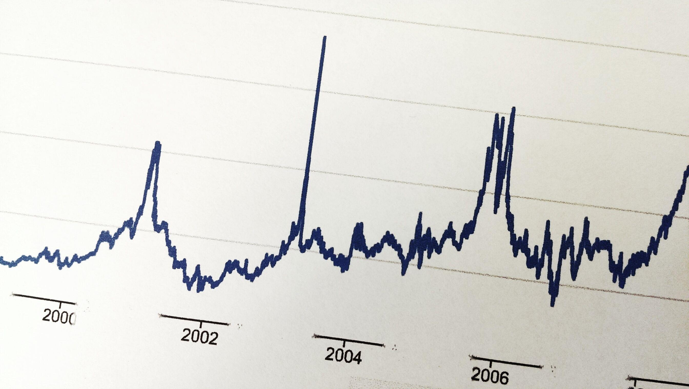

In the world of finance and investment, making informed decisions can significantly impact your trading success. Investors are constantly exploring various financial instruments to diversify portfolios and enhance returns. Among these, stock warrants and stock options stand out as potent tools due to their strategic flexibility and potential for leveraged gains. Stock warrants provide the holder the right to purchase company shares at a predetermined price within a specified timeframe, granting an attractive long-term opportunity particularly in bullish markets. Stock options, on the other hand, offer similar rights to buy or sell shares but through contracts between investors, providing strategic advantages for hedging or speculative purposes.

Moreover, the advent of algorithmic (algo) trading has transformed how these instruments are managed and traded. Algo trading involves using complex algorithms to execute trading orders at optimal speeds and prices, relying on predefined criteria without human intervention. This technological advance allows traders to exploit market inefficiencies, manage complex strategies, and mitigate risks with heightened precision and efficiency.



This article aims to elucidate the distinctions and similarities between stock warrants and stock options, delving into their unique features and utility in financial strategies. It will also explore the role of algo trading in enhancing the efficacy of these instruments, providing insights into how automated systems can elevate trading practices and improve investment outcomes. By understanding these elements, traders and investors can better navigate the complexities of financial markets, optimize their strategies, and increase their potential for success.

## Table of Contents

## Understanding Stock Warrants

Stock warrants provide the holder with the right, but not the obligation, to purchase a company's stock at a specified price, known as the exercise or strike price, before a certain expiration date. Issued directly by the corporation, warrants often serve as a mechanism for raising capital. When a warrant is exercised, new shares are issued, which can lead to the dilution of existing shares. This dilution occurs because the total number of outstanding shares increases, potentially impacting the earnings per share (EPS) for current shareholders.

### Mechanics of Stock Warrants

Stock warrants function similarly to stock options but have notable differences, including their longer terms and their issuance by the company itself. When an investor holds a warrant, they have the right to buy the stock at the predetermined price, regardless of the current market price, until the warrant expires. This feature provides a strategic advantage if the stock's market price exceeds the exercise price before expiration, allowing the holder to purchase stock at a discount.

Mathematically, the value of a warrant can be described using similar principles to those applied in option pricing models, such as the Black-Scholes model. However, adjustments must be made to account for dilution and the typically longer time horizons associated with warrants.

### Types of Stock Warrants

There are generally two main types of stock warrants: 
1. **Call Warrants**: These provide the holder with the right to purchase the underlying stock.
2. **Put Warrants**: These are less common and give the holder the right to sell the underlying stock back to the issuing company.

Moreover, warrants can be classified as traditional or naked. Traditional warrants are typically issued alongside bonds and provide a fixed return, acting as a sweetener to make the bond more attractive. Naked warrants, on the other hand, are issued independently.

### Investment Potential of Stock Warrants

Stock warrants can be an attractive long-term investment for several reasons:

1. **Leverage**: Warrants allow investors to leverage their positions, providing the potential for significant gains with a relatively small initial investment. This leverage can amplify returns if the underlying stock performs well.

2. **Longer Expiration Periods**: Compared to standard stock options, warrants often have longer expiration periods, sometimes lasting several years. This extended timeframe can offer investors more flexibility and the potential for significant capital appreciation.

3. **Strategic Use in Corporate Finance**: Companies may use warrants to enhance debt offerings or raise equity capital without issuing shares immediately. This strategy can benefit both the company and investors, allowing for strategic financial planning and potential growth.

In summary, stock warrants represent a sophisticated financial instrument with unique characteristics. By offering rights to buy shares at a set price, they provide investors with potential advantages, particularly if used strategically within a diversified investment portfolio. Understanding the nuances of their mechanics and types can enhance an investor's ability to effectively incorporate warrants into their broader market strategies.

## Decoding Stock Options

Stock options are financial contracts that confer to the holder the right, but not the obligation, to buy (in the case of a call option) or sell (in the case of a put option) a specific stock at a predetermined price, known as the exercise or strike price, before or on a predetermined date. These instruments are vital in both hedging and speculating within the financial markets.

Structurally, stock options are traded on exchanges and can be exercised at specific times, depending on the type. "American" options can be exercised at any point before or on the expiry date, while "European" options are only exercisable on the expiration date.

Unlike stock warrants, stock options do not directly affect a company's share capital structure as they are typically agreements between investors rather than being issued by the company itself. This distinction makes stock options versatile tools in the secondary market.

Options can be used to hedge against potential losses in an underlying stock. For example, an investor holding a stock might purchase put options to protect against a decline in the stock's value. Conversely, options are also used for speculative purposes. An investor might buy call options if they anticipate an upward movement in the stock price, providing the potential for significant returns with minimal upfront investment compared to buying the stock outright.

The valuation of stock options can be complex, leveraging models such as the Black-Scholes model, which considers factors such as the current stock price, strike price, time until expiration, risk-free rate, and [volatility](/wiki/volatility-trading-strategies) of the stock. 

In Python, you can compute the theoretical price of an option using the following Black-Scholes formula:

```python
from scipy.stats import norm
import math

def black_scholes(S, K, T, r, sigma, option_type='call'):
    d1 = (math.log(S/K) + (r + 0.5 * sigma**2) * T) / (sigma * math.sqrt(T))
    d2 = d1 - sigma * math.sqrt(T)

    if option_type == 'call':
        return S * norm.cdf(d1) - K * math.exp(-r * T) * norm.cdf(d2)
    elif option_type == 'put':
        return K * math.exp(-r * T) * norm.cdf(-d2) - S * norm.cdf(-d1)
    else:
        raise ValueError("Option type must be 'call' or 'put'")

# Example usage
S = 100  # Current stock price
K = 100  # Strike price
T = 1    # Time to expiration in years
r = 0.05 # Risk-free interest rate
sigma = 0.2 # Volatility

call_price = black_scholes(S, K, T, r, sigma, 'call')
put_price = black_scholes(S, K, T, r, sigma, 'put')

print(f"Call Option Price: {call_price}")
print(f"Put Option Price: {put_price}")
```

Understanding the intrinsic (difference between stock price and strike price) and time value (the additional value reflecting the time remaining until expiration) of options is crucial in strategic financial planning. Investors utilize these instruments based on market conditions and their own financial objectives, whether they aim to hedge risks or generate speculative gains.

## Key Differences Between Stock Warrants and Options

Stock warrants and stock options, while both providing the right to transact stocks under certain conditions, exhibit significant differences in terms of issuance, effects on company shares, and expiration timelines.

**Issuance and Parties Involved**

Stock warrants are typically issued directly by the company itself. This means that when an investor exercises a warrant, new shares are created and issued by the company, which can lead to dilution of the existing shares. This direct issuance often aligns warrants with corporate financing objectives, as companies use them to raise additional capital or as part of a deal to attract investors.

In contrast, stock options are not issued by the company whose stock is involved. Instead, they are contracts exchanged between two parties in the financial markets. This means they do not result in new share issuance and therefore do not dilute the company’s shares. Options involve transactions between investors, such as traders and brokers, with the underlying stock being unaffected in terms of share capital structure.

**Impact on Company Shares**

The exercise of stock warrants affects the company's share structure by increasing the total number of shares outstanding. This increase can dilute the value of existing shares, depending on the number of new shares issued in relation to the company's total equity. Thus, potential investors need to consider the dilution effect when evaluating warrants.

On the other hand, the exercise of stock options does not directly alter the company’s stock issuance. Since options are a secondary market instrument, they primarily shift ownership of existing shares without impacting the total number of shares issued by the company. This distinction is crucial for the company's shareholders and potential investors who must assess the implications of share dilution when considering warrants.

**Expiration Timelines**

Warrants typically have longer expiration periods, stretching several years, which can make them appealing for long-term investment strategies. This extended timeframe provides investors more opportunity to realize potential stock price appreciations, aligning with more strategic, longer-term investment goals.

Options, however, usually have shorter expiration periods, often merely months. The abbreviated timeframe of options necessitates a more immediate prediction of stock price movements, suiting investors who have short-term speculative or hedging strategies in mind.

**Strategic Implications**

The choice between utilizing stock warrants and stock options often hinges on specific investment goals and prevailing market conditions. Warrants may be more beneficial for investors looking for longer-term exposure to a company's potential growth, especially when coupled with the company's strategic financing initiatives. In contrast, options might be favored by those seeking short-term opportunities to leverage volatility or hedge existing positions without the worry of share dilution.

Understanding these differences allows investors to strategically select between warrants and options based on their specific financial goals and the current market environment. Whether considering long-term commitments or short-term strategies, knowing when and how to employ these instruments is integral to successful financial planning.

## The Role of Algorithmic Trading in Managing These Instruments

Algorithmic trading employs sophisticated computer algorithms to automatically execute trades based on predefined conditions. Its application in managing stock warrants and options provides several advantages that have transformed the trading landscape. One of the primary benefits of [algorithmic trading](/wiki/algorithmic-trading) is increased speed and efficiency. Algorithms can process vast amounts of market data in real time and execute orders at speeds unattainable by human traders. This rapid execution allows traders to capitalize on short-lived market opportunities, thereby increasing their potential for profit.

Moreover, algorithmic trading enables the handling of complex trading strategies. For instance, algorithms can be programmed to implement intricate strategies such as delta-neutral trading, which involves balancing the delta of a portfolio to be zero. This complexity allows traders to hedge their positions effectively or to speculate in nuanced ways that require real-time data processing and decision-making.

### Mitigating Risk and Exploiting Inefficiencies

Algorithmic trading is not merely about speed and complexity; it also plays a significant role in mitigating risks and exploiting market inefficiencies. Algorithms can be designed to monitor multiple market conditions simultaneously and make decisions based on risk assessment models. This capability helps in identifying and mitigating unforeseen risks, which might not be apparent to human traders.

For instance, a volatility [arbitrage](/wiki/arbitrage) strategy might be implemented through an algorithm to exploit pricing discrepancies between forecasted and actual market volatility. By analyzing historical data and current market conditions, algorithms can identify and execute trades that take advantage of these discrepancies, thus profiting from the inefficiencies.

### Example of an Algorithmic Trading Strategy

Here is a basic example of how one might implement an algorithmic trading strategy in Python, using a strategy that automatically executes trades based on moving average crossovers:

```python
import pandas as pd
import numpy as np

# Historical stock data
data = pd.read_csv('historical_stock_data.csv')

# Calculate moving averages
data['Short_MA'] = data['Close'].rolling(window=50).mean()
data['Long_MA'] = data['Close'].rolling(window=200).mean()

# Generate buy/sell signals
data['Signal'] = np.where(data['Short_MA'] > data['Long_MA'], 1, 0)
data['Position'] = data['Signal'].diff()

# Execute trades based on signals
buy_signals = data[data['Position'] == 1]
sell_signals = data[data['Position'] == -1]

# Output trade execution
for date, row in buy_signals.iterrows():
    print(f"Buy at {row['Close']} on {date}")

for date, row in sell_signals.iterrows():
    print(f"Sell at {row['Close']} on {date}")
```

This script processes historical stock prices, calculates short and long-term moving averages, and executes buy or sell signals when the short-term average crosses above or below the long-term average. Such strategies can be applied to stock warrants and options, tailoring the algorithm to the specific characteristics and behaviors of these financial instruments.

Ultimately, the integration of algorithmic trading in managing stock warrants and options provides a significant edge for investors. By leveraging technology's ability to process information and execute trades at high speed and complexity, traders can enhance their strategies' precision and effectiveness, ultimately leading to improved financial outcomes.

## Key Similarities of Warrants and Options

Stock warrants and stock options, while distinct in their issuance and impact, share several fundamental similarities that make them valuable tools in financial planning and strategic investment. Both instruments provide the right, but not the obligation, to buy shares at a fixed exercise price, known as the strike price, before or at a predetermined expiry date. This key feature allows investors to leverage potential movements in stock prices without initially committing to a large capital outlay.

One of the primary similarities between stock warrants and options lies in their pricing components, specifically intrinsic value and time value. The intrinsic value is the difference between the underlying stock's current market price and the exercise price of the warrant or option. If the market price exceeds the exercise price, this positive difference represents the immediate profit that could be realized if the instrument were exercised. For example, if a stock option has an exercise price of $50 and the current stock price is $60, the intrinsic value of the option is $10. In contrast, if the current stock price is below the exercise price, the intrinsic value is considered zero because exercising the option would not be profitable.

Time value is another critical component in the pricing of both warrants and options. It reflects the potential for future gains based on the time remaining until expiration. The more time left, the higher the time value, as there is a longer period for the underlying stock price to potentially move favorably. Time value can be calculated by subtracting the intrinsic value from the instrument's market price, as illustrated in the simple equation: 

$$
\text{Time Value} = \text{Market Price} - \text{Intrinsic Value}
$$

Both warrants and options can be strategically employed in financial planning by investors aiming to manage risk or speculate on future price movements. They can serve as hedging tools to protect against price fluctuations and as speculative instruments for profit maximization based on market predictions.

Moreover, the strategic use of warrants and options in portfolio management also involves considering factors such as the volatility of the underlying stock, market trends, and the investor's risk appetite. Due to their leverage effect, both instruments can magnify gains but also heighten risks. Effective use requires careful assessment of these factors alongside the investor’s financial objectives and market conditions.

In summary, the fixed exercise prices and set expiration dates of stock warrants and options make them similar in basic structure and pricing mechanics. Understanding these elements is crucial for investors looking to integrate these financial instruments into their strategic planning efforts, enabling them to capitalize on market opportunities while managing potential risks.

## Conclusion

Understanding the nuances of stock warrants and stock options is vital for investors aiming to maximize their trading strategies. Stock warrants offer the right to purchase stocks directly from the issuing company, potentially leading to the dilution of existing shares, while stock options are contractual agreements between investors that do not affect a company's share capital structure. Each instrument has its unique characteristics, benefits, and implications, which can significantly impact investment outcomes.

Algorithmic trading introduces an additional layer of sophistication by leveraging technology to execute trades with enhanced precision and speed. By using predefined criteria, algorithms can optimize trading strategies not only to maximize efficiency but also to manage risk effectively. However, the selection between warrants and options should be primarily influenced by an investor's specific financial objectives, risk appetite, and prevailing market conditions. 

Investors who equip themselves with comprehensive knowledge of these financial tools are more adept at navigating market complexities. With informed decisions, they can increase their potential for success, optimize returns, and manage risks more effectively. The combination of a deep understanding of stock warrants and options, complemented by the strategic use of algorithmic trading, provides a robust framework for achieving financial goals in today's dynamic markets.

## References & Further Reading

[1]: Merton, R. C. (1973). ["Theory of Rational Option Pricing."](https://www.jstor.org/stable/3003143) The Bell Journal of Economics and Management Science, 4(1), 141-183.

[2]: Black, F., & Scholes, M. (1973). ["The Pricing of Options and Corporate Liabilities."](https://www.jstor.org/stable/1831029) Journal of Political Economy, 81(3), 637-654.

[3]: Hull, J. C. (2015). ["Options, Futures, and Other Derivatives."](https://www.semanticscholar.org/paper/Options%2C-Futures%2C-and-Other-Derivatives-Hull/89bdee500c8623864fc9eb7a471546aa713acc44) Pearson.

[4]: Narang, R. (2013). ["Inside the Black Box: A Simple Guide to Quantitative and High-Frequency Trading."](https://www.amazon.com/Inside-Black-Box-Quantitative-Frequency/dp/1118362411) Wiley Finance.

[5]: Harris, L. (2003). ["Trading and Exchanges: Market Microstructure for Practitioners."](https://books.google.com/books/about/Trading_and_Exchanges.html?id=Rd9hDRR1Yx4C) Oxford University Press.

[6]: Lo, A. W., & MacKinlay, A. C. (1999). ["A Non-Random Walk Down Wall Street."](https://www.jstor.org/stable/j.ctt7tccx) Princeton University Press.