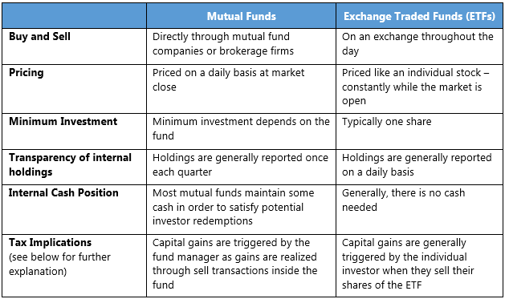

## Table of Contents

## What is a stock?

A stock is a piece of ownership in a company. When you buy a stock, you are buying a small part of that company. Companies sell stocks to raise money to grow their business. People buy stocks because they hope the company will do well and the value of the stock will go up. If the company does well, the stock price goes up, and you can sell your stock for more money than you paid for it.

Stocks are traded on stock exchanges, like the New York Stock Exchange or the NASDAQ. The price of a stock changes all the time, depending on how people feel about the company and the economy. If many people want to buy the stock, the price goes up. If many people want to sell the stock, the price goes down. You can make money from stocks by selling them for a higher price than you bought them, or by getting dividends, which are payments companies sometimes give to their stockholders.

## What is an Exchange-Traded Fund (ETF)?

An Exchange-Traded Fund, or ETF, is a type of investment that holds a collection of stocks, bonds, or other assets. It's like a basket where you can put many different things. When you buy one share of an ETF, you're actually buying a small piece of all the things inside that basket. This makes it easier for you to invest in a lot of different companies or types of investments at once, without having to buy each one separately.

ETFs are traded on stock exchanges, just like individual stocks. This means you can buy and sell them throughout the day at the current market price. ETFs are popular because they offer diversification, which means spreading out your investments to reduce risk. They also usually have lower fees than other types of funds, making them a cost-effective way to invest.

## How do stocks and ETFs differ in terms of ownership?

When you buy a stock, you own a small part of one company. It's like owning a piece of a pizza. If the company does well, the value of your stock might go up, and you could make money. But if the company doesn't do well, the value of your stock might go down, and you could lose money. Owning a stock means you are directly tied to the success or failure of that one company.

On the other hand, when you buy an ETF, you own a small part of many different things all at once. It's like owning a small piece of many different pizzas. An ETF holds a bunch of stocks, bonds, or other assets, so when you buy one share of an ETF, you get a little bit of everything inside it. This can help spread out your risk because if one company in the ETF doesn't do well, you still have many others that might do better.

## What are the typical costs associated with investing in stocks versus ETFs?

When you invest in stocks, you usually have to pay a fee every time you buy or sell a stock. This fee is called a commission. Some brokers charge a lot for this, while others might charge very little or even nothing at all. But besides the commission, there are no other ongoing costs for just owning the stock. So, if you plan to buy and hold stocks for a long time, your costs might be pretty low.

ETFs also have a commission fee when you buy or sell them, just like stocks. But ETFs have another cost called the expense ratio. This is a small percentage of your investment that you pay each year to the company that manages the ETF. The expense ratio covers the costs of running the ETF, like paying people to manage it and keeping track of all the stocks or assets inside it. Even though the expense ratio is usually small, it can add up over time, especially if you're investing a lot of money.

## How do the risks of investing in stocks compare to those of investing in ETFs?

When you invest in stocks, you are putting your money into one company at a time. This means if that company does badly, your investment can lose a lot of value. It's like betting on one horse in a race. If your horse wins, you can make a lot of money. But if it loses, you can lose a lot too. So, the risk with stocks is higher because your money is tied to the success or failure of just one company.

ETFs, on the other hand, spread your money across many different companies or assets. It's like betting on many horses at once. If one horse loses, it's not as bad because you have other horses that might win. This makes ETFs generally less risky than stocks because they offer diversification. But remember, even though ETFs are usually safer, they can still go down in value if the overall market or the group of assets they hold does badly.

## What are the tax implications of investing in stocks versus ETFs?

When you invest in stocks, you have to think about taxes. If you sell a stock for more money than you paid for it, you make a profit. This profit is called a capital gain. If you hold the stock for more than a year before selling, the gain is taxed at a lower rate, called the long-term capital gains rate. But if you sell it in less than a year, it's taxed as regular income, which can be higher. Also, if a company pays you dividends, you have to pay taxes on that money too. The tax rate on dividends can be different depending on how much money you make.

ETFs also have tax implications, but they can be a bit different. Like stocks, if you sell an ETF for a profit, you have to pay capital gains tax. The same rules apply: if you hold it for more than a year, it's taxed at the lower long-term rate, and if you sell it in less than a year, it's taxed as regular income. But ETFs can be more tax-efficient because of how they are structured. They often don't have to sell their holdings as often, which means they might not trigger as many capital gains. This can be good for you because it might mean you pay less in taxes over time.

## How does the liquidity of stocks compare to that of ETFs?

Stocks and ETFs are both traded on stock exchanges, which means you can buy and sell them during the day. But stocks can be more or less liquid depending on how popular the company is. If a lot of people want to buy and sell the stock, it's easy to trade it quickly. This means the stock is very liquid. But if not many people are interested in the stock, it might be hard to sell it fast, making it less liquid.

ETFs are usually very liquid because they hold a bunch of different stocks or assets. Since many people like to invest in ETFs, there are usually a lot of buyers and sellers. This makes it easy to buy and sell ETFs quickly. So, in general, ETFs tend to be more liquid than individual stocks, especially if those stocks are from smaller or less well-known companies.

## What are the diversification benefits of ETFs compared to individual stocks?

When you invest in ETFs, you get the benefit of diversification. This means you spread your money across many different stocks or assets all at once. It's like putting your eggs in different baskets instead of just one. If one company in the ETF does badly, it might not hurt your investment too much because you have other companies that might do well. This can help lower your risk and make your investment safer.

On the other hand, when you invest in individual stocks, you're betting on just one company at a time. If that company does great, you can make a lot of money. But if it does badly, you can lose a lot too. So, your money is more at risk because it's all tied to the success or failure of one company. With ETFs, you don't have to worry as much about one company doing badly because your money is spread out.

## How do the management styles of stocks and ETFs differ?

When you invest in stocks, you are usually in charge of picking which companies to buy. You have to do your own research to decide if a company is a good investment. This means looking at things like how much money the company makes, who runs it, and what people think about it. If you think a company will do well, you buy its stock. If you think it won't do well, you might sell it or not buy it at all. This kind of investing is called active management because you are actively making choices about what to buy and sell.

ETFs are different because they are usually managed by a company that decides what goes into the ETF. Most ETFs follow a certain plan or index, like the S&P 500, which is a list of big companies. The people who manage the ETF make sure it matches this plan or index as closely as possible. This is called passive management because they are not trying to pick the best stocks; they are just trying to copy the plan or index. So, when you buy an ETF, you are buying into this plan, and you don't have to pick the individual stocks yourself.

## What are the performance metrics to consider when comparing stocks and ETFs?

When comparing stocks and ETFs, one important performance metric to look at is the return. Return is how much money you make or lose from your investment. For stocks, you can look at the price change over time and any dividends you get. For ETFs, you look at the overall change in the value of the ETF and any dividends it pays out. It's good to compare the returns of stocks and ETFs over the same time period to see which one did better.

Another metric to consider is volatility. Volatility is how much the price of an investment goes up and down. Stocks can be more volatile than ETFs because they depend on the success of just one company. If the company does well, the stock price might go up a lot. But if the company does badly, the stock price can go down a lot too. ETFs are usually less volatile because they hold many different stocks or assets. This means the ups and downs of one company don't affect the ETF as much.

You should also think about the expense ratio for ETFs, which is the cost of managing the ETF. This is a small percentage of your investment that you pay each year. Stocks don't have an expense ratio, but they might have other costs like commissions when you buy or sell them. When comparing performance, you need to think about these costs because they can affect how much money you keep at the end of the day.

## How can an investor use stocks and ETFs to build a balanced portfolio?

An investor can build a balanced portfolio by mixing stocks and ETFs. Stocks let you pick specific companies you believe in. You might choose a few stocks from different industries, like technology, healthcare, and energy. This way, if one industry does badly, the others might do well and help balance your portfolio. But stocks can be risky because they depend on how one company does. So, it's good to not put all your money in just a few stocks.

ETFs can help make your portfolio more balanced and less risky. ETFs hold a bunch of different stocks or assets, so when you buy an ETF, you get a little bit of everything inside it. This spreads out your risk because if one company in the ETF does badly, you still have many others that might do better. You could pick ETFs that focus on different areas, like one for the whole market, one for international companies, and one for bonds. Mixing stocks and ETFs can give you the best of both worlds: the chance to pick your favorite companies and the safety of spreading your money around.

## What advanced strategies can be employed with ETFs that may not be as effective with individual stocks?

One advanced strategy with ETFs is called sector rotation. This means you move your money from one type of ETF to another based on what's happening in the economy. For example, if you think technology companies will do well, you might buy a technology ETF. Later, if you think energy companies will do better, you can sell the technology ETF and buy an energy ETF. This is easier with ETFs because they focus on whole sectors, not just one company. It's harder to do this with individual stocks because you would have to pick and choose many different stocks each time you want to switch sectors.

Another strategy is using leveraged and inverse ETFs. Leveraged ETFs try to give you bigger returns by using borrowed money. They can make your investment go up faster if the market goes up, but they can also make it go down faster if the market goes down. Inverse ETFs try to do the opposite of what the market does. If the market goes down, an inverse ETF goes up. These kinds of ETFs can be very risky, but they can also be useful for short-term trading or if you think the market will go down. It's much harder to do these things with individual stocks because you would need to use other financial tools, which can be complicated and expensive.

## References & Further Reading

[1]: ["Investments"](https://www.nerdwallet.com/article/investing/the-best-investments-right-now) by Zvi Bodie, Alex Kane, and Alan J. Marcus

[2]: ["A Random Walk Down Wall Street: The Time-Tested Strategy for Successful Investing"](https://www.amazon.com/Random-Walk-Down-Wall-Street/dp/0393358380) by Burton Malkiel

[3]: ["Exchange-Traded Funds and the New Dynamics of Investing"](https://academic.oup.com/book/3366) by Ananth Madhavan

[4]: ["Trading and Exchanges: Market Microstructure for Practitioners"](https://www.amazon.com/Trading-Exchanges-Market-Microstructure-Practitioners/dp/0195144708) by Larry Harris

[5]: ["Algorithmic Trading: Winning Strategies and Their Rationale"](https://www.amazon.com/Algorithmic-Trading-Winning-Strategies-Rationale-ebook/dp/B00CY5HC0U) by Ernest P. Chan