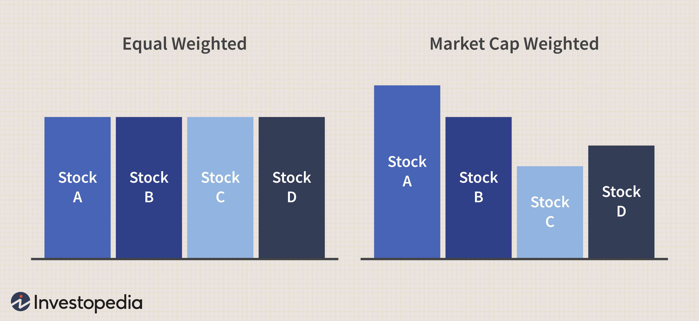

In the modern investment landscape, individuals are presented with a myriad of opportunities to grow their wealth. Among these options, stocks, exchange-traded funds (ETFs), and algorithmic trading tools have gained significant prominence. The contemporary investor is not only equipped with traditional methods of investing but is also exposed to advanced technological tools that can significantly impact investment decisions and outcomes.

Stocks represent an avenue where investors can own a piece of a company. By purchasing shares, investors take on partial ownership of the business. This traditional form of investment has existed for centuries and continues to be a pivotal component in portfolios worldwide due to its potential for substantial returns and dividend income. However, investing in individual stocks requires an understanding of market volatility and company-specific risks.



Exchange-traded funds (ETFs) offer a diversified approach to investing by bundling a collection of assets into a single unit that can be traded on stock exchanges. This allows investors to gain exposure to various sectors, industries, or regions with a single transaction. ETFs combine the best traits of both stocks and mutual funds, providing ease of trading, lower expense ratios, and tax efficiency.

Algorithmic trading, on the other hand, utilizes mathematical models and automated systems to execute trades at speeds and frequencies that are impossible for human traders. This technique leverages computer systems programmed with a set of rules that determine the timing, price, and quantity of trades. Such trading strategies can enhance efficiency and provide a systematic approach to capturing market opportunities.

This article aims to compare these investment avenues, explaining their features, advantages, and how they can fit into different investment strategies. Whether new to investing or a seasoned professional, understanding these instruments can optimize your portfolio. By examining the core aspects of each, the objective is to provide insights that align with varying financial goals and risk appetites.

## Table of Contents

## Understanding Stock Investments

Stock investments involve purchasing shares in individual companies, thereby granting the investor partial ownership and a claim on part of the company’s assets and earnings. This ownership provides the potential for significant returns, particularly when investing in high-performing companies. Historically, stocks have offered superior returns compared to other asset classes such as bonds or savings accounts. The potential for higher returns is often driven by the company’s growth prospects, which can lead to increases in stock prices and dividends. 

For instance, investing in rapidly growing sectors or companies, such as technology giants, can result in substantial capital gains as these companies expand and increase their market share. However, with the potential for higher returns comes an inherent level of risk. Stock prices are subject to market [volatility](/wiki/volatility-trading-strategies), which can result in rapid price fluctuations due to changes in market sentiment, economic indicators, or unforeseen geopolitical events. Additionally, company-specific risks, such as poor management decisions, financial scandals, or shifts in consumer preferences, can adversely impact the stock's performance.

To navigate these risks and optimize stock investment returns, diversification and thorough research are paramount. Diversification involves spreading investments across a variety of sectors, industries, and geographic regions to mitigate risk. This strategy reduces exposure to any single investment's poor performance. For example, holding a mix of stocks from different industries, such as healthcare, technology, and finance, can cushion the investor against sector-specific downturns.

Research plays a crucial role in successful stock investing. It involves analyzing financial statements, understanding market trends, assessing the competitive landscape, and evaluating the company’s management team and strategy. Investors often use financial ratios, such as the price-to-earnings (P/E) ratio, return on equity (ROE), and debt-to-equity (D/E) ratio, to assess a company's financial health and valuation. Staying informed about macroeconomic factors and industry developments further enhances an investor's ability to make informed decisions.

Despite the complexities, investing directly in stocks offers a level of control and transparency that is appealing to many investors. It requires active management, a solid understanding of market dynamics, and a willingness to take calculated risks. By adopting disciplined investment practices and maintaining a long-term perspective, investors can harness the growth potential that stock investments offer, while effectively managing the associated risks.

## An Overview of Exchange-Traded Funds (ETFs)

Exchange-Traded Funds (ETFs) are a popular investment vehicle that combines the benefits of individual stocks and mutual funds. ETFs are traded on stock exchanges, allowing investors to buy and sell shares throughout the trading day at market prices, much like individual stocks. This feature provides investors with the flexibility to react to market changes in real-time.

One of the primary attractions of ETFs is their ability to offer a diversified portfolio with a single transaction. Each [ETF](/wiki/etf-trading-strategies) consists of a collection of assets, such as stocks, bonds, or commodities, which mirror the performance of an underlying index, sector, or asset class. For instance, an ETF tracking the S&P 500 will hold a portfolio of the same stocks listed in that index. This diversification reduces the risk associated with individual securities, mitigating the impact of poor performance by any single asset.

ETFs also offer several advantages that make them an attractive investment choice. Firstly, they typically have lower expense ratios compared to mutual funds. This is because most ETFs are passively managed, aiming to replicate an index rather than outperform it, resulting in lower management fees. Secondly, ETFs are tax-efficient. Due to their unique "in-kind" creation and redemption process, which involves exchanging securities for ETF shares rather than cash, capital gains distributions are minimized. This reduces the tax burden on investors.

Another advantage of ETFs is their flexibility. Investors can engage in various trading strategies, such as buying on margin or selling short, which are not generally possible with mutual funds. This flexibility is enhanced by the fact that ETFs can be traded throughout the day, unlike mutual funds, which can only be bought or sold at the end of the trading day at the calculated net asset value (NAV).

Comparing ETFs to mutual funds reveals both similarities and differences. Like mutual funds, ETFs provide exposure to a diversified portfolio of assets, but they differ in how they are traded and managed. Mutual funds may have higher costs due to active management, while ETFs often mirror an index, resulting in lower active management costs. Mutual funds offer open-end investment access, allowing shares to be adjusted by investor demand, whereas ETFs are traded like stocks and have a finite number of shares.

ETFs serve as a versatile tool for investors seeking exposure to various sectors, markets, or asset classes. They can target specific industries, such as technology or healthcare, invest in commodities like gold or oil, or gain exposure to bonds. This versatility enables investors to tailor their portfolios to specific financial goals, risk appetites, or market outlooks, making ETFs a fundamental component of many modern investment strategies.

## Exploring Algorithmic Trading

Algorithmic trading is a method of executing trades using pre-programmed instructions based on factors such as timing, price, and [volume](/wiki/volume-trading-strategy). This trading strategy leverages complex algorithms and mathematical models to make decisions and execute orders at speeds and frequencies unattainable by human traders. The key advantage of [algorithmic trading](/wiki/algorithmic-trading) is its ability to process vast amounts of data quickly and execute orders with precision, reducing the likelihood of errors that human traders might make under similar conditions.

**Speed and Frequency**

The primary highlight of algorithmic trading is its ability to execute orders at high speed and frequency. Algorithms can react to market conditions in a fraction of a second, capitalizing on narrow windows of opportunity that human traders might miss. This speed is achieved through high-frequency trading ([HFT](/wiki/high-frequency-trading-strategies)), where algorithms are designed to perform millions of trades each day, exploiting minute price discrepancies in the market.

**Benefits of Algorithmic Trading**

1. **Reduced Transaction Costs**: By automating trading decisions, algorithmic trading can reduce costs associated with manual interventions. Algorithms can optimize order execution to avoid market impact costs, thus achieving better average buy and sell prices.

2. **Increased Accuracy**: Algorithms are designed to follow specific rules and parameters without deviation, ensuring high accuracy in executing trades. This precision is vital in fast-paced trading environments where even a minor slip can result in significant financial losses.

3. **Elimination of Human Emotions**: Emotional decision-making is often cited as a major pitfall in traditional trading. Fear and greed can lead to suboptimal trading decisions. Algorithmic trading eliminates emotional bias, adhering strictly to the predefined instructions to maintain discipline in the trading strategy.

**Technological Requirements and Learning Curve**

Engaging in algorithmic trading requires a significant technological infrastructure. Traders need access to cutting-edge hardware and software, including powerful servers, advanced trading platforms, and reliable data feeds. Moreover, the development and testing of algorithms require proficiency in programming languages such as Python or C++. For example, a simple mean-reversion strategy could be coded in Python as follows:

```python
import numpy as np

def mean_reversion_strategy(prices, window):
    rolling_mean = np.mean(prices[-window:])
    if prices[-1] < rolling_mean:
        return "Buy"
    elif prices[-1] > rolling_mean:
        return "Sell"
    else:
        return "Hold"
```

The learning curve for algorithmic trading can be steep, demanding a solid understanding of both financial markets and technical skills. Traders need to stay abreast of advancements in [machine learning](/wiki/machine-learning), data analysis, and market microstructure to create competitive algorithms.

**Prevalence and Impact on Financial Markets**

Algorithmic trading is becoming increasingly prevalent, fundamentally reshaping financial markets worldwide. According to estimates, it accounts for a substantial portion of trading volume on major stock exchanges. Its growth is driven by the efficiencies and advantages it offers, encouraging more institutions and retail investors to integrate algorithmic solutions into their trading strategies.

Overall, while algorithmic trading offers numerous advantages, it also presents challenges such as the risk of systemic errors and the need for continuous monitoring and adjustment of trading algorithms. As technology progresses, the role and impact of algorithmic trading on financial markets are expected to expand, presenting both opportunities and challenges for investors.

## Comparing the Investment Options

Each investment option—stocks, exchange-traded funds (ETFs), and algorithmic trading—carries distinct advantages and disadvantages, making them suitable for different investor profiles and strategies. Understanding these options can guide investors to make informed decisions that align with their financial goals and risk tolerance.

**Stocks** represent ownership in a company and offer the potential for high returns, particularly if the company performs well. The value of stocks can appreciate significantly, contributing to wealth creation. However, stocks are inherently volatile, exposing investors to company-specific risks and broader market volatility. Investors must conduct thorough research and diversify their portfolios to manage these risks effectively. Diversification can mitigate the impact of poor performance in any single stock, reducing overall portfolio risk.

**ETFs** appeal to investors seeking diversification and lower costs. They are funds traded on stock exchanges, similar to individual stocks, but they hold a diversified basket of assets. This structure allows investors to gain exposure to entire markets or sectors with a single transaction, reducing the need for individual stock selection. ETFs are known for their low expense ratios and tax efficiency compared to mutual funds, which makes them a cost-effective choice. Their flexibility and ease of trading provide access to a wide range of asset classes, making them attractive to passive investors and those looking to maintain a diversified investment portfolio with minimal effort.

**Algorithmic trading** utilizes computer programs to execute trades based on predefined criteria, eliminating human emotion from trading decisions. Algorithms can process large volumes of data at high speed, allowing for quick responses to market changes and reducing transaction costs through efficient order execution. While algorithmic trading offers the potential for increased accuracy and trading consistency, it demands significant technological expertise and infrastructure. Investors interested in this approach should possess a strong understanding of programming and market dynamics or seek the services of specialized firms.

When choosing between these investment options, several factors must be considered:

1. **Risk Tolerance**: Stocks can offer high rewards but come with higher risks. Investors with a higher risk appetite may prefer stocks, while risk-averse individuals might opt for ETFs or algorithmic trading systems designed to manage risk.

2. **Investment Goals**: Long-term growth objectives might align with stock investments, whereas ETFs can provide steady returns through diversification. Algorithmic trading might be suitable for those looking to capitalize on short-term market movements.

3. **Market Knowledge**: Successful stock and algorithmic trading necessitates a deep understanding of market trends and the ability to analyze financial data. In contrast, ETFs can serve investors with less market knowledge due to their inherent diversification.

In conclusion, choosing the right investment depends on personal financial objectives and comfort with risk. Investors should weigh these options carefully to determine which aligns best with their circumstances and goals.

## Conclusion

Choosing the right investment strategy hinges on understanding one's financial objectives as well as risk appetite. Stocks, exchange-traded funds (ETFs), and algorithmic trading bring distinct advantages and cater to diverse investor profiles. Stocks offer the potential for substantial returns through direct ownership in companies, but they come with higher risk and demand constant attention to market fluctuations. ETFs, on the other hand, provide diversification and typically entail lower costs, making them an attractive option for investors seeking a more passive approach to portfolio management. They allow for broad market exposure with minimal effort.

Algorithmic trading stands out for those who prioritize speed, accuracy, and consistency. By harnessing technology, it enables the execution of complex strategies that would be impractical for a human trader to manage manually. However, this approach requires a certain level of technological expertise, as well as an understanding of the algorithms and models employed.

It is critical that investors evaluate their specific circumstances and recognize the role each investment option can play in advancing their overall portfolio. This involves a thoughtful assessment of risk tolerance, investment goals, and the degree of involvement they wish to maintain in managing their investments. Staying informed and responsive to market developments is equally important for optimizing the potential of these investment avenues and achieving sustainable growth over time.

Ultimately, the most effective investment strategy is one that aligns closely with an individual's personal financial goals and level of comfort with various investment vehicles. By balancing these factors, investors can construct a portfolio that not only meets their current needs but also adapts to evolving market conditions and long-term financial aspirations.

## References & Further Reading

[1]: ["Investments"](https://www.nerdwallet.com/article/investing/the-best-investments-right-now) by Zvi Bodie, Alex Kane, and Alan J. Marcus

[2]: ["A Random Walk Down Wall Street: The Time-Tested Strategy for Successful Investing"](https://www.amazon.com/Random-Walk-Down-Wall-Street/dp/0393358380) by Burton Malkiel

[3]: ["Exchange-Traded Funds and the New Dynamics of Investing"](https://academic.oup.com/book/3366) by Ananth Madhavan

[4]: ["Trading and Exchanges: Market Microstructure for Practitioners"](https://www.amazon.com/Trading-Exchanges-Market-Microstructure-Practitioners/dp/0195144708) by Larry Harris

[5]: ["Algorithmic Trading: Winning Strategies and Their Rationale"](https://www.amazon.com/Algorithmic-Trading-Winning-Strategies-Rationale-ebook/dp/B00CY5HC0U) by Ernest P. Chan