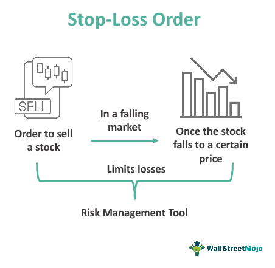

In today's fast-paced financial markets, developing a robust trading strategy is essential for achieving success. Among the myriad of strategies available, stop-limit and stop-loss orders have emerged as indispensable tools for both traders and investors. These orders play a pivotal role in algorithmic trading, providing a mechanism to manage risk and execute trades with greater precision.

Stop-limit and stop-loss orders are different in their functions but are equally crucial for optimizing trading algorithms. A stop-limit order becomes a limit order once the stop price is reached, enabling traders to set the desired amount at which their security can be bought or sold. On the other hand, stop-loss orders are designed to sell a security once it reaches a specific price point, thus mitigating potential losses in volatile markets. Both order types allow traders to automatically control their trading positions and manage risks effectively, which is especially valuable in algorithms that are sensitive to market fluctuations.



This article will explore the strategic implementations of stop-limit and stop-loss orders within algorithmic trading. Traders and investors will gain insights into using these tools to enhance their trading portfolios by minimizing risks and maximizing profitability. By effectively incorporating these orders, traders can optimize their strategies and make more informed decisions in dynamic market conditions.

Furthermore, we will examine sophisticated trading strategies and provide practical applications of these order types. The aim is to equip traders and investors with the knowledge necessary to incorporate stop-limit and stop-loss strategies effectively, thereby improving their risk management and trading outcomes. Join us as we explore the intricacies of these trading orders, uncovering strategies that promise to bolster both risk management and profitability in trading endeavors.

## Table of Contents

## Understanding Stop-Limit Orders

A stop-limit order is a sophisticated trading tool that merges the functionality of a stop order with that of a limit order, granting traders heightened precision and control over their trades. This hybrid mechanism triggers a limit order once a pre-determined stop price is reached. Execution only occurs if the market price meets the conditions set by the limit order, thereby allowing traders to define the lowest acceptable price for selling or the highest for buying.

In volatile market environments, where prices can swing dramatically within short periods, stop-limit orders prove invaluable. They enable traders to maintain control over execution prices, avoiding the risks of unfavorable fill prices that might occur with market orders. For instance, if a trader sets a stop-limit order to sell a stock at a stop price of $10 with a limit of $9.50, the order is activated once the stock hits $10 and only executes if the price remains above $9.50. This ensures that the stock isn't sold at an excessively low price during rapid market movements.

Stop-limit orders are particularly beneficial in markets characterized by low [liquidity](/wiki/liquidity-risk-premium), where rapid price changes can be more pronounced. In such scenarios, having precise control over transaction prices is crucial to prevent significant losses due to price slippage. For example, thinly traded stocks or commodities may experience sudden large price fluctuations, making stop-limit orders a strategic choice for traders seeking to avoid selling too low or buying too high during such turbulent times.

Setting up stop-limit orders within trading algorithms requires a careful understanding of both the market and individual asset behaviors. For novice traders, a basic Python script can be used to illustrate the concept:

```python
def place_stop_limit_order(current_price, stop_price, limit_price, side='sell'):
    if side not in ['buy', 'sell']:
        raise ValueError("The 'side' parameter must be either 'buy' or 'sell'")

    if (side == 'sell' and current_price <= stop_price) or (side == 'buy' and current_price >= stop_price):
        if (side == 'sell' and current_price >= limit_price) or (side == 'buy' and current_price <= limit_price):
            print(f"Placing a {side} limit order at {limit_price}")
            # This would be replaced with an actual order placement API call
            return True
    return False
```

This script function checks the current asset price against the specified stop and limit prices to determine whether to place a trade. It provides a basic structure for integrating stop-limit orders in [algorithmic trading](/wiki/algorithmic-trading) systems, aiding traders in handling market complexities more effectively.

For experienced traders, incorporating advanced statistical models and real-time market analysis into their algorithms can further refine the use of stop-limit orders. This includes using historical [volatility](/wiki/volatility-trading-strategies) data and predictive indicators to adjust stop and limit parameters dynamically, enhancing execution precision and optimizing trading outcomes. Through strategic application, stop-limit orders can provide a critical edge in managing trades across diverse market conditions.

## Exploring Stop-Loss Orders

Stop-loss orders are an essential element in risk management strategies, aimed at preventing excessive financial losses in volatile market conditions. These orders are structured to convert into market orders once the price of a security reaches a specified stop level, thereby ensuring swift execution to minimize potential losses.

In various trading environments, stop-loss orders play a pivotal role in creating a balanced trading strategy. For instance, in highly volatile markets, where price fluctuations can be sudden and extreme, stop-loss orders can act as a crucial safety net, controlling losses by automatically selling the asset before the price depreciates further. Conversely, in more stable markets, they allow traders to lock in profits and [exit](/wiki/exit-strategy) positions without having to constantly monitor market movements.

Accurately setting stop-loss levels is vital and should be based on thorough market analysis and individual risk tolerance. Traders need to consider the asset's volatility, historical price patterns, and market conditions when determining these levels. A commonly used method is the Average True Range (ATR), which helps in setting stop-loss levels based on the asset's volatility. The formula is as follows:

$$
\text{ATR-based Stop-loss} = \text{Current Price} - (\text{ATR Value} \times \text{Multiplier})
$$

In algorithmic trading systems, stop-loss orders are programmed to trigger once specific criteria are met. For example, using Python, a trader can utilize libraries like Zipline or Backtrader to automate trading strategies with integrated stop-loss functionality. Below is a sample code snippet illustrating a basic stop-loss mechanism:

```python
def stop_loss_order(current_price, purchase_price, stop_loss_percentage):
    stop_loss_value = purchase_price * (1 - stop_loss_percentage/100)
    if current_price <= stop_loss_value:
        execute_market_order()

def execute_market_order():
    print("Stop-loss triggered. Executing market order to sell the asset.")
```

Incorporating stop-loss orders within algorithmic trading can significantly contribute to safeguarding investments. These orders provide a mechanism for traders to automatically adhere to their risk management plans, thus preventing emotional decision-making during market turbulence. Additionally, they allow for continuous portfolio monitoring without constant manual oversight, optimizing the trading process, and ensuring discipline in executing pre-determined risk thresholds.

Ultimately, the strategic implementation of stop-loss orders aids in maintaining the integrity of trading strategies, ensuring that losses are kept in check while allowing traders the flexibility to adapt their approaches based on changing market conditions.

## Comparative Analysis: Stop-Loss vs Stop-Limit Orders

Stop-loss and stop-limit orders are integral to risk management strategies in trading. Each serves a unique function and choosing between them depends on a trader’s risk tolerance and market strategy.

Stop-loss orders are designed to limit a trader’s loss by selling a security at the current market price when it reaches a predetermined stop level. This order guarantees execution once the stop price is hit, irrespective of the current market price. However, it does not guarantee the price at which the order is executed, which can be disadvantageous in highly volatile markets where prices change rapidly. For example, if a trader sets a stop-loss order for a stock at $50, the order will execute at the best available market price once the stock's price hits $50, potentially lower if the stock is falling quickly.

Conversely, a stop-limit order combines features of stop orders and limit orders, allowing execution only at a specific price or better. This type involves two price points: the stop price, which triggers the conversion of the order to a limit order, and the limit price, which is the minimum price the trader is willing to accept. This ensures price certainty but not execution certainty; if the market price does not reach the limit price, the order will not execute, potentially leaving a position open to greater losses. For example, if a trader sets a stop-limit order with a stop price of $50 and a limit price of $48, the order will only execute if the price can be filled at $48 or higher after the stop price is hit.

Traders must evaluate which type of order best fits their trading strategy and risk profile. For instance, a trader with a high risk tolerance might prefer stop-limit orders for the execution control they provide, while another with a low risk tolerance might favor stop-loss orders to ensure prompt exit from the market, even at an uncertain price. This decision depends largely on market conditions and the trader’s objectives.

Looking at case studies, one example could involve a trader who used stop-loss orders during a period of high market volatility. The trader set tight stop-loss levels to avoid significant losses during sharp price declines. Although some trades exited at less favorable prices due to slippage, the strategy effectively limited potential losses. In contrast, another case involving stop-limit orders might illustrate a scenario in a stable market where a trader successfully used wider limits to control trade exits, optimizing for price execution rather than immediacy.

Understanding these differences enables traders to tailor their approach, using stop-loss or stop-limit orders to align with their strategic goals and market expectations. The choice between guaranteed execution and guaranteed price execution is a strategic decision that can significantly impact the effectiveness of a trader’s risk management and overall trading success.

## Advanced Strategies for Stop-Limit and Stop-Loss Orders

With the integration of [artificial intelligence](/wiki/ai-artificial-intelligence) (AI) and [machine learning](/wiki/machine-learning) (ML), trading algorithms are evolving to manage complex strategies involving stop orders more effectively. These advanced technologies enable dynamic adjustments and fine-tuning that optimize trading outcomes while considering market volatility and quantitative indicators.

One key aspect of leveraging AI in trading is the dynamic adjustment of stop-loss orders. These adjustments are crucial as they allow traders to better respond to market fluctuations. By using ML models, traders can predict volatility changes, ensuring that stop-loss levels are adjusted in real-time to align with current market conditions. For instance, traders might use historical price data to train a model that predicts short-term volatility, adjusting stop-loss orders accordingly to protect against sudden market movements.

Stop-limit orders, on the other hand, can be adapted to changing market conditions to provide greater control over execution. This involves setting parameters that determine when a stop-limit order should be placed based on predictive analytics. For example, if an ML model indicates an impending adverse price movement, the system can automatically place a stop-limit order to optimize execution and minimize potential losses. 

Algorithmic strategies incorporating these advanced techniques can significantly enhance trading efficiency and profitability. A typical approach might involve the use of [reinforcement learning](/wiki/reinforcement-learning) algorithms, which can continuously learn and adapt from new data. These algorithms can optimize stop and limit levels by rewarding decisions that maximize returns and minimize risks. A simple Python implementation of a dynamic stop-loss strategy might look like this:

```python
import numpy as np

def dynamic_stop_loss(current_price, volatility_index):
    base_stop = 0.02  # 2% base stop-loss
    volatility_adjustment = 0.005 * volatility_index  # Adjust based on volatility
    stop_loss_level = current_price * (1 - base_stop - volatility_adjustment)
    return stop_loss_level
```

In automated trading environments, configuring stop orders laced with these algorithms requires expert tips and best practices. To implement these effectively, traders must ensure their systems are capable of real-time data processing and can adapt stop orders based on pre-defined and tested quantitative models. Additionally, regular [backtesting](/wiki/backtesting) and optimization are vital to refine these strategies consistently over time.

In conclusion, integrating AI and ML into trading algorithms provides powerful tools for developing advanced strategies with stop-limit and stop-loss orders. By dynamically adjusting these orders based on quantitative insights and using predictive analytics, traders can achieve greater control, improved risk management, and enhanced profitability.

## Real-World Application and Case Studies

Real-world applications of stop-limit and stop-loss orders illuminate their importance in managing trading risks effectively. Traders use these strategic tools across various financial markets to safeguard investments while maximizing profit potential. A key example is the utilization of stop-loss orders in equity markets, where they serve as automatic exit strategies to prevent catastrophic losses during sudden price drops. For instance, during market downturns such as the 2020 COVID-19 crash, many traders mitigated their losses by setting stop-loss orders at specific price levels, thereby protecting their portfolios from further declines.

Case studies indicate that successful traders often employ a combination of stop-limit and stop-loss orders to capitalize on market opportunities. In liquid markets, such as Forex, the implementation of these orders requires precision. A Forex trader might set a stop-loss order to limit potential losses on a currency pair, while simultaneously placing a stop-limit order to attempt to sell the currency at a higher price once it rebounds, optimizing gains. This strategy can be implemented in trading algorithms using Python:

```python
def place_order(current_price, stop_loss, stop_limit):
    if current_price <= stop_loss:
        execute_market_order()  # Implements stop-loss
    elif current_price >= stop_limit:
        execute_limit_order(current_price)  # Uses stop-limit

```

In interviews with seasoned traders, practical challenges in using stop orders emerge, such as setting the correct thresholds in volatile markets. Financial experts note that these decisions require balancing risk tolerance with market volatility; setting stop levels too close to the current price might lead to premature exits, while too wide a gap could result in undesirable losses.

Insights reveal that market scenarios significantly impact stop order effectiveness. For instance, in high-frequency trading environments, latency can affect order execution speed, making it crucial for algorithms to adjust dynamically to market fluctuations. Traders can employ quantitative methods to calculate optimal stop levels based on volatility indicators like the Average True Range (ATR):

```python
import talib as ta
import numpy as np

def calculate_stop_loss(close_prices, multiplier=1.5):
    atr = ta.ATR(high, low, close_prices, timeperiod=14)
    stop_loss = close_prices[-1] - multiplier * atr[-1]
    return stop_loss
```

This approach allows traders to adapt their strategies over time, ensuring stop orders are aligned with current market conditions.

Actionable takeaways include routinely reviewing and adjusting stop and limit levels based on market performance and emerging patterns. By leveraging insights from case studies and interviews with experts, traders can refine their strategies to enhance risk management. Utilizing advanced algorithmic techniques and ongoing market analysis can further improve trading outcomes. These strategies provide a robust framework for traders looking to optimize profit while effectively managing risk exposure in dynamic financial markets.

## Concluding Thoughts

Stop-limit and stop-loss orders are essential tools for traders seeking to balance risk and reward amidst market volatility. These orders are designed to protect against substantial losses, while also enabling traders to capitalize on favorable market conditions. A successful trading strategy hinges on a nuanced understanding of these order types, particularly in their integration into sophisticated trading algorithms.

To achieve optimal results, traders must continuously adapt their strategies in response to evolving market conditions. This process involves not only a deep comprehension of the technical aspects of stop-loss and stop-limit orders but also an appreciation of emerging technological advancements such as artificial intelligence and machine learning in the trading domain. By leveraging these technologies, traders can enhance their algorithms to adjust dynamically to market fluctuations, setting the stage for improved trading outcomes.

This article has provided a detailed examination of stop-limit and stop-loss orders, offering traders the insights needed to make informed decisions. Understanding the distinctions and appropriate applications of each order type is critical for constructing a robust risk management framework.

Traders are encouraged to apply the knowledge and techniques discussed to refine their strategies. By doing so, they can enhance their risk management approach, mitigate potential losses, and ultimately bolster their overall trading performance.

## References & Further Reading

[1]: Bergstra, J., Bardenet, R., Bengio, Y., & Kégl, B. (2011). ["Algorithms for Hyper-Parameter Optimization."](https://dl.acm.org/doi/10.5555/2986459.2986743) Advances in Neural Information Processing Systems 24.

[2]: ["Advances in Financial Machine Learning"](https://www.amazon.com/Advances-Financial-Machine-Learning-Marcos/dp/1119482089) by Marcos Lopez de Prado

[3]: ["Evidence-Based Technical Analysis: Applying the Scientific Method and Statistical Inference to Trading Signals"](https://www.amazon.com/Evidence-Based-Technical-Analysis-Scientific-Statistical/dp/0470008741) by David Aronson

[4]: ["Machine Learning for Algorithmic Trading"](https://github.com/stefan-jansen/machine-learning-for-trading) by Stefan Jansen

[5]: ["Quantitative Trading: How to Build Your Own Algorithmic Trading Business"](https://books.google.com/books/about/Quantitative_Trading.html?id=j70yEAAAQBAJ) by Ernest P. Chan