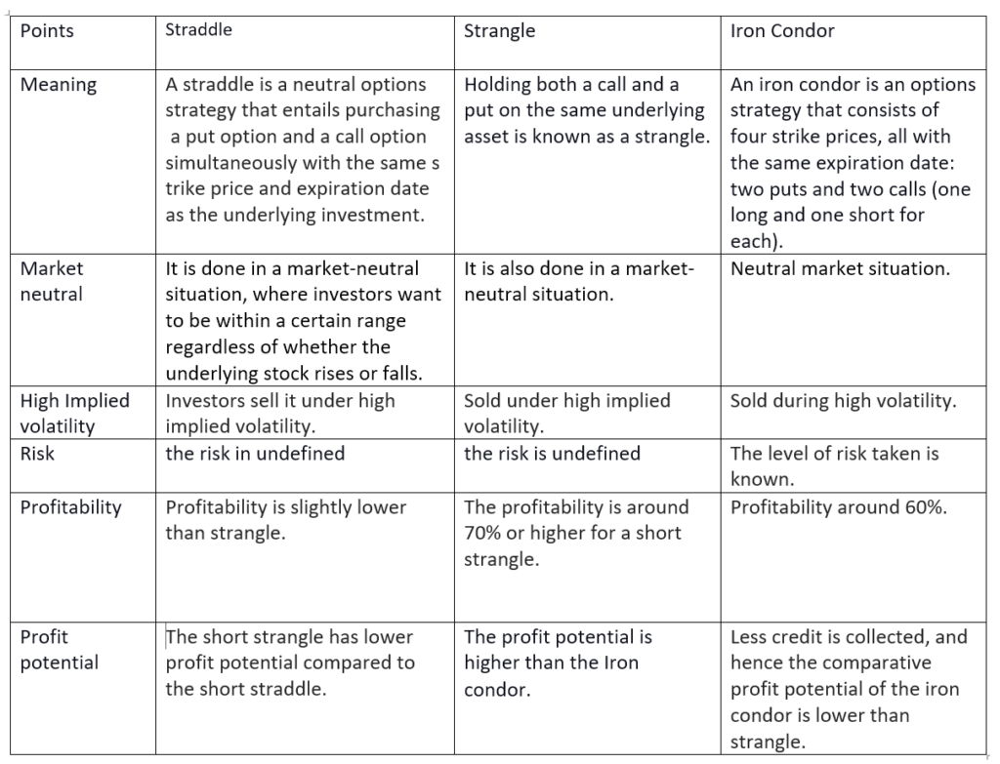

Derivatives trading offers powerful financial tools that enable traders to hedge risks and speculate on asset price movements. Within this sphere, options are particularly effective, allowing investors to capitalize on volatility. Amongst the myriad of options strategies, straddle and strangle stand out due to their potential to exploit price fluctuations and maximize returns. 

A straddle involves purchasing both a call and a put option at the same strike price and expiration date. On the other hand, a strangle entails buying a call and a put option with different strike prices but the same expiration date. Both strategies are structured to benefit from volatility, with the potential to yield profits from significant price movements in either direction, without the need to predict the precise trajectory.



The application of these strategies is further enhanced through algorithmic trading, which automates the trading process, improving accuracy and efficiency. Algorithms, which can analyze vast datasets in real-time, help traders optimize entry and exit points, manage risks dynamically, and execute trades swiftly. Understanding and implementing straddle and strangle strategies in conjunction with algorithmic trading is crucial for traders aiming to leverage price movements effectively in the derivatives market.

This article will explore the distinctions between straddle and strangle strategies, focusing on effective implementation within algorithmic trading frameworks. By integrating these strategies with technology, traders can enhance their performance, ensuring more precise risk management and potentially greater returns in volatile market conditions.

## Table of Contents

## Understanding Options in Derivatives Trading

Options are contracts that grant the holder the right, without obligation, to buy or sell an underlying asset at a predetermined price, known as the strike price, before a specified expiration date. This flexibility makes options a powerful instrument in the derivatives market.

There are two primary types of options: call options and put options. A call option gives the holder the right to purchase an underlying asset, allowing for potential profit if the asset's price increases beyond the strike price plus any premium paid. Conversely, a put option enables the holder to sell an underlying asset, offering profit opportunities if the asset's price falls below the strike price minus the premium.

In derivatives trading, options serve as essential tools for risk management and profit maximization. They allow traders to capitalize on anticipated asset price movements without committing to the underlying assets outright. For example, a trader expecting a significant upward movement in an asset's price might purchase a call option to benefit from that move with controlled risk exposure, limited to the premium paid for the option.

Successful options trading relies on accurately analyzing market trends and comprehensively understanding the characteristics of the underlying assets. Traders must assess factors such as [volatility](/wiki/volatility-trading-strategies), [liquidity](/wiki/liquidity-risk-premium), and market sentiment to inform their options strategies. For instance, high volatility in an underlying asset often results in higher option premiums, reflecting the increased potential for significant price shifts.

Moreover, applying mathematical models such as the Black-Scholes model helps in pricing options accurately, factoring in variables like the asset's asset price, strike price, time to expiration, risk-free [interest rate](/wiki/interest-rate-trading-strategies), and asset volatility. Accurate pricing ensures that traders can make informed decisions about whether to buy or sell options based on market conditions.

## What is a Straddle Strategy?

A straddle strategy in derivatives trading involves simultaneously purchasing a call option and a put option for the same underlying asset, with identical strike prices and expiration dates. This approach is designed to capitalize on significant price movements in either direction. The core advantage of this strategy is its ability to provide a hedge against potential losses caused by substantial price swings in the asset.

The straddle strategy is particularly advantageous during periods of heightened market volatility or when a substantial event is anticipated that could influence the asset's price, although the direction of the move remains unpredictable. For instance, earnings announcements or geopolitical developments can induce large price fluctuations, making the straddle an appealing choice when uncertainty prevails.

One of the defining characteristics of the long straddle strategy is the limited downside risk, restricted to the total premiums paid for acquiring both the call and put options. This makes it a controlled-risk strategy, as the maximum potential loss is the initial investment in the option premiums. The profitability of a straddle hinges on the degree to which the asset's price exceeds the total premiums paid when it moves significantly in either direction.

For illustration, consider a stock trading at $100. An investor employing a straddle might purchase a call option and a put option, both with a strike price of $100, assuming a $5 premium per option. The total investment amounts to $10. To achieve a profit, the stock’s price would need to rise above $110 or fall below $90—surpassing the combined cost of purchased options.

By leveraging the straddle strategy, traders position themselves to benefit from significant market movements while concurrently mitigating potential losses to the extent of the premiums paid.

## Exploring the Strangle Strategy

A strangle strategy involves simultaneously purchasing a call option and a put option with different strike prices while sharing the same expiration date. This approach is particularly advantageous when a trader foresees a substantial price movement but is uncertain about the direction in which the market will move. Unlike a straddle, where both options share the same strike price, a strangle allows for flexibility in choosing out-of-the-money (OTM) strike prices for both the call and put options. 

Strangles tend to be less expensive compared to straddle strategies due to the inherent characteristics of options pricing. Specifically, the OTM options acquired in a strangle have lower premiums, making it a cost-effective choice for traders who are budget-conscious yet bullish on capturing volatility. When deploying a long strangle, profit is achieved if the asset’s price makes a significant move, either upward or downward, surpassing the combined cost of the premiums paid for both options. This means that for a strangle to be profitable, the underlying asset must move significantly beyond either of the selected strike prices by expiration.

The payoff for a long strangle can be represented by the following formula:

$$
\text{Profit} = \begin{cases} 
(V_U - C_{\text{call}} - C_{\text{put}}) \text{, if } V_U > K_{\text{call}} \\
(K_{\text{put}} - V_L - C_{\text{call}} - C_{\text{put}}) \text{, if } V_L < K_{\text{put}} \\
0 \text{, otherwise}
\end{cases}
$$

Where:
- $V_U$ and $V_L$ are the upper and lower values of underlying asset price.
- $K_{\text{call}}$ and $K_{\text{put}}$ are the strike prices for the call and put options, respectively.
- $C_{\text{call}}$ and $C_{\text{put}}$ are the premiums paid for the call and put options.

In summary, the strangle strategy capitalizes on volatility without tying the trader down to a specific price direction. By judiciously selecting OTM options, traders can limit initial costs while maintaining the potential for high returns during considerable market shifts. This makes it a valuable tool for capturing profits from significant market volatility, provided that the asset moves well outside the strike prices by the point of expiration.

## Straddle vs Strangle: Key Differences

Both straddle and strangle strategies are designed to take advantage of market volatility, yet there are distinct differences in their mechanics and cost structures that traders need to understand to optimize their application.

Straddle strategies involve purchasing both a call and a put option with the same strike price and expiration date. This requirement inherently necessitates a higher initial investment since the options are at-the-money, meaning their strike price is at or near the current market price of the underlying asset. As a result, the premiums paid for both options in a straddle tend to be higher, reflecting the market's anticipation of potential price movement from the at-the-money position.

In contrast, a strangle strategy entails the purchase of a call and a put option with different strike prices, usually out-of-the-money, but with the same expiration date. Because the options are out-of-the-money, they are generally cheaper than those in a straddle. This results in a lower initial capital requirement for a strangle. However, the trade-off is that the underlying asset's price must move more substantially to either end of the spectrum—beyond the respective strike prices—for the strategy to yield a profit. In essence, strangle strategies demand a more pronounced movement in the market price for profitable outcomes compared to straddles.

To underscore their differences mathematically, consider the potential profit calculations for each strategy. For a straddle, the theoretical profit $P$ can be expressed as:

$$
P = \max(S - K - \text{Total Premium}, 0) + \max(K - S - \text{Total Premium}, 0)
$$

Where $S$ is the underlying asset price at expiration, $K$ is the strike price, and the `Total Premium` is the combined cost of both options.

Conversely, for a strangle:

$$
P = \max(S - K_{\text{call}} - \text{Total Premium}, 0) + \max(K_{\text{put}} - S - \text{Total Premium}, 0)
$$

Here, $K_{\text{call}}$ and $K_{\text{put}}$ represent the different strike prices for the call and put options, respectively.

Decisively, choosing between a straddle and a strangle hinges on the anticipated volatility and movement range in the market price. Traders must assess current market conditions and volatility levels to decide the most suitable strategy. In periods of expected high volatility with uncertainty regarding the direction of the move, a straddle might be advantageous despite its higher upfront cost due to its potentially lower breakeven points. On the other hand, if the projection includes significant price swings without directional bias but with a cost-conscious approach, executing a strangle may be more appropriate.

## Incorporating Algo Trading with Straddle and Strangle Strategies

Algorithmic trading, commonly referred to as algo trading, employs automated systems and predefined algorithms to execute trades with enhanced precision and speed. In the context of options trading strategies such as straddles and strangles, algorithms can serve as a powerful tool to optimize performance and manage risks effectively.

Algorithms improve the effectiveness of straddle and strangle strategies by precisely determining entry and [exit](/wiki/exit-strategy) points. Given the need to respond quickly to price movements, algo trading can evaluate vast amounts of market data in real-time, thus identifying optimal trading opportunities. For example, by using Python libraries such as NumPy and Pandas, traders can analyze historical price data to forecast future volatility trends, which is crucial for straddles and strangles that thrive on significant price fluctuations.

```python
import numpy as np
import pandas as pd
import statsmodels.api as sm

# Example of volatility forecasting using GARCH model
def estimate_volatility(price_data):
    returns = np.log(price_data / price_data.shift(1))
    model = sm.tsa.GARCH(returns.dropna().values, p=1, q=1)
    results = model.fit(disp="off")
    return results.conditional_volatility
```

Risk management is also a crucial component of these strategies, and algorithms excel at this task by offering the ability to perform real-time adjustments. Algorithmic systems can continuously monitor predefined metrics and indicators, automatically adjusting the strategy as market conditions evolve, thereby ensuring that withdrawal from the market is timely and that exposure to risk is minimized.

Furthermore, the scalability of algo trading allows it to handle a larger [volume](/wiki/volume-trading-strategy) of trades simultaneously, which is particularly advantageous when executing complex strategies involving multiple options contracts. Automation minimizes human error, ensures consistency in trade execution, and enables traders to capitalize on fleeting market opportunities with high efficiency.

Incorporating algorithms in trading straddles and strangles also permits the execution of [backtesting](/wiki/backtesting), where strategies are tested against historical data to assess their viability before deployment in live markets. This forward-testing ensures that the trading strategy is robust and adapts well to different market conditions.

In summary, integrating [algorithmic trading](/wiki/algorithmic-trading) with straddle and strangle strategies empowers traders to enhance accuracy and efficiency, optimize entry and exit points, rigorously manage risks, and exploit market trends. Such technological advancements provide a competitive edge in the ever-evolving landscape of financial markets.

## Tax Considerations in Options Trading

Options trading involves several tax implications that investors must accurately report to ensure compliance and optimize financial outcomes. One of the primary considerations is the classification of gains and losses as either short-term or long-term capital gains, affecting the tax rate applied. Short-term capital gains are generally taxed at higher rates, equivalent to ordinary income taxes, while long-term capital gains benefit from reduced tax rates.

Investors should understand specific tax rules, such as the wash sale rule, which prevents the claiming of a tax deduction for a security sold at a loss and subsequently repurchased within 30 days. Violating the wash sale rule can lead to disallowed losses and impact the potential tax liability. It's crucial to keep meticulous records of all transactions to avoid violating this rule inadvertently.

Offsetting positions, another important concept, refer to trades that counterbalance existing positions to manage risk or lock in profits. The tax treatment of these positions can complicate the calculation of capital gains and losses. Understanding how to account for such trades accurately is essential to prevent discrepancies in tax reporting.

Additionally, loss deferrals can affect options traders. If losses in one fiscal year cannot be fully utilized, they may be carried forward to future tax years to offset gains, following IRS guidelines. However, specific criteria must be met to qualify for such deferrals, necessitating a thorough understanding of relevant tax provisions.

Consulting experienced tax professionals is advisable for options traders to navigate these complexities effectively. They can offer insights into maximizing after-tax returns and minimizing tax liabilities by leveraging available deductions and credits. Professional advice is particularly useful for traders engaged in frequent and large-volume transactions, where the complexity of tax calculations increases.

Publication 550 from the Internal Revenue Service (IRS) serves as a critical resource for understanding investment income and expenses, offering guidelines on reporting requirements specific to options trading. It provides detailed instructions on various aspects of trading, such as the treatment of premium, expiration, and settlement of options. Familiarity with this publication can help traders align their reporting practices with IRS standards and avoid potential penalties.

## Conclusion

Straddles and strangles are versatile strategies in options trading, ideal for environments marked by high volatility. Harnessing these strategies allows traders to potentially profit from significant price movements, irrespective of the direction. The integration of algorithmic trading can further refine the execution of these strategies by enhancing both accuracy and speed, ultimately optimizing trading performance.

A key component of successful trading is understanding the detailed mechanics and nuances of strategies like straddles and strangles. Technology plays a pivotal role in this; algorithms can streamline complex decision-making processes by analyzing market data in real time, identifying optimal entry and exit points, and executing trades with minimal delay. These automated systems can also manage risks more effectively by rapidly adjusting positions in response to market changes.

Moreover, staying informed about current market conditions is crucial. Market volatility and trends directly impact the viability and profitability of straddles and strangles. Equally important are the tax implications associated with options trading. Traders must navigate a regulatory landscape that requires precise reporting of capital gains and losses. Awareness of tax rules, such as those surrounding wash sales and offsetting positions, is essential for maximizing after-tax returns. For instance, Internal Revenue Service Publication 550 offers valuable guidance on investment income and expenses for U.S.-based traders.

Adopting a strategic approach is essential for effective options trading. By remaining vigilant about market dynamics and regulatory requirements, traders can better manage risks and enhance their chances of achieving superior returns. This approach combines a thorough understanding of options strategies with the capabilities of algorithmic trading, forming a foundation for improved financial outcomes in the volatile derivatives market.

## References & Further Reading

[1]: Hull, J. C. (2017). ["Options, Futures, and Other Derivatives."](https://www.semanticscholar.org/paper/Options%2C-Futures%2C-and-Other-Derivatives-Hull/89bdee500c8623864fc9eb7a471546aa713acc44) Pearson Education.

[2]: Black, F., & Scholes, M. (1973). ["The Pricing of Options and Corporate Liabilities."](https://www.cs.princeton.edu/courses/archive/fall09/cos323/papers/black_scholes73.pdf) Journal of Political Economy, 81(3), 637-654.

[3]: Taleb, N. N. (1997). ["Dynamic Hedging: Managing Vanilla and Exotic Options."](https://www.amazon.com/Dynamic-Hedging-Managing-Vanilla-Options/dp/0471152803) Wiley.

[4]: Chance, D. M. (2013). ["An Introduction to Derivatives and Risk Management."](https://books.google.com/books/about/Introduction_to_Derivatives_and_Risk_Man.html?id=b8PgBQAAQBAJ) Cengage Learning.

[5]: Aldridge, I. (2013). ["High-Frequency Trading: A Practical Guide to Algorithmic Strategies and Trading Systems."](https://books.google.com/books/about/High_Frequency_Trading.html?id=6l0DDQAAQBAJ) Wiley.

[6]: Cartea, A., Jaimungal, S., & Penalva, J. (2015). ["Algorithmic and High-Frequency Trading."](https://assets.cambridge.org/97811070/91146/frontmatter/9781107091146_frontmatter.pdf) Cambridge University Press.