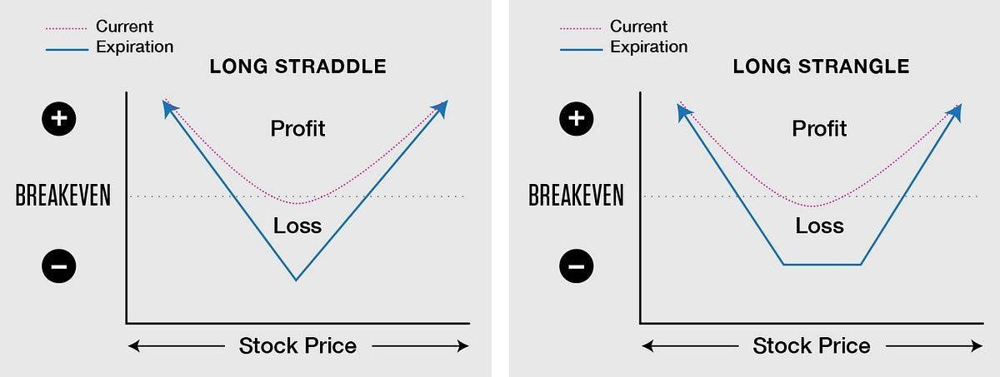

## Table of Contents

## What is a straddle options strategy?

A straddle options strategy involves buying both a call option and a put option on the same stock, with the same strike price and expiration date. The goal is to profit from a big move in the stock price, no matter which direction it goes. If the stock price goes up a lot, the call option will increase in value. If the stock price goes down a lot, the put option will increase in value. The strategy is useful when you expect a big change in the stock price but are unsure which way it will go.

However, a straddle strategy comes with risks. The main risk is that the stock price might not move enough in either direction before the options expire. If the stock price stays close to the strike price, both the call and put options could lose value, leading to a loss on the overall position. The cost of buying both options, known as the premium, is also a factor to consider. The stock price needs to move enough to cover this cost and generate a profit.

## What is a strangle options strategy?

A strangle options strategy is similar to a straddle, but it uses options with different strike prices. You buy a call option with a higher strike price and a put option with a lower strike price, both with the same expiration date. The idea is to make money if the stock price moves a lot, either up or down. Because the strike prices are further apart, a strangle is usually cheaper than a straddle, but it also needs a bigger move in the stock price to be profitable.

The main advantage of a strangle is that it costs less to set up than a straddle. This means you can start with less money. However, the trade-off is that the stock price needs to move more significantly for you to make a profit. If the stock price doesn't move enough before the options expire, you could lose the money you spent on the options. So, a strangle is a good choice if you think the stock will have a big move but you're not sure which way it will go, and you want to keep your initial costs down.

## How do the basic structures of straddle and strangle differ?

A straddle and a strangle are both options strategies that let you make money if a stock price moves a lot, but they have different setups. In a straddle, you buy a call option and a put option on the same stock, with the same expiration date and the same strike price. This means you think the stock will move a lot, but you're not sure if it will go up or down. The cost of a straddle can be higher because you're buying two options at the same strike price.

A strangle, on the other hand, also involves buying a call and a put option on the same stock with the same expiration date, but the strike prices are different. You buy the call option at a higher strike price and the put option at a lower strike price. This makes the strangle cheaper to set up than a straddle because the options are less expensive. However, for a strangle to be profitable, the stock price needs to move more significantly to cover the difference between the strike prices. Both strategies are used when you expect big moves in the stock price but are unsure of the direction.

## What are the key components needed to set up a straddle?

To set up a straddle, you need to buy both a call option and a put option on the same stock. Both options should have the same expiration date and the same strike price. This means you are betting that the stock price will move a lot, but you don't know if it will go up or down. The cost of setting up a straddle is the total of the premiums you pay for both the call and put options.

The main reason to use a straddle is if you think the stock will have a big move soon, but you're not sure which way it will go. If the stock price goes up a lot, the call option will become more valuable. If it goes down a lot, the put option will become more valuable. However, if the stock price doesn't move much, you could lose the money you spent on the options. So, a straddle is useful when you expect a big change but are unsure of the direction.

## What are the key components needed to set up a strangle?

To set up a strangle, you need to buy a call option and a put option on the same stock. Both options should have the same expiration date, but they will have different strike prices. You buy the call option at a higher strike price and the put option at a lower strike price. The cost of setting up a strangle is the total of the premiums you pay for both options.

The main reason to use a strangle is if you think the stock will have a big move soon, but you're not sure which way it will go. Because the strike prices are different, a strangle is usually cheaper than a straddle. However, for a strangle to make money, the stock price needs to move more than it would for a straddle. If the stock price doesn't move enough before the options expire, you could lose the money you spent on the options. So, a strangle is a good choice when you expect a big change but want to keep your initial costs down.

## Under what market conditions is a straddle most effective?

A straddle is most effective when you think a big event will make the stock price move a lot, but you're not sure if it will go up or down. This could be things like earnings reports, product launches, or big news that can shake up the market. When these events happen, the stock price can jump or drop quickly, and a straddle lets you make money no matter which way it goes.

However, the stock price needs to move enough to cover the cost of the straddle. If the stock price stays the same or doesn't move much, you could lose the money you spent on the options. So, a straddle works best when you're sure something big is coming that will cause a big change in the stock price, but you're not sure what that change will be.

## Under what market conditions is a strangle most effective?

A strangle is most effective when you think a big event will make the stock price move a lot, but you're not sure if it will go up or down. This could be things like earnings announcements, big news, or other events that can shake up the market. Because a strangle uses different strike prices, it's cheaper to set up than a straddle. This means you can get into the trade with less money, which is good if you're watching your costs.

However, for a strangle to make money, the stock price needs to move more than it would for a straddle. This is because the strike prices are further apart. If the stock price doesn't move enough before the options expire, you could lose the money you spent on the options. So, a strangle works best when you're sure something big is coming that will cause a big change in the stock price, but you're not sure what that change will be, and you want to keep your initial costs down.

## How do the risk profiles of straddle and strangle strategies compare?

A straddle and a strangle both let you make money if a stock price moves a lot, but they have different risk profiles. A straddle is riskier because it costs more to set up. You buy a call and a put option at the same strike price, so you pay more for the options. This means you need a bigger move in the stock price to cover the cost of the straddle. If the stock price doesn't move much, you could lose all the money you spent on the options.

A strangle is less risky in terms of the initial cost because you buy a call option at a higher strike price and a put option at a lower strike price. This makes the options cheaper, so you spend less money to start. However, a strangle needs an even bigger move in the stock price to make money. If the stock price doesn't move enough before the options expire, you could still lose the money you spent on the options. So, while a strangle has a lower initial cost, it requires a larger stock price movement to be profitable.

## What are the potential profit and loss scenarios for a straddle?

A straddle can make money if the stock price moves a lot in either direction. If the stock price goes up a lot, the call option you bought will become more valuable. You can sell it for a profit. If the stock price goes down a lot, the put option you bought will become more valuable, and you can sell it for a profit. The key is that the stock price needs to move enough to cover the cost of both options. If it does, you can make money no matter which way it goes.

On the other hand, a straddle can lose money if the stock price doesn't move much. If the stock price stays close to the strike price you chose, both the call and put options could lose value. When the options expire, they might be worth less than what you paid for them. In this case, you would lose the money you spent on the options. So, a straddle is risky because it needs a big move in the stock price to be profitable, and if that doesn't happen, you could lose your investment.

## What are the potential profit and loss scenarios for a strangle?

A strangle can make money if the stock price moves a lot in either direction. If the stock price goes up a lot, the call option you bought at a higher strike price will become more valuable, and you can sell it for a profit. If the stock price goes down a lot, the put option you bought at a lower strike price will become more valuable, and you can also sell it for a profit. The key is that the stock price needs to move enough to cover the cost of both options. Because the strike prices are different, the stock needs to move more than it would for a straddle to make money, but if it does, you can still profit no matter which way it goes.

On the other hand, a strangle can lose money if the stock price doesn't move much. If the stock price stays between the two strike prices you chose, both the call and put options could lose value. When the options expire, they might be worth less than what you paid for them. In this case, you would lose the money you spent on the options. So, a strangle is risky because it needs a big move in the stock price to be profitable, and if that doesn't happen, you could lose your investment.

## How does the cost to enter a straddle compare to a strangle, and why does this matter?

The cost to enter a straddle is usually higher than the cost to enter a strangle. This is because a straddle involves buying a call option and a put option at the same strike price. Since both options are at the same price, they tend to be more expensive. A strangle, on the other hand, uses different strike prices. You buy a call option at a higher strike price and a put option at a lower strike price, which makes each option cheaper. So, the total cost to set up a strangle is less than a straddle.

The difference in cost matters because it affects how much the stock price needs to move for you to make money. With a straddle, you need a big move in the stock price to cover the higher cost of the options. If the stock price doesn't move enough, you could lose the money you spent. A strangle is cheaper to start, so you don't need as big of a move to break even, but it still needs a bigger move than a straddle to make a profit because the strike prices are further apart. So, choosing between a straddle and a strangle depends on how much money you want to spend and how big of a move you expect in the stock price.

## What advanced considerations should be taken into account when choosing between a straddle and a strangle for an expert trader?

For an expert trader, choosing between a straddle and a strangle involves looking at more than just the cost and the size of the stock price move. One important thing to think about is how volatile the stock is. Volatility is how much the stock price goes up and down. If a stock is very volatile, a straddle might be better because it can make money even if the stock only moves a little. But if the stock is not very volatile, a strangle might be better because it's cheaper and can still make money if the stock makes a big move.

Another thing to consider is how much time is left until the options expire. If there's a lot of time left, a straddle might be better because it gives the stock more time to move. But if there's not much time left, a strangle might be better because it's cheaper and you need a big move quickly to make money. Also, expert traders might look at the "Greeks," which are measures like delta, gamma, theta, and vega. These help traders understand how the options will react to changes in the stock price, time, and [volatility](/wiki/volatility-trading-strategies). By thinking about these things, expert traders can pick the best strategy for their goals and the market conditions.

## What is the Strangle Strategy and how can it be explored?

A strangle strategy involves simultaneously purchasing a call option and a put option with different strike prices while sharing the same expiration date. This approach is particularly advantageous when a trader foresees a substantial price movement but is uncertain about the direction in which the market will move. Unlike a straddle, where both options share the same strike price, a strangle allows for flexibility in choosing out-of-the-money (OTM) strike prices for both the call and put options. 

Strangles tend to be less expensive compared to straddle strategies due to the inherent characteristics of options pricing. Specifically, the OTM options acquired in a strangle have lower premiums, making it a cost-effective choice for traders who are budget-conscious yet bullish on capturing volatility. When deploying a long strangle, profit is achieved if the asset’s price makes a significant move, either upward or downward, surpassing the combined cost of the premiums paid for both options. This means that for a strangle to be profitable, the underlying asset must move significantly beyond either of the selected strike prices by expiration.

The payoff for a long strangle can be represented by the following formula:

$$
\text{Profit} = \begin{cases} 
(V_U - C_{\text{call}} - C_{\text{put}}) \text{, if } V_U > K_{\text{call}} \\
(K_{\text{put}} - V_L - C_{\text{call}} - C_{\text{put}}) \text{, if } V_L < K_{\text{put}} \\
0 \text{, otherwise}
\end{cases}
$$

Where:
- $V_U$ and $V_L$ are the upper and lower values of underlying asset price.
- $K_{\text{call}}$ and $K_{\text{put}}$ are the strike prices for the call and put options, respectively.
- $C_{\text{call}}$ and $C_{\text{put}}$ are the premiums paid for the call and put options.

In summary, the strangle strategy capitalizes on volatility without tying the trader down to a specific price direction. By judiciously selecting OTM options, traders can limit initial costs while maintaining the potential for high returns during considerable market shifts. This makes it a valuable tool for capturing profits from significant market volatility, provided that the asset moves well outside the strike prices by the point of expiration.

## What are the key differences between a Straddle and a Strangle?

Both straddle and strangle strategies are designed to take advantage of market volatility, yet there are distinct differences in their mechanics and cost structures that traders need to understand to optimize their application.

Straddle strategies involve purchasing both a call and a put option with the same strike price and expiration date. This requirement inherently necessitates a higher initial investment since the options are at-the-money, meaning their strike price is at or near the current market price of the underlying asset. As a result, the premiums paid for both options in a straddle tend to be higher, reflecting the market's anticipation of potential price movement from the at-the-money position.

In contrast, a strangle strategy entails the purchase of a call and a put option with different strike prices, usually out-of-the-money, but with the same expiration date. Because the options are out-of-the-money, they are generally cheaper than those in a straddle. This results in a lower initial capital requirement for a strangle. However, the trade-off is that the underlying asset's price must move more substantially to either end of the spectrum—beyond the respective strike prices—for the strategy to yield a profit. In essence, strangle strategies demand a more pronounced movement in the market price for profitable outcomes compared to straddles.

To underscore their differences mathematically, consider the potential profit calculations for each strategy. For a straddle, the theoretical profit $P$ can be expressed as:

$$
P = \max(S - K - \text{Total Premium}, 0) + \max(K - S - \text{Total Premium}, 0)
$$

Where $S$ is the underlying asset price at expiration, $K$ is the strike price, and the `Total Premium` is the combined cost of both options.

Conversely, for a strangle:

$$
P = \max(S - K_{\text{call}} - \text{Total Premium}, 0) + \max(K_{\text{put}} - S - \text{Total Premium}, 0)
$$

Here, $K_{\text{call}}$ and $K_{\text{put}}$ represent the different strike prices for the call and put options, respectively.

Decisively, choosing between a straddle and a strangle hinges on the anticipated volatility and movement range in the market price. Traders must assess current market conditions and volatility levels to decide the most suitable strategy. In periods of expected high volatility with uncertainty regarding the direction of the move, a straddle might be advantageous despite its higher upfront cost due to its potentially lower breakeven points. On the other hand, if the projection includes significant price swings without directional bias but with a cost-conscious approach, executing a strangle may be more appropriate.

## References & Further Reading

[1]: Hull, J. C. (2017). ["Options, Futures, and Other Derivatives."](https://www.semanticscholar.org/paper/Options%2C-Futures%2C-and-Other-Derivatives-Hull/89bdee500c8623864fc9eb7a471546aa713acc44) Pearson Education.

[2]: Black, F., & Scholes, M. (1973). ["The Pricing of Options and Corporate Liabilities."](https://www.cs.princeton.edu/courses/archive/fall09/cos323/papers/black_scholes73.pdf) Journal of Political Economy, 81(3), 637-654.

[3]: Taleb, N. N. (1997). ["Dynamic Hedging: Managing Vanilla and Exotic Options."](https://www.amazon.com/Dynamic-Hedging-Managing-Vanilla-Options/dp/0471152803) Wiley.

[4]: Chance, D. M. (2013). ["An Introduction to Derivatives and Risk Management."](https://books.google.com/books/about/Introduction_to_Derivatives_and_Risk_Man.html?id=b8PgBQAAQBAJ) Cengage Learning.

[5]: Aldridge, I. (2013). ["High-Frequency Trading: A Practical Guide to Algorithmic Strategies and Trading Systems."](https://books.google.com/books/about/High_Frequency_Trading.html?id=6l0DDQAAQBAJ) Wiley.

[6]: Cartea, A., Jaimungal, S., & Penalva, J. (2015). ["Algorithmic and High-Frequency Trading."](https://assets.cambridge.org/97811070/91146/frontmatter/9781107091146_frontmatter.pdf) Cambridge University Press.