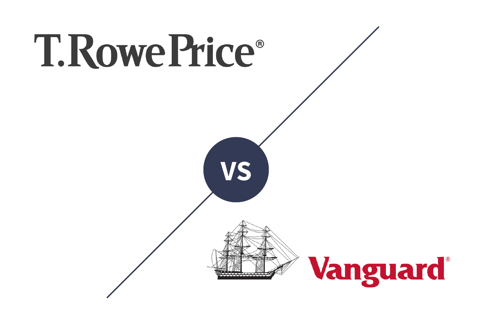

Investment options abound for individuals seeking portfolio diversification and growth, ranging from traditional stock and bond investments to more complex derivatives and managed funds. Each option carries its own risk profile and potential for returns, making the selection of an appropriate strategy crucial for long-term financial success. In this article, we focus on two prominent investment firms, Vanguard and T. Rowe Price, and explore the emergent role of algorithmic trading within the investing landscape. 

Vanguard, a pillar in the investment community, is renowned for its low-cost index funds and broad market exposure, catering to those who prefer a passive investment approach. T. Rowe Price, meanwhile, offers actively managed funds, with a focus on achieving superior returns through proactive investment decisions. These two institutions provide distinct strategies, reflecting differing philosophies on market engagement.

Alongside traditional methods, the role of technology in investment strategies is becoming increasingly significant. Algorithmic trading, which utilizes computer algorithms to execute complex trading strategies at high speeds, is transforming how individual and institutional investors navigate financial markets. By harnessing data and analytics, algorithmic trading offers the potential for increased efficiency and decision-making precision, while also posing unique challenges and risks that must be managed.

This article aims to provide a detailed comparison between Vanguard and T. Rowe Price, evaluating their respective strengths and the integration of algorithmic trading within their service offerings. Through this examination, readers will gain insights into which investment strategies may best align with their specific goals, while understanding the importance of technology in shaping the future of investing.

## Table of Contents

## Background on Vanguard

Vanguard, founded in 1975 by John C. Bogle, is a prominent investment management company known for its emphasis on low-cost, diversified investment options. Bogle's pioneering introduction of the first index mutual fund, the Vanguard 500 Index Fund, reshaped the investment landscape by making diversified portfolios accessible to the average investor. This trailblazing approach aligns with Vanguard's core investment philosophy of prioritizing investor returns through cost-effective management and passive investment strategies.

The mission of Vanguard centers on maximizing shareholder value by managing investments at the lowest possible cost. This philosophy is reflected in their wide array of products, which include index funds, exchange-traded funds (ETFs), and actively managed mutual funds. With a focus on transparency and long-term growth, Vanguard aims to provide a range of services tailored to meet the diverse financial goals of its clientele.

Key products offered by Vanguard span across various asset classes and investment styles, catering to both individual investors and institutional clients. One of the company’s flagship offerings, the Vanguard Total Stock Market Index Fund, enables investors to capture the broader U.S. stock market’s performance at low costs, exemplifying Vanguard's commitment to broad-market exposure and minimal expense ratios. Additionally, Vanguard’s Target Retirement Funds offer investors a way to achieve a diversified portfolio through lifecycle funds that automatically adjust asset allocation as the target retirement date approaches.

Investing with Vanguard offers several advantages, chief among them being the company’s strong reputation for integrity and fiduciary responsibility. Vanguard operates under a unique mutual ownership structure, where the company is owned by its funds, which in turn are owned by their investors. This structure eliminates the conflicts of interest commonly found in publicly traded companies, as any profits earned are returned to investors in the form of lower fees.

Vanguard enjoys a robust market reputation, bolstered by its commitment to delivering value to investors. With over 30 million investors globally as of 2023, Vanguard has established a substantial and loyal customer base. Its dedication to low-cost investing and transparent communication has earned it widespread acclaim, positioning it as a leader in the investment management industry.

The company’s customer base spans a diverse demographic, including individual investors, corporations, and retirement plans, all of whom benefit from Vanguard’s proven investment strategies and customer-centric focus. This exemplary market standing, combined with a steadfast adherence to their founding principles, continues to drive Vanguard's growth and reputation for trustworthiness in the financial sector.

## Overview of T. Rowe Price

T. Rowe Price was founded in 1937 by Thomas Rowe Price Jr., a pioneer in the field of growth investing. The firm established itself with a strong commitment to research-driven investment strategies and has grown to become a global asset management firm. Over the years, T. Rowe Price has expanded its reach and capabilities, managing a diverse range of investment portfolios for individuals, institutions, and retirement plans.

The investment approach of T. Rowe Price is characterized by active management, where experienced portfolio managers and analysts conduct extensive research to select securities that are expected to outperform the market. The guiding principle of T. Rowe Price is to consistently deliver superior investment results by maintaining a long-term perspective and adhering to disciplined investment processes. This approach emphasizes [fundamental analysis](/wiki/fundamental-analysis) to identify companies with potential for high earnings growth, competitive advantages, and sound management practices.

T. Rowe Price offers a wide array of products and services to meet the needs of various investors. These include mutual funds, retirement plans, separately managed accounts, and advisory services. The firm also provides investment solutions in different asset classes, such as equities, fixed-income, and multi-asset strategies. Notable for its focus on goal-oriented investing, T. Rowe Price offers tools and resources to help investors plan and achieve their financial objectives.

One of the strengths of T. Rowe Price is its consistent emphasis on research and its robust team of investment professionals. This foundation enables the firm to deliver informed insights and timely decisions that benefit their clients. Additionally, T. Rowe Price is distinguished by its client-centric approach, offering personalized service and support to help investors navigate complex financial landscapes.

T. Rowe Price is recognized for its strong reputation in the investment industry, with a loyal customer base encompassing individual investors, financial advisors, and institutional clients globally. The firm's commitment to ethical practices, transparency, and corporate responsibility further bolsters its popularity among clients who value trustworthy and dependable investment partners.

The firm's clientele appreciates the combination of comprehensive research, investment expertise, and client-centered service, making T. Rowe Price a prominent name in the asset management business. With a long-standing legacy and a forward-looking approach, T. Rowe Price continues to adapt to the changing dynamics of the financial world while maintaining its foundational investment philosophy.

## Understanding Algorithmic Trading

Algorithmic trading, commonly referred to as algo trading, involves the use of computer algorithms to execute trading orders. These algorithms analyze multiple market variables and conditions to generate trading signals, which are then executed at high speed with minimal human intervention. The core principle of [algorithmic trading](/wiki/algorithmic-trading) is to leverage computational power to identify optimal trading opportunities in financial markets, thereby enhancing decision-making efficiency.

**Role of Algorithms in Assisting Investment Decisions**

Algorithms are employed to analyze vast amounts of financial data that would be unmanageable for human traders. They use quantitative models to predict price movements and execute trades based on pre-set criteria. Common strategies implemented by algorithms include statistical [arbitrage](/wiki/arbitrage), mean reversion, and [trend following](/wiki/trend-following). By doing so, they offer traders opportunities to capitalize on market inefficiencies.

**Benefits of Algorithmic Trading for Individual Investors**

For individual investors, algorithmic trading offers several advantages:

1. **Speed and Accuracy**: Algorithms are able to analyze market conditions and execute trades in fractions of a second, far surpassing human capabilities. This can be particularly advantageous in markets where prices change rapidly.

2. **Backtesting**: Algorithms can be rigorously tested on historical data to evaluate their performance before they are deployed, offering investors insights into potential risks and returns.

3. **Reduced Emotion**: By automating transactions, algorithmic trading helps eliminate emotional influences on decision-making, which can lead to more rational investment choices.

4. **Cost Efficiency**: Automated trades can be executed without requiring continuous manual supervision, reducing the management costs associated with manual trading.

**Potential Risks and Considerations Associated with Algorithmic Trading**

Despite its benefits, algorithmic trading is not without risks:

1. **Technology Failures**: Technical glitches or failures in communication systems can result in significant trading losses. Therefore, robust infrastructure is key to mitigating such risks.

2. **Over-Optimization**: Algorithms developed through extensive backtesting may perform well on historical data but fail in real market scenarios due to overfitting.

3. **Market Impact**: Algorithms executing large volumes of trades may inadvertently influence market prices, especially in less liquid markets.

4. **Regulatory Risks**: The regulatory landscape for algorithmic trading is evolving, with increased scrutiny aimed at preventing market manipulation and ensuring fairness in trading practices.

**Current Trends and Future Outlook for Algorithmic Trading in Finance**

Algorithmic trading is becoming increasingly prevalent in the financial industry, aided by advancements in technology and data analytics. Current trends indicate a shift towards more sophisticated [machine learning](/wiki/machine-learning) models and [artificial intelligence](/wiki/ai-artificial-intelligence), enabling algorithms to learn and adapt to changing market conditions.

The integration of [alternative data](/wiki/best-alternative-data) sources, such as social media sentiment and satellite imagery, is enriching algorithms' inputs, potentially enhancing predictive accuracy. Furthermore, the use of cloud computing and blockchain technology promises to augment both the scalability and security of algorithmic trading platforms.

Looking forward, the trajectory of algorithmic trading points towards greater personalization, with bespoke algorithms tailored to individual investor preferences and risk profiles. As technology evolves, so too will the complexity and capability of algorithmic trading, representing a dynamic frontier in financial markets.

## Vanguard vs. T. Rowe Price: A Detailed Comparison

Vanguard and T. Rowe Price represent two prominent figures in the investment industry with distinct investment philosophies and strategies. This section provides a comprehensive comparison of these companies based on several critical factors.

### Investment Philosophies

Vanguard is renowned for its commitment to low-cost index investing. Its founder, John C. Bogle, pioneered the concept of passive investing, advocating that keeping costs low and investing in a diverse market index portfolio can lead to better long-term results for the average investor. This philosophy drives Vanguard to offer a wide array of index funds and ETFs that mirror market indices.

Conversely, T. Rowe Price has built its reputation on active management. The company emphasizes a rigorous research-driven investment approach, aiming to achieve superior returns by leveraging the expertise of seasoned fund managers to select high-potential securities. T. Rowe Price focuses on detailed company analysis, market trends, and economic indicators to actively curate their investment selections.

### Fee Structures and Cost-Effectiveness

Vanguard's business model is heavily focused on cost-effectiveness. The company is structured as a mutual fund with no outside owners, which allows it to pass cost savings directly to its investors. As a result, Vanguard is known for its low expense ratios, particularly for its index funds, which on average are significantly below industry norms.

T. Rowe Price, while competitive, generally presents higher fees associated with its actively managed funds. The rationale behind these fees is the intensive research and active management strategies employed to potentially outperform market benchmarks. However, T. Rowe Price has been proactive in adjusting its fees to remain competitive.

### Performance Metrics and Historical Returns

When evaluating performance metrics, Vanguard's passive strategy often leads to performance that is closely aligned with market indices. This strategy tends to outperform in efficient markets where active managers find it challenging to consistently beat the index after accounting for fees.

T. Rowe Price's active management has resulted in periods of both underperformance and outperformance compared to benchmarks. Historically, the company's actively managed funds have shown the potential for higher alpha, particularly in less efficient markets where active management can exploit inefficiencies.

### Customer Support and Service Features

Both Vanguard and T. Rowe Price offer robust customer support services, but there are notable differences in their customer interaction models. Vanguard provides comprehensive online resources, focusing on empowering self-directed investors with tools, calculators, and educational content. They also offer personal advisory services at a fee, integrating a human element with their digital platform.

T. Rowe Price, on the other hand, emphasizes personalized client service with a more traditional approach. Investors can access investment counselors for guidance and benefit from a tailored client experience, reflecting its premium service model intended to complement its actively managed products.

### Technological Integration in Investment Services

In terms of technological integration, Vanguard has significantly invested in digital transformation, enhancing its online platforms and mobile applications to facilitate user-friendly account management, trading, and performance tracking. Vanguard's technology strategy aligns with its focus on scalability and cost minimization.

T. Rowe Price also utilizes technology to enhance its investment offerings. The firm employs advanced analytical tools and data-driven insights in its research processes, augmenting its active management strategies. The client-facing platforms are designed to provide interactive portfolio analysis and access to proprietary research, blending technology with personalized investment solutions.

In conclusion, choosing between Vanguard and T. Rowe Price depends significantly on the investor’s preferences and goals. While Vanguard appeals to those seeking low-cost, passive investment solutions, T. Rowe Price caters to investors interested in active management potential with a more personalized service approach.

## Integrating Algorithmic Trading with Vanguard and T. Rowe Price

Vanguard and T. Rowe Price are two prominent investment companies, yet their positions on algorithmic trading differ due to their unique business models and customer bases.

**Current Offerings of Algorithmic Trading Tools**

Vanguard, traditionally known for its passive investment strategies, has been slower to incorporate algorithmic trading directly into its consumer-facing products. Vanguard focuses on low-cost index funds, which inherently rely on a form of algorithmic rules to track market indices, but these are not typically offered as customizable algorithmic tools for retail investors.

Conversely, T. Rowe Price, with its active management heritage, has shown a cautious interest in leveraging technology to enhance its portfolio management services. While not offering direct algorithmic trading platforms to consumers, T. Rowe Price employs quantitative approaches in its investment research and decision-making processes. These approaches involve utilizing algorithms for data analysis and strategy development, particularly in actively managed funds.

**Potential Synergies between Traditional Investment Strategies and Algorithmic Trading**

Traditional investment strategies, focusing on long-term growth and stability, can potentially benefit from the precision and speed of algorithmic trading. Algorithms can sift through vast datasets to identify trends and anomalies that may inform better decision-making. By embedding algorithms into traditional strategies, firms like Vanguard and T. Rowe Price could enhance the efficiency of portfolio rebalancing, tax-loss harvesting, and risk management.

For example, an algorithm might be employed to optimize asset allocation dynamically based on predicted market movements while adhering to the underlying investment philosophy of long-term growth and risk minimization.

**User Experiences and Testimonials**

User experiences and testimonials regarding algorithmic trading within these firms are limited, reflecting the nature of their current offerings. However, some clients appreciate T. Rowe Price's ability to blend quantitative research with active management, enhancing fund performance without the explicit use of direct-to-consumer trading algorithms. Vanguard's customer base largely values the company's focus on low fees and broad market access over advanced trading features.

**Technology's Role in Enhancing Investment Outcomes**

Both Vanguard and T. Rowe Price leverage technology to enhance investment outcomes by using sophisticated data analysis tools and risk management frameworks. These technologies allow for better market insight and operational efficiency. While they do not directly offer algorithmic trading platforms to individual investors, both companies utilize algorithmic insights to refine their investment processes internally.

Technological integration primarily manifests in enhanced data analytics capabilities, providing fund managers with deeper insights into market trends and potential investment opportunities. These enhanced insights can lead to more informed decision-making and potentially better investor outcomes.

**Challenges and Limitations**

Adopting algorithmic trading presents several challenges for both Vanguard and T. Rowe Price. These include the need for significant technological infrastructure, the risk of model overfitting, and the potential for increased [volatility](/wiki/volatility-trading-strategies) due to algorithm-driven trades. Additionally, these companies must ensure regulatory compliance, as algorithmic trading can attract scrutiny from financial authorities.

Moreover, the integration of algorithmic trading within a traditional investment framework requires careful consideration to maintain the core values and investment philosophies that define these firms. As such, while algorithmic trading offers promising synergies, successful adoption involves balancing innovation with the assurance of stability and adherence to long-term investment principles.

## Conclusion

In conclusion, the comparative analysis of Vanguard and T. Rowe Price in conjunction with algorithmic trading tools provides a multi-faceted perspective for investors aiming for portfolio diversification and growth. Vanguard's strengths lie in its low-cost index funds and ETFs, appealing to cost-conscious, passive investors seeking a long-term approach. In contrast, T. Rowe Price is distinguished by its active management philosophy and a wide array of mutual funds, attracting investors interested in personalized, actively managed portfolios.

For investors with specific needs and goals, Vanguard may be ideal for those focused on minimizing expenses and comfortable with broad market exposure. Conversely, investors looking for active management and specialized strategies might find T. Rowe Price’s offerings more aligned with their objectives. Incorporating algorithmic trading presents an opportunity to enhance investment strategies with precision and efficiency. However, it is crucial to assess personal risk tolerance and investment knowledge before leveraging such tools.

The fusion of traditional investing with algorithmic trading symbolizes a shift towards modern finance, presenting prospects for improved decision-making and performance. It is vital for investors to remain informed about market changes and technology advancements, as these can significantly impact investment outcomes. Regularly reviewing recent developments and research ensures alignment with evolving market conditions and technology trends.

Thorough research remains paramount before making investment decisions. Investors are encouraged to explore various investment platforms, comprehend the associated risks, and evaluate service offerings to select a strategy that aligns best with their financial goals. Consistent due diligence not only aids in achieving investment success but also in mitigating potential pitfalls in an ever-changing financial landscape.

## References & Further Reading

[1]: Bergstra, J., Bardenet, R., Bengio, Y., & Kégl, B. (2011). ["Algorithms for Hyper-Parameter Optimization."](https://dl.acm.org/doi/10.5555/2986459.2986743) Advances in Neural Information Processing Systems 24.

[2]: ["Advances in Financial Machine Learning"](https://www.amazon.com/Advances-Financial-Machine-Learning-Marcos/dp/1119482089) by Marcos Lopez de Prado

[3]: Bogle, J. C. (1999). ["Common Sense on Mutual Funds: New Imperatives for the Intelligent Investor."](https://www.amazon.com/Common-Sense-Mutual-Funds-Imperatives/dp/0471392286) Wiley.

[4]: ["Evidence-Based Technical Analysis: Applying the Scientific Method and Statistical Inference to Trading Signals"](https://www.amazon.com/Evidence-Based-Technical-Analysis-Scientific-Statistical/dp/0470008741) by David Aronson

[5]: Rowe Price, T. (1999). ["T. Rowe Price: The Man, The Company, and The Investment Philosophy."](https://www.amazon.com/T-Rowe-Price-Investment-Philosophy/dp/1119531268) McGraw-Hill.

[6]: ["Machine Learning for Algorithmic Trading"](https://github.com/PacktPublishing/Machine-Learning-for-Algorithmic-Trading-Second-Edition) by Stefan Jansen

[7]: ["Quantitative Trading: How to Build Your Own Algorithmic Trading Business"](https://books.google.com/books/about/Quantitative_Trading.html?id=j70yEAAAQBAJ) by Ernest P. Chan