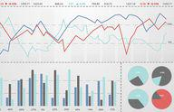

Investing presents a complex landscape filled with an array of strategies and products, some of the most popular being target-date funds, S&P 500 indexing, and algorithmic trading. Understanding these options is crucial, as each comes with its own set of features and benefits tailored to different investment goals and risk appetites. Target-date funds are designed to cater to individuals planning for retirement, adjusting their asset allocation progressively as a specified target date nears. This gradual shift towards a more conservative investment stance offers convenience for those seeking a hands-off investment approach.

In contrast, S&P 500 indexing offers a straightforward method of investing by providing exposure to 500 of the largest companies in the U.S. This passive investment strategy is characterized by its low fees and is constructed to closely mirror the overall market performance. Its historical robustness makes it an attractive option for investors aiming for broad market exposure with minimal management.



Algorithmic trading, by leveraging technology to execute trades based on predetermined criteria, introduces an avenue to exploit market efficiencies and execute complex trading strategies. This high-tech approach demands significant technical knowledge and capital, making it suitable for investors who are comfortable with technology and have a higher risk tolerance.

This article will guide you through a comparative analysis of these investment strategies, enabling a clearer understanding of their respective strengths, weaknesses, and suitability for various investor profiles. By equipping yourself with this knowledge, you can make informed decisions that align with your financial goals and risk preferences.

## Table of Contents

## Understanding Target-Date Funds

Target-date funds are a popular investment option for individuals saving for retirement as they are structured to adjust their asset allocation over time based on a predetermined retirement date, known as the target date. These funds aim to provide a well-diversified portfolio that gradually shifts from higher-risk investments, like stocks, to lower-risk investments, such as bonds, as the target date approaches. This transition reflects a reduction in risk exposure, aligning with the retirement planning strategy that generally advises a more conservative approach as one nears retirement age.

The primary benefit of target-date funds is their convenience. Investors can simply pick a fund with a target date close to their expected retirement date and rely on the fund managers to adjust the investment mix over time. This hands-off approach is particularly appealing to individuals who prefer not to manage their investments actively or lack the investment expertise to make complex asset allocation decisions.

However, these funds often operate under a 'fund of funds' structure, meaning they invest in a variety of other mutual funds or ETFs. This can lead to higher fees compared to investing directly in individual funds, as investors may be charged both the management fees of the underlying funds and an additional layer of fees for the target-date fund itself.

Target-date funds are best suited for hands-off investors who prefer a simple solution for retirement saving that automatically implements a gradual decrease in risk exposure. Although they provide a level of ease and automated management, potential investors should be mindful of the associated costs and consider how these might impact their long-term accumulation of retirement savings.

## Diving into S&P 500 Indexing

The S&P 500 Indexing is a prominent investment strategy designed to give investors exposure to 500 of the largest publicly traded companies in the United States. As a passive investment approach, it focuses on replicating the performance of the S&P 500 Index—a widely regarded benchmark that represents approximately 80% of the total value of the U.S. stock market. The index itself comprises sectors ranging from technology and healthcare to financials and consumer goods, thus providing investors broad market exposure.

One of the defining features of S&P 500 Indexing is its cost-effectiveness. Since it is passively managed, the fees associated with managing an S&P 500 index fund are generally lower than those of actively managed funds. This is because passive funds aim to track an index's performance rather than outperform it, resulting in reduced management and operational costs.

Historically, the S&P 500 has demonstrated considerable robustness, contributing to its status as a preferred choice for investors. Over decades, it has reflected the long-term growth trends of the U.S. economy, delivering relatively consistent returns. This mathematical stability can attract investors looking for predictable and steady growth. The expected return of an S&P 500 index fund can be estimated using models like the Capital Asset Pricing Model (CAPM), represented as:
$$
E(R_i) = R_f + \beta_i (E(R_m) - R_f)
$$
where $E(R_i)$ is the expected return of the index fund, $R_f$ is the risk-free rate, $\beta_i$ is the beta of the index fund compared to the market, and $E(R_m)$ is the expected return of the market.

The advantage of minimal management makes S&P 500 indexing especially appealing for investors who prefer a hands-off investment strategy. By holding a diversified portfolio of large-cap stocks, one gains the benefits of broader market participation while avoiding the complexities involved in individual stock selection. This passive approach implies a long-term investment horizon, aligning with the belief that despite short-term [volatility](/wiki/volatility-trading-strategies), markets tend to rise over the long term.

In summary, S&P 500 Indexing offers a strategic entry into the U.S. equity market with reduced fees and management activities. By mirroring the overall market performance, it serves as an ideal investment route for individuals seeking comprehensive market exposure.

## Algorithmic Trading: An Overview

Algorithmic trading, a groundbreaking approach in modern finance, relies on computer systems to execute trades based on predefined conditions. This method leverages speed, efficiency, and precision by processing vast amounts of market data without direct human intervention. The foundation of [algorithmic trading](/wiki/algorithmic-trading) is its ability to execute operations at a pace and [volume](/wiki/volume-trading-strategy) unreachable by manual trading methods.

Central to algorithmic trading are algorithms—mathematical models or sets of rules designed to make trading decisions and execute them. These algorithms assess market conditions, detect patterns, and decide when and how to trade to achieve optimal market positioning. The advantage lies in their capability to process information and react instantaneously, capitalizing on transient market opportunities.

Algorithmic trading strategies can vary significantly in complexity and purpose. Strategies might include statistical [arbitrage](/wiki/arbitrage), which exploits price discrepancies between correlated securities, or [trend following](/wiki/trend-following), which finds positions based on the [momentum](/wiki/momentum) of asset prices. The adaptability of algorithms allows traders to implement these strategies across various asset classes, from equities and commodities to foreign exchange markets.

The primary appeal of algorithmic trading is exploiting market inefficiencies, thus potentially achieving higher returns. However, this pursuit often demands substantial technical expertise and significant financial capital. Successful algorithmic traders must possess a solid understanding of both programming and quantitative analysis. They typically work in languages such as Python, renowned for its simplicity and robust libraries like NumPy and pandas, which are essential tools for data analysis and manipulation.

For instance, a basic algorithmic trading strategy might involve creating a simple moving average crossover system, which is a common method used to identify potential buy and sell signals. The code snippet below illustrates a simplified version of this strategy in Python:

```python
import pandas as pd

# Example data frame with stock prices
data = pd.DataFrame({'Price': [...], 'Date': [...]})

# Calculate moving averages
data['SMA_20'] = data['Price'].rolling(window=20).mean()
data['SMA_50'] = data['Price'].rolling(window=50).mean()

# Generate trading signals
data['Signal'] = 0
data.loc[data['SMA_20'] > data['SMA_50'], 'Signal'] = 1
data.loc[data['SMA_20'] < data['SMA_50'], 'Signal'] = -1

# Display buy/sell signals
print(data[['Date', 'Signal']])
```

Algorithmic trading's intricacies imply that while it offers substantial opportunities, it also presents heightened risks, notably associated with system failures and unforeseen market conditions. Algorithmic trading is best suited for tech-savvy investors eager to embrace the rapid shifts and challenges of financial markets, prepared to invest in the necessary infrastructure and continuously refine their strategies in response to market developments.

## Comparative Analysis: Pros and Cons

When comparing target-date funds, S&P 500 indexing, and algorithmic trading, each strategy presents unique advantages and drawbacks tailored to different investor profiles and goals. 

Target-date funds provide investors with the convenience of a set-and-forget investment strategy. These funds automatically adjust their asset allocation as the target retirement date approaches, gradually becoming more conservative to safeguard accumulated wealth. This convenience, however, often comes at the cost of higher fees, typical of the "fund of funds" structure in which they operate. The fee structure can impact net returns over time, making it crucial for investors to weigh this against the hands-off approach that target-date funds offer.

S&P 500 indexing, on the other hand, provides low-cost diversification by investing in a basket of 500 of the largest U.S. companies. This approach is widely regarded as a low-fee passive investment strategy, mirroring the overall performance of the U.S. stock market. Historically, the S&P 500 has demonstrated robustness and consistent returns, making it an ideal choice for those seeking broad market exposure without the need for active management. Investors benefit from the simplicity and cost-effectiveness of these funds, with expense ratios typically lower than those of actively managed funds.

Algorithmic trading represents a more complex investment vehicle that capitalizes on computer algorithms to execute trades based on predefined criteria. This strategy offers the potential for higher returns by exploiting market inefficiencies and leveraging speed of execution. However, this potential comes with the need for significant technical knowledge and capital. The complexity of algorithmic trading requires sophisticated risk management systems and a deep understanding of the markets. It is best suited for tech-savvy investors comfortable with greater risk exposure in pursuit of superior returns.

In making a choice among these strategies, investors must consider their individual investment goals and risk tolerance. Target-date funds are suitable for those seeking simplicity and automatic adjustments over time, while S&P 500 indexing appeals to those looking for low-cost, broadly diversified market exposure. Algorithmic trading is ideal for those who have expertise in technology and are willing to actively manage and monitor their investments.

Diversification can enhance investment portfolios, potentially mitigating risks associated with any single investment strategy. By integrating elements from each of these approaches, investors can achieve a well-rounded portfolio that aligns with their financial objectives and risk profiles. Balancing target-date funds' ease, S&P 500's stable performance, and algorithmic trading's innovative potential can offer a comprehensive investment solution.

## Special Considerations

All investment strategies involve a degree of risk and necessitate thorough due diligence. Understanding these aspects is essential to making informed investment choices. Fees, market conditions, and personal financial goals are critical factors in deciding on an investment strategy. While historical performance data can provide insights, it's important to remember that it does not guarantee future results.

Investors should carefully evaluate the fee structures associated with each investment option, as these can significantly impact overall returns. For instance, target-date funds often come with higher fees due to their 'fund of funds' structure, where multiple underlying funds are managed. Conversely, S&P 500 indexing usually offers lower fees, given its passive nature. Algorithmic trading, meanwhile, might involve variable costs related to technological infrastructure and execution fees.

Market conditions also play a crucial role in determining investment outcomes. Economic indicators, geopolitical events, and monetary policies can influence markets and require investors to remain vigilant and adaptive. Algorithmic trading, for example, relies on market timing and data analysis, which can be affected by rapid market changes.

Personal financial goals should guide an investor's choice of strategy. Some investors may prioritize stability and predictability over potential high returns, making options like target-date funds or S&P 500 indexing more suitable. Others willing to take on more risk for the possibility of higher returns might consider algorithmic trading.

Consulting with a financial advisor is recommended to develop a strategy tailored to one's specific needs and circumstances. An advisor can provide comprehensive insights and suggest investment options that align with an individual's risk tolerance, time horizon, and financial objectives.

Staying informed about market trends and regulatory changes is critical to maintaining a successful investment strategy. Changes in regulations can impact the feasibility and legality of certain trading practices or investment vehicles. Regularly reviewing and adjusting one's portfolio is advisable to ensure it continues to meet evolving personal and market conditions.

In conclusion, successful investment requires a well-considered approach that balances risk, cost, and strategic objectives with awareness of changing market dynamics and regulations.

## Conclusion

Investment selection is a personal decision that requires careful consideration of individual financial goals, risk tolerance, and investment knowledge. The choice of investment strategy—whether it be target-date funds, S&P 500 indexing, or algorithmic trading—should align with these personal factors.

Target-date funds cater to those planning for specific financial milestones, such as retirement. By adjusting the asset allocation to become more conservative over time, they provide a hands-off approach for investors seeking to reduce risk exposure as they approach the target date. This strategy is particularly advantageous for those who prioritize convenience and a structured plan, despite the potentially higher fees associated with a fund-of-funds structure.

S&P 500 indexing offers a passive investment approach with the benefit of low management fees and broad market exposure. By mimicking the performance of 500 of the largest U.S. companies, it provides consistent historical returns. This option is ideal for investors looking for simplicity and diversification without the need for active management.

Algorithmic trading appeals to tech-savvy investors, leveraging computer algorithms to capitalize on market inefficiencies with speed and precision. It can offer substantial rewards but also requires significant expertise, technical infrastructure, and an appetite for higher risk.

Understanding the distinct advantages of each strategy can empower investors to make informed decisions that suit their financial situations. While no single strategy fits all needs uniformly, incorporating elements from multiple strategies can enhance diversification. This can be achieved by combining different approaches to spread risk and optimize returns.

Regular portfolio reviews are also crucial. They ensure that investment strategies remain aligned with changing personal goals and market conditions. By staying informed and adaptable, investors can navigate the ever-evolving financial landscape more effectively and achieve their long-term objectives.

## References & Further Reading

[1]: ["Target-Date Funds: A Comprehensive Analysis of the Glide Path," T. Walker](https://financefacts101.com/understanding-glide-paths-in-target-date-funds-a-comprehensive-guide-for-professional-investors/) - CFA Institute Research Foundation.

[2]: ["Common Sense on Mutual Funds: Fully Updated 10th Anniversary Edition"](https://www.amazon.com/Common-Sense-Mutual-Funds-Anniversary/dp/B08ZBJQTMP) by John C. Bogle

[3]: ["A Random Walk Down Wall Street: The Time-Tested Strategy for Successful Investing"](https://www.amazon.com/Random-Walk-Down-Wall-Street/dp/0393358380) by Burton G. Malkiel

[4]: ["Algorithmic Trading and DMA: An Introduction to Direct Access Trading Strategies"](https://archive.org/details/algorithmictradi0000john) by Barry Johnson

[5]: ["Algorithmic Trading: Winning Strategies and Their Rationale"](https://www.amazon.com/Algorithmic-Trading-Winning-Strategies-Rationale-ebook/dp/B00CY5HC0U) by Ernie Chan