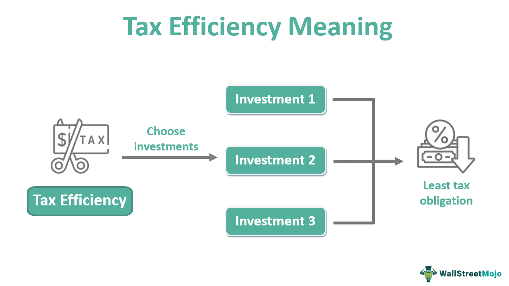

## Table of Contents

## What is a tax efficiency in the context of investments?

Tax efficiency in the context of investments refers to how much an investor can keep after taxes are taken out of their investment earnings. When you invest in things like stocks, bonds, or mutual funds, you might earn money through interest, dividends, or selling the investment for a profit. However, the government requires you to pay taxes on these earnings. The goal of tax efficiency is to minimize the amount of taxes you have to pay, so you get to keep more of your investment returns.

Different types of investments are taxed differently. For example, long-term capital gains, which are profits from selling investments held for more than a year, usually have lower tax rates than short-term gains, which are profits from investments held for less than a year. Also, certain accounts like Individual Retirement Accounts (IRAs) or 401(k)s offer tax advantages, such as tax-deferred growth or tax-free withdrawals. By choosing the right types of investments and accounts, investors can reduce their tax burden and increase their overall returns.

## How do ETFs and mutual funds differ in their basic structure?

ETFs, or Exchange-Traded Funds, and mutual funds are both types of investment funds that pool money from many investors to buy a variety of assets like stocks, bonds, or commodities. The main difference in their basic structure is how they are bought and sold. ETFs trade on stock exchanges just like individual stocks. This means you can buy and sell them throughout the trading day at the current market price. On the other hand, mutual funds are bought and sold directly from the fund company at the end of each trading day, based on the fund's net asset value (NAV).

Another difference is in how they are managed. ETFs often track an index, like the S&P 500, and aim to replicate its performance. This makes them passively managed, which usually results in lower expense ratios. Mutual funds can be either actively or passively managed. Actively managed mutual funds have a manager who tries to beat the market by [picking](/wiki/asset-class-picking) specific investments, which can lead to higher fees. Passively managed mutual funds, similar to ETFs, track an index but might still have higher fees than ETFs due to their structure.

## What are the main tax advantages of ETFs over mutual funds?

ETFs often have tax advantages over mutual funds because of how they are structured. When you own an [ETF](/wiki/etf-trading-strategies), you usually don't have to worry about paying taxes until you sell your shares. This is because ETFs use a special process called "in-kind" transactions to manage their portfolios. This means they can swap securities without selling them, which avoids triggering capital gains taxes that would have to be passed on to investors.

On the other hand, mutual funds often have to sell securities to meet investor redemptions, which can create capital gains that are then distributed to all shareholders, even if they didn't sell any shares themselves. These distributions are taxable events for the investors, even if they reinvest the money back into the fund. So, ETFs can be more tax-efficient because they are less likely to create these taxable events for their investors.

## Can you explain the concept of capital gains distributions in mutual funds?

Capital gains distributions in mutual funds happen when the fund sells investments for a profit. When a mutual fund sells a stock or bond that has gone up in value, it makes a capital gain. If the fund manager decides to sell enough of these investments, they have to share that profit with all the people who own shares in the fund. This sharing of profits is called a capital gains distribution. It's important to know that these distributions are usually made once a year, often at the end of the year.

When you get a capital gains distribution from a mutual fund, you have to pay taxes on it, even if you didn't sell any of your own shares in the fund. This can be a surprise for some people because they might not expect to owe taxes without selling anything themselves. The tax you pay depends on how long the fund held the investment before selling it. If the fund held it for more than a year, it's called a long-term capital gain and is taxed at a lower rate. If it was held for less than a year, it's a short-term capital gain and is taxed at your regular income tax rate.

## How do ETFs minimize capital gains distributions?

ETFs minimize capital gains distributions by using a special method called "in-kind" transactions. This means that instead of selling securities to meet investor redemptions like mutual funds do, ETFs can swap securities with big investors called authorized participants. When these big investors want to redeem their ETF shares, the ETF gives them securities instead of cash. This way, the ETF doesn't have to sell the securities and create capital gains that would be passed on to all shareholders.

Because of this in-kind process, ETFs can change their holdings without triggering taxable events for their investors. This makes ETFs more tax-efficient than mutual funds, which often have to sell securities to pay out investors who want their money back. By avoiding these sales, ETFs help investors keep more of their money by reducing the need for capital gains distributions.

## What role does the creation and redemption process play in the tax efficiency of ETFs?

The creation and redemption process is a big reason why ETFs are more tax-efficient than mutual funds. When someone wants to buy or sell a lot of shares in an ETF, they work with big investors called authorized participants. These authorized participants can create new ETF shares by giving the ETF a bunch of securities, or they can redeem ETF shares by getting securities back from the ETF. This swapping of securities is called an "in-kind" transaction.

Because of these in-kind transactions, the ETF doesn't have to sell its securities to give money to someone who wants to sell their shares. If the ETF sold securities, it might make a profit, and that profit would have to be shared with all the ETF's investors as a capital gains distribution, which they would have to pay taxes on. By using in-kind transactions instead, the ETF can change what it owns without making those taxable profits, so investors can keep more of their money.

## How does the turnover rate affect the tax efficiency of ETFs and mutual funds?

The turnover rate is how often a fund buys and sells its investments. A high turnover rate means the fund is trading a lot, which can lead to more taxes for investors. When a fund sells an investment for a profit, it has to share that profit with all its investors as a capital gains distribution. These distributions are taxable, so a fund with a high turnover rate might end up giving investors more tax bills. ETFs usually have lower turnover rates than actively managed mutual funds because they often track an index and don't need to trade as much.

ETFs benefit from lower turnover rates because they use "in-kind" transactions to change their holdings without selling securities. This means they can swap securities with big investors instead of selling them, which helps avoid creating capital gains that would be taxable for all investors. On the other hand, mutual funds, especially those that are actively managed, might have higher turnover rates because their managers are trying to beat the market by picking different investments. This active trading can lead to more sales of securities, which can trigger more capital gains distributions and higher taxes for investors.

## What are the tax implications of dividend payments in ETFs versus mutual funds?

When it comes to dividend payments, both ETFs and mutual funds can pay out dividends to their investors. These dividends come from the earnings of the stocks or other investments the fund holds. The tax you pay on these dividends depends on whether they are classified as qualified or non-qualified dividends. Qualified dividends are taxed at the lower capital gains tax rate, while non-qualified dividends are taxed at your regular income tax rate. Both ETFs and mutual funds can have qualified and non-qualified dividends, so the tax implications are similar in this regard.

However, there's a small difference that might affect how much tax you pay on dividends from ETFs versus mutual funds. ETFs are often more tax-efficient because they have lower turnover rates and use "in-kind" transactions. This means they might distribute fewer non-qualified dividends compared to actively managed mutual funds, which could lead to a slightly lower tax bill for ETF investors. But overall, the tax you pay on dividends from ETFs and mutual funds is pretty much the same, depending on whether the dividends are qualified or not.

## How do wash sale rules impact the tax efficiency of ETFs and mutual funds?

Wash sale rules can affect the tax efficiency of both ETFs and mutual funds, but they work a bit differently for each. A wash sale happens when you sell an investment at a loss and buy the same or a "substantially identical" investment within 30 days before or after the sale. If you do this, you can't claim the loss on your taxes right away. For ETFs, it's usually easier to avoid wash sales because there are many different ETFs that track similar indexes but aren't considered "substantially identical." This means you can sell one ETF at a loss and buy another similar one without triggering a wash sale.

For mutual funds, it can be trickier to avoid wash sales because there are fewer options that are different enough to not be considered "substantially identical." If you sell a mutual fund at a loss and buy the same or a very similar one within the 30-day window, you'll have to delay claiming that loss. This can make mutual funds less tax-efficient if you're trying to use tax-loss harvesting strategies. Overall, the flexibility of ETFs can help investors manage their taxes better by avoiding wash sales more easily than with mutual funds.

## What are the advanced strategies investors can use to enhance tax efficiency in ETFs?

One advanced strategy to enhance tax efficiency in ETFs is tax-loss harvesting. This means selling an ETF that has gone down in value to realize a loss, which you can use to reduce your taxes. After selling, you can buy a different but similar ETF to keep your investment strategy the same. Because there are many ETFs that track similar indexes, you can easily switch without running into wash sale rules. This way, you can lower your tax bill while still staying invested in the market.

Another strategy is to use ETFs in tax-advantaged accounts like IRAs or 401(k)s. When you put ETFs in these accounts, you don't have to pay taxes on the dividends or capital gains until you take the money out. This can be really helpful for ETFs that might distribute dividends or capital gains, because you can let your investments grow without worrying about taxes each year. By using these accounts smartly, you can make your ETF investments even more tax-efficient.

## How does the holding period of investments in ETFs and mutual funds influence tax outcomes?

The holding period of investments in ETFs and mutual funds can make a big difference in how much tax you have to pay. If you hold an investment for more than a year before selling it, any profit you make is called a long-term capital gain. Long-term capital gains are taxed at a lower rate than short-term gains, which are profits from investments you've held for less than a year. So, if you keep your ETFs or mutual funds for over a year, you'll usually pay less tax when you sell them.

Both ETFs and mutual funds can benefit from this lower tax rate if you hold them long enough. But ETFs might be a bit more tax-efficient overall because they often have lower turnover rates and use "in-kind" transactions, which can help you avoid some taxes while you're holding them. Still, the main thing to remember is that holding onto your investments for more than a year can save you money on taxes, no matter if you're investing in ETFs or mutual funds.

## What are the latest regulatory changes affecting the tax efficiency of ETFs and mutual funds?

Recently, there haven't been many big changes in the rules that affect how taxes work for ETFs and mutual funds. But, the government always keeps an eye on these things, and any new rules can change how much tax you have to pay. For example, changes in tax rates or new rules about how capital gains are treated can make a difference. It's important for investors to stay updated on any new laws or rules because they can affect how much money you keep from your investments.

One thing to watch out for is how the rules about "in-kind" transactions for ETFs might change. These special trades help ETFs avoid taxes that mutual funds can't avoid as easily. If the rules around these trades change, it could make ETFs less tax-efficient. Also, any changes in the rules about retirement accounts like IRAs or 401(k)s can affect how you use ETFs and mutual funds to save on taxes. Keeping an eye on these changes can help you plan your investments better and keep more of your money.

## What are some case studies and examples?

To provide a clearer understanding of how mutual funds and ETFs perform in terms of tax efficiency, let's examine several case studies and examples. 

### Example 1: Tax Efficiency of ETFs vs. Mutual Funds

Consider the tax-cost ratios of an actively managed mutual fund versus a passively managed ETF. Tax-cost ratio is a measure of how much an investor’s annualized returns are reduced by taxes. It's calculated as follows:

$$
\text{Tax-Cost Ratio} = \left(1 - \frac{\text{After-Tax Return}}{\text{Pre-Tax Return}}\right) \times 100
$$

**Mutual Fund Example:** A mutual fund with frequent trading often generates capital gains distributions. Suppose a mutual fund has a pre-tax return of 8% and an after-tax return of 6.4%, yielding a tax-cost ratio of:

$$
\text{Tax-Cost Ratio} = \left(1 - \frac{6.4}{8}\right) \times 100 = 20\%
$$

**ETF Example:** Conversely, an ETF that tracks an index may have less frequent capital gains distributions. For an ETF with a pre-tax return of 8% and an after-tax return of 7.6%, the tax-cost ratio is:

$$
\text{Tax-Cost Ratio} = \left(1 - \frac{7.6}{8}\right) \times 100 = 5\%
$$

This illustrates ETFs often have a lower tax-cost ratio, indicating higher tax efficiency.

### Example 2: Algorithmic Trading and Tax Efficiency

Algorithmic trading uses programmed instructions to execute trades that can enhance tax efficiency. Consider a trading strategy designed to minimize taxes by avoiding the realization of short-term gains, which are taxed at a higher rate than long-term gains. Algorithms can be programmed to identify and execute such trades efficiently.

### Example 3: Real-World Mutual Fund and ETF Comparisons

**Vanguard Tax-Managed Fund vs. iShares Core S&P 500 ETF:**

1. **Vanguard Tax-Managed Fund:** Designed to minimize capital gains through strategies such as loss harvesting. The fund managers aim to only realize capital gains at the long-term rate. Its tax efficiency is a major selling point for high-net-worth investors.

2. **iShares Core S&P 500 ETF (IVV):** Part of the popular S&P 500 ETFs, it minimizes distributions through in-kind redemptions. The ETF structure inherently allows for tax advantages, often resulting in superior after-tax returns compared to actively managed mutual funds.

These examples highlight the practical implications of tax efficiency in mutual funds and ETFs, especially when enhanced through algorithmic strategies. By analyzing tax-cost ratios and employing sophisticated trading techniques, investors can significantly improve their after-tax returns.

## References & Further Reading

[1]: ["The ETF Book: All You Need to Know About Exchange-Traded Funds"](https://www.amazon.com/ETF-Book-About-Exchange-Traded-Funds/dp/0470537469) by Richard A. Ferri

[2]: Poterba, J. M., & Shoven, J. B. (2002). ["Exchange-Traded Funds: A New Investment Option for Taxable Investors"](https://economics.mit.edu/sites/default/files/publications/Exchange-Traded%20Funds%20A%20New%20Investment%20Option.pdf). National Bureau of Economic Research.

[3]: ["Common Wealth: ETFs and Index Funds"](https://www.fool.com/investing/how-to-invest/index-funds/best-index-funds/) by Vanguard Group.

[4]: Arnott, R. D., Berkin, A. L., & Ye, J. C. (2001). ["Tax-Efficient Equity Investing: Solutions for Maximizing After-Tax Returns"](https://www.pm-research.com/content/iijwealthmgmt/3/4/10.full.pdf). Financial Analysts Journal, 57(2), 28-40.

[5]: ["Algorithmic Trading and DMA: An Introduction to Direct Access Trading Strategies"](https://www.semanticscholar.org/paper/Algorithmic-trading-%26-DMA-%3A-an-introduction-to-Johnson/aa5de1ab883d5e23b6651faa7c1807586d688e4b) by Barry Johnson.