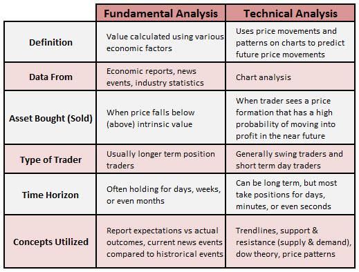

## Table of Contents

## What is technical analysis?

Technical analysis is a way to look at past price movements and trading volumes of things like stocks or cryptocurrencies to predict what might happen to their prices in the future. People who use technical analysis believe that by studying charts and patterns, they can make better guesses about whether a price will go up or down. They use tools like moving averages, trend lines, and different types of charts to help them see these patterns more clearly.

This method is different from fundamental analysis, which looks at the actual value of a company or asset based on its financial health, management, and market conditions. Technical analysts focus more on the psychology of the market and the behavior of other traders, rather than the underlying value of the asset itself. While some people swear by technical analysis and use it to make trading decisions, others think it's more like trying to predict the future and can be unreliable.

## What is fundamental analysis?

Fundamental analysis is a way to figure out if a stock or any other investment is a good buy by looking at the real value of the company or asset. It's like checking the health of a company by looking at things like how much money it makes, how much it owes, and how well it's run. People who do fundamental analysis study financial statements, look at how the company is doing compared to others in the same field, and think about things like the economy and industry trends. They want to know if the price of the stock is a fair deal based on what the company is really worth.

This kind of analysis is different from technical analysis, which only looks at past price movements and charts. Fundamental analysts believe that the price of a stock will eventually match its true value, so they try to find stocks that are priced lower than they should be. By doing a lot of research and using numbers to guide them, they hope to pick investments that will grow in value over time. It's a bit like shopping for a good deal – you want to buy something when it's on sale, knowing it's worth more than you're paying.

## How do technical and fundamental analysis differ in their approach to evaluating investments?

Technical and fundamental analysis are two different ways to look at investments. Technical analysis focuses on studying past price movements and trading volumes of stocks or other assets. People who use this method believe they can predict future price changes by looking at charts and patterns. They use tools like moving averages and trend lines to help them see these patterns. It's all about understanding the behavior of the market and other traders, not about the actual value of the company.

On the other hand, fundamental analysis looks at the real value of a company or asset. It's like checking the health of a business by looking at its financial statements, how much money it makes, and how well it's run. Fundamental analysts also consider things like the economy and industry trends. They want to find out if a stock's price is a good deal based on what the company is really worth. This method is about finding investments that are undervalued and likely to grow in value over time.

In short, technical analysis is about predicting price movements using charts and patterns, while fundamental analysis is about understanding the true value of a company through detailed financial analysis. Both methods have their fans, but they approach investing from very different angles.

## What are the basic tools used in technical analysis?

Technical analysis uses different tools to help people understand how prices might move in the future. Some of the most common tools are charts, like line charts, bar charts, and candlestick charts. These charts show how prices have changed over time. People look at these charts to find patterns that might repeat. Another important tool is the moving average, which is a line on the chart that shows the average price over a certain period. This helps smooth out the ups and downs in the price, making it easier to see trends.

Other tools include trend lines, which are lines drawn on the chart to show the direction of the price movement. If the price keeps going up, the trend line will go up too. If the price is going down, the trend line will go down. Indicators like the Relative Strength Index (RSI) and the Moving Average Convergence Divergence (MACD) are also used. These indicators help people see if a stock is overbought or oversold, which can signal when the price might change direction. By using these tools together, people try to make better guesses about where prices are headed next.

## What are the key financial ratios used in fundamental analysis?

Fundamental analysis uses several key financial ratios to understand a company's financial health and value. One important ratio is the Price-to-Earnings (P/E) ratio, which compares a company's stock price to its earnings per share. A lower P/E might mean the stock is a good deal, but it's good to compare it with other companies in the same industry. Another ratio is the Debt-to-Equity (D/E) ratio, which shows how much a company relies on debt to finance its operations. A high D/E can be risky because it means the company has a lot of debt to pay back. The Return on Equity (ROE) ratio tells you how well a company is using the money shareholders have invested to make a profit. A higher ROE is usually better.

Other useful ratios include the Price-to-Book (P/B) ratio, which compares the market value of a company to its book value, or what it would be worth if it were sold off. A P/B ratio below 1 might mean the stock is undervalued. The Current Ratio measures a company's ability to pay its short-term debts with its short-term assets. A current ratio above 1 is generally seen as a sign of good financial health. Finally, the Dividend Yield tells investors how much they can earn in dividends for each dollar invested in the stock. A higher dividend yield can be attractive, but it's important to check if the company can keep paying those dividends. By looking at these ratios, investors can get a clearer picture of a company's financial situation and make smarter investment choices.

## Can technical and fundamental analysis be used together, and if so, how?

Yes, technical and fundamental analysis can be used together to make better investment decisions. By combining the two, investors can get a fuller picture of what's going on with a stock or asset. Fundamental analysis helps you figure out if a company is a good buy based on its actual value, looking at things like earnings, debts, and how well it's run. If the company looks healthy and undervalued, that's a good sign. But knowing when to buy or sell can be tricky. That's where technical analysis comes in. It looks at past price movements and patterns to help guess where the price might go next. So, you might use fundamental analysis to pick a good company and then use technical analysis to decide the best time to buy or sell its stock.

Using both methods together can help balance out their weaknesses. For example, fundamental analysis might tell you that a stock is undervalued, but it won't tell you if now is a good time to buy it. Technical analysis can help you see if the stock's price is trending up or down, which can guide your timing. On the flip side, technical analysis might show you a good entry point, but if the company's fundamentals are weak, it might not be a smart long-term investment. By using both, you can make more informed decisions, like buying a stock when it's both undervalued and showing signs of an upward trend. This combined approach can help you find the best opportunities and manage risks better.

## What are the advantages of using technical analysis for short-term trading?

Technical analysis is really helpful for people who trade stocks or other things for short periods of time. It looks at past price movements and patterns to guess where the price might go next. This is great for short-term trading because it helps traders decide the best times to buy or sell. By using charts and tools like moving averages and trend lines, traders can see if a stock's price is going up or down right now. This can help them make quick decisions to make a profit in a short amount of time.

Another advantage is that technical analysis doesn't need a lot of information about the company itself. You don't have to study financial statements or the economy. All you need are the price charts and trading volumes. This makes it easier and faster to analyze, which is perfect for short-term trading where you need to act fast. Plus, since so many traders use technical analysis, the patterns and signals can become self-fulfilling. If enough people see the same signal and act on it, it can actually move the price in the direction they expect.

## How does fundamental analysis help in long-term investment decisions?

Fundamental analysis is great for making long-term investment decisions because it helps you understand if a company is really worth the price of its stock. By looking at things like how much money the company makes, how much it owes, and how well it's run, you can figure out if the stock is a good deal. If a company's stock is cheaper than what it's actually worth, it might be a smart long-term investment. This kind of analysis looks at the real value of the company, not just what the market thinks it's worth right now.

Using fundamental analysis for long-term investing also means you're looking at the big picture. You're thinking about where the company might be in a few years, not just next week or next month. By studying the company's financial health and growth potential, you can pick stocks that are likely to grow in value over time. This approach can help you build a strong investment portfolio that does well over the long haul, even if the market goes up and down in the short term.

## What are the common criticisms of technical analysis?

Some people think technical analysis is not a good way to pick investments. They say it's like trying to predict the future by looking at charts and patterns, but the future is hard to guess. They argue that just because a stock's price went up or down in the past, it doesn't mean it will do the same thing again. This means technical analysis might not be very reliable. Also, they point out that since so many people use technical analysis, it can be hard to find new patterns that others haven't seen yet. This can make it less useful because everyone is looking at the same things.

Another big criticism is that technical analysis doesn't look at what a company is really worth. It only looks at price movements and doesn't care about the company's earnings, debts, or how well it's run. Critics say this is a big problem because a company's stock price should be based on its real value, not just what the charts say. They think that without considering the fundamentals, technical analysis can lead to bad investment choices. In the end, while some traders swear by technical analysis, many people think it's not the best way to make investment decisions.

## What challenges might investors face when relying solely on fundamental analysis?

Investors who only use fundamental analysis might miss out on understanding what the market is doing right now. Fundamental analysis looks at a company's real value, like its earnings and debts, but it doesn't tell you if the stock's price is going up or down at the moment. If you buy a stock just because it looks like a good deal based on its fundamentals, you might end up buying at a time when the price is about to drop. This can happen because the market can be influenced by things like news events or the overall mood of investors, which fundamental analysis doesn't take into account.

Another challenge is that fundamental analysis can be time-consuming and requires a lot of research. You have to dig into financial statements, compare the company to others in the same industry, and keep up with economic trends. This can be hard for people who don't have a lot of time or who are new to investing. Also, even if you do all this work and find a stock that looks undervalued, there's no guarantee it will go up in price anytime soon. Sometimes, it can take a long time for the market to realize a stock's true value, and during that time, the stock price might stay low or even go down.

## How have advancements in technology impacted the use of technical and fundamental analysis?

Technology has made it a lot easier for people to use technical and fundamental analysis. For technical analysis, there are now many computer programs and apps that can quickly draw charts and show patterns. These tools can do things like calculate moving averages and other indicators in seconds, which used to take a long time to do by hand. This means traders can look at more data and make faster decisions. Also, with the internet, people can get real-time price information from anywhere, making it easier to spot trends and act on them quickly.

For fundamental analysis, technology has also been a big help. There are now websites and software that gather and show all kinds of financial data about companies. This makes it easier for investors to look at things like earnings, debts, and other important numbers without having to go through piles of paper reports. With these tools, investors can compare companies and find undervalued stocks faster. Plus, technology lets investors use big data and artificial intelligence to spot patterns and trends that might be hard to see otherwise. This can help them make better long-term investment choices.

## What are some advanced techniques in technical analysis that experts might use?

Experts in technical analysis often use advanced techniques like Elliott Wave Theory to predict how prices will move. This theory says that prices move in patterns called waves, and by understanding these waves, you can guess where the price might go next. It's pretty complicated and needs a lot of practice to get good at it. Another advanced tool is the use of Fibonacci retracement levels. These levels help traders find points where the price might change direction. They're based on a special number sequence called the Fibonacci sequence, and traders use these levels to decide when to buy or sell.

Another technique experts might use is called Ichimoku Cloud, which is a set of indicators that can show trends, support and resistance levels, and momentum all at once. It looks a bit confusing at first, but once you learn how to read it, it can give you a lot of information about what the price might do next. Some experts also use advanced statistical methods like regression analysis to find relationships between different market factors. By using these advanced techniques, experts try to get a better understanding of the market and make more accurate predictions about future price movements.

## What is Fundamental Analysis?

Fundamental analysis is a critical investment strategy that determines the intrinsic value of an asset by examining a variety of economic and financial factors. This method focuses on understanding the economic realities that affect the market, thereby enabling investors to make informed investment decisions based on an asset's inherent worth.

The process begins with a thorough evaluation of a company's financial statements, which includes analyzing the balance sheet, income statement, and cash flow statement. These documents provide insight into a company's financial health, operational efficiency, and profitability. Key metrics often assessed include revenue growth, profit margins, return on equity (ROE), and earnings per share (EPS). For example, ROE is calculated as:

$$
\text{ROE} = \frac{\text{Net Income}}{\text{Shareholder's Equity}}
$$

This ratio measures a company's efficiency in generating profits from shareholders' investments.

Beyond financial statements, [fundamental analysis](/wiki/fundamental-analysis) also considers industry conditions. This involves understanding the competitive landscape, market trends, regulatory impacts, and technological advancements that could influence a company's future performance. An investor might assess a company's market share, the barriers to entry in its industry, or the potential impact of new regulations.

Economic indicators are another crucial element, comprising metrics like interest rates, inflation, and GDP growth, which can affect overall market dynamics and a company's performance. For example, higher inflation may erode purchasing power, thereby impacting consumer spending and company revenues.

The ultimate goal of fundamental analysis is to identify stocks that are undervalued or overvalued compared to their intrinsic value. An undervalued stock presents a potential investment opportunity as its market price does not reflect its true worth, offering the potential for financial gains when the market eventually corrects the price discrepancy. Conversely, recognizing overvalued stocks can help investors avoid potential losses.

Fundamental analysis is particularly suitable for long-term investors who prioritize intrinsic value and growth potential over time. By focusing on long-term productivity and sustainable growth, this method assists investors in identifying and investing in companies with strong fundamentals and the potential for favorable returns in the future.

## What is Technical Analysis?

Technical analysis involves the study of historical price data and various patterns to predict future market movements. This method is centered around the belief that all necessary information about an asset is already reflected in its price, rendering the price action a critical indicator of future performance. 

The analysis primarily relies on charts and technical indicators, which serve as tools for interpreting price changes and identifying potential trading opportunities. Charts offer a visual representation of price movements over time, making it easier for traders to spot trends, reversals, and patterns. Among the popular chart types are the line charts, bar charts, and candlestick charts, each offering unique insights into market behavior.

Technical indicators are mathematical calculations based on price data, such as moving averages and the relative strength index (RSI). Moving averages smooth out price data to identify trends, typically calculated as the average price over a specific number of periods. The formula for a simple moving average (SMA) is:

$$
\text{SMA} = \frac{P_1 + P_2 + \ldots + P_n}{n}
$$

where $P$ represents the price at each time period and $n$ is the total number of periods. 

The RSI, another vital indicator, measures the speed and change of price movements to determine overbought or oversold conditions. Calculated as follows, it plays a crucial role in identifying potential reversal points:

$$
\text{RSI} = 100 - \left(\frac{100}{1 + \frac{\text{average gain}}{\text{average loss}}}\right)
$$

Beyond individual indicators, technical analysis also focuses on patterns such as head and shoulders, triangles, and double tops or bottoms. These patterns help in forecasting potential price movements based on historical behavior observed during similar formations.

Contrary to fundamental analysis, technical analysis emphasizes price movements and market psychology over underlying economic or financial factors. This focus makes it particularly appealing to short-term traders who seek to capitalize on quick price fluctuations.

Technical analysis involves a deep understanding of market sentiment and crowd behavior. Traders use this information to make quick trading decisions based on observed trends and reversal patterns. Therefore, technical analysis is not only about numbers and charts but also about understanding human behavior in financial markets, and how it can influence prices. 

While often supplemented with fundamental analysis for a more comprehensive strategy, technical analysis alone offers a robust framework for short-term trading success.

## References & Further Reading

[1]: ["Advances in Financial Machine Learning"](https://www.amazon.com/Advances-Financial-Machine-Learning-Marcos/dp/1119482089) by Marcos Lopez de Prado

[2]: ["Evidence-Based Technical Analysis: Applying the Scientific Method and Statistical Inference to Trading Signals"](https://www.amazon.com/Evidence-Based-Technical-Analysis-Scientific-Statistical/dp/0470008741) by David Aronson

[3]: ["Machine Learning for Algorithmic Trading"](https://github.com/stefan-jansen/machine-learning-for-trading) by Stefan Jansen

[4]: ["Quantitative Trading: How to Build Your Own Algorithmic Trading Business"](https://www.amazon.com/Quantitative-Trading-Build-Algorithmic-Business/dp/1119800064) by Ernest P. Chan

[5]: Bergstra, J., Bardenet, R., Bengio, Y., & Kégl, B. (2011). ["Algorithms for Hyper-Parameter Optimization."](https://dl.acm.org/doi/10.5555/2986459.2986743) Advances in Neural Information Processing Systems 24.