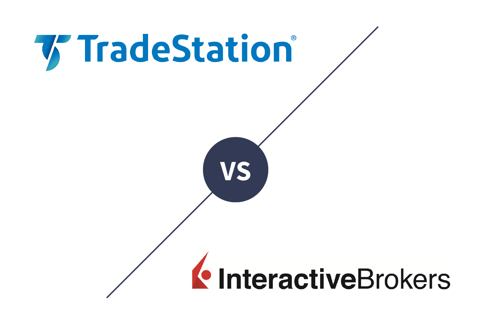

## Table of Contents

## What are TradeStation and Interactive Brokers?

TradeStation is a popular online brokerage platform that allows people to buy and sell stocks, options, futures, and other financial products. It is known for its powerful trading tools and software that help traders make smart decisions. Many people like TradeStation because it has a lot of features, like advanced charting and the ability to automate trades using custom strategies. It's great for both beginners and experienced traders who want to take control of their investments.

Interactive Brokers is another online brokerage platform that offers a wide range of investment options, including stocks, options, futures, forex, and more. It is well-known for its low fees and access to global markets, which makes it a favorite among active traders and investors who want to trade internationally. Interactive Brokers also provides strong trading tools and research resources to help users make informed decisions. It's a good choice for anyone looking for a cost-effective way to trade across different markets around the world.

## How do the account minimums compare between TradeStation and Interactive Brokers?

TradeStation has different account minimums depending on the type of account you want to open. For a standard brokerage account, there is no minimum deposit required. However, if you want to use their advanced trading features or open a margin account, you might need to deposit at least $2,000. This makes TradeStation a good choice for people who are just starting out and don't have a lot of money to invest right away.

Interactive Brokers also has varying account minimums based on the type of account. For a standard individual account, the minimum is $0, which means you can start trading with any amount of money. However, if you want to use their margin account, you'll need to deposit at least $2,000. They also have a monthly activity fee if your account balance is below $100,000 and you don't generate enough commissions. This makes Interactive Brokers suitable for both beginners and more experienced traders, but you need to be aware of the potential fees.

## What are the commission fees for trading stocks on TradeStation versus Interactive Brokers?

TradeStation charges different fees for trading stocks depending on how you trade. If you trade stocks online, you pay $0 per trade. But if you use their brokers to make a trade, it costs $50 per trade. So, if you like to do things yourself, TradeStation can be a good choice because you won't pay any commission for online stock trades.

Interactive Brokers also has different fees based on how you trade. For stocks, they charge $0 per trade if you use their IBKR Lite plan, which is good for people who don't trade a lot. But if you use their IBKR Pro plan, which is better for active traders, you pay a small fee that can be as low as $0.005 per share, with a minimum of $1 per trade. This means Interactive Brokers can be cheaper for people who trade a lot, but you need to think about which plan is right for you.

## How do the platforms' user interfaces compare for beginner traders?

TradeStation's user interface can be a bit tricky for beginners. It has a lot of tools and charts that might seem overwhelming at first. But once you learn how to use it, you can do a lot of cool things like setting up your own trading strategies. TradeStation has a practice account where you can try things out without using real money, which is helpful for beginners who want to get comfortable with the platform before they start trading for real.

Interactive Brokers' user interface is also packed with features, but it tries to be a bit more straightforward. They have a version called "Client Portal" that is easier to use and might be better for beginners. Still, there are a lot of options and it can take some time to figure everything out. Like TradeStation, Interactive Brokers lets you practice with a demo account, so you can learn how to use the platform without risking your money.

## What types of assets can be traded on TradeStation and Interactive Brokers?

TradeStation lets you trade many different things. You can buy and sell stocks, which are pieces of companies. You can also trade options, which are contracts that give you the right to buy or sell stocks at a certain price. TradeStation also lets you trade futures, which are agreements to buy or sell something at a future date, and forex, which is trading different countries' money. They even let you trade mutual funds and bonds, which are ways to invest your money safely.

Interactive Brokers also lets you trade a lot of different things. You can trade stocks, options, futures, and forex just like with TradeStation. But Interactive Brokers also lets you trade in more places around the world, so you can buy and sell things from different countries. They also let you trade ETFs, which are like baskets of stocks, and bonds. Plus, you can trade things like commodities, which are things like gold or oil, and cryptocurrencies, which are digital money like Bitcoin.

## How does the quality of customer support differ between TradeStation and Interactive Brokers?

TradeStation's customer support is good and they have different ways to help you. You can call them on the phone, send an email, or use their live chat if you have questions or problems. They also have a lot of information on their website that you can read to learn more about trading. But sometimes, you might have to wait a bit if you call them because they are busy helping other people. Overall, TradeStation tries hard to make sure you get the help you need.

Interactive Brokers also has good customer support but it can be a bit different. They have phone support, email, and a help center on their website. They also have a community forum where you can ask questions and get answers from other traders. Sometimes, their support can be a bit slower because they serve a lot of people all over the world. But they have a lot of resources and ways to get help, so if you're patient, you can usually find what you need.

## What advanced trading tools are available on TradeStation compared to Interactive Brokers?

TradeStation has a lot of cool tools for people who like to trade a lot. One of the best things is their "EasyLanguage" which lets you write your own trading rules. This means you can tell the computer exactly what to do when you want to buy or sell something. They also have something called "RadarScreen" which helps you keep an eye on many different stocks at the same time. This can be really useful if you want to see what's happening with lots of different things without having to look at each one separately. Plus, TradeStation has tools for backtesting, which means you can see how your trading ideas would have worked in the past.

Interactive Brokers also has some great tools for traders. They have something called "Trader Workstation" which is full of charts and ways to watch the markets. You can set up alerts to tell you when something important happens, like if a stock price goes up or down a lot. They also have tools for algo trading, which means you can use computer programs to make trades for you. This can be really helpful if you want to trade a lot without having to watch the markets all the time. Like TradeStation, Interactive Brokers lets you backtest your trading ideas to see if they would have worked well before.

## How do the platforms handle margin trading and what are the associated rates?

TradeStation lets you do margin trading, which means you can borrow money from them to buy more stocks or other things. If you want to use margin trading, you need to have at least $2,000 in your account. The interest rate for borrowing money from TradeStation can change, but right now, it's around 12.5% for balances under $50,000. If you borrow more, the rate might be a little lower. It's good to check their website because the rates can go up or down.

Interactive Brokers also lets you do margin trading, and you need at least $2,000 in your account to start. They have different rates depending on how much money you borrow and which plan you use. If you use their IBKR Pro plan, the rate can be as low as 5.83% for big balances, but it goes up to around 6.83% for smaller amounts. If you use their IBKR Lite plan, the rate is a bit higher, around 12.5% for all balances. It's a good idea to look at their website to see the latest rates because they can change.

## What are the differences in the research and analysis tools provided by TradeStation and Interactive Brokers?

TradeStation has lots of cool tools to help you learn about stocks and other things you can trade. They have something called "Market Monitor" where you can see what's happening with the markets right now. They also let you use something called "Scan" to find stocks that match what you're looking for. If you like to do your own research, TradeStation has lots of charts and numbers you can look at. They also have a tool called "Backtesting" where you can see how your trading ideas would have worked in the past. This can help you make better choices when you're ready to trade for real.

Interactive Brokers also gives you lots of ways to do research and learn about the markets. They have a tool called "Trader Workstation" where you can see lots of charts and numbers. You can also set up alerts to tell you when something important happens, like if a stock price goes up or down a lot. They have something called "Research" where you can read reports and get ideas about what to trade. Like TradeStation, they let you do backtesting to see how your trading ideas would have worked before. Both platforms are good for people who want to learn a lot about trading, but Interactive Brokers has more reports and research from other people.

## How do TradeStation and Interactive Brokers cater to algorithmic and automated trading?

TradeStation is really good for people who like to use computers to trade. They have something called "EasyLanguage" which lets you write your own rules for trading. This means you can tell the computer exactly what to do when you want to buy or sell something. TradeStation also has tools for backtesting, which means you can see how your trading ideas would have worked in the past. This can help you make your trading rules better before you use them for real. They also let you use their "RadarScreen" to watch many stocks at the same time, which can be helpful if your trading rules need to look at lots of different things.

Interactive Brokers also has great tools for people who want to trade using computers. They have something called "Trader Workstation" which lets you set up your own trading rules. You can use algo trading, which means you can use computer programs to make trades for you. This can be really helpful if you want to trade a lot without having to watch the markets all the time. Like TradeStation, Interactive Brokers lets you backtest your trading ideas to see if they would have worked well before. They also have a tool called "API" which lets you connect your own computer programs to their platform, so you can make trades even easier.

## What are the international trading capabilities of TradeStation and Interactive Brokers?

TradeStation lets you trade things from other countries, but it's not as big as some other platforms. You can trade stocks, options, and futures from places like Canada and Europe. But if you want to trade in lots of different countries, TradeStation might not have everything you need. They do have tools to help you keep track of what's happening in different markets, but their focus is more on the U.S. markets.

Interactive Brokers is really good for trading in other countries. They let you trade stocks, options, futures, and forex from all over the world. You can trade in more than 135 markets in 33 countries. This makes Interactive Brokers a great choice if you want to buy and sell things from different places. They also have tools to help you understand what's happening in these markets, so you can make smart choices no matter where you're trading.

## How do the platforms compare in terms of security and investor protection?

TradeStation takes security seriously. They use strong encryption to keep your information safe when you're trading. They also have something called SIPC coverage, which protects your money if something bad happens to TradeStation. This means if TradeStation goes out of business, you can get up to $500,000 back, including $250,000 for cash. TradeStation also follows rules from the government to make sure they're doing things the right way. So, if you're worried about your money being safe, TradeStation has a lot of ways to protect you.

Interactive Brokers also works hard to keep your information and money safe. They use strong encryption too, and they have SIPC coverage just like TradeStation. This means you're protected up to $500,000 if something goes wrong with Interactive Brokers. They also have extra insurance from a company called Lloyd's of London, which can give you even more protection. Interactive Brokers follows a lot of rules from different countries because they let you trade all over the world. So, if you're trading internationally, Interactive Brokers has extra ways to keep your money safe.

## References & Further Reading

[1]: Jansen, S. (2020). ["Machine Learning for Algorithmic Trading."](https://github.com/stefan-jansen/machine-learning-for-trading) Packt Publishing.

[2]: Chan, E. P. (2008). ["Quantitative Trading: How to Build Your Own Algorithmic Trading Business."](https://rickorford.com/quantitative-trading/) Wiley.

[3]: Lopez de Prado, M. (2018). ["Advances in Financial Machine Learning."](https://www.amazon.com/Advances-Financial-Machine-Learning-Marcos/dp/1119482089) Wiley.

[4]: Aronson, D. R. (2007). ["Evidence-Based Technical Analysis: Applying the Scientific Method and Statistical Inference to Trading Signals."](https://www.amazon.com/Evidence-Based-Technical-Analysis-Scientific-Statistical/dp/0470008741) Wiley.

[5]: Bergstra, J., Bardenet, R., Bengio, Y., & Kégl, B. (2011). ["Algorithms for Hyper-Parameter Optimization."](https://proceedings.neurips.cc/paper/2011/file/86e8f7ab32cfd12577bc2619bc635690-Paper.pdf) Advances in Neural Information Processing Systems 24.