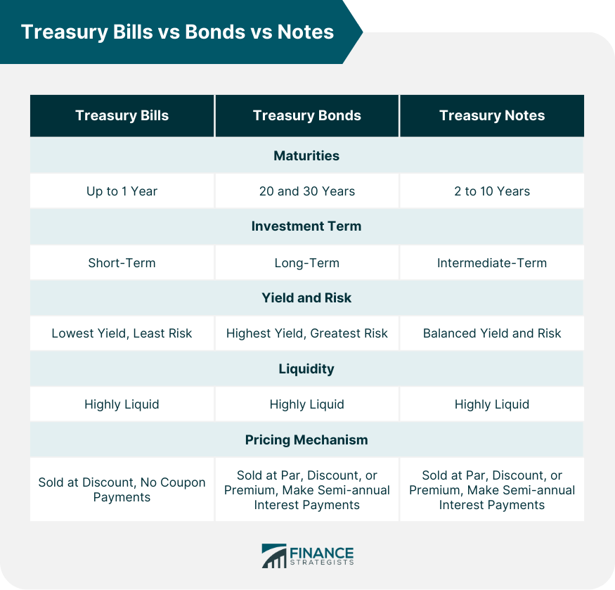

## Table of Contents

## What are Treasury Bonds, Notes, and Bills?

Treasury Bonds, Notes, and Bills are all types of securities issued by the U.S. Department of the Treasury to help fund the government's operations and pay off debts. They are considered very safe investments because they are backed by the full faith and credit of the U.S. government. Treasury Bills, often called T-Bills, are short-term securities that mature in one year or less. Treasury Notes, or T-Notes, have longer terms, ranging from two to ten years. Treasury Bonds, known as T-Bonds, are long-term securities with terms of 20 or 30 years.

These securities work differently in terms of how they pay interest. T-Bills are sold at a discount from their face value, and when they mature, the government pays you the full face value. The difference between the purchase price and the face value is the interest you earn. T-Notes and T-Bonds, on the other hand, pay interest every six months until they mature. At maturity, the government pays you the face value of the security. Investors can buy these securities directly from the Treasury through TreasuryDirect or through banks and brokers.

## How do Treasury Bonds, Notes, and Bills differ in terms of maturity?

Treasury Bills, or T-Bills, are the shortest-term securities offered by the U.S. Treasury. They mature in one year or less. This means if you buy a T-Bill, you will get your money back, plus interest, within a year. T-Bills are popular among investors who want a safe place to park their money for a short time.

Treasury Notes, or T-Notes, have a longer maturity period than T-Bills. They can mature anywhere from two to ten years after you buy them. So, if you invest in a T-Note, you'll have to wait at least two years, but no more than ten years, to get your money back, along with the interest payments you receive every six months.

Treasury Bonds, or T-Bonds, are the longest-term securities. They mature in either 20 or 30 years. This means if you buy a T-Bond, you're committing to a very long investment period. You'll get interest payments every six months, but you won't get the full amount back until the bond matures, which could be decades later.

## What are the interest rates like for Treasury Bonds, Notes, and Bills?

Interest rates for Treasury Bonds, Notes, and Bills can change a lot. They depend on what's happening in the economy and what the Federal Reserve is doing. When the economy is doing well, interest rates might go up because people want to borrow more money. When the economy is not doing so well, interest rates might go down to encourage people to borrow and spend more. The rates are set at auctions where people and institutions bid on these securities. The more people want to buy them, the lower the [interest rate](/wiki/interest-rate-trading-strategies) can be because the government doesn't have to offer as much to attract buyers.

For Treasury Bills, the interest rate is a bit different because they are sold at a discount. You buy them for less than their face value, and when they mature, you get the full face value. The difference between what you paid and what you get back is your interest. For example, if you buy a $1,000 T-Bill for $950, and it matures in a year, you earn $50 in interest. Treasury Notes and Bonds pay interest every six months. The rate is fixed when you buy them, so you know exactly how much you'll get every six months until they mature. For example, if you buy a $1,000 T-Note with a 2% annual interest rate, you'll get $10 every six months.

## How can one purchase Treasury Bonds, Notes, and Bills?

You can buy Treasury Bonds, Notes, and Bills directly from the U.S. Treasury through a website called TreasuryDirect. First, you need to set up an account on TreasuryDirect. It's easy to do and free. Once your account is set up, you can go to the site, choose the type of security you want to buy, and place your order during the auction times. The Treasury holds auctions regularly, so you can check the schedule on the site. After the auction, if your bid is accepted, the securities will be added to your account.

Another way to buy these securities is through a bank or a broker. Many banks and brokers offer Treasury securities to their customers. You might need to have an account with them already, or you might need to open a new one. Once you have an account, you can tell your bank or broker what you want to buy, and they will place the order for you. They might charge you a fee for this service, so it's a good idea to ask about any costs before you buy. Both ways of buying are safe and reliable, so it depends on what you find easier and more convenient.

## What are the risks associated with investing in Treasury securities?

Investing in Treasury securities is generally very safe because they are backed by the U.S. government. This means the risk of the government not paying you back is very low. However, there are still some risks to think about. One risk is interest rate risk. If interest rates go up after you buy a Treasury security, the value of your security might go down. This is because new securities will be issued with higher interest rates, making your older ones less attractive to other investors. If you need to sell your security before it matures, you might get less money than you expected.

Another risk is inflation risk. Inflation is when the prices of things go up over time. If inflation goes up a lot, the interest you earn from your Treasury securities might not be enough to keep up with the rising prices. This means the money you get back when your security matures might not buy as much as it used to. While these risks are important to consider, Treasury securities are still seen as a very safe investment compared to many other options.

## How do Treasury Bonds, Notes, and Bills impact the economy?

Treasury Bonds, Notes, and Bills have a big impact on the economy. When the government sells these securities, it gets money to pay for things like building roads, paying for schools, and other important stuff. This helps the economy grow because the government can spend money on projects that create jobs and help people. Also, when people and businesses buy these securities, they are lending money to the government. This means there's less money for them to spend on other things, which can slow down the economy a bit. But overall, it helps the government manage its money and keep the economy stable.

These securities also affect interest rates and inflation. When the government sells a lot of securities, it can push up interest rates because it's borrowing more money. Higher interest rates can make it more expensive for people and businesses to borrow money, which might slow down spending and economic growth. On the other hand, if the government buys back its securities, it can lower interest rates and encourage more borrowing and spending. Treasury securities also help control inflation. If the economy is growing too fast and prices are going up a lot, the government can sell more securities to take money out of the economy and slow down inflation. So, these securities are important tools for managing the economy and keeping it balanced.

## What are the tax implications of investing in Treasury securities?

When you invest in Treasury securities, you have to think about taxes. The interest you earn from Treasury Bonds, Notes, and Bills is usually subject to federal income tax. This means you have to report this interest on your federal tax return and pay taxes on it. However, there's some good news: the interest from these securities is not taxed by state and local governments. So, if you live in a state with high income taxes, this can be a big advantage because you won't have to pay those taxes on your Treasury interest.

Another thing to keep in mind is that if you sell a Treasury security before it matures and you make a profit, that profit is also subject to federal income tax. But if you sell it at a loss, you might be able to use that loss to reduce your taxable income. It's always a good idea to talk to a tax professional to understand how these rules apply to your specific situation and to make sure you're following all the tax laws correctly.

## How do Treasury Bonds, Notes, and Bills fit into a diversified investment portfolio?

Treasury Bonds, Notes, and Bills can be a good part of a diversified investment portfolio because they are very safe and reliable. They are backed by the U.S. government, so there's a very low chance you won't get your money back. This makes them a great way to balance out riskier investments like stocks. If the stock market goes down, your Treasury securities can help protect your money because they usually don't lose value in the same way. This can give you peace of mind and help you keep your investments steady over time.

Including Treasury securities in your portfolio can also help you earn a steady income. Treasury Notes and Bonds pay interest every six months, which can be a good source of regular money. Even though the interest rates might not be as high as some other investments, the safety and reliability can make up for it. By having a mix of Treasury securities and other investments, you can spread out your risk and increase your chances of meeting your financial goals, whether you're saving for retirement, buying a house, or just trying to grow your savings.

## What is the process for selling Treasury securities before maturity?

If you need to sell your Treasury securities before they mature, you can do it through TreasuryDirect or a bank or broker. If you use TreasuryDirect, you can sell your securities online. You just log into your account, find the securities you want to sell, and choose to sell them. TreasuryDirect will then try to sell your securities at the current market price. It might take a few days for the money to show up in your account after the sale.

If you use a bank or broker, you tell them which securities you want to sell, and they will handle the sale for you. They might charge you a fee for this service, so it's good to ask about any costs before you decide to sell. Selling through a bank or broker can sometimes be faster than selling through TreasuryDirect, but it depends on the specific bank or broker you use. Either way, selling before maturity means you might get more or less money than you originally paid, depending on what's happening with interest rates and the economy at the time.

## How do changes in interest rates affect the value of Treasury Bonds, Notes, and Bills?

When interest rates go up, the value of Treasury Bonds, Notes, and Bills usually goes down. This happens because new securities are issued with higher interest rates, making the older ones less attractive to investors. If you want to sell your Treasury security before it matures, you might have to sell it for less than you paid for it because people would rather buy the new securities with higher interest rates. This is called interest rate risk, and it's something to think about if you might need to sell your securities before they mature.

On the other hand, when interest rates go down, the value of your Treasury securities can go up. This is because your securities now have higher interest rates than the new ones being issued, making them more attractive to other investors. If you decide to sell your securities before they mature, you might be able to sell them for more than you paid for them. But remember, if you hold onto your securities until they mature, you'll get the full face value no matter what happens with interest rates.

## What are the differences in liquidity between Treasury Bonds, Notes, and Bills?

Treasury Bills, or T-Bills, are usually the most liquid of the three types of Treasury securities. This means it's easier and quicker to buy and sell them. T-Bills mature in a year or less, so they are seen as short-term investments. Because they are short-term, people and businesses often use them to manage their cash flow. They can be sold before they mature, but since they are already short-term, there's less need to sell them early. This makes them very popular and easy to trade.

Treasury Notes and Bonds are less liquid than T-Bills because they have longer maturity periods. T-Notes mature in two to ten years, and T-Bonds mature in 20 or 30 years. Because they are long-term investments, it can take longer to sell them if you need your money back before they mature. The longer the time until maturity, the more the price can be affected by changes in interest rates. This means if you want to sell a T-Note or T-Bond before it matures, you might get less money than you expected if interest rates have gone up. But if you can hold onto them until they mature, you'll get the full face value no matter what happens with interest rates.

## How do Treasury Inflation-Protected Securities (TIPS) compare to regular Treasury Bonds, Notes, and Bills?

Treasury Inflation-Protected Securities, or TIPS, are a special type of Treasury security designed to protect investors from inflation. Unlike regular Treasury Bonds, Notes, and Bills, TIPS adjust their principal value based on changes in the Consumer Price Index (CPI), which measures inflation. This means if inflation goes up, the value of your TIPS goes up too, and so does the interest you earn because the interest rate is applied to the adjusted principal. This makes TIPS a good choice if you're worried about inflation eating away at your money over time. However, if inflation goes down, the principal value of TIPS can also go down, but it will never be less than the original amount you invested.

Regular Treasury Bonds, Notes, and Bills do not adjust for inflation. They pay a fixed interest rate, which means you know exactly how much interest you'll get every six months for Notes and Bonds, or at maturity for Bills. This can be good if you want a predictable income, but if inflation goes up a lot, the interest you earn might not be enough to keep up with rising prices. So, while regular Treasury securities are very safe and reliable, they don't offer the same protection against inflation that TIPS do. Both types of securities are backed by the U.S. government, making them very safe investments, but they serve different purposes depending on your financial goals and concerns about inflation.

## What are the types of Treasury Securities: Bills, Notes, and Bonds?

Treasury securities, commonly known as U.S. Treasuries, are government debt instruments that the U.S. Department of the Treasury issues to finance government spending and obligations. These securities are heavily utilized by a multitude of investors due to their low-risk nature, as they are backed by the full faith and credit of the U.S. government. Among these securities, Treasury Bills, Treasury Notes, and Treasury Bonds serve different investment needs based on their maturity, yield, and structure.

**Treasury Bills (T-bills)** are short-term securities with maturities that range from a few days to one year. They are issued at a discount from their par (or face) value and do not pay periodic interest before maturity. Instead, the investor's return comes from the difference between the purchase price and the par value at maturity. For example, an investor might purchase a $1,000 T-bill for $950, thus earning $50 when it matures. The price of a T-bill is calculated using the formula:

$$
\text{Price} = \frac{\text{Face Value}}{1 + \left( \frac{\text{Discount Rate} \times \text{Time}}{360} \right)}
$$

where the discount rate reflects the investor's required yield and time is the time to maturity in days.

**Treasury Notes (T-notes)** are medium-term securities with maturities ranging from two to ten years. Unlike T-bills, T-notes pay interest semi-annually at a fixed rate, referred to as the coupon rate. The consistent income makes them attractive to investors seeking regular cash flow. Upon maturity, T-notes pay the principal amount along with the final interest payment. Assuming an investor holds a 5-year T-note with a $1,000 par value and a 3% annual coupon rate, they will receive $15 every six months until maturity, where they will also regain their principal.

**Treasury Bonds (T-bonds)** offer the longest maturities, generally between 20 and 30 years. Due to their extended duration, they typically offer higher interest rates compared to T-bills and T-notes. T-bonds also pay interest semi-annually, providing investors with regular income over a longer period, which can be a hedge against future inflation risks. Their long-term nature makes them suitable for investors focused on long-term goals like retirement planning. The yield of Treasury Bonds can be a critical indicator for the economy, influencing interest rates across various sectors.

Collectively, T-bills, T-notes, and T-bonds form the cornerstone of the U.S. fixed-income market, providing security, [liquidity](/wiki/liquidity-risk-premium), and predictability that underpin diverse investment strategies. They are not only pivotal for individual investors but also play a crucial role in the broader economic framework, including monetary policy and financial market stability.

## References & Further Reading

[1]: ["U.S. Treasury Securities."](https://www.investopedia.com/articles/investing/073113/introduction-treasury-securities.asp) U.S. Department of the Treasury.

[2]: Fabozzi, F. J. (2005). ["Fixed Income Analysis."](https://books.google.com/books/about/Fixed_Income_Analysis.html?id=lujLawVLS3YC) John Wiley & Sons.

[3]: ["Principles of Algorithmic Trading."](https://www.investopedia.com/articles/active-trading/101014/basics-algorithmic-trading-concepts-and-examples.asp) CFA Institute Financial Analysts Journal.

[4]: ["Algorithmic Trading and DMA: An introduction to Direct Access Trading Strategies"](https://www.amazon.com/Algorithmic-Trading-DMA-introduction-strategies/dp/0956399207) by Barry Johnson

[5]: ["Introduction to U.S. Treasury Debt Instruments"](https://www.investopedia.com/terms/t/treasurybond.asp) Federal Reserve Board

[6]: ["Algorithmic Trading: Winning Strategies and Their Rationale"](https://www.wiley.com/en-us/Algorithmic+Trading%3A+Winning+Strategies+and+Their+Rationale-p-9781118460146) by Ernie Chan