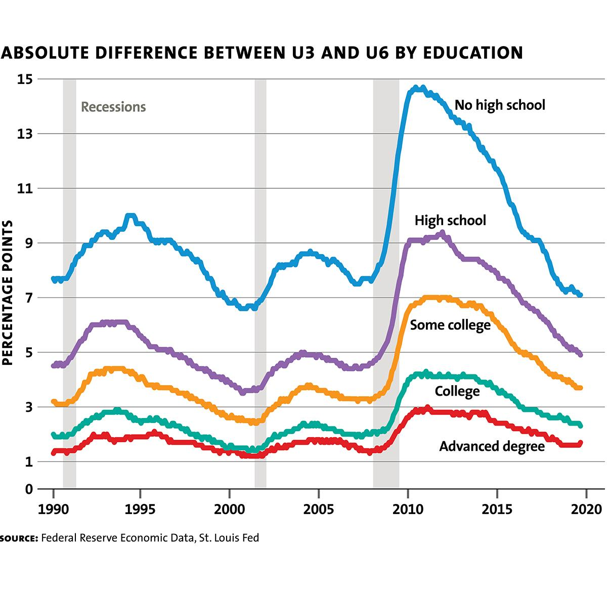

## Table of Contents

## What is the U-3 unemployment rate?

The U-3 unemployment rate is a common measure of unemployment in the United States. It is calculated by the Bureau of Labor Statistics and represents the number of unemployed people as a percentage of the total labor force. The labor force includes people who are either employed or actively looking for work. This rate is often referred to simply as the unemployment rate and is widely reported in the media.

The U-3 rate is important because it gives a snapshot of the job market's health. When the U-3 rate is low, it usually means more people have jobs and the economy is doing well. When it is high, it can mean that many people are out of work and the economy might be struggling. Policymakers and economists use this rate to make decisions about economic policies and to understand how well the country's job market is performing.

## What is the U-6 unemployment rate?

The U-6 unemployment rate is a broader measure of unemployment in the United States. It includes not only people who are unemployed and looking for work, like in the U-3 rate, but also people who are working part-time because they can't find full-time jobs, and people who want to work but have given up looking for a job. This rate gives a more complete picture of how many people are struggling to find work.

The U-6 rate is important because it shows more about the challenges people face in the job market. While the U-3 rate might look good, the U-6 rate can show that many people are still having a hard time finding the work they need. Economists and policymakers look at the U-6 rate to get a better understanding of the overall health of the economy and to make better decisions about how to help people find good jobs.

## How is the U-3 unemployment rate calculated?

The U-3 unemployment rate is calculated by the Bureau of Labor Statistics. To find this rate, they first count the number of people who are unemployed. These are people who don't have a job but have looked for work in the past four weeks. Then, they count the total labor force, which includes everyone who is either working or looking for work. The U-3 rate is then figured out by dividing the number of unemployed people by the total labor force and multiplying by 100 to get a percentage.

This rate is important because it shows how many people are out of work compared to the whole group of people who want to work. When the U-3 rate is low, it means more people have jobs, which usually means the economy is doing well. When it's high, it means more people are looking for work and the economy might be struggling. The U-3 rate is the most commonly used measure of unemployment and is often reported in the news.

## How is the U-6 unemployment rate calculated?

The U-6 unemployment rate is a wider measure of unemployment. It is calculated by the Bureau of Labor Statistics. To find the U-6 rate, they start by counting the same group of unemployed people used in the U-3 rate. These are people without a job who have looked for work in the past four weeks. Then, they add two more groups of people. The first group includes people who are working part-time but want to work full-time. They are called "part-time for economic reasons." The second group includes people who want a job but have given up looking for one. They are called "marginally attached to the labor force." After adding these groups together, the total is divided by the total labor force plus all the people who are marginally attached to the labor force. This number is then multiplied by 100 to get the U-6 unemployment rate as a percentage.

The U-6 rate is important because it gives a fuller picture of how many people are struggling to find work. While the U-3 rate might show that the job market is doing well, the U-6 rate can show that many people are still having a hard time. This rate includes people who are not counted in the U-3 rate but are still facing job challenges. Economists and policymakers look at the U-6 rate to understand the overall health of the economy and to make better decisions about how to help people find good jobs.

## What are the key differences between U-3 and U-6 unemployment rates?

The U-3 and U-6 unemployment rates are two different ways to measure unemployment in the United States. The U-3 rate is the most common measure and it counts people who don't have a job but have looked for work in the last four weeks. This rate is simple and gives a quick look at how many people are out of work. It's the number you usually hear about on the news.

The U-6 rate is a broader measure that includes everyone counted in the U-3 rate, plus two other groups of people. It adds people who are working part-time but want full-time jobs, and people who want to work but have given up looking. This rate gives a fuller picture of how many people are struggling to find work. The U-6 rate shows more about the challenges in the job market, helping policymakers and economists understand the economy better.

## Why is the U-6 rate often considered a more comprehensive measure of unemployment?

The U-6 rate is often considered a more comprehensive measure of unemployment because it includes more people than the U-3 rate. The U-3 rate only counts people who are out of work and have looked for a job in the last four weeks. But the U-6 rate also includes people who are working part-time because they can't find full-time jobs. These people want to work more but can't find the right job. The U-6 rate also counts people who have given up looking for work, even though they still want a job. These people are not included in the U-3 rate, but they are still part of the job market's challenges.

By including these extra groups, the U-6 rate gives a fuller picture of how many people are struggling to find work. It shows that even if the U-3 rate looks good, there might still be a lot of people having a hard time. Economists and policymakers use the U-6 rate to understand the real health of the job market. It helps them see where more help is needed to make sure everyone can find good work.

## How do U-3 and U-6 rates typically differ in their reported values?

The U-3 and U-6 unemployment rates usually show different numbers because they count different groups of people. The U-3 rate is the smaller number because it only counts people who don't have a job and have looked for work in the last four weeks. This rate is what you hear about most often on the news. It gives a quick look at how many people are out of work.

The U-6 rate is always higher than the U-3 rate because it includes more people. Besides the group counted in the U-3 rate, the U-6 rate also counts people who are working part-time but want full-time jobs, and people who have given up looking for work but still want a job. This rate gives a fuller picture of how many people are struggling to find work. It helps show that even if the U-3 rate looks good, there might still be a lot of people facing job challenges.

## What are the implications of using U-3 versus U-6 for economic policy?

Using the U-3 unemployment rate for economic policy can make things look better than they really are. The U-3 rate only counts people who are out of work and have looked for a job in the last four weeks. If policymakers only look at this rate, they might think the job market is doing well and not do enough to help people who are struggling. This can lead to policies that don't address the full range of job market problems, like people who want full-time work but can only find part-time jobs, or people who have given up looking for work.

On the other hand, using the U-6 unemployment rate can give a more complete picture of the job market. The U-6 rate includes everyone in the U-3 rate, plus people working part-time who want full-time jobs and people who have given up looking for work. When policymakers use the U-6 rate, they can see that even if the U-3 rate looks good, many people are still having a hard time finding the work they need. This can lead to better policies that help more people find good jobs and improve the overall health of the economy.

## How have U-3 and U-6 rates trended historically in the United States?

Historically, the U-3 and U-6 unemployment rates in the United States have followed similar trends but with different levels. During good economic times, both rates go down, showing that more people have jobs. For example, in the late 1990s and early 2000s, the U-3 rate was around 4% to 5%, while the U-6 rate was around 7% to 9%. During the Great Recession in 2008 and 2009, both rates went up a lot. The U-3 rate reached over 10%, and the U-6 rate went above 17%. This showed that many people were out of work and struggling to find jobs.

After the Great Recession, both rates started to go down again as the economy got better. By the late 2010s, the U-3 rate was back to around 3.5% to 4%, and the U-6 rate was around 6.5% to 7.5%. When the COVID-19 pandemic hit in 2020, both rates spiked again. The U-3 rate went up to around 14.7% at its peak, and the U-6 rate went over 22%. But as the economy recovered, both rates came down again. By 2022, the U-3 rate was around 3.5% again, and the U-6 rate was around 6.5%. This shows that while the U-3 and U-6 rates move together, the U-6 rate is always higher because it counts more people who are struggling to find work.

## Can U-3 and U-6 rates be used to predict economic recessions?

U-3 and U-6 unemployment rates can give clues about whether an economic recession might be coming. When these rates start to go up a lot, it can mean that more people are losing their jobs and the economy is getting weaker. This is because when businesses are not doing well, they often have to let people go. So, if you see the U-3 and U-6 rates going up quickly, it might be a sign that a recession is on the way.

But, these rates are not perfect for predicting recessions. They can go up for other reasons too, like changes in the job market or people deciding to look for work again. Also, by the time the unemployment rates go up a lot, the recession might already be happening. So, while U-3 and U-6 rates can help us understand what's going on in the economy, they are just one part of the puzzle. Economists look at many other things too, like how much people are spending and how businesses are doing, to predict if a recession is coming.

## What are the criticisms or limitations of both U-3 and U-6 as unemployment measures?

The U-3 unemployment rate has some problems. It only counts people who are out of work and have looked for a job in the last four weeks. This means it doesn't include people who have given up looking for work, even if they still want a job. It also doesn't count people who are working part-time but want full-time jobs. Because of this, the U-3 rate can make the job market look better than it really is. If people think the U-3 rate is low, they might not see that many people are still struggling to find good work.

The U-6 unemployment rate tries to fix some of the U-3 rate's problems, but it has its own issues. The U-6 rate includes more people, like those working part-time who want full-time jobs and those who have given up looking for work. But it can still miss some important things. For example, it doesn't count people who are not in the labor force for other reasons, like students or people who are taking care of family. Also, the U-6 rate can be hard to understand because it's a more complicated number. People might not pay as much attention to it, even though it gives a fuller picture of the job market.

## How do international standards compare to U-3 and U-6 in measuring unemployment?

Different countries use different ways to measure unemployment, but many follow the guidelines set by the International Labour Organization (ILO). The ILO's standard for unemployment is similar to the U-3 rate in the United States. It counts people who are without a job, available to work, and have looked for work in the last four weeks. This means that the U-3 rate is close to what many other countries use to measure unemployment. But some countries might have small differences in how they collect data or define who is looking for work.

The U-6 rate, on the other hand, is more detailed than what most countries use. It includes not just the people counted in the U-3 rate, but also those working part-time who want full-time jobs and people who have given up looking for work. While some countries do have similar broader measures, they are not as common as the standard ILO measure. The U-6 rate gives a fuller picture of the job market, but it can be harder to compare with international numbers because not all countries collect this kind of data in the same way.

## What is the U-3 Unemployment Rate and how is it understood?

The U-3 unemployment rate is recognized as the official measure of unemployment in the United States. It specifically counts individuals who are without jobs but are actively seeking employment. This metric is released monthly by the Bureau of Labor Statistics (BLS) and is widely regarded as a fundamental indicator of economic health. 

As an economic indicator, the U-3 rate provides insights into the overall labor market by exhibiting trends in job opportunities and workforce engagement. It is calculated by taking the number of unemployed individuals who are actively looking for work and dividing it by the total labor force, then multiplying by 100 to convert to a percentage. Mathematically, this can be represented as:

$$

U3 = \left( \frac{\text{Unemployed and seeking work}}{\text{Total labor force}} \right) \times 100 
$$

Despite its prevalent use, U-3 has faced criticism for not encompassing certain segments of the labor market. It overlooks part-time workers aspiring for full-time positions and does not account for discouraged workers—those who have ceased searching for jobs due to the belief that there are none available for them. These exclusions mean that the U-3 rate might underrepresent the true extent of unemployment, particularly in situations where underemployment is significant.

Economists and labor market analysts argue that while the U-3 rate provides vital data, it offers an incomplete representation of the labor market's state. This limitation can be critical when assessing the full spectrum of economic issues facing the workforce, influencing everything from policy formulation to business strategy development. Understanding the shortcomings of U-3 is essential for anyone who uses this data to make informed decisions about the economy.

## References & Further Reading

[1]: ["Understanding the Employment Measures from the CPS and CES"](https://www.bls.gov/mlr/2006/02/art2full.pdf), Bureau of Labor Statistics (BLS).

[2]: ["Unemployment: Concepts and Measurement in Australia"](https://www.rba.gov.au/education/resources/explainers/unemployment-its-measurement-and-types.html), Australian Bureau of Statistics (ABS), July 2020.

[3]: ["Understanding U.S. Labor Statistics"](https://www.bls.gov/), Investopedia article on the U.S. Labor Force Statistics.

[4]: ["Unemployment Statistics and Tracking U.S. Unemployment Rates"](https://www.bls.gov/charts/employment-situation/civilian-unemployment-rate.htm), U.S. Census Bureau.

[5]: ["Macro Trading and Investment Strategies: The Impact of Macroeconomics on Financial Markets"](https://www.thestockdork.com/macro-trading/) by Gabriel Burstein.