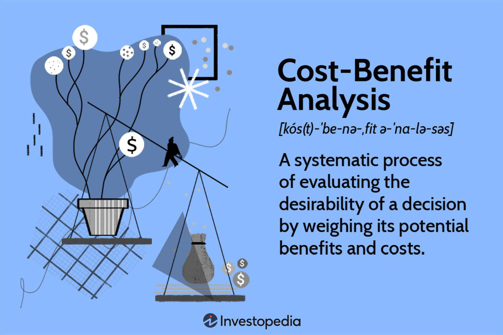

Algorithmic trading, commonly referred to as 'algo trading', is fundamentally transforming the financial markets by leveraging computer algorithms to execute trades more efficiently and accurately than traditional manual methods. With the rise of technology, these automated systems utilize predefined rules and sophisticated quantitative models to make split-second trading decisions that can capitalize on market opportunities or mitigate risks. According to a report by the Financial Times, as of 2022, nearly 60% of all trades executed in the American equity markets were driven by algorithmic systems, underscoring the significant impact of this approach on modern finance.

This article serves to provide a comprehensive analysis of both the advantages and disadvantages inherent in algorithmic trading. By examining attributes such as speed, efficiency, and the reduction of human error, as well as potential pitfalls like technical glitches and regulatory issues, readers will gain a balanced view of this influential trading method. Furthermore, we explore the concept of a 'comparison universe', an essential tool for investors seeking to benchmark and evaluate the performance of their investments against market standards. Prominent examples of comparison universes include those curated by Lipper and Morningstar, providing widely-recognized reference points within the industry.



In preparing this article, our goal is to offer actionable insights to investors who are considering incorporating algorithmic trading into their strategies, as well as understanding how comparison universes can guide their investment decisions. This holistic evaluation will aid in navigating the complexities of automated trading mechanisms and ensuring informed strategy selection, enhancing overall investment practice.

## Table of Contents

## Understanding Algorithmic Trading

Algorithmic trading, or "algo trading," refers to the use of computer algorithms to execute trades in the financial markets. These algorithms function based on a set of predefined rules that dictate when and how trades should be carried out. 

At its core, algorithmic trading involves a synergy between quantitative analysis, market data analysis, and the rigorous application of computational techniques. The primary components of an algorithmic trading system include data collection and management, strategy formulation, execution, and risk management. Data is collected from a variety of sources, including market prices, economic indicators, and company fundamentals, which are then fed into the algorithm. 

The trading algorithm uses this data to identify trading opportunities based on criteria coded into its logic. These criteria can be as simple as executing trades when a stock's price moves beyond a certain threshold or more complex strategies like [statistical arbitrage](/wiki/statistical-arbitrage), pairs trading, or mean reversion. The pre-defined rules can include specific parameters, such as time of day, [liquidity](/wiki/liquidity-risk-premium) levels, and market [volatility](/wiki/volatility-trading-strategies), which help in deciding the most opportune moments to execute trades.

A key distinction between algorithmic and manual trading is that the former can execute trades at a speed and frequency that is impossible for a human trader. Manual trading requires individuals to analyze market conditions and make decisions in real-time, often under pressure. This process can be time-consuming and may subject traders to emotional biases. In contrast, [algorithmic trading](/wiki/algorithmic-trading) relies on precise mathematical models to make fast, unbiased, and consistent trading decisions, mitigating the risks associated with human errors.

Consider this Python code snippet that demonstrates a simple moving average crossover strategy, a common tactic in algorithmic trading:

```python
import pandas as pd

# Load historical stock data
data = pd.read_csv('stock_data.csv')

# Calculate the short-term and long-term moving averages
data['Short_MA'] = data['Close'].rolling(window=40, min_periods=1).mean()
data['Long_MA'] = data['Close'].rolling(window=100, min_periods=1).mean()

# Generate trading signals
data['Signal'] = 0
data['Signal'][40:] = np.where(data['Short_MA'][40:] > data['Long_MA'][40:], 1, 0)

# Identify trading positions
data['Position'] = data['Signal'].diff()

# Display the resulting dataframe
print(data)
```

This code calculates short-term and long-term moving averages for a stock and generates buy or sell signals based on their crossover points. The efficiency and speed of executing such strategies automatically highlight one of the significant advantages of algorithmic trading over manual methods.

To summarize, algorithmic trading involves a methodical application of computational rules and contributes to highly efficient and less error-prone trading processes, setting it apart from traditional manual approaches in the financial markets.

## What Is a Comparison Universe?

A comparison universe is a grouping of similar investment funds or portfolios used as a reference point to evaluate the performance of a specific investment. It serves as a benchmark, enabling investors and analysts to assess how well an investment is performing relative to its peers. By providing a standard against which performance can be measured, comparison universes play a crucial role in investment analysis and decision-making.

Comparison universes are essential in performance evaluations as they allow for objective assessments. They comprise funds or investments with similar objectives, styles, or risk profiles. The primary purpose of using a comparison universe is to ensure that performance evaluations account for exogenous factors like market conditions, sector-specific moves, or broad economic changes that can affect all investments within the same category. When a fund's returns are compared to a relevant universe, it helps determine whether the performance resulted from active management skills or market movements.

Prominent comparison universes include those developed by established financial firms such as Lipper and Morningstar. Lipper's comparison universes are well-known for segmenting funds based on investment style and market capitalization, which offers comprehensive insights into fund performance across different categories. Morningstar's universes, on the other hand, are widely recognized for their classification of funds according to factors like investment strategy and asset allocation, enabling nuanced performance comparisons among mutual funds and exchange-traded funds (ETFs).

These examples highlight the importance of choosing an appropriate comparison universe to make meaningful performance evaluations, as it aids in isolating an investment's performance from broader market influences.

## Pros of Algorithmic Trading

Algorithmic trading offers a set of compelling advantages that have contributed to its widespread adoption in financial markets. Primarily, one of its standout features is the remarkable speed and efficiency it brings to trade execution. Through the use of computer algorithms, trades can be conducted at speeds unattainable through manual methods. This rapid execution minimizes latency, allowing traders to capitalize on fleeting price discrepancies and market opportunities.

Another essential advantage is the high accuracy associated with algorithmic trading. By eliminating human errors, which can arise from fatigue, oversight, or inconsistent decision-making, algorithmic systems ensure a greater precision in executing trades. These predefined sets of instructions or rules are programmed to operate based on quantitative data, drastically reducing the susceptibility to the emotional and psychological biases that might affect human traders.

Moreover, algorithmic trading platforms are designed to handle extensive trade volumes, far beyond what a human trader could manage. This capability not only facilitates the execution of numerous trades simultaneously but also aids in diversifying investments. Automated systems can scan multiple markets and securities, assessing opportunities and risks within seconds, thereby enabling traders to maintain a diversified portfolio without sacrificing attention to detail in any specific area.

The automation inherent in algo trading also promotes discipline by removing emotional decision-making from the trading process. Human traders often fall into emotional traps, such as fear of loss or greed, which can lead to impulsive and irrational decisions. Algorithmic trading adheres strictly to the logic encoded in its algorithms, ensuring that decisions are made based on data, statistical analysis, and predetermined criteria, thereby fostering a disciplined and methodical approach to trading.

In conclusion, the speed, accuracy, scalability, and disciplined nature of algorithmic trading make it an attractive option for traders looking to optimize their strategies and enhance market performance. With the continued evolution of technology, these advantages are likely to grow, further solidifying the role of algorithmic trading in modern finance.

## Cons of Algorithmic Trading

Algorithmic trading, while offering numerous advantages, is not without its challenges and downsides. One significant concern in the domain is the heavy reliance on technology, which can lead to potential technical glitches. These glitches may arise from software bugs, network connectivity issues, or hardware failures, potentially causing significant financial losses. The reliance on technology also means that any cyber attack or technical disruption can disrupt trading operations.

A further consideration is the high initial cost associated with establishing the necessary technological infrastructure and purchasing sophisticated trading software. For many investors, especially retail traders, these costs can be prohibitive. Developing or acquiring advanced algorithmic trading systems often involves significant financial investment in powerful computers, specialized software, and robust cybersecurity measures.

Moreover, programming skills are essential for the successful implementation and management of algorithmic trading strategies. This requirement can pose a barrier to entry for traders who lack the necessary technical expertise. Understanding complex algorithms and the ability to modify them according to market conditions is vital, but the learning curve can be steep for those new to programming or computational finance.

Additionally, the regulatory environment surrounding algorithmic trading presents challenges. As markets evolve and the use of automated systems grows, regulatory bodies continuously adapt rules to ensure market stability and fairness. Regulations can impact algorithmic trading by imposing guidelines on transaction speeds, order types, and trading volumes. For instance, measures such as the SEC's Rule 15c3-5 require brokers to have risk management controls in place for automated trades. These regulatory frameworks aim to curb potential market manipulations and flash crashes, but they may also limit the flexibility and efficiency that algorithmic trading offers, necessitating ongoing compliance efforts and adaptation to new rules.

## Pros and Cons of Comparison Universes

Comparison universes play a crucial role in the evaluation of fund performance, providing a standardized benchmark that assists in assessing the relative success of investment strategies. These benchmarks are composed of a collection of similar investment funds or indices, allowing investors to make informed comparisons. Prominent examples include Lipper and Morningstar comparison universes, which offer structured categorizations for mutual funds and ETFs.

### Benefits

**Standardization and Transparency**: One of the primary benefits of using comparison universes is the standardization they provide in evaluating performance. They offer a consistent benchmark against which funds can be compared, thereby enhancing transparency and aiding investor decision-making. By examining returns against a defined universe, investors can objectively assess whether a fund manager is adding value.

**Performance Evaluation**: Another advantage is the facilitation of performance evaluation over multiple time frames. Investors can analyze returns over various periods, including short-term and long-term horizons. This level of analysis helps in understanding the consistency and sustainability of a fund's performance.

**Risk Assessment**: Comparison universes also enable robust risk assessment. By looking at how different funds perform within a universe, investors can better understand the risk profiles of individual funds relative to their peers. This comparison is vital in making informed decisions concerning risk-adjusted returns.

### Drawbacks

**Survivorship Bias**: One significant drawback of comparison universes is survivorship bias. This bias occurs when only successful funds are included in the universe, excluding funds that have been liquidated or merged due to poor performance. As a result, the universe may inadvertently overstate typical performance levels, presenting an artificially optimistic view.

**Excessive Broadness**: Another potential issue is the broadness of certain universes. They may include a wide array of funds with varying strategies and objectives. This broad categorization can lead to misleading conclusions, as it may not account for nuanced differences in investment mandates. For precise performance evaluation, a more granular categorization is often necessary.

**Unrealistic Performance Expectations**: Additionally, comparison universes can sometimes set unrealistic performance expectations. Investors might assume that outperforming the universe is a guarantee of success, neglecting the complexities and challenges inherent in achieving consistent outperformance. It is crucial for investors to remain aware of the broader market conditions and the limitations of benchmark comparisons.

### Conclusion

In conclusion, while comparison universes are instrumental in providing benchmarks for performance evaluation, they come with certain limitations. Investors should remain vigilant of biases and broad categorizations that may skew perceptions. By understanding both the advantages and potential pitfalls, investors can more effectively utilize these benchmarks in their investment decision-making processes.

## Conclusion

Algorithmic trading offers numerous strengths, such as speed, efficiency, and the minimization of human error. Algorithms can process vast amounts of data rapidly and execute trades at a pace unattainable by manual methods. This efficiency enables investors to capitalize on short-lived market opportunities and manage higher trade volumes effectively. Furthermore, algorithmic trading reduces emotional biases and enhances trading discipline by adhering strictly to predefined rules. However, there are weaknesses to consider. The dependence on technology means that technical glitches or errors in the algorithm may result in significant financial losses. Additionally, the initial investment in technological infrastructure and the skills required to develop and maintain sophisticated trading algorithms constitute considerable barriers for many investors.

Comparison universes are critical benchmarks that investors use to evaluate the performance of their portfolios or funds. They provide a reference point that helps in assessing whether a given investment strategy is outperforming or underperforming relative to a broader market segment. Despite their utility, comparison universes come with potential drawbacks. One such issue is survivorship bias, where only successful entities remain within the universe, leading to inflated performance metrics. Additionally, excessively broad universes may set unattainable benchmarks that create unrealistic performance expectations for investors.

In selecting suitable trading strategies and tools, investors should weigh the advantages of algorithmic trading against its potential pitfalls critically. The decision to use algorithmic trading should consider the investor's technological capacity, skill set, and risk tolerance. Similarly, while comparison universes can provide valuable context for investment decisions, it is crucial to select appropriate and relevant benchmarks that align with the specificities of one's investment objectives. Combining a strategic use of algorithmic trading with a thoughtful application of comparison universes can enhance the robustness and outcome of investment strategies.

## Frequently Asked Questions (FAQs)

### Frequently Asked Questions (FAQs)

**What is the potential of algorithmic trading as an investment strategy?**

Algorithmic trading offers significant potential as an investment strategy due to several compelling attributes. First, it operates at a speed and efficiency unattainable by human traders, leveraging powerful computational algorithms to process vast amounts of data and execute trades in milliseconds. This allows investors to capitalize on fleeting market opportunities and optimize their strategies in real-time.

Moreover, algorithmic trading increases accuracy by eliminating human errors and biases. It allows the management of more considerable trade volumes and facilitates diversification across different asset classes and markets. Automated trading strategies also promote discipline by removing emotional decision-making, a common pitfall in manual trading.

Algorithmic trading strategies can be adapted to various market conditions, making them versatile tools for investors. Common strategies include statistical [arbitrage](/wiki/arbitrage), [trend following](/wiki/trend-following), and [market making](/wiki/market-making), each utilizing mathematical models and data analysis to predict market movements and generate profits. As technology advances and more data becomes available, the potential for algorithmic trading to enhance investment performance and strategy continues to grow.

**What are the common regulations surrounding algorithmic trading?**

Algorithmic trading is subject to a number of regulations aimed at ensuring fair and transparent financial markets. These regulations are designed to prevent market manipulation, reduce systemic risk, and protect investors:

1. **Market Access Controls**: Regulators require that algorithmic traders implement pre-trade risk controls to prevent erroneous orders. These controls might include measures like maximum order size limits and circuit breakers.

2. **Transparency and Reporting**: Traders are often required to report their algorithms' activities to regulatory bodies. This transparency helps ensure that algorithms do not engage in manipulative practices, such as spoofing or layering.

3. **System Testing and Stability**: Regulations often mandate thorough testing of trading algorithms under various market conditions to ensure stability and reliability. This includes stress-testing algorithms to prevent unintended market impacts.

4. **High-Frequency Trading (HFT) Regulations**: Given the rapid nature of HFT, additional scrutiny is placed on such strategies. Some jurisdictions require HFT firms to register specifically and adhere to stricter operational standards.

5. **Audit Trails**: Maintaining detailed records of algorithmic trading activities is essential for regulatory compliance. This aids in investigations and compliance audits to ensure adherence to market rules.

Compliance with these regulations is crucial for firms engaged in algorithmic trading. Non-compliance can result in severe penalties and disrupt trading operations. As algorithmic trading continues to evolve, regulations are also expected to adapt, aiming to balance market efficiency with the protection of market participants.

## References & Further Reading

[1]: Bergstra, J., Bardenet, R., Bengio, Y., & Kégl, B. (2011). ["Algorithms for Hyper-Parameter Optimization."](https://dl.acm.org/doi/10.5555/2986459.2986743) Advances in Neural Information Processing Systems 24.

[2]: ["Advances in Financial Machine Learning"](https://www.amazon.com/Advances-Financial-Machine-Learning-Marcos/dp/1119482089) by Marcos Lopez de Prado

[3]: ["Evidence-Based Technical Analysis: Applying the Scientific Method and Statistical Inference to Trading Signals"](https://www.amazon.com/Evidence-Based-Technical-Analysis-Scientific-Statistical/dp/0470008741) by David Aronson

[4]: ["Machine Learning for Algorithmic Trading"](https://github.com/stefan-jansen/machine-learning-for-trading) by Stefan Jansen

[5]: ["Quantitative Trading: How to Build Your Own Algorithmic Trading Business"](https://www.amazon.com/Quantitative-Trading-Build-Algorithmic-Business/dp/1119800064) by Ernest P. Chan