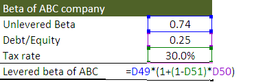

In the world of finance, understanding the concepts of unlevered beta and levered beta is crucial for risk assessment and investment decisions. These terms refer to different ways of measuring a company's risk relative to the market. Beta itself is a measure of a stock's volatility compared to the overall market, serving as a cornerstone for models such as the Capital Asset Pricing Model (CAPM). 

Unlevered beta, sometimes called asset beta, captures the risk inherent in a company's core operations, isolating it from the effects of financial leverage. It provides a purer view of business risk by focusing solely on operational factors without the influence of a company's debt levels. In contrast, levered beta takes the company's debt into account, thus representing the total risk, including financial risks stemming from its capital structure.



In the era of algorithmic trading, or algo trading, the significance of these betas has grown. Algorithmic traders leverage statistical and quantitative analyses to optimize trading strategies, and beta metrics play a significant role in this process. Understanding both unlevered and levered beta is essential for formulating strategies that align with specific risk preferences and market dynamics.

This article will explore the definitions, calculations, and implications of both unlevered and levered beta within the context of modern finance. Furthermore, we will examine how these metrics integrate into algo trading strategies, allowing for more sophisticated and informed investment decisions. Through this lens, the enduring relevance and application of beta in financial markets will become evident, highlighting its role in enhancing risk assessment and strategic execution.

## Table of Contents

## Understanding Beta in Finance

Beta is a metric used to quantify the volatility of a stock relative to the overall market. It serves as an essential tool for investors, enabling them to assess the level of risk associated with investing in a particular stock. The foundation of beta is deeply embedded within the Capital Asset Pricing Model (CAPM), a pivotal model in finance used to determine the expected return on an asset while considering its inherent risk and the time value of money.

The basic idea behind beta is to measure how much a stock's price moves in relation to the movements of the market. It provides insights into whether a stock is expected to be more or less volatile than the broader market. A beta greater than one suggests that the stock experiences greater fluctuations compared to the market, implying higher risk and potentially higher returns. Conversely, a beta less than one indicates that the stock is less volatile and, therefore, potentially less risk-prone.

The calculation of beta is typically performed using regression analysis. The changes in the stock's price are plotted against changes in the market index. Mathematically, beta can be calculated using the formula:

$$
\beta = \frac{\text{Covariance}(\text{Stock Returns}, \text{Market Returns})}{\text{Variance}(\text{Market Returns})}
$$

Where:
- $\text{Covariance}(\text{Stock Returns}, \text{Market Returns})$ measures how the stock returns vary in relation to market returns.
- $\text{Variance}(\text{Market Returns})$ represents the dispersion of market returns around their mean.

Alternatively, this relationship can be represented in a programming context to compute beta using historical price data, often obtained through financial data APIs or datasets. The Python programming language is well-suited for this task, utilizing libraries like pandas for data manipulation and numpy for numerical calculations. Here is an example of how beta might be computed using Python:

```python
import numpy as np
import pandas as pd

# Assume 'data' is a DataFrame containing historical stock prices and market index prices
stock_returns = data['Stock Price'].pct_change().dropna()
market_returns = data['Market Index'].pct_change().dropna()

# Calculating the covariance matrix
covariance_matrix = np.cov(stock_returns, market_returns)

# Extract the covariance of the stock returns and market returns
covariance_stock_market = covariance_matrix[0, 1]

# Extract the variance of the market returns
variance_market = covariance_matrix[1, 1]

# Calculate beta
beta = covariance_stock_market / variance_market
```

In interpreting beta, it's crucial for investors to acknowledge that it is a historical measure based on past performance and may not necessarily predict future [volatility](/wiki/volatility-trading-strategies). Additionally, the market index chosen as a benchmark can impact beta calculations, thus influencing the investment decision-making process. By understanding and effectively using beta, investors can make more informed decisions regarding the risk and potential return of their investment portfolios.

## Unlevered Beta: The Pure Business Risk

Unlevered beta, also referred to as asset beta, measures the risk inherent in a company's core operations, excluding the influence of debt. This metric is instrumental in providing insights into a company's business risk, as it focuses solely on operational factors and eliminates the noise created by financial leverage. By stripping out the effects of debt, unlevered beta allows investors to make cleaner comparisons across companies within the same industry, making it an essential tool for benchmarking and risk assessment.

The formula to calculate unlevered beta can be expressed as follows:

$$
\text{Unlevered Beta} = \frac{\text{Levered Beta}}{1 + \left(1 - \text{Tax Rate}\right) \times \frac{\text{Debt}}{\text{Equity}}}
$$

This formula allows analysts to adjust the traditional beta of a company, reducing it to a version that reflects only the business risk, free from the company's financial decisions regarding debt. The tax rate [factor](/wiki/factor-investing) acknowledges the tax shield provided by debt, which affects the financial risk associated with leverage.

Understanding unlevered beta is advantageous for investors who are particularly focused on the operational aspects of a company. For instance, two companies in the same industry may have similar operational risks but different levels of financial risk due to varying capital structures. By evaluating the unlevered beta, an investor can gauge the pure business risk independent of how much debt the company holds.

In summary, unlevered beta is a crucial metric for investors interested in the underlying operations of a company. It serves as a standardized measure that facilitates meaningful comparisons across firms within an industry, enhancing the ability to assess investment risk without the confounding variable of financial leverage.

## Levered Beta: The Impact of Debt

Levered beta, often referred to simply as beta, incorporates the impact of a company's use of debt on its risk profile. It provides a comprehensive measure of the total risk and potential return associated with investing in a particular company. By accounting for financial leverage, levered beta reflects both operational and financial risks.

The formula for calculating levered beta is derived from the CAPM and is typically expressed as:

$$
\beta_L = \beta_U \times \left(1 + \frac{D}{E} \times (1 - T)\right)
$$

Where:
- $\beta_L$ is the levered beta.
- $\beta_U$ is the unlevered beta, which represents the business risk without leverage.
- $D$ is the market value of the company’s debt.
- $E$ is the market value of the company's equity.
- $T$ is the corporate tax rate.

This formula shows that levered beta increases with higher levels of debt. As a company takes on more debt, its financial risk increases, which is captured by a higher beta value. Consequently, levered beta is crucial for understanding the complete risk accumulated through an investment in equity. It helps investors estimate the expected return on a risky investment by relating the risk premium demanded by investors for equity to the systematic risk of the stock.

Rising debt levels generally lead to a higher levered beta, indicating increased volatility and risk to equity holders. This occurs because financial leverage amplifies the impact of earnings variability on the equity holders, as the company is obligated to meet debt obligations regardless of its earnings performance.

Understanding levered beta is vital for stock valuation and investor decision-making. It provides insight into how stock prices are likely to fluctuate in response to changes in leverage and helps investors gauge the risk-adjusted return potential of equity investments. In essence, levered beta serves as a fundamental component in portfolio management and strategic financial planning, allowing investors to assess the risk associated with their investments comprehensively.

By integrating levered beta into their analysis, investors can make more informed decisions about portfolio diversification and risk management, ultimately enhancing their investment strategies.

## The Role of Beta in Algorithmic Trading

Algorithmic trading, commonly known as algo trading, is a trading method that uses computer algorithms to execute trades at high speeds based on predetermined criteria. These algorithms rely heavily on statistical and quantitative analysis, where metrics such as beta play an integral role in evaluating and managing risk.

Beta, particularly unlevered and levered beta, is crucial for developing and optimizing trading algorithms. Unlevered beta, reflecting the inherent business risk without debt influence, and levered beta, including the financial structure's impact, help traders understand the volatility of stocks relative to the market. This understanding allows traders to create strategies that capitalize on market movements by assessing the systematic risk associated with individual stocks.

Algo traders utilize beta metrics to evaluate stock sensitivity to market changes. For instance, when developing a trading strategy, a trader might examine a stock's levered beta to anticipate its reaction to market fluctuations. A high beta value indicates greater sensitivity, which could influence decisions regarding portfolio adjustments and hedging strategies. Algorithms can systematically analyze these metrics to optimize trade timing, asset allocation, and risk management.

Python, a favored language in finance, offers libraries like Pandas and NumPy that facilitate the calculation and analysis of beta. For example, calculating beta might involve the following steps:

```python
import pandas as pd
import numpy as np

# Assume we have historical price data for a stock and the market index
stock_returns = np.array([0.02, 0.03, 0.01, -0.01, 0.04])  # hypothetical stock returns
market_returns = np.array([0.01, 0.02, 0.00, -0.02, 0.03])  # hypothetical market returns

covariance_matrix = np.cov(stock_returns, market_returns)
beta = covariance_matrix[0, 1] / covariance_matrix[1, 1]
print(f"Calculated Beta: {beta}")
```

This code snippet demonstrates how an algorithm might compute beta, an essential step in determining a stock's relation to market movements. With this understanding, algorithms can be programmed to make real-time trading decisions, adjusting portfolios dynamically by increasing or decreasing exposure based on anticipated volatility.

The integration of beta in [algorithmic trading](/wiki/algorithmic-trading) aids in designing more robust trading systems by enhancing risk management capabilities. These strategies allow for more informed decisions, potentially leading to higher returns while managing downside risks effectively. As markets continue to evolve, the significance of these beta metrics in algo trading underlines the need for continuous refinement and adaptation of trading algorithms.

## Beta Considerations for Different Industries

Different industries demonstrate varying levels of volatility and risk, influencing how unlevered and levered beta are applied in investment decisions. Understanding these sector-specific factors is crucial for investors seeking to tailor their investment strategies effectively.

The technology sector is typically associated with high volatility, leading to higher beta values compared to more stable sectors like utilities. The high beta in technology stocks suggests that these stocks experience more pronounced price swings relative to the market. This increased volatility is attributed to factors such as rapid innovation, competitive pressures, and changing consumer preferences. Consequently, investors in technology stocks often expect significant growth potential, albeit with higher associated risk.

In contrast, the utility sector generally exhibits lower beta values, indicating less volatility compared to the broader market. Utilities provide essential services such as water, electricity, and gas, which maintain steady demand irrespective of economic cycles. The stable and regulated nature of utility companies results in predictable cash flows and lower operational risk, thereby attracting investors seeking to minimize risk exposure.

To illustrate the application of beta across industries, consider the following examples:

1. **Technology Sector**: Companies in this sector may have a beta greater than 1.5, reflecting their sensitivity to market fluctuations and economic changes. Investors must account for these higher beta values when assessing technology stocks, as they imply a higher risk and potentially higher returns.

2. **Utility Sector**: Utility companies often exhibit beta values below 0.7, indicating their lower volatility. Companies in this sector are less susceptible to market swings, making them attractive to risk-averse investors seeking stable returns.

The calculation of unlevered and levered beta requires consideration of these industry characteristics. Unlevered beta (asset beta) is calculated by stripping out the effects of financial leverage, offering insights into the inherent business risk:

$$
\text{Unlevered Beta} = \frac{\text{Equity Beta}}{1 + \left(\frac{1 - \text{tax rate}}{\text{Debt/Equity ratio}}\right)}
$$

Levered beta, on the other hand, incorporates the impact of a company's debt and financial structure, providing a comprehensive view of the total risk:

$$
\text{Levered Beta} = \text{Unlevered Beta} \times \left(1 + \left(\frac{1 - \text{tax rate}}{\text{Debt/Equity ratio}}\right)\right)
$$

By understanding these distinct characteristics and their implications, investors can make more informed decisions. Sector-specific beta considerations assist in constructing diversified portfolios that align with risk tolerance and investment goals. Tailoring strategies to account for industry volatility can enhance portfolio performance and stability.

## Conclusion

The understanding of unlevered and levered beta is a powerful tool for any investor or finance professional. These metrics provide crucial insights into company risk profiles, essential for both traditional investing and algorithmic trading. Unlevered beta offers a clear view of a company's business risk independent of its financial structure, while levered beta encapsulates the total risk including debt effects. This dual perspective is vital for evaluating potential returns and risks.

The integration of beta metrics with algorithmic trading enhances both precision and strategic execution in financial markets. Algorithmic traders can leverage these metrics for optimizing portfolios and making informed trade decisions. By understanding how stocks respond to market swings, algorithms can adjust positions efficiently, aiming for improved risk-adjusted returns.

As financial markets continue to evolve, the application of beta too grows in significance. Emerging sectors, varying economic conditions, and dynamic regulatory environments all influence beta calculations and interpretations. This underscores its enduring relevance in risk assessment and strategic planning.

Investors and traders should continuously refine their understanding of unlevered and levered beta concepts. Keeping abreast of changes in market dynamics, sectorial shifts, and technological advancements in trading can significantly enhance risk management and investment decision-making. By doing so, they can harness these metrics to capitalize on opportunities and mitigate potential risks more effectively.

## References & Further Reading

[1]: Damodaran, Aswath. ["Equity Risk Premiums (ERP): Determinants, Estimation and Implications - The 2022 Edition."](https://pages.stern.nyu.edu/~adamodar/pdfiles/papers/ERP2022Formatted.pdf) SSRN, 2022.

[2]: Damodaran, Aswath. ["Investment Valuation: Tools and Techniques for Determining the Value of Any Asset."](https://www.amazon.com/Investment-Valuation-Tools-Techniques-Determining/dp/111801152X) 3rd Edition, Wiley Finance, 2012.

[3]: ["Quantitative Equity Portfolio Management: An Active Approach to Portfolio Construction and Management"](https://www.amazon.com/Quantitative-Equity-Portfolio-Management-Second/dp/1264268920) by Ludwig B. Chincarini and Daehwan Kim

[4]: Fabozzi, Frank J., Focardi, Sergio M., Kolm, Petter N. ["Robust Portfolio Optimization and Management."](https://books.google.com/books/about/Robust_Portfolio_Optimization_and_Manage.html?id=PUnRxEBIFb4C) Wiley, 2007.

[5]: Grinold, Richard C., and Ronald N. Kahn. ["Active Portfolio Management: A Quantitative Approach for Producing Superior Returns and Controlling Risk."](https://www.amazon.com/Active-Portfolio-Management-Quantitative-Controlling/dp/0070248826) McGraw-Hill, 1999.