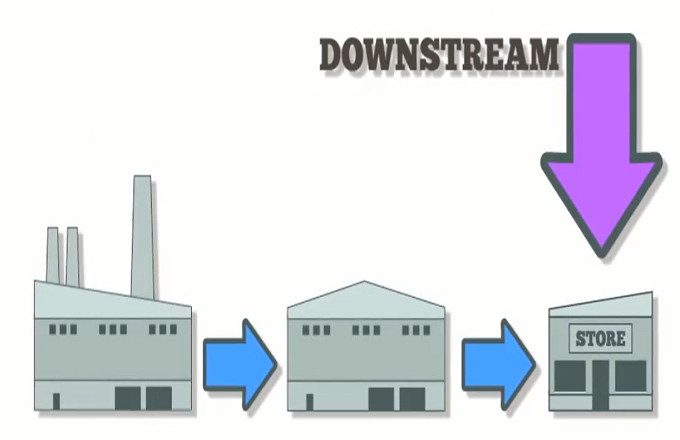

## Table of Contents

## What is the basic difference between upstream and downstream oil and gas operations?

Upstream oil and gas operations involve finding and extracting oil and gas from the earth. This part of the industry is often called exploration and production. Companies search for oil and gas deposits using various methods like seismic surveys. Once they find a promising spot, they drill wells to bring the oil and gas to the surface. This process can happen on land or offshore, and it requires a lot of specialized equipment and technology.

Downstream oil and gas operations, on the other hand, focus on what happens after the oil and gas are extracted. This includes refining the crude oil into products like gasoline, diesel, and jet fuel, as well as processing natural gas for use in homes and businesses. Downstream operations also involve transporting these products to where they are needed, such as gas stations and power plants. The goal is to turn raw materials into usable products that people can buy and use every day.

## What are the primary activities involved in upstream oil and gas operations?

Upstream oil and gas operations start with exploration. Companies use tools like seismic surveys to look deep into the earth and find places where oil and gas might be hiding. They study the data to decide where to drill. Once they find a good spot, they start drilling wells to reach the oil and gas trapped underground. This can happen on land or out at sea, where they use big platforms to drill in the ocean.

After drilling, the next step is to get the oil and gas out of the ground. This is called production. Companies use pumps and other equipment to bring the oil and gas up to the surface. Sometimes, they need to use special methods to help the oil flow better, like injecting water or steam into the well. Once the oil and gas are out, they are sent to be processed and turned into products we use every day.

## What are the main processes in downstream oil and gas operations?

Downstream oil and gas operations start with refining. This means taking the raw oil and turning it into useful things like gasoline, diesel, and jet fuel. They do this at big factories called refineries. At the refinery, they heat up the oil and separate it into different parts. Each part can be used to make different products. They also clean up the oil to make sure it's safe to use.

After refining, the next step is to get these products to people who need them. This is called distribution. They use pipelines, trucks, trains, and ships to move the products around. Gasoline goes to gas stations, jet fuel goes to airports, and other products go where they are needed. The last part of downstream operations is selling the products. This can happen at gas stations, stores, or through big deals with other companies. The goal is to make sure people can easily buy and use these products every day.

## How do the risk profiles differ between upstream and downstream sectors?

The risk profiles in the upstream sector are generally higher than in the downstream sector. Upstream operations involve exploration and drilling, which can be very risky. Companies might spend a lot of money looking for oil and gas but find nothing. Drilling can also be dangerous, with risks like oil spills, blowouts, and accidents on drilling rigs. These risks can harm the environment and cost a lot of money to fix. Also, the price of oil and gas can change a lot, which makes it hard for upstream companies to plan and make money.

In contrast, the downstream sector tends to have lower risks but still faces its own challenges. Downstream operations include refining and distribution, which are more predictable than finding and drilling for oil. However, refineries can be expensive to build and maintain, and there are risks of accidents or equipment failures that can cause fires or explosions. The downstream sector also depends on the demand for products like gasoline, which can change with economic conditions or new laws about the environment. While the risks might be lower, they still require careful management to keep operations safe and profitable.

## What are the typical profit margins in upstream versus downstream operations?

Upstream operations, which involve finding and drilling for oil and gas, can have big swings in profit margins. When oil prices are high, upstream companies can make a lot of money because they sell their oil and gas at a good price. But when oil prices drop, their profits can go down fast. Upstream companies also spend a lot of money on exploration and drilling, so if they don't find oil or gas, they can lose money. This makes their profit margins less predictable and more risky.

Downstream operations, like refining and selling oil products, usually have more stable profit margins. Refineries turn [crude oil](/wiki/crude-oil) into things like gasoline and diesel, and they can make money even when oil prices change. They do this by adjusting what they make and how they sell it. But downstream companies still need to watch out for costs, like running refineries and moving products around. Their profit margins might not be as high as upstream during good times, but they are usually more steady and less risky.

## How does the environmental impact vary between upstream and downstream oil and gas activities?

Upstream oil and gas activities, which include exploring for and drilling oil and gas, can have a big impact on the environment. When companies drill, they might accidentally spill oil into the sea or onto the land. These spills can harm animals, plants, and water. Also, drilling uses a lot of energy and can release gases like methane into the air, which is bad for the climate. The places where they drill can also be disturbed, changing the natural habitat for wildlife.

Downstream activities, like refining oil and moving it around, also affect the environment but in different ways. Refineries can pollute the air and water around them. They release gases and chemicals that can make the air dirty and harm people's health. When oil products are moved around, there's a risk of spills from trucks, trains, or pipelines. These spills can also hurt the environment. But, downstream operations usually have less of an impact on big, wild areas compared to upstream drilling.

## What technologies are commonly used in upstream oil and gas extraction?

In upstream oil and gas extraction, one of the main technologies used is seismic surveying. This is when companies use special equipment to send sound waves into the ground. The sound waves bounce back and help them see what's under the earth. They look for places where oil and gas might be trapped. Once they find a good spot, they use drilling rigs to dig deep into the ground. These rigs can be huge machines on land or big platforms out at sea. They drill down to reach the oil and gas and bring it up to the surface.

Another important technology in upstream extraction is hydraulic fracturing, often called fracking. This is used to get oil and gas out of tight rocks. They pump a mix of water, sand, and chemicals into the well at high pressure. This cracks the rocks and lets the oil and gas flow out. Companies also use enhanced oil recovery methods to get more oil out of old wells. They might inject steam, water, or chemicals into the ground to push the oil towards the well. All these technologies help make upstream extraction more efficient but can also have big effects on the environment.

## What are the key refining processes in downstream operations and their purposes?

In downstream oil and gas operations, one of the main refining processes is called distillation. This is when they heat up the crude oil in a big tower. The heat makes the oil turn into a gas, and as it rises up the tower, it cools down and turns back into a liquid. Different parts of the oil turn back into liquid at different temperatures, so they can separate it into things like gasoline, diesel, and jet fuel. Distillation is important because it splits the oil into useful products that people need every day.

Another key process is called cracking. This is used to break big molecules in the oil into smaller ones. They heat up the oil or use special chemicals to do this. Cracking helps make more gasoline from the oil, which is really important because a lot of people use gasoline in their cars. It also helps make other products like plastics. The last main process is called hydrotreating. This is when they use hydrogen to clean up the oil and remove bad things like sulfur. Hydrotreating makes the oil safer and better for the environment when people use it.

## How do regulatory frameworks affect upstream and downstream operations differently?

Upstream operations, like exploring for and drilling oil and gas, are heavily affected by rules that aim to protect the environment. Governments make laws about where companies can drill, how they can drill, and what they need to do if something goes wrong, like an oil spill. These rules can make it harder and more expensive for upstream companies to work. They might need special permits to drill in certain places, and they have to follow strict safety rules to keep the environment safe. If the rules change, it can make upstream companies change their plans or even stop working in some areas.

Downstream operations, like refining oil and moving products around, also have to follow a lot of rules, but they are different from upstream rules. Governments make laws about how refineries can work to keep the air and water clean. They also have rules about how to safely move oil and gas products, like using pipelines or trucks. These rules can affect how much it costs to run a refinery and how they can sell their products. Downstream companies need to keep up with changes in these rules to make sure they can keep working and selling their products without breaking the law.

## What are the current trends in upstream oil and gas exploration and production?

One big trend in upstream oil and gas exploration and production is the use of new technology to find and drill for oil and gas in harder places. Companies are using better seismic surveys to see deep under the ground or the ocean floor. They can find oil and gas where it was too hard to find before. Also, they are using more fracking to get oil and gas out of tight rocks. This helps them reach oil and gas that used to be too hard to get. These technologies make it possible to keep finding and producing oil and gas, even when the easy places are already used up.

Another trend is focusing on making upstream operations more environmentally friendly. Companies are trying to reduce the amount of methane and other gases they release into the air. They are using better equipment and methods to capture these gases instead of letting them escape. Also, there is more interest in renewable energy, so some companies are looking at ways to use less oil and gas and more clean energy. This can help them meet new rules and keep people happy about the environment. Even though oil and gas are still important, companies are working to be cleaner and more responsible in how they find and produce them.

## How do market dynamics influence the strategies of companies in upstream versus downstream sectors?

Market dynamics, like the price of oil and how much people want it, really affect what upstream companies do. When oil prices are high, upstream companies make more money, so they might decide to explore new places or drill more wells. They can take bigger risks because the rewards are bigger. But when oil prices go down, upstream companies need to be careful. They might cut back on spending and focus on keeping their costs low. They might also try to sell their oil and gas to different places to get the best price. Upstream companies always need to watch the market closely and change their plans to make sure they can keep making money.

Downstream companies, which turn oil into things like gasoline and sell it, also need to pay attention to the market but in different ways. When oil prices are high, their costs go up, so they might need to charge more for their products. But they have to be careful because if they charge too much, people might not buy as much. When oil prices are low, downstream companies can make more money if they can keep their costs down and sell a lot of products. They also need to think about what people want. If more people want cleaner fuels or electric cars, downstream companies might need to change what they make and sell. So, they always need to be ready to adjust to what's happening in the market and what people want.

## What future innovations are expected to impact the upstream and downstream oil and gas industries?

In the upstream oil and gas industry, future innovations are expected to focus on making it easier to find and drill for oil and gas in tough places. One big innovation is better technology for seismic surveys. This means companies can see deeper and more clearly under the ground or ocean floor to find oil and gas. Another important innovation is in drilling technology, like using robots and automation to drill wells more safely and quickly. Also, there will be more use of [artificial intelligence](/wiki/ai-artificial-intelligence) to help make decisions about where to drill and how to get the most oil and gas out of the ground. These innovations can help upstream companies find and produce oil and gas even when the easy places are already used up.

For the downstream oil and gas industry, future innovations will focus on making refineries cleaner and more efficient. One big trend is the use of advanced refining technologies that can turn more of the oil into useful products like gasoline and diesel. Another innovation is in using more renewable energy to power refineries, which can help reduce their impact on the environment. Downstream companies will also use more automation and digital tools to keep their operations running smoothly and safely. As people want cleaner fuels and less pollution, downstream companies will need to find new ways to make and sell their products that meet these new demands.

## References & Further Reading

[1]: Yergin, D. (1991). ["The Prize: The Epic Quest for Oil, Money & Power"](https://www.amazon.com/Prize-Epic-Quest-Money-Power/dp/1439110123). Free Press.

[2]: Hyne, N. J. (2018). ["Nontechnical Guide to Petroleum Geology, Exploration, Drilling, and Production"](https://www.semanticscholar.org/paper/Nontechnical-Guide-to-Petroleum-Geology%2C-Drilling-%26-Hyne/7acacec71061739f54965e1e918999988deeb4fb) (3rd ed.). PennWell Corporation.

[3]: Ghosh, S. (2017). ["Algorithmic Trading & DMA: An Introduction to Direct Access Trading Strategies"](https://www.amazon.com/Algorithmic-Trading-DMA-introduction-strategies/dp/0956399207). 4Myeloma Press.

[4]: Seyhun, H. N. (2021). ["Investment Intelligence from Insider Trading"](https://direct.mit.edu/books/book/2765/Investment-Intelligence-from-Insider-Trading). MIT Press.

[5]: Rehring, C., & Wachtel, S. (2019). ["Oil Trading and Price Risk Management"](https://pubmed.ncbi.nlm.nih.gov/30959224/). Risk Books.