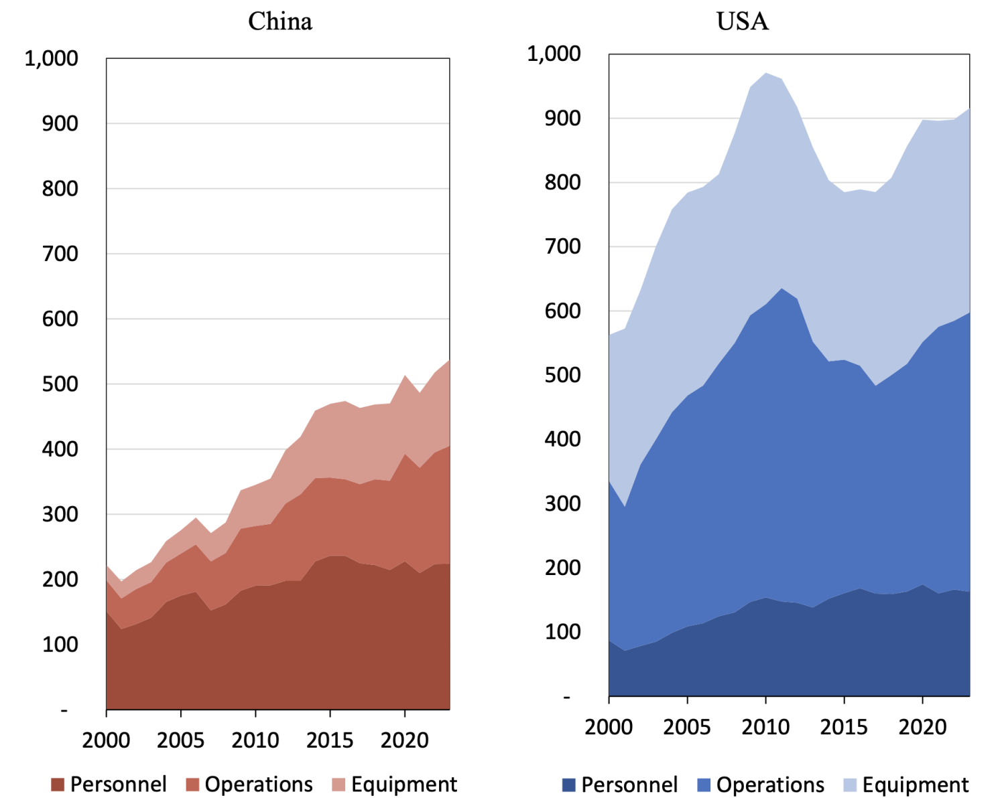

The focus on military spending by the United States and China has become a critical area of analysis, particularly due to its implications on both global security and economic stability. Military expenditure, often referred to as the defense budget, is a significant allocation within a nation's fiscal plan dedicated to maintaining and enhancing armed forces' capabilities. This spending covers a broad range of needs, including personnel, research and development, procurement of weapons, and maintenance of facilities.

In recent years, the defense budgets of the US and China have been watched closely, as they reflect the strategic priorities and military ambitions of these leading global powers. The United States has historically invested substantial resources in maintaining a technologically advanced military, aiming to uphold its global strategic interests. China's military expenditures, on the other hand, have been increasing rapidly, indicating its intent to modernize its forces and expand its influence.



The relevance of algorithmic trading in this context arises from the impact that defense budget announcements can have on the financial markets, particularly on stocks of companies in the defense sector. Algorithmic trading refers to the use of complex algorithms and quantitative models to execute trades at high speeds, often capitalizing on minute market fluctuations. In the case of defense stocks, sophisticated algorithms allow investors to respond swiftly to budget announcements and anticipated changes in military spending, thus optimizing financial outcomes.

The aim of this article is to analyze and compare the military expenditures of the US and China, exploring the underlying economic and political factors, as well as their broader implications on the financial markets. This exploration will include a review of how military spending influences global economic dynamics and the role that algorithmic trading plays in monitoring and capitalizing on changes in defense stocks. Through this analysis, we aim to provide insights into the ongoing developments in military spending and their relevance to both national security and economic sectors.

## Table of Contents

## Comparative Analysis of US and China Defense Budgets

The defense budgets of the United States and China represent significant allocations of national resources, highlighting their strategic priorities and global influence. As of the latest data, the United States maintains the largest defense budget in the world, with its 2023 military expenditure estimated at approximately $813 billion. This budget underlines its global military commitments, technological advancements, and ongoing modernization programs. In contrast, China's defense budget for 2023 is estimated at around $230 billion, making it the second-largest in the world. Although China's budget is significantly less than that of the US, it reflects substantial growth over recent decades, indicative of its desire to enhance its military capabilities and regional influence.

### Military Modernization Programs

Both countries have invested heavily in military modernization. The United States focuses on maintaining technological superiority and strategic versatility, investing in advanced weaponry, cyberwarfare capabilities, and modernization of its nuclear arsenal. The Pentagon’s initiatives include the development of next-generation aircraft, naval vessels, and missile defense systems. 

China's military modernization is driven by its strategic objectives of regional dominance and deterrence. The People's Liberation Army (PLA) has focused on modernizing its naval capabilities, developing hypersonic weaponry, and advancing its cyber and space warfare capabilities. China's rapid advancements in these areas suggest a strategic pivot towards becoming a significant global military power.

### Historical Growth Patterns

Historically, the US defense budget has experienced fluctuations, influenced by its international engagements and economic conditions. The post-9/11 era saw significant increases to support operations in Iraq and Afghanistan. However, recent trends show a shift towards recalibrating military presence globally, with a focus on technological innovation rather than large-scale troop deployments.

China’s defense spending has grown consistently over the last two decades, reflecting its expanding economy and strategic ambitions. The double-digit growth rates in defense budgets from the early 2000s highlight a significant transformation in the PLA’s capabilities, aligning with China's broader national rejuvenation goals.

### Economic and Political Factors

Several economic and political factors influence these defense budgets. In the United States, the defense budget is often a subject of political debate, balancing national security needs with fiscal responsibility. Economic conditions, such as GDP growth and public debt, also play crucial roles in budget decisions. 

China's defense spending is largely driven by its economic growth and strategic priorities. The political leadership's focus on national security and military modernization is influenced by regional security dynamics, notably tensions in the South China Sea and Taiwan Strait. Additionally, China's Belt and Road Initiative (BRI) underscores the military’s role in securing its overseas investments and infrastructure projects.

In conclusion, while both nations pursue different strategic goals, their defense budgets and modernization programs are essential to understanding their global influence and military capabilities. These financial commitments not only dictate their current military readiness but also shape future geopolitical landscapes.

## Economic Implications of Military Spending

Military spending significantly impacts a nation's economy, beginning with its contribution to the Gross Domestic Product (GDP). The percentage of GDP allocated to defense affects economic growth, employment, and industrial development. In the United States, military expenditure constitutes a notable portion of GDP, reportedly 3.7% in 2021, highlighting the sector's substantial role in the national economy (Stockholm International Peace Research Institute, 2023). Comparatively, China invests approximately 1.7% of its GDP in military spending, reflecting a different economic approach while still maintaining rapid growth in defense capabilities.

One vital aspect of military expenditure is its comparison with other economic sectors within each country. In the U.S., defense spending rivals major sectors such as healthcare and education, often surpassing them in federal budget allocations. This heavy investment underscores the emphasis on maintaining technological superiority and readiness in military capabilities. Meanwhile, in China, although the defense budget is smaller relative to GDP, it competes with significant sectors like technology and infrastructure, demonstrating a balanced approach to fostering both economic development and military enhancement.

Military spending also shapes global economic dynamics, influencing trade, investment, and industrial cooperation. The U.S. and China's military budgets affect global supply chains, especially in defense-related industries like aerospace, electronics, and cybersecurity. These expenditures drive technological innovation and industrial growth, often resulting in spinoff technologies that benefit civilian markets. Moreover, defense spending stimulates international arms markets, contributing to shifts in geopolitical alliances and trade relationships.

The global economic landscape is further influenced by how military spending affects international investment flows. Countries with substantial defense budgets often attract foreign direct investment (FDI) in related industries due to perceived stability and potential for growth. Additionally, defense collaborations and the export of military technology can create economic interdependencies that transcend national borders.

In summary, military spending plays a multifaceted role in economic structures. It contributes to GDP, influences sectoral budget priorities, and alters global economic interactions. Understanding these implications provides insight into national priorities and the interplay between economic strategies and defense policies.

## Algorithmic Trading and Defense Stocks

Algorithmic trading, often synonymous with high-frequency trading, utilizes complex algorithms to execute trades based on predetermined criteria, enabling rapid decision-making processes and often surpassing human capabilities. In the context of financial markets, [algorithmic trading](/wiki/algorithmic-trading) plays a significant role by analyzing vast amounts of data to identify market trends and execute trades with minimal delay.

In the defense sector, algorithmic trading capitalizes on defense budget announcements, which can significantly impact stock prices of defense-related companies. When a defense budget is announced, especially by nations such as the United States or China, it can trigger algorithmic trading strategies that anticipate changes in defense sector stocks. These algorithms may incorporate factors such as change in military expenditure, geopolitical tensions, and technological advancements cited in the budget.

To illustrate the impact of defense budget announcements on stock prices, consider the case study of a major U.S. defense budget proposal. When such an announcement is made, defense stocks generally exhibit rapid price movements, influenced by the anticipated impact of allocated funds on defense projects and contracts. Algorithmic trading systems swiftly analyze the announcement data, historical trends, and economic indicators to adjust their trading strategies accordingly. For example, if a significant increase in cybersecurity spending is noted, algorithms may prioritize buying shares in companies specializing in cybersecurity.

A practical implementation of algorithmic trading can utilize Python libraries such as `pandas` for data analysis, `numpy` for numerical calculations, and `alpaca_trade_api` for executing trades. A simple pseudocode for such an algorithm might look like this:

```python
import pandas as pd
import numpy as np
from alpaca_trade_api import REST
import datetime

# Initialize API
api = REST('your_api_key', 'your_secret_key', base_url='https://paper-api.alpaca.markets')

# Function to analyze budget data and execute trades
def trade_on_defense_budget(budget_impact_data):
    # Evaluate sectors with impact
    defense_sectors = ['aerospace', 'cybersecurity']

    # Analyze stock data for relevant companies
    for sector in defense_sectors:
        stocks = budget_impact_data.get_companies(sector)
        for stock in stocks:
            price_movement = predict_price_movement(stock)
            if price_movement > threshold:
                api.submit_order(
                    symbol=stock,
                    qty=10,
                    side='buy',
                    type='market',
                    time_in_force='gtc'
                )

# Predict stock price movements based on historical data
def predict_price_movement(stock):
    historical_data = api.get_barset(stock, 'day', limit=5).df
    price_change = historical_data['close'].pct_change().mean()
    return price_change

# Execute trading function with budget data
budget_impact_data = pd.read_csv('defense_budget_impact.csv')
trade_on_defense_budget(budget_impact_data)
```

This simplified example demonstrates how algorithmic trading systems can process data to make trading decisions based on defense budget announcements. By leveraging technology and data analytics, traders can identify and exploit opportunities arising from fluctuations in defense expenditures, ultimately influencing not only defense stocks but also broader market dynamics.

## Geopolitical Considerations

Military spending by the United States and China is influenced significantly by their geopolitical strategies, as these investments are essential tools for asserting global power and safeguarding national interests. Defense budgets are not merely fiscal expenditures; they are strategic allocations aimed at maintaining or enhancing a country's influence and readiness in the international arena.

### Military Spending and Geopolitical Strategies

Military budgets often reflect the geopolitical aims of a nation. For the United States, maintaining a substantial military presence globally is crucial to its strategy of ensuring its dominance and fulfilling commitments to allies. This is evident in its expansive network of military bases worldwide, particularly in regions like Europe and the Pacific, where strategic competitor interests are most pronounced. Conversely, China's military spending reveals its aim to assert regional dominance and extend its influence, underlined by initiatives like the Belt and Road Initiative, which are bolstered by growing military prowess.

### Military Capabilities and International Relations

The role of military capabilities in shaping international relations is profound. The United States, with its advanced technological capabilities and a comprehensive nuclear triad, remains a central figure in global diplomacy. Its capability to project power anywhere in the world acts as a deterrent and an assurance to its allies. China, on the other hand, is rapidly modernizing its military forces, focusing on enhancing naval power and cyber warfare capabilities to secure its maritime claims and interests, particularly in the South China Sea.

This assertiveness in military modernization impacts global strategic calculations, as nations must navigate between cooperation and competition. For instance, the US’s continued arms sales to Taiwan serve as both a deterrent against potential Chinese aggression and a focal point of tensions between the US and China.

### Potential Flashpoints and Military Readiness

Potential flashpoints that could escalate military engagements between these nations or with others include territorial disputes, economic sanctions, and cyber threats. The South China Sea continues to be a significant area of contention, with overlapping territorial claims involving China and several ASEAN countries. The United States’ Freedom of Navigation operations in these contested waters underscore the strategic chess game that military readiness demands.

On military readiness, both nations demonstrate high levels of preparedness. The United States maintains a state of readiness capable of rapid deployment, supported by its extensive logistics and global alliances. Meanwhile, China has been investing significantly in enhancing its readiness levels, through reforms aimed at improving joint operations and training exercises that mirror realistic combat scenarios.

In conclusion, the military spending of the United States and China is a decisive indicator of each nation's strategic posture and geopolitical ambitions. Their military capabilities play a pivotal role in shaping international relations, either as stabilizing forces or potential sources of conflict. Understanding these dynamics is essential for anticipating how the global security landscape will evolve in the coming years.

## The Future of Military Spending

Predicted trends in the military budgets of the United States and China suggest sustained or increasing expenditures, influenced by geopolitical tensions and technological innovations. The U.S. and China, as major global military powers, often adjust their defense budgets based on perceived threats and strategic interests. Forecasting indicates that both nations will likely continue enhancing their military capabilities, albeit through slightly different trajectories and with various external factors potentially acting as moderating influences.

**Technological Advancements Shaping Future Military Requirements**

Technological progress significantly shapes defense strategies, with investment increasingly directed toward advanced fields such as [artificial intelligence](/wiki/ai-artificial-intelligence) (AI), hypersonic weapons, and cybersecurity. The U.S. Department of Defense (DoD) prioritizes maintaining a technological edge through initiatives like the Joint Artificial Intelligence Center (JAIC) and significant funding toward research and development (R&D) in unmanned systems. Similarly, China envisions a transformation of its military forces through the "Military-Civil Fusion" strategy, integrating civilian technological advances like AI and quantum computing into military applications.

The continuous evolution of warfare technologies compels these countries to allocate substantial portions of their budgets to securing technological superiority. This necessity reinforces rising defense expenditures as emerging domains, such as space warfare and electromagnetic spectrum operations, demand novel and costly military capabilities.

**The Role of International Agreements and Treaties in Controlling Defense Spending**

International treaties and agreements can significantly influence military spending by imposing restrictions or encouraging transparency and stability. Arms control agreements, such as the New START treaty between the U.S. and Russia or the potential for new accords involving China, aim to limit the proliferation and development of certain weapon systems. While these frameworks intend to promote global security, their impact on actual defense spending varies.

The U.S. and China’s participation in global forums or bilateral dialogues may lead to more comprehensive arms control measures that influence future budget allocations. However, compliance with international agreements often depends on verification mechanisms and the geopolitical climate, highlighting challenges in enforcing spending constraints.

Overall, future military spending by the U.S. and China will likely reflect a balance between ensuring technological superiority and adhering to international norms and agreements. Although predictive models point toward increased budgets, global diplomatic engagements and strategic defense initiatives could also shape expenditure levels in unforeseen ways. As such, understanding these dynamics is crucial for anticipating changes in defense allocations and preparing for their implications on global security and economic landscapes.

## Conclusion

The comparative analysis of military expenditures between the United States and China highlights significant strategic and economic implications for both nations and the global landscape. The data indicates that both countries have consistently prioritized defense spending, albeit through different trajectories and motivations. The United States, often leading in absolute spending figures, emphasizes maintaining and expanding its global military presence and technological superiority. Meanwhile, China focuses on modernizing its armed forces to match its growing geopolitical influence, reflecting its strategic shift from quantity to quality in defense investments.

The impact of these defense budgets extends beyond national borders, influencing global security and economic stability. Military spending, while bolstering national defense capabilities, also contributes significantly to each country's GDP and creates ripple effects across various sectors, particularly in technology and manufacturing. The correlation between defense expenditures and economic performance underscores the need for a balanced approach that secures national interests while ensuring economic growth and sustainability.

Furthermore, innovation plays a critical role in both the defense and financial sectors. In defense, advancements such as artificial intelligence, cybersecurity, and unmanned systems are becoming increasingly integral, promising to redefine future military landscapes. In the financial sector, algorithmic trading leverages defense budget announcements to optimize investment strategies and manage risks, thus underscoring the interconnectedness between military spending and financial markets.

Ultimately, the continuous evolution of military requirements and financial practices underlines the importance of adaptive strategies. Nations must navigate the complexities of maintaining robust defense capabilities while fostering economic growth, leveraging technological advancements, and adhering to international diplomatic agreements. This delicate balance is crucial not only for national security but also for ensuring global peace and economic resilience.

## References & Further Reading

[1]: Stockholm International Peace Research Institute. (2023). ["SIPRI Military Expenditure Database."](https://www.sipri.org/databases/milex) 

[2]: International Institute for Strategic Studies. (2023). ["The Military Balance 2023."](https://www.iiss.org/publications/the-military-balance/the-military-balance-2023/)

[3]: Lopez de Prado, M. (2018). ["Advances in Financial Machine Learning."](https://www.amazon.com/Advances-Financial-Machine-Learning-Marcos/dp/1119482089) Wiley.

[4]: Chan, E. P. (2009). ["Quantitative Trading: How to Build Your Own Algorithmic Trading Business."](https://github.com/ftvision/quant_trading_echan_book) Wiley.

[5]: Thomson, E. (2019). ["US-China Military Scorecard: Forces, Geography, and the Evolving Balance of Power."](https://www.rand.org/pubs/research_reports/RR392.html) RAND Corporation.