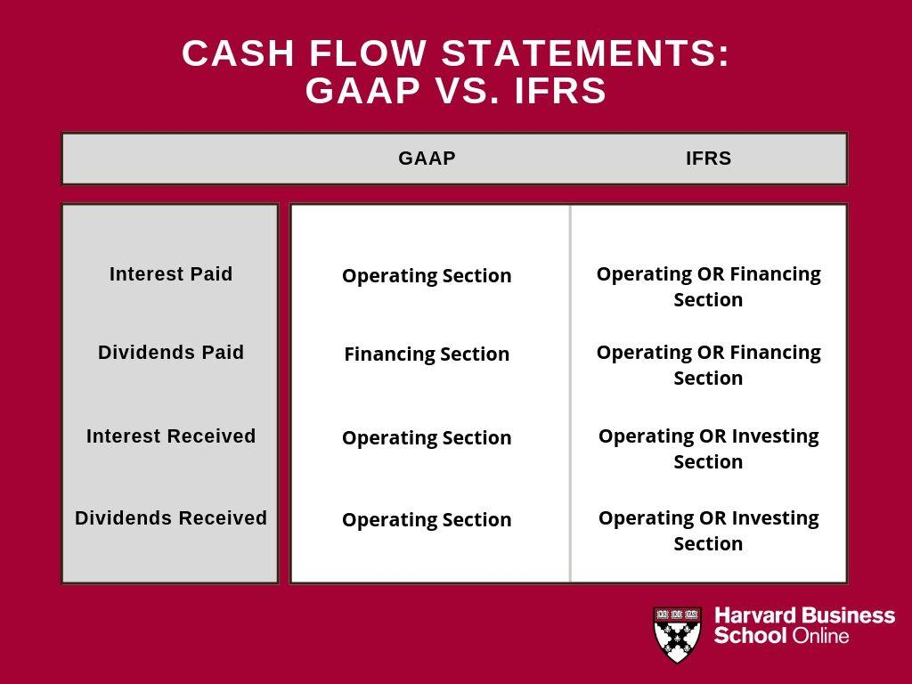

## Table of Contents

## What are the basic differences between US GAAP and IFRS?

US GAAP and IFRS are two different sets of accounting rules used around the world. US GAAP stands for Generally Accepted Accounting Principles and is mainly used in the United States. IFRS, or International Financial Reporting Standards, is used in many other countries. One big difference is that US GAAP has more detailed rules, while IFRS gives companies more freedom to use their judgment when reporting financial information.

Another key difference is how the two systems treat inventory. Under US GAAP, companies can use a method called LIFO (Last In, First Out) to value their inventory. This means they can assume the most recent items they bought are the first ones they sold. IFRS does not allow LIFO. Instead, it uses methods like FIFO (First In, First Out) or weighted average cost, which can lead to different values for inventory and cost of goods sold.

Lastly, the way these systems handle development costs is different. Under US GAAP, most research and development costs must be expensed immediately, meaning they are recorded as costs right away. On the other hand, IFRS allows companies to capitalize some development costs, meaning they can spread these costs over time as an asset on the balance sheet. This can make a big difference in how profitable a company looks on paper.

## How do US GAAP and IFRS differ in their approach to revenue recognition?

US GAAP and IFRS have different ways of recognizing revenue, but they've become more similar over time. Under US GAAP, revenue is recognized when it's earned and realizable, meaning the company has done what it needs to do to earn the money and it's likely they'll get paid. IFRS also focuses on when revenue is earned, but it uses a principle called "control" to decide when that happens. This means revenue is recognized when the customer gets control of the good or service. Both systems now follow a five-step model for revenue recognition, which was introduced to make them more alike.

Even though they use a similar model, there are still some differences. For example, under US GAAP, if a company sells a product with a right of return, they have to estimate and record a liability for potential returns right away. IFRS also requires an estimate for returns, but it's a bit more flexible on how to account for it. Another difference is in the treatment of licensing revenue. US GAAP can be more complex, with different rules depending on whether the license is for a right to use or a right to access the IP. IFRS tends to be simpler, focusing on whether the company keeps doing things to support the license over time.

## What are the key differences in inventory accounting under US GAAP versus IFRS?

US GAAP and IFRS have different rules for how companies can value their inventory. Under US GAAP, companies can use a method called LIFO, which stands for Last In, First Out. This means they can say the most recent items they bought are the first ones they sold. This can be helpful for tax purposes because it can lower taxable income when prices are going up. IFRS doesn't allow LIFO. Instead, it requires companies to use methods like FIFO (First In, First Out) or the weighted average cost. This means they have to say the oldest items they bought are the first ones they sold, or they can use an average cost of all items.

Another difference is how these systems treat the write-down of inventory. Under US GAAP, if the value of inventory goes down, it can be written down to a lower value, but if the value goes back up later, it can't be written back up. IFRS is more flexible here. If the value of inventory goes down and is written down, but then the value goes back up, the inventory can be written back up to its new value. This means that under IFRS, the value of inventory on the balance sheet can change more often than under US GAAP.

## How do the treatments of property, plant, and equipment differ between US GAAP and IFRS?

US GAAP and IFRS have different ways of dealing with property, plant, and equipment. Under US GAAP, these assets are always recorded at their original cost minus any depreciation and impairment losses. This means that even if the value of the property goes up over time, it stays on the books at what was paid for it. On the other hand, IFRS allows companies to choose between keeping the asset at its original cost or revaluing it to its current fair value. If a company chooses to revalue, any increase in value can be shown on the balance sheet, which can make the company look more valuable.

Another difference is how these systems handle depreciation and impairments. Both US GAAP and IFRS require that property, plant, and equipment be depreciated over their useful lives, but IFRS gives more flexibility in choosing the method of depreciation. For impairments, US GAAP uses a two-step test to see if an asset's value has gone down permanently, and once an impairment is recognized, it can't be reversed. IFRS uses a one-step test and allows for the reversal of impairments if the value of the asset goes back up. This means that under IFRS, the value of these assets on the balance sheet can change more often than under US GAAP.

## What are the differences in lease accounting standards between US GAAP and IFRS?

US GAAP and IFRS have different rules for how companies should account for leases. Under US GAAP, leases are split into two types: operating leases and finance leases. Operating leases are like renting, where the cost is spread out over time and shown as an expense. Finance leases are more like buying something with a loan, where the asset and the loan are both shown on the balance sheet. IFRS also splits leases into two types, but they're called operating leases and finance leases too. However, IFRS has a bit more flexibility in deciding which type a lease is, and it focuses more on whether the lease transfers most of the risks and rewards of ownership to the lessee.

Another big difference is how these systems treat the accounting for leases. Under US GAAP, companies have to record a right-of-use asset and a lease liability for all leases longer than a year, but the way they're recorded can be different for operating and finance leases. IFRS also requires companies to record a right-of-use asset and a lease liability for all leases, but the way they handle the ongoing accounting for these leases can be more straightforward. For example, IFRS doesn't have as many detailed rules for separating lease and non-lease components, which can make things simpler for companies to report.

## How do US GAAP and IFRS handle financial instruments differently?

US GAAP and IFRS have different ways of dealing with financial instruments like stocks, bonds, and loans. Under US GAAP, financial instruments are divided into categories like held-to-maturity, trading, and available-for-sale. Each category has its own rules for how to show them on the balance sheet and how to record changes in their value. For example, held-to-maturity securities are recorded at their original cost, while trading securities are recorded at their current market value, with changes in value shown in the income statement. IFRS uses a different system with categories like amortized cost, fair value through profit or loss, and fair value through other comprehensive income. This means that under IFRS, companies have more options for how they can classify their financial instruments, and the rules for showing changes in value can be different.

Another big difference is how these systems handle impairments of financial instruments. Under US GAAP, if a financial instrument loses value and it's not likely to recover, the company has to record an impairment loss. Once an impairment is recorded, it can't be reversed even if the value goes back up. IFRS is more flexible here. If a financial instrument is impaired, the company records the loss, but if the value goes back up later, the impairment can be reversed. This means that under IFRS, the value of financial instruments on the balance sheet can change more often than under US GAAP. This can make a big difference in how a company's financial health looks on paper.

## What are the implications of the differences in consolidation standards between US GAAP and IFRS?

US GAAP and IFRS have different ways of deciding when a company needs to include another company's financials in its own reports, which is called consolidation. Under US GAAP, a company has to consolidate another company if it has control over it, which usually means owning more than half of the voting shares. But it's not just about owning shares; US GAAP also looks at whether the company can make decisions for the other company. IFRS also uses the idea of control for consolidation, but it's more flexible. IFRS says a company has control if it has power over the other company, gets benefits from it, and can affect those benefits with its power. This means that under IFRS, a company might have to consolidate another company even if it doesn't own most of the shares, as long as it has the power to control it.

The differences in these rules can make a big impact on how a company's financials look. If a company has to consolidate another company under IFRS but not under US GAAP, its balance sheet and income statement will look bigger and more complex. This can affect how investors see the company, because it changes the numbers they see. Also, because IFRS gives more room for judgment in deciding what counts as control, companies might have more ways to show their financials in a way that looks good to them. This can make it harder for people to compare companies that use different rules, and it might make some companies look more or less risky than they really are.

## How do impairment rules for long-lived assets differ under US GAAP and IFRS?

US GAAP and IFRS have different rules for deciding when long-lived assets like buildings or machines have lost value, which is called impairment. Under US GAAP, a company has to do a two-step test to see if an asset is impaired. First, they look at the total value of the asset group it's part of. If that value is less than what's on the books, they move to the second step, where they compare the asset's fair value to what's on the books. If the fair value is lower, they record an impairment loss. Once an impairment is recorded, it can't be reversed even if the asset's value goes back up later. 

IFRS uses a simpler one-step test for impairment. They compare the carrying amount of the asset to its recoverable amount, which is the higher of the asset's fair value minus costs to sell, or its value in use. If the carrying amount is higher than the recoverable amount, the asset is impaired, and the company records a loss. Unlike US GAAP, IFRS allows companies to reverse impairments if the asset's value goes back up later. This means that under IFRS, the value of long-lived assets on the balance sheet can change more often than under US GAAP.

## What are the differences in the treatment of income taxes under US GAAP and IFRS?

US GAAP and IFRS have different ways of dealing with income taxes. Under US GAAP, companies use something called the asset and liability approach. This means they look at the difference between what they've paid in taxes and what they owe, and they record this as either a deferred tax asset or a deferred tax liability. They also have to consider things like valuation allowances, which are like safety nets to make sure the deferred tax assets will actually be useful in the future. If it's not likely that the company will make enough money to use up the deferred tax assets, they have to lower their value.

IFRS also uses the asset and liability approach for income taxes, but it's a bit simpler. Like US GAAP, IFRS looks at the difference between taxes paid and taxes owed, and records deferred tax assets and liabilities. But IFRS doesn't have the same strict rules about valuation allowances. Instead, IFRS says companies should only record a deferred tax asset if it's likely they'll make enough money to use it up. This means that under IFRS, companies might not have to lower the value of their deferred tax assets as often as they would under US GAAP.

## How do the standards for business combinations vary between US GAAP and IFRS?

US GAAP and IFRS have different rules for how companies should account for business combinations, which is when one company buys another. Under US GAAP, when a company buys another one, it has to record all the assets and liabilities of the bought company at their fair value on the day of the purchase. This means the buying company has to figure out how much everything is worth, including things like buildings, machines, and even things you can't touch like brand names or customer lists. US GAAP also has special rules for how to handle any extra money the buying company paid over the fair value of the assets and liabilities, which is called goodwill. This goodwill stays on the books and gets checked for problems every year.

IFRS also says that when a company buys another one, it should record the assets and liabilities at their fair value on the day of the purchase. But IFRS gives companies a bit more time to figure out those values, up to a year after the purchase. Like US GAAP, IFRS also deals with goodwill, but it has different rules for how to handle any extra money paid over the fair value of the assets and liabilities. Under IFRS, if there's a gain from a bargain purchase, where the company pays less than the fair value of what it's buying, that gain can be recorded right away in the income statement. This is different from US GAAP, which has stricter rules about how to handle these kinds of gains.

## What are the expert-level differences in the presentation of financial statements under US GAAP and IFRS?

US GAAP and IFRS have different ways of showing financial statements, which can make a big difference in how a company's financial health looks on paper. Under US GAAP, companies have to follow a specific order for their financial statements, starting with the income statement, then the balance sheet, and finally the cash flow statement. They also have to show a lot of details, like breaking down their expenses into different categories. This can make the financial statements longer and more detailed. Another thing is that US GAAP requires companies to show their comprehensive income, which includes things like gains or losses from foreign currency changes, either in a separate statement or as part of the income statement.

IFRS gives companies more freedom in how they show their financial statements. They can choose the order of the statements and don't have to break down their expenses in as much detail as US GAAP. This can make the financial statements shorter and simpler. IFRS also lets companies show their comprehensive income in a single statement that includes both the income statement and the other comprehensive income, or in two separate statements. This flexibility can make it easier for companies to show their financials in a way that makes sense to them, but it can also make it harder for people to compare companies that use different rules.

## How do the ongoing convergence efforts between the FASB and IASB affect the future of US GAAP and IFRS?

The Financial Accounting Standards Board (FASB) and the International Accounting Standards Board (IASB) have been working together for a long time to make US GAAP and IFRS more similar. This effort is called convergence. They've already made some big changes, like making the rules for recognizing revenue more alike. But it's a slow process, and not everything is the same yet. Some people think that one day, the whole world might use just one set of rules, but right now, there are still a lot of differences between US GAAP and IFRS.

Even though the convergence efforts are ongoing, it's not clear if US GAAP and IFRS will ever be exactly the same. The US has been a bit slow to change because a lot of companies and investors are used to US GAAP. Also, some people in the US worry that changing to IFRS could be hard and expensive. But the work between FASB and IASB keeps going, and they might keep making the rules more similar over time. This could make it easier for companies to do business around the world and for investors to understand financial statements from different countries.

## References & Further Reading

[1]: ["IFRS Foundation"](https://www.ifrs.org/?m=1) - Official website of the International Financial Reporting Standards Foundation.

[2]: ["Advanced Financial Accounting"](https://www.studocu.com/row/document/addis-ababa-university/financial-accounting-1/advanced-financial-accounting-ii/40173834) by Richard Lewis and David Pendrill

[3]: ["Advances in Financial Machine Learning"](https://www.amazon.com/Advances-Financial-Machine-Learning-Marcos/dp/1119482089) by Marcos Lopez de Prado

[4]: ["Quantitative Trading: How to Build Your Own Algorithmic Trading Business"](https://www.amazon.com/Quantitative-Trading-Build-Algorithmic-Business/dp/1119800064) by Ernest P. Chan

[5]: ["Convergence of IFRS and US GAAP: A Comprehensive Study"](https://www.researchgate.net/publication/306137126_The_Convergence_of_US_GAAP_with_IFRS_A_Comparative_Analysis_of_Principles-based_and_Rules-based_Accounting_Standards) by Ashwath S. Damodaran

[6]: ["Principles of Financial Accounting"](https://open.umn.edu/opentextbooks/textbooks/694) by Jerry J. Weygandt, Paul D. Kimmel, and Donald E. Kieso