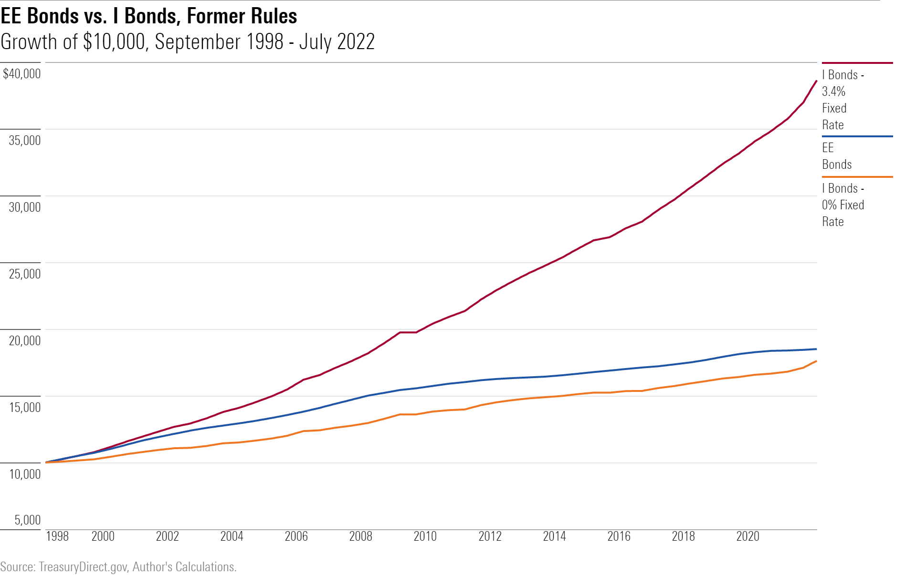

## Table of Contents

## What are U.S. Savings Bonds?

U.S. Savings Bonds are a type of investment issued by the U.S. Department of the Treasury. They are considered a safe way to save money because they are backed by the full faith and credit of the U.S. government. People buy these bonds to save money over time, and they earn interest until they reach their maturity date, which is when the bond can be cashed in for its full value.

There are different types of savings bonds, like Series EE and Series I bonds. Series EE bonds earn a fixed rate of interest, while Series I bonds earn a rate that is adjusted for inflation. You can buy these bonds electronically through the TreasuryDirect website, and they are often given as gifts or used to help save for things like education or retirement. They are a good choice for people who want a low-risk way to grow their savings.

## What is a Series EE Savings Bond?

A Series EE Savings Bond is a type of savings bond issued by the U.S. government. It's a safe way to save money because the government promises to pay you back. You can buy these bonds for yourself or give them as gifts. They are electronic, so you buy them online through a website called TreasuryDirect. When you buy a Series EE bond, you pay a certain amount, and over time, it grows in value until it reaches its full worth, which is called the face value.

Series EE bonds earn a fixed interest rate. This means the rate stays the same for the life of the bond. The interest is added to the bond every month, but you don't get to use it until you cash in the bond. These bonds take 20 years to reach their face value, but you can keep them for up to 30 years to earn even more interest. They are a good choice if you want to save money for the long term and don't want to take big risks with your money.

## What is a Series I Savings Bond?

A Series I Savings Bond is another type of savings bond from the U.S. government. Like Series EE bonds, they are safe because the government backs them. You can buy them online through TreasuryDirect. They are good for saving money over time, and you can give them as gifts too. The main difference is how they earn interest.

Series I bonds have two parts to their interest rate: a fixed rate and an inflation rate. The fixed rate stays the same for the life of the bond, but the inflation rate changes every six months to keep up with the cost of living. This means your money can grow to keep up with inflation. You can keep these bonds for up to 30 years, but they start [earning](/wiki/earning-announcement) interest right away and you can cash them in after one year. They are a good choice if you want your savings to keep up with the rising costs of things.

## How do the interest rates of Series EE and Series I bonds differ?

Series EE bonds have a fixed interest rate. This means the rate stays the same for the whole time you own the bond. When you buy a Series EE bond, you know exactly what rate your money will grow at until you cash it in. These bonds take 20 years to reach their full value, but you can keep them for up to 30 years to earn even more interest. They are good if you want to know exactly how your money will grow over time.

Series I bonds have a different kind of interest rate. They have a fixed rate part, like Series EE bonds, but they also have an inflation rate part. The fixed rate stays the same, but the inflation rate changes every six months to match the rising cost of living. This means your money can grow to keep up with inflation. You can cash in Series I bonds after one year, but they can also be kept for up to 30 years. They are a good choice if you want your savings to keep up with the rising costs of things.

## What is the minimum investment required for Series EE and Series I bonds?

The minimum investment for a Series EE Savings Bond is $25. You can buy these bonds online through the TreasuryDirect website. If you want to buy them as gifts, the minimum is the same, $25 per bond. This makes it easy for people to start saving, even if they don't have a lot of money to invest at once.

For Series I Savings Bonds, the minimum investment is also $25. Just like with Series EE bonds, you can buy them through TreasuryDirect. Whether you're buying for yourself or as a gift, you need to spend at least $25 on each bond. This low minimum amount means that Series I bonds are accessible to people who want to save money without a large upfront investment.

## How long must you hold Series EE and Series I bonds before they reach maturity?

Series EE bonds take 20 years to reach their full value, which is called maturity. This means if you buy a Series EE bond, you need to hold onto it for 20 years before it grows to the amount you were promised when you bought it. But, you can keep the bond for up to 30 years to earn even more interest if you want.

Series I bonds work a bit differently. They don't have a set time to reach maturity like Series EE bonds. You can cash them in after just one year, but if you do this before five years, you'll lose the last three months of interest. If you keep them for 30 years, they will keep earning interest the whole time. So, while they don't have a fixed maturity date, the longer you hold them, the more interest you can earn.

## Can you cash in Series EE and Series I bonds before they mature? If so, what are the penalties?

Yes, you can cash in Series EE bonds before they reach their 20-year maturity. If you cash them in within the first 5 years, you will lose the last 3 months of interest. After 5 years, you can cash them in without any penalty, but you won't get the full value until they reach 20 years. So, if you need your money back early, you can get it, but you might not get all the interest you could have earned.

You can also cash in Series I bonds before they reach their 30-year term. If you cash them in within the first year, you lose the last 3 months of interest plus all the interest earned in the first 3 months. If you wait until after the first year but before 5 years, you only lose the last 3 months of interest. After 5 years, you can cash them in without any penalty, but remember, the longer you keep them, the more interest you earn.

## How does inflation affect the value of Series EE versus Series I bonds?

Inflation can affect the value of Series EE and Series I bonds differently. Series EE bonds have a fixed interest rate, which means the rate stays the same no matter what happens with inflation. If inflation goes up, the buying power of the money you get from your Series EE bond might go down because the interest rate doesn't change. So, if prices rise a lot, your bond might not be worth as much in real terms as when you bought it.

Series I bonds, on the other hand, are designed to help protect against inflation. They have two parts to their interest rate: a fixed rate and an inflation rate. The inflation rate part changes every six months to match the rising cost of living. This means if inflation goes up, the interest rate on your Series I bond goes up too, helping to keep the value of your bond in line with the cost of things. So, Series I bonds can be a good choice if you're worried about inflation eating away at your savings.

## What are the tax benefits associated with Series EE and Series I bonds?

The interest you earn from Series EE and Series I bonds is not taxed by states or local governments. This means you don't have to pay state or local taxes on the money your bonds make. However, you do have to pay federal taxes on the interest. You can choose to report the interest on your taxes every year or wait until you cash in the bond or it reaches maturity. If you wait, you might end up paying more taxes at once, but it can be easier to manage.

There's another tax benefit if you use the money from these bonds to pay for education. If you meet certain rules, you might not have to pay any federal taxes on the interest. This is called the Education Savings Bond Program. To use this, you need to use the money for qualified education expenses like tuition and fees at an eligible school. This can make these bonds a smart choice if you're saving for college or other education costs.

## How do the redemption processes for Series EE and Series I bonds work?

To redeem Series EE and Series I bonds, you need to go to the TreasuryDirect website if you bought them electronically. You log into your account, find the bonds you want to cash in, and follow the steps to redeem them. The money will be sent to the bank account you have linked to your TreasuryDirect account. If you have paper bonds, you can take them to a local bank or mail them to the Treasury Department with a special form. The process is easy, but it might take a few days to get your money.

There are some things to remember when you redeem these bonds. For Series EE bonds, if you cash them in within the first 5 years, you lose the last 3 months of interest. After 5 years, there's no penalty, but you won't get the full value until they reach 20 years. For Series I bonds, if you cash them in within the first year, you lose the last 3 months of interest plus all the interest from the first 3 months. After the first year but before 5 years, you only lose the last 3 months of interest. After 5 years, there's no penalty. So, think about these rules before you decide to cash in your bonds early.

## What are the current rates and terms for Series EE and Series I bonds?

As of the latest update, Series EE bonds have a fixed interest rate of 2.50%. This rate stays the same for the entire time you own the bond. If you buy a Series EE bond, it will take 20 years to reach its full value, but you can keep it for up to 30 years to earn more interest. You can buy these bonds for as little as $25 each through the TreasuryDirect website. They are a good choice if you want to save money over a long time without taking big risks.

Series I bonds have a different kind of interest rate. They have a fixed rate part, which is currently 1.30%, and an inflation rate part that changes every six months. The total rate for Series I bonds as of the latest update is 5.27%. You can cash in Series I bonds after one year, but if you do it before five years, you lose the last three months of interest. Like Series EE bonds, you can buy Series I bonds for $25 each through TreasuryDirect. They are a good choice if you want your savings to keep up with the rising costs of things.

## How should an investor decide between Series EE and Series I bonds based on their financial goals and market conditions?

When choosing between Series EE and Series I bonds, an investor should think about their financial goals and the current market conditions. If your goal is to save money over a long time and you want a steady, predictable return, Series EE bonds might be the better choice. They have a fixed interest rate, so you know exactly how much your money will grow. This can be good if you're saving for something like a future big purchase or retirement and you don't want to take risks with your money. But remember, if inflation goes up a lot, the buying power of your Series EE bond might go down because the interest rate stays the same.

On the other hand, if you're worried about inflation and want your savings to keep up with the rising cost of living, Series I bonds could be a better fit. They have an interest rate that changes to match inflation, so your money can grow even if prices go up. This makes Series I bonds a good choice if you're saving for the long term and want to protect your money from losing value. Both types of bonds are safe because they're backed by the U.S. government, so it really comes down to whether you want a steady return or one that adjusts with inflation.

## What is the understanding of U.S. Savings Bonds?

U.S. Savings Bonds are an integral part of the financial instruments issued by the United States government to promote savings amongst individuals. These bonds are classified as non-marketable securities, meaning they cannot be bought or sold in secondary markets. Instead, they serve as a secure investment vehicle for personal savings, backed by the full faith and credit of the U.S. government.

Among the various types of U.S. Savings Bonds, Series EE and Series I are the most prevalent, each designed to cater to specific financial objectives. Series EE bonds are particularly attractive due to their guaranteed returns. They are structured to double in value over a maturity period of 20 years. This is achieved through a fixed interest rate that is established at the time of their issuance. The formula for calculating the future value $FV$ of a Series EE bond can be expressed as:

$$
FV = P \times (1 + r)^t
$$

where $P$ is the principal amount, $r$ is the fixed interest rate, and $t$ represents the time period in years. For Series EE bonds, $t = 20$ to guarantee the doubling of the investment.

In contrast, Series I bonds are designed to provide protection against inflation, making them highly suitable for investors who seek to preserve purchasing power amidst economic fluctuations. Series I bonds are characterized by a dual [interest rate](/wiki/interest-rate-trading-strategies) structure consisting of a fixed rate, which remains constant throughout the life of the bond, and an inflation-adjusted rate, which is revised semiannually based on changes in the Consumer Price Index for All Urban Consumers (CPI-U). The composite interest rate for Series I bonds is calculated using the formula:

$$
\text{Composite Rate} = \text{Fixed Rate} + (2 \times \text{Inflation Rate}) + (\text{Fixed Rate} \times \text{Inflation Rate})
$$

This formula ensures that the overall return on Series I bonds reflects changes in the economy's inflation level, thus safeguarding the bondholder's real rate of return.

Both Series EE and Series I bonds share certain characteristics that enhance their appeal as investment tools. They offer purchase limits that ensure broader accessibility to a wide range of investors. Additionally, these bonds provide tax benefits, such as deferment of federal income tax on earned interest until redemption or maturity. This feature, combined with the ability to use bond proceeds for educational expenses tax-free under specific conditions, makes U.S. Savings Bonds a strategic choice for long-term financial planning.

## What are the differences between Series EE and Series I Bonds?

Series EE Bonds and Series I Bonds represent two principal types of U.S. savings bonds, each designed to serve distinct financial goals for investors.

**Series EE Bonds** are known for their simplicity and reliability. They offer a fixed interest rate and come with a guarantee that the bond will double in value if held for 20 years. This assurance makes them particularly attractive to investors seeking long-term stability. Regardless of economic fluctuations, Series EE Bonds provide a predictable outcome, whereby an initial investment will effectively earn an average annual return of approximately 3.5% over 20 years, assuming the bond matures to double its purchase price.

In contrast, **Series I Bonds** provide a different mechanism to ensure value retention, particularly against inflation. These bonds feature a combination of a fixed interest rate and a variable rate, which is adjusted semiannually based on changes in the Consumer Price Index for All Urban Consumers (CPI-U). This dual-rate structure ensures that Series I Bonds can protect the purchasing power of the invested principal against inflationary pressures. The formula to determine the composite interest rate for I Bonds is:

$$
\text{Composite Rate} = \text{Fixed Rate} + 2 \times \text{Inflation Rate} + (\text{Fixed Rate} \times \text{Inflation Rate})
$$

where the "Inflation Rate" is the change in the CPI-U over the previous 6-month period.

Both Series EE and Series I Bonds come with purchase restrictions. They are sold at face value, with annual purchase limits set by the U.S. Department of the Treasury ($10,000 per series, per person). Furthermore, U.S. savings bonds offer significant tax advantages when applied towards educational expenses. Under the Education Savings Bond Program, the interest earned on both Series EE and I Bonds may be excluded from federal income tax if the bondholder uses the proceeds to pay for qualified higher education expenses and meets certain requirements regarding income limits and use of funds.

These features have made Series EE and Series I Bonds popular among conservative investors and those looking to plan for future educational needs.

## References & Further Reading

1. **U.S. Department of the Treasury: TreasuryDirect - Explore and Buy Savings Bonds**  
   This resource provides comprehensive information about savings bonds directly from the U.S. Department of the Treasury. It offers detailed guidance on how to purchase, manage, and redeem U.S. savings bonds through TreasuryDirect, an online platform designed for ease of use and security.

2. **Bodie, Zvi: On the Risk of Stocks in the Long Run**  
   Zvi Bodie's work is a seminal reference for understanding the dynamics of risk in long-term investment strategies. While primarily focused on stocks, the principles discussed also offer valuable insights into safe investment alternatives, such as U.S. savings bonds, for risk-averse investors.

3. **Fabozzi, Frank J.: Bond Markets, Analysis, and Strategies**  
   Frank J. Fabozzi’s book is an authoritative source on bond market mechanics and strategies. It provides foundational knowledge about different bond types, including government and corporate bonds, aiding in the comparative understanding of savings bonds and the broader bond market landscape.

