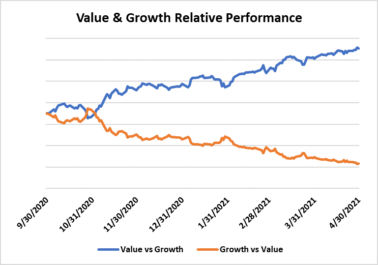

## Table of Contents

## What are ETFs and how do they work?

ETFs, or Exchange-Traded Funds, are a type of investment that works like a mix between a mutual fund and a stock. They are baskets of securities, like stocks or bonds, that you can buy and sell on a stock exchange, just like you would with individual company stocks. This means you can trade ETFs throughout the day at market prices, which can change based on supply and demand.

When you invest in an ETF, you're buying a small piece of many different investments all at once. For example, if you buy an ETF that tracks the S&P 500, you're investing in a little bit of each of the 500 companies in that index. This can help spread out your risk because your money isn't tied to the success of just one company. ETFs are popular because they offer a simple way to diversify your investments and can often have lower fees than other types of funds.

## What is the difference between value and growth investing?

Value investing is like looking for bargains. It's when you try to find companies that you think are priced lower than they should be. These companies might be out of favor with other investors for some reason, but value investors believe they will do better in the future. They look at things like the price-to-earnings ratio to see if a stock is a good deal. The idea is to buy these undervalued stocks, wait for the market to recognize their true worth, and then sell them for a profit.

Growth investing, on the other hand, is about finding companies that are growing fast and are expected to keep growing. These companies might not be cheap, but growth investors are willing to pay more for them because they believe the company's earnings will increase a lot in the future. They focus on things like revenue growth and earnings growth. The hope is that as the company grows, the stock price will go up, and they can make money from that increase.

Both styles have their own risks and rewards. Value investing can be safer because you're buying at a lower price, but it might take a long time for the market to see the value. Growth investing can be exciting because of the potential for big gains, but it can also be riskier if the growth doesn't happen as expected.

## How do value ETFs select their stocks?

Value ETFs pick their stocks by looking for companies that seem to be a good deal. They use things like the price-to-earnings ratio, which compares a company's stock price to how much money it makes. If this ratio is low, it might mean the stock is undervalued. They also look at the price-to-book ratio, which compares the stock price to the company's net assets. A low ratio here can also suggest a company is underpriced. By focusing on these numbers, value ETFs aim to buy stocks that are cheaper than they should be, hoping they will go up in value over time.

These ETFs often follow a specific index that is made up of value stocks. For example, they might track the Russell 1000 Value Index, which includes big companies that are considered undervalued. The ETF managers will then buy the same stocks that are in the index, in the same proportions. This way, the ETF mirrors the performance of the index. By doing this, value ETFs give investors an easy way to invest in a bunch of value stocks all at once, without having to pick each one themselves.

## How do growth ETFs select their stocks?

Growth ETFs pick their stocks by looking for companies that are growing fast and are expected to keep growing. They focus on things like how much a company's earnings and sales are going up. If a company is doing really well and is expected to keep doing well, growth ETFs might want to include it. They might also look at how much money the company is putting back into the business to help it grow even more. The idea is to find companies that will make the stock price go up a lot in the future.

These ETFs usually follow a specific index that is made up of growth stocks. For example, they might track the Nasdaq-100 Index, which includes a lot of technology companies that are known for growing quickly. The ETF managers will buy the same stocks that are in the index, in the same amounts. This way, the ETF's performance is similar to the index's performance. By doing this, growth ETFs give investors an easy way to invest in a bunch of growing companies all at once, without having to pick each one themselves.

## What are some examples of popular value ETFs?

One popular value ETF is the Vanguard Value ETF (VTV). This ETF tries to match the performance of the CRSP US Large Cap Value Index. It picks big companies that seem to be a good deal. People like this ETF because it has low fees and it's a simple way to invest in a lot of value stocks at once.

Another well-known value ETF is the iShares Russell 1000 Value ETF (IWD). This one follows the Russell 1000 Value Index. It also focuses on big companies that are thought to be undervalued. Investors choose this ETF because it's easy to buy and sell, and it gives them a broad way to invest in value stocks.

A third example is the Schwab U.S. Large-Cap Value ETF (SCHV). This ETF tracks the Dow Jones U.S. Large-Cap Value Total Stock Market Index. It's known for its very low costs and for giving investors a way to own a piece of many large value companies. People like it because it's affordable and helps them spread out their investments.

## What are some examples of popular growth ETFs?

One popular growth ETF is the Vanguard Growth ETF (VUG). This ETF tries to match the performance of the CRSP US Large Cap Growth Index. It picks big companies that are growing fast and are expected to keep growing. People like this ETF because it has low fees and it's a simple way to invest in a lot of growth stocks at once.

Another well-known growth ETF is the iShares Russell 1000 Growth ETF (IWF). This one follows the Russell 1000 Growth Index. It also focuses on big companies that are thought to have strong growth potential. Investors choose this ETF because it's easy to buy and sell, and it gives them a broad way to invest in growth stocks.

A third example is the Invesco QQQ Trust (QQQ). This ETF tracks the Nasdaq-100 Index, which includes many technology companies known for growing quickly. It's popular because it gives investors a way to own a piece of many fast-growing companies, especially in the tech sector. People like it because it's well-known and has a good track record of growth.

## What are the historical performance differences between value and growth ETFs?

Over the years, value and growth ETFs have had different performances. Sometimes, value ETFs do better, and sometimes growth ETFs do better. It depends a lot on what's happening in the economy and the stock market. For example, during times when the economy is doing well and companies are growing fast, growth ETFs often do better. People are more willing to pay more for stocks that are expected to grow a lot. But when the economy is not doing so well, value ETFs might do better. Investors might look for cheaper stocks that they think are a good deal and will go up in value later.

In the past, there have been long periods where one style did better than the other. From the late 1990s to the early 2000s, growth ETFs, especially those focused on tech companies, did really well. But after the tech bubble burst, value ETFs started to do better for a while. More recently, from around 2010 to 2020, growth ETFs again outperformed value ETFs, especially in the years leading up to and during the early stages of the COVID-19 pandemic. This shows that the performance of value and growth ETFs can change a lot over time, and it's hard to predict which one will do better in the future.

## How do value and growth ETFs perform during different market cycles?

Value and growth ETFs can act differently depending on what's happening in the market. When the economy is growing and things are going well, growth ETFs often do better. This is because people are more willing to pay more for stocks of companies that are expected to keep growing fast. For example, during the tech boom of the late 1990s, growth ETFs did really well because everyone wanted to invest in fast-growing tech companies. But when the economy slows down or goes into a recession, value ETFs might do better. Investors start looking for cheaper stocks that they think are a good deal and will go up in value later.

Over the years, we've seen that these cycles can last a long time. After the tech bubble burst in the early 2000s, value ETFs started to do better for a while. People were more cautious and looked for stocks that were undervalued. More recently, from around 2010 to 2020, growth ETFs again did better than value ETFs, especially in the years leading up to and during the early stages of the COVID-19 pandemic. This shows that the performance of value and growth ETFs can change a lot over time, and it's hard to predict which one will do better in the future based on the current market cycle.

## What are the risk profiles associated with value versus growth ETFs?

Value ETFs are often seen as less risky than growth ETFs. This is because they focus on buying stocks that seem like a good deal, meaning they are cheaper than they should be. If you buy a stock at a lower price, there's less room for it to fall, so the risk can be lower. But value ETFs can still be risky if the companies they invest in don't turn around and start doing better. If the market doesn't recognize the true value of these stocks, they might stay low or even go down more.

Growth ETFs, on the other hand, are often seen as riskier. They invest in companies that are growing fast and are expected to keep growing. This can be exciting because there's a chance for big gains if the companies do well. But it's also riskier because if the growth slows down or stops, the stock price can drop a lot. Growth ETFs can be more affected by changes in the economy or in the market, so they might go up and down more than value ETFs.

## How do fees and expenses compare between value and growth ETFs?

Fees and expenses for value and growth ETFs can be similar, but they can also vary depending on the specific ETF. In general, both types of ETFs have what's called an expense ratio, which is a yearly fee you pay to own the ETF. This fee is a percentage of the money you have invested in the ETF. For example, if an ETF has an expense ratio of 0.10%, you pay $10 a year for every $10,000 you have invested. Many popular value and growth ETFs have low expense ratios, often around 0.10% to 0.20%.

However, some growth ETFs, especially those that focus on specific sectors like technology, might have higher expense ratios. This is because managing these ETFs can be more complicated, and the companies they invest in might be riskier. On the other hand, some value ETFs might have even lower fees because they often follow broad, well-established indexes. So, while the fees between value and growth ETFs can be close, it's always a good idea to check the expense ratio of any ETF you're thinking about investing in.

## What are the tax implications of investing in value versus growth ETFs?

When you invest in value or growth ETFs, you need to think about taxes. Both types of ETFs can give you dividends, which are payments from the companies the ETF owns. You have to pay taxes on these dividends. But the tax rate might be different depending on if the dividends are "qualified" or "non-qualified." Qualified dividends usually have a lower tax rate, and both value and growth ETFs can have them. So, the tax on dividends might not be very different between the two types of ETFs.

The other thing to think about is capital gains. This is the profit you make when you sell your ETF for more than you paid for it. If you hold your ETF for more than a year before selling, you pay a lower tax rate on the gain. This is called a long-term capital gain. Both value and growth ETFs can give you long-term capital gains. But growth ETFs might have more short-term capital gains because they might buy and sell stocks more often. Short-term capital gains are taxed at a higher rate, like your regular income. So, growth ETFs might have a bit higher tax impact because of this.

## How should an investor decide between value and growth ETFs based on their investment goals and risk tolerance?

When choosing between value and growth ETFs, an investor should think about their investment goals and how much risk they can handle. If you want to grow your money fast and are okay with taking more risk, growth ETFs might be a good choice. These ETFs invest in companies that are growing quickly and are expected to keep growing. This can be exciting because there's a chance for big gains, but it's also riskier because if the growth slows down or stops, the stock price can drop a lot. If you're looking for this kind of potential reward and are willing to accept the ups and downs, growth ETFs could fit your goals.

On the other hand, if you want to be a bit safer and are looking for good deals, value ETFs might be better for you. These ETFs focus on buying stocks that seem cheaper than they should be. This can be less risky because you're buying at a lower price, so there's less room for the price to fall. But it might take longer for the market to see the true value of these stocks, and if it doesn't happen, you might not make as much money. If you're okay with waiting for the right time and want to reduce your risk, value ETFs could be the way to go.

## What is Exploring Value Investing?

### Exploring Value Investing

Value investing is an investment strategy centered on finding securities that appear underpriced by some form of [fundamental analysis](/wiki/fundamental-analysis). The concept is rooted in the belief that the market often overreacts to good and bad news, potentially leading to stock price movements that do not correspond to a company’s long-term fundamentals. Therefore, value investors seek stocks that they believe are undervalued with the goal of profiting from the eventual correction in price.

#### Value Investing Fundamentals

The core principle of value investing is to identify stocks trading for less than their intrinsic values. This involves assessing a company's financials, management team, and competitive advantages to determine its intrinsic value. Key metrics often used include the price-to-earnings (P/E) ratio, price-to-book (P/B) ratio, and dividend yield. A lower ratio compared to the industry average might indicate that a stock is undervalued.

$$
\text{P/E Ratio} = \frac{\text{Market Value per Share}}{\text{Earnings per Share}}
$$

The principles of value investing trace back to Benjamin Graham and David Dodd, who pioneered this approach at Columbia Business School in the 1920s. Graham’s book, "The Intelligent Investor," serves as a foundational text for understanding and implementing value investing practices.

#### Differentiation Between Value and Growth Investing

While both value and growth investing aim to generate profitable returns, their approaches differ significantly. Growth investing focuses on companies expected to grow at an above-average rate compared to their industry or the overall market. In contrast, value investing seeks stocks thought to be undervalued by the market. Growth stocks are often characterized by higher P/E ratios, as investors are willing to pay a premium for anticipated growth, while value stocks tend to have lower ratios, reflecting their perceived undervaluation.

#### Market Conditions Favorable to Value Investing

Value investing tends to outperform during certain market conditions, particularly in times of economic uncertainty or recovery phases following a downturn. During such times, market [volatility](/wiki/volatility-trading-strategies) can create opportunities for undervaluation as investors flee riskier assets. Historical data also suggests that value stocks tend to perform well in rising [interest rate](/wiki/interest-rate-trading-strategies) environments. Additionally, markets characterized by clear distortions or inefficiencies present potential prospects for value investors as stock prices may be more likely to deviate from their intrinsic values.

#### Incorporation of ETFs in Value Investing

Exchange-traded funds (ETFs) have become an essential tool for value investors seeking diversification and exposure to undervalued stocks. ETFs can track specific indices comprised of value stocks, allowing investors to efficiently diversify their portfolios while maintaining a focus on value-oriented securities. By pooling investments across numerous undervalued stocks, ETFs can mitigate some risks associated with individual stock selection.

#### Notable ETFs Specializing in Value Stocks

Several ETFs specialize in value stocks, providing access to a broad range of industries and markets. Among these, the Vanguard Value ETF (VTV) and the iShares Russell 1000 Value ETF (IWD) are widely recognized for their robust selection methodologies and broad market exposure. The Vanguard Value ETF aims to track the performance of the CRSP U.S. Large Cap Value Index, offering exposure to large-cap companies believed to be undervalued. Similarly, the iShares Russell 1000 Value ETF focuses on companies within the Russell 1000 Index that exhibit value characteristics.

In summary, value investing is a disciplined, long-term strategy aimed at capitalizing on market inefficiencies. By leveraging ETFs, investors can efficiently build diversified portfolios and capitalize on identified undervaluations. Understanding the differences between value and growth investing and recognizing favorable market conditions can enhance the effectiveness of a value-oriented approach.

## References & Further Reading

[1]: Graham, B., & Dodd, D. (1934). ["Security Analysis."](https://books.google.com/books/about/Security_Analysis_The_Classic_1934_Editi.html?id=wXlrnZ1uqK0C) McGraw-Hill Education.

[2]: Graham, B. (1949). ["The Intelligent Investor."](https://en.wikipedia.org/wiki/The_Intelligent_Investor) Harper & Brothers.

[3]: Lopez de Prado, M. (2018). ["Advances in Financial Machine Learning."](https://www.amazon.com/Advances-Financial-Machine-Learning-Marcos/dp/1119482089) Wiley.

[4]: Chan, E. P. (2008). ["Quantitative Trading: How to Build Your Own Algorithmic Trading Business."](https://github.com/ftvision/quant_trading_echan_book) Wiley.

[5]: Jansen, S. (2018). ["Machine Learning for Algorithmic Trading: Predictive models to extract signals from market and alternative data for systematic trading strategies with Python."](https://www.amazon.com/Machine-Learning-Algorithmic-Trading-alternative/dp/1839217715) Packt Publishing.

[6]: Aronson, D. R. (2006). ["Evidence-Based Technical Analysis: Applying the Scientific Method and Statistical Inference to Trading Signals."](https://www.amazon.com/Evidence-Based-Technical-Analysis-Scientific-Statistical/dp/0470008741) Wiley.

[7]: Vanguard. (2020). ["Investing with Vanguard ETFs."](https://money.usnews.com/investing/articles/best-vanguard-funds-for-beginner-investors) Vanguard Group.