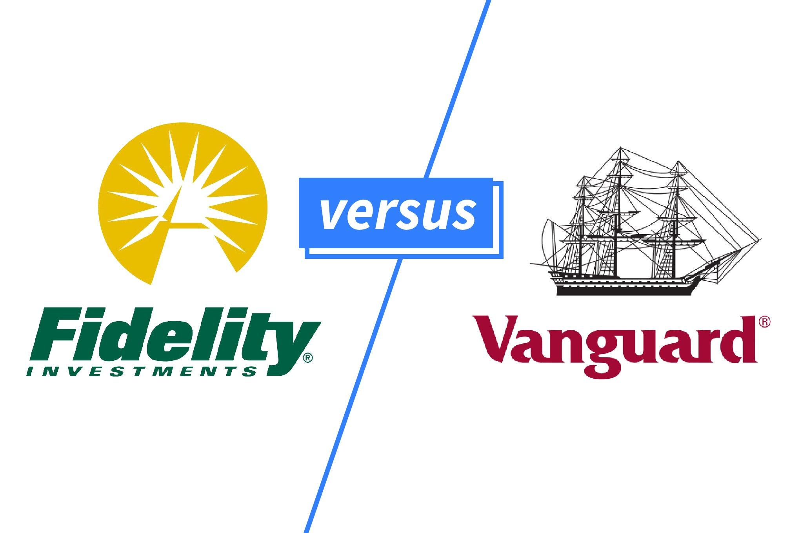

Vanguard and Fidelity stand as titans within the investment industry, each boasting a significant market presence and a rich history of facilitating diverse financial services to investors worldwide. Both companies have built reputations as trusted custodians of wealth, providing comprehensive investment platforms that include mutual funds, exchange-traded funds (ETFs), and retirement accounts. Vanguard, renowned for its low-cost index fund offerings, and Fidelity, noted for its innovative technological integration and active fund management, represent alternative pathways to financial growth.

Algorithmic trading has emerged as a significant paradigm shift in the investment landscape. This trading strategy leverages computer algorithms to execute orders based on predefined criteria, enabling rapid trade execution beyond human capability. The growth in this area has been powered by advances in technology and data analytics, making it an attractive option for both institutional and retail investors. This trend has reshaped how investments are managed, offering potential advantages such as efficiency and reduced costs but also introducing new complexities and risks.

The primary purpose of this article is to conduct a comparative analysis of Vanguard and Fidelity with respect to their investment offerings, emphasizing algorithmic trading capabilities. By dissecting the two platforms, this article intends to equip investors with a comprehensive understanding, enabling informed decisions aligned with their financial objectives. Selecting the appropriate investment platform is crucial for maximizing returns and optimizing portfolio management. Differences in cost structures, product availability, and technological advancements can significantly influence investor outcomes.

Through this exploration, the article will highlight the unique advantages and possible drawbacks associated with each company, focusing on their efficiency in adopting algorithmic trading strategies. Understanding these aspects will help investors navigate the complex financial terrain, ensuring that they choose a platform that aligns with their goals and risk tolerance.

## Table of Contents

## Overview of Vanguard

The Vanguard Group, founded in 1975 by John C. Bogle, has established itself as a predominant force in the investment world. Known for pioneering the concept of index investing, Vanguard is celebrated for its client-owned structure and commitment to offering low-cost investment options. This approach has earned it a reputation as a trustworthy institution among long-term investors. As of 2023, Vanguard manages over $7 trillion in global assets, underscoring its significant industry influence.

Vanguard's investment philosophy centers on simplicity, transparency, and long-term growth. The company is an advocate of a diversified portfolio strategy, emphasizing the importance of maintaining a balanced mix of asset classes to mitigate risk and capture market growth. This philosophy is reflected in its wide array of index and actively managed funds, which offer comprehensive asset class coverage.

Key investment products offered by Vanguard include mutual funds, exchange-traded funds (ETFs), and retirement accounts like IRAs and 401(k) plans. Vanguard's mutual funds and ETFs are highly regarded for their low expense ratios, which stand out in the competitive landscape. The company offers over 190 U.S. funds, including the Vanguard Total Stock Market Index Fund and the Vanguard 500 Index Fund, both popular choices for investors aiming for low-cost, broad market exposure.

While Vanguard’s focus has traditionally been on passive index strategies, it has started integrating algorithmic tools to optimize its funds’ management and trading operations. However, it does not offer direct [algorithmic trading](/wiki/algorithmic-trading) strategies to individual investors. Instead, the company leverages algorithmic efficiencies internally to enhance fund performance and ensure cost-effective trade execution.

Vanguard’s fee structure is one of its most notable attributes, rooted in its client-owned model. Since clients own the funds, Vanguard operates at cost, which allows for competitive pricing. The average expense ratio of Vanguard funds is significantly below the industry average, providing a cost-effective investment solution. Additionally, Vanguard is committed to high-quality customer service, offering various tools and resources to assist investors in making informed decisions.

In summary, Vanguard remains a leader in providing low-cost, diversified investment opportunities, adhering to a philosophy of simplicity and long-term growth. While it does not offer algorithmic trading to individual investors, its internal use of innovative trading technologies aims to improve fund performance and cost-efficiency.

## Overview of Fidelity

Fidelity Investments, established in 1946 by Edward C. Johnson II, has grown to be a significant force in the investment industry. With its headquarters in Boston, Massachusetts, Fidelity is known for its substantial impact on both the financial and investment landscapes. The firm has consistently prioritized customer satisfaction and innovation, which has enabled it to expand globally and serve millions of investors. 

Fidelity's investment principles focus on delivering high-quality financial services while continually adapting to market changes. The company's commitment to innovation is evident through its early adoption of technology in investment management, such as the introduction of an electronic trading platform in the late 1980s. Fidelity emphasizes a customer-centric approach by providing customized investment solutions and maintaining transparency in its transactions and operations.

The suite of investment products offered by Fidelity includes a broad range of mutual funds, where investors can choose from numerous actively managed and index funds tailored to various risk preferences. Fidelity also offers direct access to stocks, allowing investors to buy and sell shares with ease. Its bond offerings provide fixed-income investment options, catering to those seeking stable and predictable returns. Additionally, Fidelity provides comprehensive retirement solutions, such as 401(k) plans and Individual Retirement Accounts (IRAs), designed to help individuals plan for their financial future.

Fidelity has integrated algorithmic trading into its platform, enhancing the efficiency and speed of transactions. This technology uses sophisticated mathematical models and strategies to automate trading processes, ensuring better outcomes for investors by reducing transaction costs and minimizing market impact. Algorithmic trading at Fidelity has improved the execution of trades, providing clients with a competitive advantage in the fast-paced financial markets.

The pricing model at Fidelity is competitive, with a focus on providing value for money. The company offers zero expense ratio index funds, ensuring cost-conscious investors can maximize their returns without being burdened by high fees. Fidelity's transparent pricing structure includes tiered commission rates for stocks and options trades, and no-transaction-fee mutual funds, which appeal to a wide range of investors.

Customer support is a hallmark of Fidelity's service, with 24/7 access to knowledgeable representatives who assist with a variety of financial inquiries and investment needs. Fidelity also provides extensive online resources, including market research tools, investment calculators, and account management features, enabling investors to make well-informed decisions and effectively manage their portfolios.

In summary, Fidelity's history of market influence, client-focused investment principles, diverse product offerings, advanced use of algorithmic trading, and excellent customer support, position it as a formidable player in the investment sector.

## Comparative Analysis: Vanguard vs. Fidelity

When comparing Vanguard and Fidelity, two titans in the investment industry, a key differentiator lies in their investment tools and platforms. Vanguard, renowned for its low-cost and long-term investment approach, offers a broad range of mutual funds, exchange-traded funds (ETFs), and retirement accounts. Fidelity, conversely, is known for its innovation and diverse investment options, including individual stocks, bonds, and advanced mutual fund selections.

In examining algorithmic trading, Fidelity generally takes the lead. Fidelity provides sophisticated trading platforms like Active Trader Pro, designed for high-frequency traders and those interested in leveraging algorithmic trading capabilities. This platform offers advanced charting tools, real-time analytics, and adaptability to custom trading algorithms. In contrast, Vanguard emphasizes long-term investments over frequent trades, reflecting its foundational philosophy of patience and cost-efficiency. While Vanguard does not heavily focus on algorithmic trading, it does offer automated investment management through its robo-advisory service, Vanguard Digital Advisor. However, this service is more focused on strategic asset allocation than algorithmic trading per se.

When assessing performance outcomes, both platforms cater to different investor profiles. Vanguard's strength lies in delivering consistent, low-cost returns, which suits long-term, passive investors. Fidelity, with its robust trading tools, appeals to active traders and those seeking to capitalize on short-term market movements. However, it is critical to note that performance can vary significantly based on market conditions and individual strategies employed.

In terms of cost-effectiveness, Vanguard often holds an advantage, with its reputation built on low fees and a transparent pricing structure. Vanguard’s expense ratios are among the lowest in the industry, reflecting its commitment to cost efficiency. Fidelity also offers competitive fees, though they can be higher for certain types of trades, particularly those requiring more complex transactions or real-time management through its advanced platforms.

User experiences and reviews offer additional insights into each platform's ease of use and reliability. Vanguard is often praised for its straightforward and user-friendly interface, ideal for novice investors and those focusing on long-term gains. Fidelity’s platform, while more complex due to its extensive functionalities, receives accolades for its comprehensive research tools and educational resources, which support a more active trading approach.

In summary, the choice between Vanguard and Fidelity largely depends on individual investment goals and trading strategies. Vanguard's offerings align more with investors focused on long-term growth with minimal fees, while Fidelity caters to those who are keen on employing advanced trading techniques and require extensive market analysis tools.

## Algorithmic Trading: Risks and Rewards

Algorithmic trading involves the use of computer algorithms to execute trading orders at speeds and efficiencies beyond human capability. This practice leverages pre-defined sets of rules, which can incorporate various market factors such as timing, price, or quantity. Algorithms decide the optimal way to fulfill orders efficiently, thereby enabling rapid decision-making based on mathematical models. Algorithmic trading plays a vital role in modern investing, providing [liquidity](/wiki/liquidity-risk-premium) and facilitating low-cost trade execution.

For major investment firms like Vanguard and Fidelity, algorithmic trading is integral to their operational strategies. With Vanguard, the emphasis historically has been on low-cost fund management, although they are increasingly integrating algorithmic tools to enhance portfolio management and transaction efficiency. Fidelity, known for its commitment to innovative investment solutions, actively employs algorithmic trading to offer sophisticated trading features to its users, enhancing the accessibility and performance of complex trading strategies.

Among the benefits of adopting algorithmic trading strategies are the abilities to enhance trade execution, reduce costs, and mitigate the impact of human error. At Vanguard, these algorithms contribute to more efficient trade processing, while Fidelity's offerings leverage these technologies to provide dynamic asset management and improved trading speeds.

However, algorithmic trading carries inherent risks. Market [volatility](/wiki/volatility-trading-strategies) can be exacerbated by high-frequency trading activities, potentially leading to substantial losses if algorithms react to transient price changes. Technical failures, such as software bugs or connectivity issues, can also disrupt trading activities, leading to missed opportunities or unintended trades.

To manage risk in algorithmic trading, investors are encouraged to implement robust risk management protocols. This can include strategies such as [backtesting](/wiki/backtesting) algorithms under various market conditions, setting strict stop-loss parameters, and ensuring redundancy in trading infrastructure to prevent significant outages due to technical malfunctions. Diversification of algorithmic strategies can also play a crucial role in mitigating potential risks, spreading exposure across different instruments and strategies.

Looking forward, the future of algorithmic trading remains promising, with continuous advancements in [machine learning](/wiki/machine-learning) and big data analytics driving more sophisticated models. These technologies are expected to further refine trading algorithms, making them more adaptable and predictive. Vanguard and Fidelity, as leaders in the industry, are likely to harness these innovations to enhance service offerings, balancing the benefits of speed and efficiency with the need for risk management frameworks tailored to evolving market dynamics. The growing [momentum](/wiki/momentum) in technological innovations will only continue to propel algorithmic trading to new heights, reshaping the investment landscape significantly.

## Concluding Remarks

Vanguard and Fidelity both stand as titans within the investment landscape, each offering distinct advantages and approaches to algorithmic trading. Throughout this article, we examined the comprehensive range of investment products and services provided by these two industry leaders and their unique philosophies on asset management and technological innovation.

Vanguard is renowned for its emphasis on low-cost, long-term investment strategies, primarily through mutual funds and ETFs. However, its utilization of algorithmic trading is less pronounced, focusing instead on a traditional and steady investment approach. The fee structure at Vanguard is typically low, aligning well with its customer-centric philosophy, but this comes at the potential cost of less frequent trading opportunities.

Conversely, Fidelity shines with its robust support of algorithmic trading and technological integration. Fidelity's platform is designed to facilitate more dynamic investment strategies, appealing to investors interested in leveraging algorithmic tools for potentially higher returns. Fidelity's pricing model is competitive, but the sophistication of its platform may attract costs that should be weighed against the benefits of automated trading.

Choosing between Vanguard and Fidelity involves aligning investment decisions with personal financial goals and comfort levels regarding technology use in investing. Those favoring stable, long-term growth without frequent adjustments may prefer Vanguard. In contrast, investors seeking to capitalize on algorithmic trading's potential might find Fidelity more suitable.

For those interested in further exploration, visiting the official websites of [Vanguard](https://investor.vanguard.com/home) and [Fidelity](https://www.fidelity.com/) will provide direct access to their latest offerings and resources. Additionally, articles on algorithmic trading and other investment strategies can provide valuable insights into making informed decisions.

In conclusion, it is crucial for individuals to evaluate their investment strategies periodically and consider the platforms that best align with their financial goals and risk tolerance. By doing so, investors can optimize their portfolio performance and navigate the ever-evolving investment landscape effectively.

## References

1. Vanguard's Official Website: For detailed information about Vanguard's investment services and products, visit [Vanguard](https://investor.vanguard.com/home).

2. Fidelity's Official Website: To explore Fidelity's range of investment options and services, access [Fidelity](https://www.fidelity.com).

3. Algorithmic Trading and DMA: An Overview: A comprehensive article on the mechanisms and impact of algorithmic trading, available at [Algorithmic Trading and DMA](https://www.amazon.com/Algorithmic-Trading-DMA-introduction-direct/dp/0956399207).

4. "Quantitative Trading: How to Build Your Own Algorithmic Trading Business" by Ernie Chan: This book provides insights into creating algorithmic trading strategies and is available for further reading.

5. Understanding the Risks of Algorithmic Trading: An informative piece on the risks involved with algorithmic trading methodologies, available at [Risk Management](https://www.investopedia.com/terms/a/algorithmictrading.asp).

6. "Advances in Financial Machine Learning" by Marcos López de Prado: This book dives into the use of machine learning in the investment sector, highlighting its applications in algorithmic trading.

7. Journal of Investment Strategies: A peer-reviewed publication offering various articles on investment strategies, including algorithmic trading.

8. "Algorithmic and High-Frequency Trading" by Álvaro Cartea, Sebastian Jaimungal, and José Penalva: This book addresses the specifics of algorithmic and high-frequency trading and their implications in financial markets.

9. SEC Office of Investor Education and Advocacy: A resource for understanding regulations and safeguards related to investment trading, available at [SEC](https://www.sec.gov).

10. MSCI's Research Papers: Research publications on investment strategies, which can provide additional insights into market trends and algorithmic trading, available at [MSCI Research](https://www.msci.com/research).

## References & Further Reading

[1]: ["Advances in Financial Machine Learning"](https://www.amazon.com/Advances-Financial-Machine-Learning-Marcos/dp/1119482089) by Marcos Lopez de Prado

[2]: ["Quantitative Trading: How to Build Your Own Algorithmic Trading Business"](https://www.amazon.com/Quantitative-Trading-Build-Algorithmic-Business/dp/1119800064) by Ernest P. Chan

[3]: ["Algorithmic Trading and DMA: An introduction to direct access trading strategies"](https://www.amazon.com/Algorithmic-Trading-DMA-introduction-strategies/dp/0956399207) by Barry Johnson

[4]: ["Algorithmic and High-Frequency Trading"](https://assets.cambridge.org/97811070/91146/frontmatter/9781107091146_frontmatter.pdf) by Álvaro Cartea, Sebastian Jaimungal, and José Penalva

[5]: ["Investopedia - Algorithmic Trading"](https://www.investopedia.com/articles/active-trading/101014/basics-algorithmic-trading-concepts-and-examples.asp) - Article discussing algorithmic trading methodologies and risks

[6]: ["Vanguard Group official website"](https://www.vanguard.com/) - For detailed information regarding Vanguard's services and products.

[7]: ["Fidelity Investments official website"](https://www.fidelity.com/) - To explore Fidelity's investment options and services.

[8]: ["SEC Office of Investor Education and Advocacy"](https://www.sec.gov/about/divisions-offices/office-investor-education-advocacy) - A resource for understanding regulations and safeguards related to investment trading.