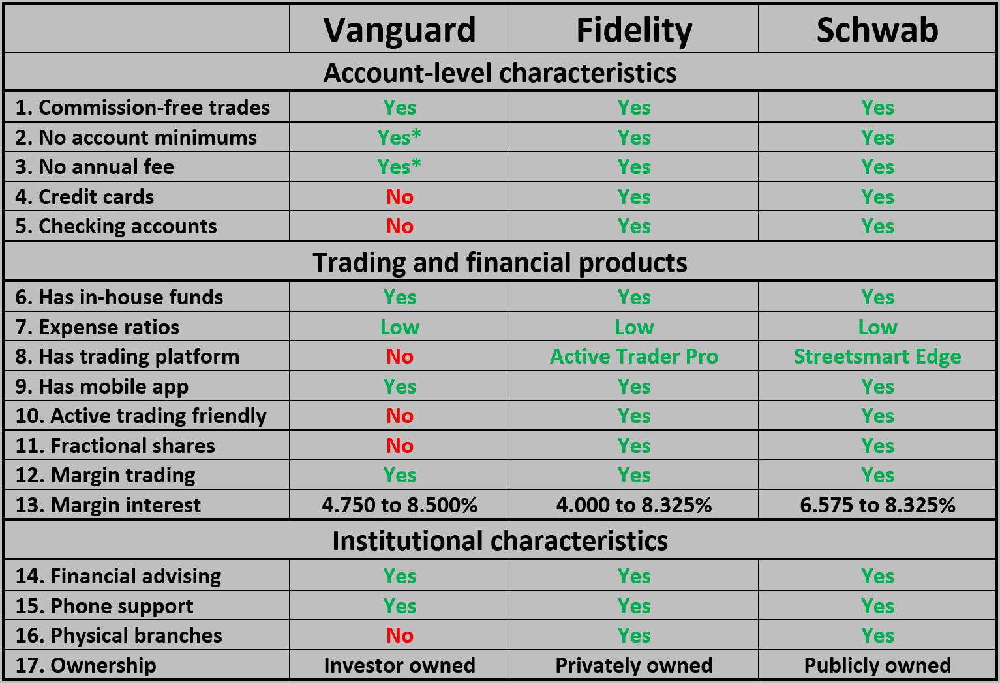

## Table of Contents

## What are Vanguard and Fidelity?

Vanguard and Fidelity are two major financial companies that help people invest their money. Vanguard is known for its low-cost index funds, which are a type of investment that tracks the performance of a group of stocks or bonds. This means that when you invest in a Vanguard fund, your money is spread out across many different companies, reducing risk. Vanguard was started by John Bogle, who wanted to make investing easier and cheaper for everyone. The company is owned by the people who invest in its funds, which is different from most other companies.

Fidelity, on the other hand, offers a wider range of investment options, including mutual funds, stocks, and bonds. They are known for their customer service and for offering tools that help people make smart investment choices. Fidelity was founded by Edward C. Johnson II and is still run by his family. Unlike Vanguard, Fidelity is a privately-owned company, which means it is not owned by its customers. Both companies are trusted by millions of people to help them save for retirement, buy a house, or reach other financial goals.

## How do Vanguard and Fidelity differ in terms of company structure?

Vanguard and Fidelity have different ways of being owned and run. Vanguard is special because it is owned by the people who invest in its funds. This means that if you put your money into a Vanguard fund, you are part of the company. This structure helps keep costs low because Vanguard doesn't have to worry about making profits for outside owners. Instead, it focuses on serving its investors. John Bogle, who started Vanguard, wanted to make sure that the company always put its investors first.

Fidelity, on the other hand, is a privately-owned company. This means it is owned by a family, the Johnson family, who started it. Because it is privately owned, Fidelity can make decisions that might be different from what a company owned by its customers would do. Fidelity focuses on offering a lot of different investment choices and good customer service. They want to help people invest in a way that works best for them, but they also need to make money for the company and its owners.

## What types of investment products do Vanguard and Fidelity offer?

Vanguard offers a variety of investment products, but they are most famous for their low-cost index funds. These funds track the performance of a group of stocks or bonds, like the S&P 500, which is a collection of 500 big companies in the U.S. Vanguard also has actively managed funds, where professional managers pick the stocks or bonds to try to do better than the market. They also offer exchange-traded funds (ETFs), which are like index funds but can be bought and sold during the day like stocks. Plus, Vanguard has options for people saving for retirement, like 401(k) and IRA accounts.

Fidelity offers a wider range of investment products. They have mutual funds, which can be actively managed or index funds, just like Vanguard. Fidelity also lets you buy individual stocks and bonds, which means you can pick specific companies or government loans to invest in. They have ETFs too, and they are known for their research tools that help you decide what to invest in. Fidelity also offers retirement accounts like 401(k)s and IRAs, and they have special accounts for college savings, called 529 plans.

## How do the fees and expenses compare between Vanguard and Fidelity?

Vanguard is known for having some of the lowest fees in the investment world. They focus a lot on keeping costs down for their investors. For example, their index funds have very low expense ratios, which means you pay less money each year to own the fund. Vanguard's average expense ratio for their index funds is around 0.08%. They also don't charge extra fees for things like buying and selling their funds, which helps keep more money in your pocket. If you want to trade stocks or ETFs, Vanguard charges a small fee of $7 per trade, but they are working on lowering that too.

Fidelity also offers competitive fees, but their range is a bit wider because they have more types of investment products. Their index funds have expense ratios that are a bit higher than Vanguard's, averaging around 0.12%. But Fidelity has some funds with no expense ratio at all, called zero funds. When it comes to trading stocks and ETFs, Fidelity used to charge $4.95 per trade, but now they have made it free, which is great for people who like to buy and sell a lot. For other services, like managing your retirement account, Fidelity might charge different fees depending on what you need.

## What are the minimum investment requirements for Vanguard and Fidelity?

Vanguard has different minimum investment requirements depending on the type of account and the funds you choose. For many of their index funds, the minimum is $3,000. But if you want to start with their ETFs, you can buy as little as one share, which can be less than $100 depending on the price of the ETF. For their actively managed funds, the minimum can be higher, sometimes up to $50,000. If you are saving for retirement through a 401(k) or an IRA with Vanguard, you can often start with less money, sometimes as low as $1,000.

Fidelity also has different minimums based on the type of investment. Many of their mutual funds, both index and actively managed, have a minimum of $0, which means you can start investing with any amount of money. If you want to buy individual stocks or ETFs, you can start with the price of one share, which can be very low, sometimes less than $100. For retirement accounts like 401(k)s and IRAs, Fidelity often lets you start with no minimum investment, making it easy to begin saving for the future.

## How do Vanguard and Fidelity's customer service options compare?

Vanguard offers good customer service, but it might not be as easy to reach as Fidelity's. You can call Vanguard's customer service line or use their website to chat with someone. They also have financial advisors you can talk to, but you might have to pay for that. Vanguard's focus is more on keeping costs low, so their customer service might not be as quick or personal as some people want. But they have a lot of helpful information on their website and through their mobile app, so you can learn a lot on your own.

Fidelity is known for its excellent customer service. They have a lot of people ready to help you over the phone, and you can also use their website or app to chat with someone. Fidelity also has many branches where you can go in person to talk to someone, which can be really helpful if you like face-to-face help. They focus a lot on making sure their customers are happy, so they try to answer your questions quickly and clearly. This can be a big plus if you are new to investing and need a lot of help.

## What investment tools and resources are provided by Vanguard and Fidelity?

Vanguard offers a lot of tools and resources to help you invest. They have a website and a mobile app where you can see how your investments are doing, buy and sell funds, and learn about investing. Vanguard's website has a lot of articles and videos that explain things like how to save for retirement or what index funds are. They also have tools that can help you plan for the future, like calculators that show you how much you need to save to reach your goals. If you want more help, Vanguard has financial advisors you can talk to, but you might have to pay for that.

Fidelity also gives you many tools and resources to make investing easier. Their website and app let you manage your investments, check your account, and learn about different ways to invest. Fidelity is known for its research tools, which help you pick stocks and funds by giving you lots of information about them. They have tools that can help you see how your investments might do in the future and calculators to plan for things like retirement or buying a house. Plus, Fidelity has a lot of educational content, like articles and videos, to help you understand investing better. They also have customer service people you can talk to for free if you need help.

## How do the performance histories of Vanguard and Fidelity's funds compare?

Vanguard and Fidelity both have good performance histories, but they can be a bit different because they offer different types of funds. Vanguard is famous for its index funds, which try to match the performance of the market instead of beating it. Over the years, Vanguard's index funds have done a great job of doing just that, often with very low costs. This means that if the market goes up, your money in a Vanguard index fund goes up too. For their actively managed funds, the performance can be more up and down, but some of them have done better than the market over time.

Fidelity, on the other hand, offers a mix of index funds and actively managed funds. Their index funds have also done well, but their expense ratios are a bit higher than Vanguard's. Fidelity's actively managed funds have had some big winners over the years, which means they have sometimes done better than the market. But because they are trying to beat the market, their performance can be more unpredictable. Overall, both companies have funds that have performed well, but it depends on which specific funds you look at and what you are trying to achieve with your investments.

## What are the tax implications of investing with Vanguard versus Fidelity?

When you invest with Vanguard or Fidelity, you have to think about taxes. Both companies offer tax-advantaged accounts like IRAs and 401(k)s, which can help you save on taxes. These accounts let your investments grow without being taxed until you take the money out, often when you're retired. Vanguard and Fidelity also have funds that are designed to be tax-efficient, meaning they try to minimize the taxes you have to pay while you're investing. For example, Vanguard's index funds are often very tax-efficient because they don't buy and sell stocks as much, which can create fewer taxable events.

The main difference between Vanguard and Fidelity in terms of taxes comes down to the specific funds you choose. Vanguard's low-cost index funds tend to be more tax-efficient because of their lower turnover rates. This means you might pay less in taxes each year if you invest in these funds. Fidelity, on the other hand, offers a wider variety of funds, including some that are actively managed. These funds might have higher turnover rates, which could lead to more capital gains distributions and, therefore, higher taxes. However, Fidelity also has tax-managed funds and ETFs that are designed to minimize taxes, so it's important to look at the specific funds you're considering from both companies.

## How do Vanguard and Fidelity approach sustainable and ethical investing?

Vanguard and Fidelity both offer ways to invest in companies that are good for the environment and society, which is called sustainable and ethical investing. Vanguard has a few funds that focus on this, like their ESG (Environmental, Social, and Governance) funds. These funds invest in companies that do well in areas like reducing pollution, treating workers fairly, and having good leadership. Vanguard tries to make sure these funds still perform well financially, so they use a lot of research to pick the right companies. They also let you know how their funds are doing in terms of sustainability, so you can see if you're making a positive impact.

Fidelity also has funds that focus on sustainable and ethical investing. They have a bigger variety of these funds, including some that are actively managed. This means that professional managers pick the companies they think are doing the best in terms of sustainability and ethics. Fidelity also offers tools that help you see how your investments are doing in terms of their impact on the environment and society. They want to make sure you can invest in a way that matches your values, so they give you a lot of information to help you choose the right funds.

## What are the retirement planning options available at Vanguard and Fidelity?

Vanguard offers several retirement planning options to help you save for the future. They have traditional and Roth IRAs, which let you save money for retirement with some tax benefits. Traditional IRAs let you put in money before you pay taxes on it, while Roth IRAs let you pay taxes now but take out money tax-free later. Vanguard also helps with 401(k) plans, which many people get through their jobs. They offer target-date funds, which change how they invest as you get closer to retiring, making it easier to plan. Vanguard's website and app have tools like retirement calculators to help you figure out how much you need to save.

Fidelity also provides a wide range of retirement planning options. They offer traditional and Roth IRAs, just like Vanguard, to help you save with tax advantages. Fidelity also works with many companies to manage their employees' 401(k) plans. They have a lot of different funds you can choose from, including target-date funds that adjust over time. Fidelity's website and app have many tools to help you plan for retirement, like calculators and planning guides. They also have customer service people you can talk to for free if you need help figuring out your retirement plan.

## How do Vanguard and Fidelity integrate advanced technology and AI in their services?

Vanguard uses technology and AI to make investing easier for you. They have a website and an app where you can check your investments anytime. Their technology helps them pick the best funds for you, and they use AI to give you personalized advice. For example, if you want to save for retirement, Vanguard's AI can help you figure out how much you need to save and suggest the best funds to do that. They also use technology to keep your information safe and to make sure their website and app work well.

Fidelity also uses a lot of technology and AI to help you invest. Their website and app are full of tools that use AI to help you pick the best stocks and funds. They have something called "Fidelity AI," which looks at a lot of data to give you advice on what to invest in. Fidelity's technology also helps you plan for things like retirement or saving for college. They use AI to give you personalized suggestions and to make sure their customer service is quick and helpful.

## References & Further Reading

[1]: ["Advances in Financial Machine Learning"](https://www.amazon.com/Advances-Financial-Machine-Learning-Marcos/dp/1119482089) by Marcos Lopez de Prado

[2]: ["Quantitative Trading: How to Build Your Own Algorithmic Trading Business"](https://www.amazon.com/Quantitative-Trading-Build-Algorithmic-Business/dp/1119800064) by Ernest P. Chan

[3]: ["Algorithmic Trading and DMA: An introduction to direct access trading strategies"](https://www.amazon.com/Algorithmic-Trading-DMA-introduction-strategies/dp/0956399207) by Barry Johnson

[4]: ["Algorithmic and High-Frequency Trading"](https://assets.cambridge.org/97811070/91146/frontmatter/9781107091146_frontmatter.pdf) by Álvaro Cartea, Sebastian Jaimungal, and José Penalva

[5]: ["Investopedia - Algorithmic Trading"](https://www.investopedia.com/articles/active-trading/101014/basics-algorithmic-trading-concepts-and-examples.asp) - Article discussing algorithmic trading methodologies and risks

[6]: ["Vanguard Group official website"](https://www.vanguard.com/) - For detailed information regarding Vanguard's services and products.

[7]: ["Fidelity Investments official website"](https://www.fidelity.com/) - To explore Fidelity's investment options and services.

[8]: ["SEC Office of Investor Education and Advocacy"](https://www.sec.gov/about/divisions-offices/office-investor-education-advocacy) - A resource for understanding regulations and safeguards related to investment trading.