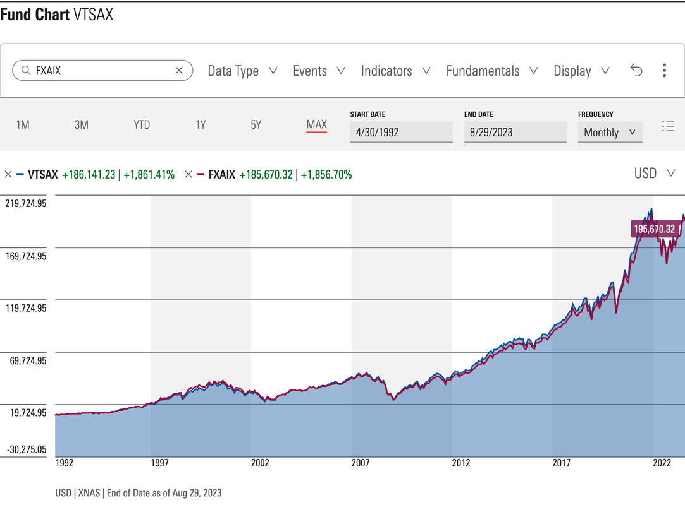

## Table of Contents

## What is the Vanguard Total Stock Market Index Fund?

The Vanguard Total Stock Market Index Fund is a type of investment fund that tries to match the performance of the entire U.S. stock market. It does this by holding a little bit of almost every stock available in the U.S., from big companies to smaller ones. This way, it gives investors a broad and diversified way to invest in the stock market without having to pick individual stocks themselves.

This fund is popular because it's easy to invest in and usually has low costs. When you invest in this fund, you're essentially betting on the overall growth of the U.S. economy. Over time, this can be a good strategy because the stock market tends to go up, even if there are ups and downs along the way.

## What is the Vanguard 500 Index Fund?

The Vanguard 500 Index Fund is another type of investment fund that aims to match the performance of the S&P 500, which is a group of 500 big companies in the U.S. When you invest in this fund, you're buying a small piece of each of these companies. It's a popular choice for people who want to invest in the stock market without having to choose individual stocks.

This fund is similar to the Vanguard Total Stock Market Index Fund but focuses only on the 500 largest companies. It's known for being simple to invest in and having low fees, which means more of your money stays invested and working for you. Over time, investing in the S&P 500 has been a good way to grow your money because these big companies often do well as the economy grows.

## How do the investment objectives of these two funds differ?

The Vanguard Total Stock Market Index Fund and the Vanguard 500 Index Fund have slightly different investment objectives. The Total Stock Market Index Fund aims to match the performance of the entire U.S. stock market. This means it includes stocks from thousands of companies, from the biggest to the smallest. The goal is to give investors a broad and diversified way to invest in the overall growth of the U.S. economy.

On the other hand, the Vanguard 500 Index Fund focuses on matching the performance of the S&P 500, which includes only the 500 largest companies in the U.S. This fund is more concentrated on big companies and might be seen as a way to invest in the performance of these major players in the economy. While it's still diversified, it doesn't cover the full range of the U.S. stock market like the Total Stock Market Index Fund does.

Both funds aim to provide a simple and low-cost way to invest in the stock market, but they do so with different scopes. The Total Stock Market Index Fund offers broader exposure, which might appeal to investors looking for maximum diversification. The 500 Index Fund, with its focus on large companies, might be more attractive to those who believe in the growth potential of these big firms.

## What are the key differences in the composition of the Vanguard Total Stock Market Index Fund and the Vanguard 500 Index Fund?

The Vanguard Total Stock Market Index Fund and the Vanguard 500 Index Fund differ mainly in the number and size of the companies they include. The Total Stock Market Index Fund tries to match the whole U.S. stock market. It holds stocks from thousands of companies, including big ones, medium-sized ones, and small ones. This means it covers a wide range of the market, giving investors a lot of variety in their investments.

On the other hand, the Vanguard 500 Index Fund focuses only on the S&P 500. This means it includes stocks from just 500 of the biggest companies in the U.S. It's more concentrated on large companies and doesn't include the smaller ones that are part of the Total Stock Market Index Fund. So, while both funds give you a way to invest in the stock market, the 500 Index Fund is narrower in its focus.

## How do the expense ratios of these two funds compare?

The expense ratio is how much it costs to run a fund, and it's taken out of the fund's returns each year. For the Vanguard Total Stock Market Index Fund, the expense ratio is very low. It's about 0.03% for the Admiral Shares version, which means for every $10,000 you invest, you pay just $3 a year in fees. This low cost makes it a good choice for people who want to keep more of their investment returns.

The Vanguard 500 Index Fund also has a low expense ratio, but it's even lower than the Total Stock Market Index Fund. For the Admiral Shares version, the expense ratio is about 0.04%. That's just $4 a year for every $10,000 invested. Even though it's a tiny bit higher than the Total Stock Market Index Fund, both are still very low and make these funds attractive to investors looking to minimize costs.

## What are the historical performance differences between the Vanguard Total Stock Market Index Fund and the Vanguard 500 Index Fund?

The Vanguard Total Stock Market Index Fund and the Vanguard 500 Index Fund have very similar historical performance because they both aim to track broad segments of the U.S. stock market. Over the long term, both funds have provided investors with solid returns. For example, over the past 10 years, both funds have grown at about the same rate, with the Total Stock Market Index Fund slightly outperforming the 500 Index Fund in some years and vice versa in others. The difference in their returns is usually very small because the S&P 500, which the 500 Index Fund tracks, makes up a big part of the total U.S. stock market.

However, there can be small differences in their performance because of how they are made up. The Total Stock Market Index Fund includes stocks from thousands of companies, including smaller ones that aren't in the S&P 500. These smaller companies can sometimes grow faster than big companies, which might help the Total Stock Market Index Fund do a bit better during those times. On the other hand, the 500 Index Fund focuses on the 500 largest companies, which can be more stable and might do better when investors are looking for safety. Overall, these differences are usually not big enough to make a huge impact on long-term returns, but they can lead to slight variations year to year.

## How does the diversification benefit vary between these two funds?

The Vanguard Total Stock Market Index Fund offers more diversification than the Vanguard 500 Index Fund. It includes stocks from thousands of companies, from the biggest to the smallest. This means you're spreading your investment across a huge part of the U.S. stock market. If one company or a small group of companies does poorly, it won't hurt your whole investment as much because you have so many other companies in the fund.

The Vanguard 500 Index Fund, on the other hand, focuses only on the 500 largest companies in the U.S. It's still a good way to diversify your investments, but it's not as broad as the Total Stock Market Index Fund. If something goes wrong with big companies, it could affect your investment more because you don't have the smaller companies to balance things out. So, the Total Stock Market Index Fund gives you a wider safety net, while the 500 Index Fund might be a bit riskier but still pretty safe because it's focused on big, stable companies.

## What are the considerations for tax efficiency in these two funds?

Both the Vanguard Total Stock Market Index Fund and the Vanguard 500 Index Fund are designed to be tax-efficient, but there are some small differences to think about. These funds are good at keeping your taxes low because they don't buy and sell stocks a lot. When a fund trades a lot, it can create capital gains that you have to pay taxes on. Both of these funds aim to match the performance of their indexes, so they only trade when the indexes change, which doesn't happen often.

The Total Stock Market Index Fund might be a bit more tax-efficient because it includes smaller companies. Smaller companies can grow faster, and if they do well, the fund might not have to sell them as often. This means fewer taxable events for you. The 500 Index Fund focuses on big companies, which might need to be sold or bought more often to keep up with changes in the S&P 500. But the difference in tax efficiency between these two funds is usually small, and both are considered good choices if you want to keep your taxes low.

## How do minimum investment requirements compare between the Vanguard Total Stock Market Index Fund and the Vanguard 500 Index Fund?

The minimum investment requirements for the Vanguard Total Stock Market Index Fund and the Vanguard 500 Index Fund depend on which share class you choose. For the Admiral Shares of both funds, you need at least $3,000 to start investing. This is the same for both the Total Stock Market Index Fund and the 500 Index Fund. Admiral Shares are good for people who have a bit more money to invest because they have lower fees than the other type of shares.

For the Investor Shares of both funds, the minimum investment is lower. You only need $3,000 to start with the Investor Shares of the Total Stock Market Index Fund and the 500 Index Fund. These shares are better if you're just starting out and don't have as much money to invest. But remember, Investor Shares have higher fees than Admiral Shares, so they cost a bit more to own over time.

## What are the implications of market capitalization weighting in these funds?

Both the Vanguard Total Stock Market Index Fund and the Vanguard 500 Index Fund use market capitalization weighting. This means the bigger a company is, the more of it the fund will hold. So, if a company is worth a lot more than others, it will make up a bigger part of the fund. This can be good because bigger companies often have a bigger impact on the market. But it also means that if these big companies don't do well, it can affect the whole fund more.

For the Total Stock Market Index Fund, this means that even though it includes thousands of companies, the biggest ones will have the most influence on how the fund does. The same goes for the 500 Index Fund, which only includes the 500 largest companies. Since both funds are weighted this way, they will perform a lot like each other, but the Total Stock Market Fund might be a little less affected by the biggest companies because it also includes smaller ones. Still, the big companies will have a lot of say in how both funds do.

## How do these funds respond to market volatility, and what are the potential impacts on an investor's portfolio?

Both the Vanguard Total Stock Market Index Fund and the Vanguard 500 Index Fund will go up and down with the overall stock market. When the market is doing well, both funds will likely go up too. But when the market is going through a rough time, like during a big drop or a lot of ups and downs, both funds will also go down. This is because they are trying to match the performance of the whole market or a big part of it. So, if you have money in these funds, you need to be ready for the market to be bumpy sometimes.

The Total Stock Market Index Fund might be a little less affected by big swings because it includes a lot more smaller companies. These smaller companies can sometimes do better when the market is going crazy. But the 500 Index Fund, which only has the biggest companies, might feel the ups and downs more because those big companies can move the market a lot. No matter which fund you choose, having money in these funds means your portfolio will feel the market's volatility. But over a long time, both funds have a good chance of growing because the market usually goes up in the long run.

## What are the advanced strategies for using these funds in a diversified investment portfolio?

One advanced strategy for using these funds in a diversified investment portfolio is to use them as the core of your investments. You can put a big part of your money into either the Vanguard Total Stock Market Index Fund or the Vanguard 500 Index Fund, depending on how much diversification you want. The Total Stock Market Index Fund gives you a lot of variety because it includes thousands of companies, while the 500 Index Fund focuses on the biggest ones. Once you have your core set, you can add other investments around it, like bonds or international stocks, to spread your risk even more. This way, you're building a strong base that grows with the U.S. economy, and then you're adding other pieces to make your portfolio safer and more likely to do well no matter what's happening in the market.

Another strategy is to use these funds for dollar-cost averaging. This means you put a set amount of money into the fund every month or every few months, no matter what the market is doing. Over time, this can help you buy more shares when the price is low and fewer when it's high, which can make your overall cost lower. You could use the Total Stock Market Index Fund if you want to be as diversified as possible, or the 500 Index Fund if you believe in the long-term growth of big companies. Either way, this strategy helps you smooth out the ups and downs of the market and can lead to good long-term growth.

## References & Further Reading

[1]: ["The Little Book of Common Sense Investing: The Only Way to Guarantee Your Fair Share of Stock Market Returns"](https://www.amazon.com/Little-Book-Common-Sense-Investing/dp/1119404509) by John C. Bogle

[2]: ["Common Sense on Mutual Funds"](https://www.amazon.com/Common-Sense-Mutual-Funds-Anniversary/dp/0470138130) by John C. Bogle

[3]: ["Advances in Financial Machine Learning"](https://www.amazon.com/Advances-Financial-Machine-Learning-Marcos/dp/1119482089) by Marcos Lopez de Prado

[4]: ["Quantitative Trading: How to Build Your Own Algorithmic Trading Business"](https://www.amazon.com/Quantitative-Trading-Build-Algorithmic-Business/dp/1119800064) by Ernest P. Chan

[5]: ["Algorithmic Trading: Winning Strategies and Their Rationale"](https://www.amazon.com/Algorithmic-Trading-Winning-Strategies-Rationale-ebook/dp/B00CY5HC0U) by Ernie Chan

[6]: ["Technical Analysis of the Financial Markets"](https://drive.google.com/file/d/1OcDrGakDhaejT7J7xGEE3HHKy7xmrafy/preview) by John J. Murphy

[7]: ["Python for Finance: Analyze Big Financial Data"](https://books.google.com/books/about/Python_for_Finance.html?id=E93SBQAAQBAJ) by Yves Hilpisch

[8]: Browne, S. (2000). ["Bounded-Value Stock-Price Targeting Strategies."](https://www.cambridge.org/core/journals/journal-of-applied-probability/article/abs/stochastic-differential-portfolio-games/80B09DF3B30C6AD847C4F9E77EEE48C7) Journal of Finance, 55(5), 2221-2249.

[9]: Kose, N.K., & Kadir, M.B. (2019). ["Algorithmic Trading Based on Technical Indicators and Artificial Neural Networks: A Study on an Emerging Market."](https://pmc.ncbi.nlm.nih.gov/articles/PMC10720914/) Elsevier.