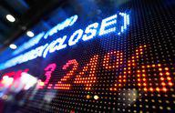

Investment in index funds has grown notably among investors seeking diversified and cost-effective exposure to the stock market. Index funds, which passively track a specific market index, provide a straightforward strategy for achieving stable returns over time. Vanguard stands as a significant influence in this domain, largely due to its flagship products, the Vanguard 500 Index Fund and the Vanguard Total Stock Market Index Fund. These funds offer investors a way to gain exposure to a wide array of stocks, encompassing both large U.S. corporations and a broader range of smaller companies.

Algorithmic trading, a modern technique rooted in data science and technological advancements, is becoming a prevalent method for trading equities, including index funds. By utilizing sophisticated algorithms, traders can automate decision-making processes, aiming for optimal trade execution. This technology reduces human error and increases efficiency in investment strategies, aligning well with the passive nature of index fund investing.



This article investigates the relationship between Vanguard's notable index funds and the application of algorithmic trading. It includes a detailed comparison of these funds, examines their integration into algorithmic trading, and offers insights for making informed strategic investment decisions. As financial markets continue to evolve, understanding the synergy between traditional index investing and algorithmic strategies is crucial for modern investors.

## Table of Contents

## Understanding Vanguard Index Funds

Vanguard is renowned for its array of index funds, with the Vanguard 500 Index Fund and the Vanguard Total Stock Market Index Fund being among its flagship offerings. Each fund serves distinct investment goals but collectively aims to provide broad market exposure with minimal expenses.

The Vanguard 500 Index Fund replicates the performance of the S&P 500, an index comprising 500 of the largest corporations in the United States. These typically include well-established companies with considerable market capitalizations across diverse sectors such as technology, healthcare, finance, and consumer goods. This fund offers investors exposure to a significant portion of the U.S. equity market, focusing predominantly on large-cap stocks, known for their relative stability and lower volatility compared to smaller-cap stocks. Its strategic composition appeals to investors seeking a balance of substantial growth and safer investments.

In contrast, the Vanguard Total Stock Market Index Fund aims to track the performance of the CRSP US Total Market Index. This index encompasses a broader variety of stocks, including small, mid, and large-cap equities, thus offering a more comprehensive representation of the entire U.S. stock market. By capturing the performance of over 3,500 stocks, this fund provides diversified exposure that includes emerging sectors and smaller companies poised for growth. While this diversification can present increased volatility, it also positions investors to benefit from the rapid growth potentials often seen in mid and small-cap stocks.

Both the Vanguard 500 Index Fund and the Total Stock Market Index Fund offer investors a means to partake in passive management strategies. This investment style primarily focuses on replicating index performance rather than outperforming it, which tends to reduce both cost and risk. The appeal lies in their low expense ratios, as passive funds incur lower fees than active management, where fund managers frequently buy and sell stocks.

For investors interested in [algorithmic trading](/wiki/algorithmic-trading) strategies, a comprehensive understanding of these funds' compositions and historical performances is essential. By assessing historical data, investors can tailor algorithmic models to align with fund characteristics, market conditions, and investment horizons. These models can deploy risk management through diversification and strategic asset allocation using methodologies that optimize both fund performance and trading execution. Ultimately, successful integration of algorithmic trading requires an in-depth knowledge of market indices and the factors that drive their performance, providing the foundation for informed, dynamic investment strategy development.

## The Role of Algorithmic Trading

Algorithmic trading involves the use of pre-programmed instructions to execute trades. These instructions rely on mathematical models and complex algorithms to determine the timing, price, and size of trades. For index funds like those managed by Vanguard, algorithmic trading offers the advantage of automation, allowing for more efficient decisions when it comes to portfolio balancing and optimizing fund performance. This automation leads to significant reductions in transaction costs and improvements in execution speed, which are attractive benefits for both individual and institutional investors seeking to maximize returns while minimizing expenses.

At its core, the efficiency of algorithmic trading lies in its ability to process and analyze large volumes of data at speeds unreachable by human traders. This capability is particularly useful for exploiting small price discrepancies across different markets or index funds, a strategy known as statistical [arbitrage](/wiki/arbitrage). For instance, algorithms can be designed to monitor indices globally and identify opportunities where a temporary mispricing between a Vanguard index fund and another comparable financial instrument exists. By executing trades that exploit these inefficiencies, algorithms can potentially deliver additional returns beyond typical market gains.

Algorithmic trading systems usually operate on a set of criteria based on historical data, market fluctuations, and trading volumes. The aim is to generate profits by allowing the algorithm to make real-time decisions based on the evolving market conditions. To adequately leverage algorithmic trading with index funds, investors need to have a solid understanding of both market mechanics and the underlying technology. This includes knowledge of the algorithms’ predictive models, risk assessment parameters, and the ability to interpret outputs effectively.

While developing an algorithm, several factors must be considered, such as the choice of programming language, algorithmic complexity, and computational efficiency. Python, for example, is often preferred due to its rich ecosystem of libraries and ease of use. Here's a basic example of what a simple [backtesting](/wiki/backtesting) script might look like in Python for testing an algorithm's performance:

```python
import pandas as pd
import numpy as np
import matplotlib.pyplot as plt

# Load historical price data
data = pd.read_csv('historical_data.csv')
data['Returns'] = np.log(data['Close'] / data['Close'].shift(1))

# Define simple moving average strategy
def moving_average_strategy(data, short_window, long_window):
    data['Short_MA'] = data['Close'].rolling(window=short_window).mean()
    data['Long_MA'] = data['Close'].rolling(window=long_window).mean()
    data['Signal'] = 0
    data['Signal'][short_window:] = np.where(data['Short_MA'][short_window:] > data['Long_MA'][short_window:], 1, -1)
    data['Strategy_Return'] = data['Signal'].shift(1) * data['Returns']
    return data

# Implement the strategy and calculate returns
strategy_data = moving_average_strategy(data, short_window=40, long_window=100)
cumulative_strategy_return = (strategy_data['Strategy_Return'] + 1).cumprod()
cumulative_market_return = (strategy_data['Returns'] + 1).cumprod()

# Plot the strategy performance
plt.figure(figsize=(10, 5))
plt.plot(cumulative_strategy_return, label='Strategy Return')
plt.plot(cumulative_market_return, label='Market Return')
plt.xlabel('Date')
plt.ylabel('Cumulative Return')
plt.legend()
plt.show()
```

This example demonstrates a moving average crossover strategy, a basic form of algorithmic trading. While this is a simplified illustration, actual algorithmic trading requires rigorous testing and validation to ensure robust performance under various market conditions.

In conclusion, algorithmic trading's integration with index funds like those offered by Vanguard provides powerful tools for optimizing investment strategies. The application of such technology can lead to improved portfolio performance and better risk management. As financial markets and technologies continue to evolve, the potential for algorithmic trading methods in index fund management will likely grow, offering new ways for investors to achieve their financial goals effectively.

## Comparing Vanguard 500 Index Fund and Total Stock Market Index Fund

The Vanguard 500 Index Fund and the Vanguard Total Stock Market Index Fund offer distinct approaches to equity investments, each catering to different investor needs and preferences. 

The Vanguard 500 Index Fund primarily invests in large-cap U.S. stocks, focused on the 500 leading companies that make up the S&P 500 index. This concentration on large, established companies generally results in lower [volatility](/wiki/volatility-trading-strategies), particularly during market downturns. The stability of this fund comes from the long-standing reputation and financial resilience of the constituent companies, which often have substantial market capitalization and a proven track record of consistent earnings.

Conversely, the Vanguard Total Stock Market Index Fund provides exposure to the entire U.S. stock market, including small, mid, and large-cap stocks. This fund comprises thousands of stocks, extending beyond the S&P 500 to include emerging and smaller companies that have more potential for significant growth. The diverse nature of its portfolio can lead to higher volatility, but it also offers opportunities for greater returns over the long term due to the potential appreciation of smaller, rapidly growing companies.

Both Vanguard funds are known for their low expense ratios, making them attractive to cost-conscious investors. For instance, Vanguard's emphasis on minimizing fees is reflected in these funds' design, allowing investors to retain more of their earnings compared to actively managed funds with higher fee structures. 

The diversification strategies employed by these funds differ significantly. The 500 Index Fund's targeting of established companies may offer investors a conservative growth strategy, with lower risk and moderate returns. On the other hand, the Total Stock Market Index Fund’s inclusive approach provides a more aggressive strategy aiming to capture broader market gains, accommodating investors willing to embrace higher risk for potential reward.

Investors can choose to blend both funds for a more balanced risk profile, leveraging their complementarities. This combined approach enables investors to benefit from the stability of large-cap investments while still seizing the growth opportunities presented by mid and small-cap stocks. Incorporating algorithmic strategies into this blend can further optimize performance, automating rebalancing decisions based on market conditions to maximize returns and manage risks effectively.

Overall, the choice between the Vanguard 500 Index Fund and the Total Stock Market Index Fund depends largely on the investor’s risk appetite, investment goals, and financial strategy. The integration of algorithmic trading provides an additional layer of precision and adaptability, ensuring that the investment strategy remains aligned with dynamic market conditions.

## Integrating Algorithmic Trading with Vanguard Index Funds

Algorithmic trading offers a powerful toolset for optimizing entry and [exit](/wiki/exit-strategy) points, thereby enhancing the management of Vanguard index fund investments. By employing quantitative models, investors can backtest their strategies, enabling them to predict future performance with a higher degree of accuracy. This process allows dynamic adjustments of investment positions based on historical data patterns and statistical analysis. For example, considering a simple moving average crossover strategy:

```python
import numpy as np
import pandas as pd

def moving_average_strategy(prices, short_window, long_window):
    signals = pd.DataFrame(index=prices.index)
    signals['price'] = prices
    signals['short_mavg'] = prices.rolling(window=short_window, min_periods=1).mean()
    signals['long_mavg'] = prices.rolling(window=long_window, min_periods=1).mean()
    signals['signal'] = 0.0
    signals['signal'][short_window:] = np.where(signals['short_mavg'][short_window:] > signals['long_mavg'][short_window:], 1.0, 0.0)
    signals['positions'] = signals['signal'].diff()
    return signals
```

This Python code illustrates how a moving average crossover strategy might be implemented, using short and long moving averages to generate buy and sell signals.

Risk management algorithms are essential tools used alongside these strategies to maintain desired exposure levels, especially in volatile markets. These algorithms dynamically adjust positions to mitigate risks and adhere to predefined risk parameters. For instance, they may employ techniques such as Value at Risk (VaR) calculations or employ hedging strategies using futures or options.

Engaging in algorithmic trading requires strict compliance with regulatory standards to avoid legal entanglements. Regulatory bodies like the U.S. Securities and Exchange Commission (SEC) and the Commodity Futures Trading Commission (CFTC) govern algorithmic trading activities. Investors and fund managers must ensure that their trading systems adhere to these regulations, including maintaining audit trails and employing safeguards against malfunctions.

As digital technology continues to evolve, index fund investing is becoming increasingly digitized. Algorithms are playing an integral role in maximizing returns by automating complex trading strategies. Whether investors manage their portfolios directly or utilize third-party trading platforms, incorporating algorithmic techniques with Vanguard index funds can significantly enhance portfolio performance.

Continued technological advancements are expected to increase the sophistication and accessibility of algorithmic trading tools, further empowering investors to optimize their index fund investments. The fusion of Vanguard's robust index funds with state-of-the-art algorithmic trading infrastructure represents a pivotal shift towards more efficient and profitable investing strategies.

## Conclusion

Vanguard index funds and algorithmic trading represent a powerful synergy in modern investing, offering investors innovative tools to enhance their investment strategies. With the advancement of technology, investors now possess the capability to automate trading strategies, significantly optimizing the performance of their Vanguard index funds. This combination leverages algorithms to identify optimal trading opportunities, ensuring more efficient execution and reduced transaction costs.

As the landscape of investment technology evolves, the sophistication and accessibility of algorithmic trading are poised to expand even further. This growth will enable a broader range of investors, from individuals to institutions, to utilize these advanced tools to refine their investment approaches. The incorporation of algorithmic techniques, either through direct management or third-party platforms, provides a robust framework to achieve consistent and potentially higher returns within Vanguard index fund portfolios.

However, navigating this transformative environment requires continuous education and adaptability. Investors must stay informed about technological advancements and regulatory changes to fully leverage these tools while mitigating associated risks. By committing to ongoing learning and adaptation, investors can capitalize on the dynamic intersection of Vanguard index funds and algorithmic trading, shaping their investment strategies to meet the challenges and opportunities of tomorrow's financial markets.

## References & Further Reading

[1]: ["The Little Book of Common Sense Investing: The Only Way to Guarantee Your Fair Share of Stock Market Returns"](https://www.amazon.com/Little-Book-Common-Sense-Investing/dp/1119404509) by John C. Bogle

[2]: ["Common Sense on Mutual Funds"](https://www.amazon.com/Common-Sense-Mutual-Funds-Anniversary/dp/0470138130) by John C. Bogle

[3]: ["Advances in Financial Machine Learning"](https://www.amazon.com/Advances-Financial-Machine-Learning-Marcos/dp/1119482089) by Marcos Lopez de Prado

[4]: ["Quantitative Trading: How to Build Your Own Algorithmic Trading Business"](https://www.amazon.com/Quantitative-Trading-Build-Algorithmic-Business/dp/1119800064) by Ernest P. Chan

[5]: ["Algorithmic Trading: Winning Strategies and Their Rationale"](https://www.amazon.com/Algorithmic-Trading-Winning-Strategies-Rationale-ebook/dp/B00CY5HC0U) by Ernie Chan

[6]: ["Technical Analysis of the Financial Markets"](https://drive.google.com/file/d/1OcDrGakDhaejT7J7xGEE3HHKy7xmrafy/preview) by John J. Murphy

[7]: ["Python for Finance: Analyze Big Financial Data"](https://books.google.com/books/about/Python_for_Finance.html?id=E93SBQAAQBAJ) by Yves Hilpisch

[8]: Browne, S. (2000). ["Bounded-Value Stock-Price Targeting Strategies."](https://www.cambridge.org/core/journals/journal-of-applied-probability/article/abs/stochastic-differential-portfolio-games/80B09DF3B30C6AD847C4F9E77EEE48C7) Journal of Finance, 55(5), 2221-2249.

[9]: Kose, N.K., & Kadir, M.B. (2019). ["Algorithmic Trading Based on Technical Indicators and Artificial Neural Networks: A Study on an Emerging Market."](https://pmc.ncbi.nlm.nih.gov/articles/PMC10720914/) Elsevier.