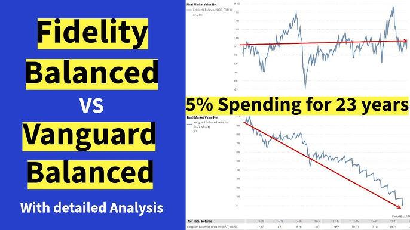

## Table of Contents

## What are Vanguard VGSTX and Fidelity FBALX?

Vanguard VGSTX, or the Vanguard STAR Fund, is a mutual fund that invests in a mix of stocks and bonds. It's designed to give investors a balanced way to grow their money over time. The fund includes other Vanguard funds, which makes it easy for people to have a diversified investment without having to pick individual stocks or bonds themselves.

Fidelity FBALX, or the Fidelity Balanced Fund, is another mutual fund that also mixes stocks and bonds. It aims to provide both growth and income for investors. Like VGSTX, it's a good choice for someone who wants a balanced approach to investing without the need to manage a portfolio of individual securities.

## What are the main investment objectives of VGSTX and FBALX?

The main goal of the Vanguard STAR Fund (VGSTX) is to grow your money over time while also keeping it safe. It does this by spreading your investment across different types of stocks and bonds. This mix helps to balance the risk and reward, making it a good choice for people who want their money to grow but don't want to take too many chances.

The Fidelity Balanced Fund (FBALX) has a similar aim but focuses on both growing your money and providing you with some income. It invests in a combination of stocks, which can help your money grow, and bonds, which can give you regular income. This fund is designed for investors who want a steady way to increase their savings while also getting some money back to use or reinvest.

## How do the asset allocations of VGSTX and FBALX differ?

The Vanguard STAR Fund (VGSTX) spreads your money across different types of investments. It puts about 60% to 70% of your money into stocks, which can help your money grow over time. The rest, about 30% to 40%, goes into bonds, which are usually safer and can help protect your money. This mix is meant to balance growth with safety, so you don't have to worry too much about big ups and downs in the market.

The Fidelity Balanced Fund (FBALX) also mixes stocks and bonds but in a slightly different way. It typically puts around 60% to 70% of your money into stocks for growth and the remaining 30% to 40% into bonds for income and safety. While the percentages are similar to VGSTX, FBALX might choose different stocks and bonds, which can affect how the fund performs. Both funds aim to give you a balanced approach, but their specific choices can lead to different results.

## What are the historical performance differences between VGSTX and FBALX?

Over the years, the Vanguard STAR Fund (VGSTX) and the Fidelity Balanced Fund (FBALX) have shown different results. VGSTX has had an average yearly return of about 7% to 8% over the long term. This means if you put $100 in the fund many years ago, it might be worth around $200 to $220 now. The fund tries to balance growth with safety, so it doesn't go up and down as much as funds that only invest in stocks.

FBALX has also done well, with an average yearly return of about 8% to 9%. If you had invested $100 in FBALX a long time ago, it could be worth around $220 to $240 today. This fund also balances growth and safety but might have different stocks and bonds than VGSTX, which can make its performance a bit different. Both funds aim to grow your money steadily over time, but FBALX has slightly outperformed VGSTX in the past.

## What are the expense ratios for VGSTX and FBALX, and how do they compare?

The expense ratio for the Vanguard STAR Fund (VGSTX) is about 0.31%. This means if you have $10,000 invested in the fund, you'll pay around $31 each year to cover the costs of running the fund. A lower expense ratio like this can help your money grow more over time because you're keeping more of your investment returns.

The expense ratio for the Fidelity Balanced Fund (FBALX) is higher at about 0.50%. So, if you have $10,000 invested in FBALX, you'll pay around $50 each year. Even though the difference between 0.31% and 0.50% might seem small, over many years, paying less in fees can make a big difference in how much your investment grows.

## How do the risk profiles of VGSTX and FBALX compare?

The Vanguard STAR Fund (VGSTX) and the Fidelity Balanced Fund (FBALX) both try to balance growth and safety, but they have slightly different risk profiles. VGSTX spreads your money across many different types of stocks and bonds, which helps to reduce the risk because it's not all in one place. This mix can make the fund less likely to lose a lot of value quickly, but it also means it might not grow as fast as a fund that only invests in stocks. Overall, VGSTX is considered to have a moderate risk level, suitable for someone who wants to grow their money but doesn't want to take big chances.

FBALX also mixes stocks and bonds, but it might choose different investments than VGSTX, which can affect its risk level. Like VGSTX, FBALX aims to balance growth and safety, but it might be a bit more aggressive in its stock choices, which can lead to higher returns but also higher risk. The risk profile of FBALX is also considered moderate, but it might have slightly more ups and downs than VGSTX because of its investment choices. Both funds are good for people who want a balanced approach, but FBALX might be a bit riskier.

## What are the minimum investment requirements for VGSTX and FBALX?

To start investing in the Vanguard STAR Fund (VGSTX), you need at least $1,000 if you're opening a new account. If you already have an account with Vanguard and want to add more money to VGSTX, you can do it with no minimum amount. This makes it easier for people who already invest with Vanguard to keep adding to their investments little by little.

For the Fidelity Balanced Fund (FBALX), you need at least $2,500 to start investing if you're opening a new account. Like VGSTX, if you already have an account with Fidelity and want to add more to FBALX, you don't need a minimum amount. This means you can keep investing in FBALX without worrying about meeting a certain threshold each time you add money.

## How do the dividend yields of VGSTX and FBALX compare?

The Vanguard STAR Fund (VGSTX) usually has a dividend yield of around 1% to 2%. This means if you have $10,000 invested in VGSTX, you might get about $100 to $200 in dividends each year. The fund focuses on growing your money over time, so the dividend part is not the main thing, but it still gives you a little extra money to use or reinvest.

The Fidelity Balanced Fund (FBALX) has a slightly higher dividend yield, usually around 2% to 3%. So, if you have $10,000 in FBALX, you could get about $200 to $300 in dividends every year. FBALX tries to give you both growth and income, so the dividend part is a bit more important than in VGSTX. This can be good if you want to get some regular money from your investment.

## What are the tax implications of investing in VGSTX versus FBALX?

When you invest in the Vanguard STAR Fund (VGSTX), you might have to pay taxes on the money you earn from it. The fund gives you dividends and might also make money when it sells stocks or bonds. You'll need to pay taxes on these dividends and any gains from selling investments inside the fund. If you hold VGSTX for more than a year, you might pay a lower tax rate on the gains, which is good. But if you sell your shares in VGSTX and make a profit, you'll also have to pay taxes on that profit.

The Fidelity Balanced Fund (FBALX) works the same way when it comes to taxes. You'll pay taxes on the dividends it gives you and on any gains it makes from selling stocks or bonds. Like VGSTX, if you keep FBALX for more than a year, you might pay less tax on the gains. And if you sell your FBALX shares at a profit, you'll need to pay taxes on that profit too. The main difference between VGSTX and FBALX in terms of taxes might come from how each fund manages its investments and how often they sell things, which can affect how much tax you owe each year.

## How do the portfolio managers of VGSTX and FBALX approach their investment strategies?

The portfolio managers of the Vanguard STAR Fund (VGSTX) focus on spreading your money across many different types of investments. They want to balance growth with safety, so they put about 60% to 70% of your money into stocks and the rest into bonds. This mix helps to lower the risk because not all your money is in one place. The managers pick other Vanguard funds to invest in, which makes it easier for you to have a diverse portfolio without having to choose individual stocks or bonds yourself. They keep an eye on how the different funds are doing and make changes if needed to keep the balance right.

The portfolio managers of the Fidelity Balanced Fund (FBALX) also aim to balance growth and safety, but they do it a bit differently. They typically put around 60% to 70% of your money into stocks for growth and the rest into bonds for income and safety. The managers at Fidelity might choose different stocks and bonds than Vanguard, which can affect how the fund performs. They look at the overall market and try to find the best investments that will help your money grow while also giving you some regular income. They adjust the fund's investments based on what they think will work best for reaching the goal of both growth and income.

## What are the sector weightings in VGSTX and FBALX, and how do they differ?

The Vanguard STAR Fund (VGSTX) spreads your money across many different areas of the market. It puts a big part of your money into technology, health care, and financial services. These sectors can help your money grow because they often do well over time. VGSTX also invests in other areas like consumer goods and utilities, but not as much. The idea is to have a good mix so that if one area doesn't do well, the others can help balance it out.

The Fidelity Balanced Fund (FBALX) also invests in many sectors but might focus a bit more on technology, health care, and industrials. These areas can help your money grow, but FBALX might have different amounts in each sector compared to VGSTX. For example, FBALX might put more money into industrials than VGSTX does. Both funds want to have a good mix of sectors, but their choices can make them perform differently over time.

## How have VGSTX and FBALX performed during different market conditions, such as bull and bear markets?

During bull markets, when the stock market is doing well and going up, both the Vanguard STAR Fund (VGSTX) and the Fidelity Balanced Fund (FBALX) tend to do pretty good. VGSTX, with its mix of stocks and bonds, can grow your money nicely because it has a lot in stocks. FBALX also does well because it has a big part in stocks too. But since both funds also have bonds, they might not grow as fast as funds that only invest in stocks. Still, they can help your money grow without taking too many chances.

In bear markets, when the stock market is going down, VGSTX and FBALX can help protect your money better than funds that only invest in stocks. VGSTX, with its mix of stocks and bonds, might not lose as much value because the bonds can help balance out the losses from stocks. FBALX works the same way, using bonds to help keep your money safer. Both funds aim to keep your money safe during tough times, but they might still go down a bit because they have stocks too. Overall, they can help you feel more secure during bad market times.

## References & Further Reading

[1]: Bergstra, J., Bardenet, R., Bengio, Y., & Kégl, B. (2011). ["Algorithms for Hyper-Parameter Optimization."](https://papers.nips.cc/paper/4443-algorithms-for-hyper-parameter-optimization) Advances in Neural Information Processing Systems 24.

[2]: ["Advances in Financial Machine Learning"](https://www.amazon.com/Advances-Financial-Machine-Learning-Marcos/dp/1119482089) by Marcos Lopez de Prado

[3]: ["Evidence-Based Technical Analysis: Applying the Scientific Method and Statistical Inference to Trading Signals"](https://www.amazon.com/Evidence-Based-Technical-Analysis-Scientific-Statistical/dp/0470008741) by David Aronson

[4]: ["Machine Learning for Algorithmic Trading"](https://github.com/stefan-jansen/machine-learning-for-trading) by Stefan Jansen

[5]: ["Quantitative Trading: How to Build Your Own Algorithmic Trading Business"](https://www.amazon.com/Quantitative-Trading-Build-Algorithmic-Business/dp/1119800064) by Ernest P. Chan