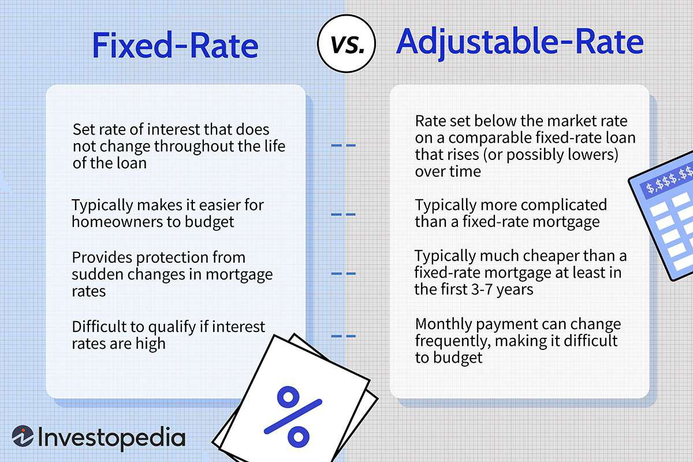

In the fast-paced world of algorithmic trading, understanding the components of cost structures is crucial for maximizing profitability. Algorithmic trading, which uses complex algorithms to automate trading decisions and execute orders at optimal speeds, is significantly impacted by how costs are managed. The efficiency of a trading strategy is not solely determined by its ability to generate profits but also by how well it manages costs associated with executing trades.

This article aims to demystify the concepts of fixed and variable costs in the context of algorithmic trading. Fixed costs are those that remain constant regardless of the number of trades executed, such as software subscriptions, data feeds, and hardware maintenance. Meanwhile, variable costs fluctuate with trading activity, including transaction fees, brokerage commissions, and regulatory charges.



We'll explore how these cost structures impact trading strategies and discuss practical methods for comparison. Recognizing and controlling these expenses can enhance a trader's ability to optimize their trading strategies. A thorough understanding of cost implications enables traders to align their trading volume and execution with profitability goals. For example, knowing the breakdown of costs can help traders decide whether to scale operations or focus on optimizing existing trades for cost-efficiency.

Understanding the distinctions and implications of these costs can aid traders in optimizing their trading strategies. By clearly differentiating between fixed and variable costs, traders can perform detailed analyses, enabling them to tailor strategies that prioritize cost-effectiveness while maintaining competitive execution in the market. These insights are vital for making informed decisions about investments in trading technology and infrastructure, ultimately aiming for improved returns.

Join us as we examine fixed and variable costs and how they significantly influence algorithmic trading strategies.

## Table of Contents

## Understanding Fixed Costs in Algo Trading

Fixed costs in algorithmic trading represent those expenses that remain constant, independent of the number of trades executed or the level of trading activity. These stable financial outlays provide traders with a predictable expense framework, enabling more accurate budgeting and profitability forecasting.

Key components of fixed costs in algo trading include:

1. **Software Subscriptions**: Trading platforms and analytical tools often require ongoing subscriptions. Regardless of usage, these costs provide essential infrastructure for executing and monitoring trades effectively. Advanced platforms might include real-time analytics, risk management tools, and automated strategy execution features.

2. **Data Feed Services**: Access to real-time and historical market data is crucial for developing and executing trading strategies. Data feeds typically incur a fixed monthly fee, ensuring traders have continuous access to the necessary information for making informed trading decisions.

3. **Hardware Maintenance**: The physical equipment required for trading, such as servers and personal computers, incurs fixed maintenance costs. These expenses cover routine hardware updates and repairs, providing the reliability needed to minimize downtime and maintain optimal performance.

Understanding fixed costs is vital for traders as it allows them to establish a financial baseline from which variable costs can be assessed. When strategically planning, traders must account for these fixed expenses to ensure their strategies remain viable over the long term. Accurate anticipation of these costs aids in setting realistic profitability targets, allowing traders to maintain focus on maximizing returns after accounting for these base-level expenses.

Fixed costs can influence trading strategies significantly. Traders might seek strategies that generate returns exceeding these fixed expenditures. To illustrate, if fixed costs amount to \$5,000 monthly, traders should choose strategies likely to produce profits significantly above this threshold. Failure to do so may necessitate the reevaluation of strategies or fixed cost components to sustain profitability.

Effective management of fixed costs involves ongoing assessment to ensure that each expense contributes to the overall trading strategy. For instance, upgrading to more sophisticated software might increase fixed costs but could result in improved decision-making and profitability, thereby justifying the expense. In contrast, reducing fixed expenses may lead to trade-offs in performance or capability, warranting careful consideration.

## The Nature of Variable Costs in Algo Trading

Variable costs in [algorithmic trading](/wiki/algorithmic-trading) are expenses that vary with the level of trading activity. These costs play a vital role in determining the overall profitability of trading operations and require careful management. Understanding variable costs is fundamental for traders aiming to optimize their trading strategies and enhance cost-efficiency.

Transaction fees are a primary component of variable costs. These fees are charged by exchanges or trading platforms each time a trade is executed. For traders operating high-frequency or large-[volume](/wiki/volume-trading-strategy) strategies, transaction fees can accumulate quickly, affecting net returns significantly. Brokerage commissions are another significant variable cost, often calculated as a percentage of the trade value or as a fixed amount per trade. These commissions incentivize brokers, but they add to the cost of executing trades.

Regulatory charges, including transaction taxes and compliance fees, also fall under variable costs. These charges vary by jurisdiction and trading activity, influencing the overall cost structure depending on the regulatory environment in which a trader operates.

The management of variable costs is crucial as they directly impact the profitability of each trade. Effective cost management includes analyzing the cost per trade and adjusting strategies to minimize unnecessary expenses. For instance, traders might choose brokers or platforms offering lower fees or negotiate better commission rates based on trading volume. Additionally, by optimizing the frequency and timing of trades, it is possible to reduce exposure to high transaction fees.

To illustrate the effect of variable costs, consider the total profit formula for a given trading strategy:

$$
\text{Total Profit} = \text{Gross Profit} - (\text{Transaction Fees} + \text{Brokerage Commissions} + \text{Regulatory Charges})
$$

In Python, traders could use a simple script to calculate and analyze the variable costs for a given set of trades:

```python
def calculate_variable_costs(trades, fee_percentage, commission_per_trade, regulatory_charge):
    transaction_fees = sum(trade['value'] * fee_percentage for trade in trades)
    brokerage_commissions = len(trades) * commission_per_trade
    total_regulatory_charges = len(trades) * regulatory_charge
    return transaction_fees + brokerage_commissions + total_regulatory_charges

# Example usage
trades = [{'value': 1000}, {'value': 2000}, {'value': 1500}]
fee_percentage = 0.001  # 0.1% fee
commission_per_trade = 5  # $5 per trade
regulatory_charge = 1  # $1 per trade

total_variable_costs = calculate_variable_costs(trades, fee_percentage, commission_per_trade, regulatory_charge)
print(f"Total Variable Costs: ${total_variable_costs}")
```

For cost-efficiency optimization, traders may employ strategies such as consolidating trades to reduce frequency, selecting lower-cost service providers, or leveraging algorithms to execute trades at optimal times. Additionally, incorporating high-performance trading systems may help minimize latency-related costs, indirectly reducing variable expenditures.

Effective management of variable costs allows algorithmic traders to achieve greater profitability and maintain competitiveness. By regularly reviewing and adjusting their trading operations, traders can ensure that their strategies remain financially viable in an ever-evolving market.

## Cost Comparison: Fixed vs. Variable Costs

In algorithmic trading, differentiating between fixed and variable costs is essential to understand their financial implications. Fixed costs, such as software subscriptions and infrastructure maintenance, remain constant regardless of trading volume. On the other hand, variable costs fluctuate with trading activity, including transaction fees and commissions.

### Impact on Trading Strategies

Various trading strategies impact the balance between fixed and variable costs. For example, high-frequency trading ([HFT](/wiki/high-frequency-trading-strategies)) strategies typically incur significant fixed costs due to the need for advanced technology, high-performance computing, and low-latency data feeds. The fixed nature of these costs makes them more predictable, allowing traders to scale their operations without substantially increasing costs per trade. Conversely, swing trading strategies may have lower fixed costs but face higher variable costs relative to trade volume due to transactional expenses like brokerage fees.

### Real-World Examples

Real-world setups often exemplify how traders manage these expenses. For instance, an HFT firm might invest heavily in technology infrastructure to minimize latency, resulting in high fixed costs. However, the low variable costs per trade can be advantageous when executing large volumes of trades. Alternatively, a retail trader utilizing swing trading strategies could minimize fixed costs by opting for more affordable data services and software subscriptions, focusing on managing variable costs through selective trade execution to maintain profitability.

### Implications of Cost Models

Choosing between high fixed cost/low variable cost and low fixed cost/high variable cost models has strategic implications. A high fixed cost strategy requires significant upfront investments and a stable revenue stream to cover these expenses. However, it benefits from economies of scale, where trading more results in lower average total costs per trade. Conversely, a low fixed cost/high variable cost model offers flexibility and lower initial investment, but it demands careful management of trade volume to prevent costs from eroding profitability.

### Tools and Techniques for Calculation

Accurately calculating and comparing these cost structures is crucial. Traders can use various tools and techniques to analyze their expenses. Spreadsheet software like Microsoft Excel or Google Sheets facilitates detailed cost analysis by tracking fixed and variable expenses over time. Python programming provides a more advanced approach, allowing for dynamic modeling of cost structures. Here is an example of a simple Python script to estimate and compare costs:

```python
def calculate_costs(trade_volume, fixed_costs, variable_cost_rate):
    total_fixed_costs = fixed_costs
    total_variable_costs = trade_volume * variable_cost_rate
    total_costs = total_fixed_costs + total_variable_costs
    return total_fixed_costs, total_variable_costs, total_costs

fixed_costs = 10000  # Example fixed costs in dollars
variable_cost_rate = 0.1  # Example variable cost rate per trade in dollars
trade_volume = 1000  # Example number of trades

fixed, variable, total = calculate_costs(trade_volume, fixed_costs, variable_cost_rate)
print(f"Fixed Costs: ${fixed}")
print(f"Variable Costs: ${variable}")
print(f"Total Costs: ${total}")
```

These tools help traders simulate different scenarios, providing insights into how various cost structures influence overall trading performance. By understanding and optimizing these costs, traders can enhance their operational efficiency and maintain financial sustainability.

## Strategies for Optimizing Costs in Algo Trading

In algorithmic trading, optimizing costs is essential to maximize profitability and maintain a competitive edge. Innovative strategies can be employed to manage and reduce both fixed and variable expenses.

Leveraging technology and service providers is a crucial approach. By partnering with specialized service providers, traders can access cutting-edge trading platforms and data analytics tools that offer scalability and cost-efficiency. Technologies such as cloud computing and data storage solutions enable firms to adapt their infrastructure to their trading needs, optimizing resource utilization and reducing fixed expenses. For instance, migrating to a cloud-based infrastructure can eliminate the need for costly on-premises hardware, resulting in significant cost savings.

Automation plays a pivotal role in minimizing variable costs and maximizing return on investment. By automating routine trading tasks, firms can significantly reduce the time and resources spent on manual operations. This not only enhances trading efficiency but also reduces human error, which can lead to costly mistakes. Algorithmic solutions that optimize order execution can reduce transaction costs and slippage, directly improving the profitability of trades. Additionally, automated systems can operate continuously, capturing trading opportunities around the clock without incurring additional labor costs.

Balancing cost management with trading performance is essential to achieve sustainable profitability. Traders must ensure that cost-cutting measures do not compromise the quality and effectiveness of their trading strategies. This involves striking a balance between investing in essential technological resources and maintaining a lean operational structure. Regularly reviewing and negotiating brokerage fees, technology contracts, and other variable costs can also lead to improved cost management without affecting trading performance.

Examining successful cost optimization examples in algo trading firms provides valuable insights. For instance, a trading firm might implement a sophisticated algorithm capable of analyzing large datasets more efficiently, thereby reducing the need for extensive data subscription services. Another firm could adopt a dynamic pricing strategy, where algorithm parameters are adjusted based on market conditions to minimize transaction costs. By continuously evaluating cost structures and adapting to technological advancements, these firms maintain competitive profitability in the market.

## Conclusion

In algorithmic trading, distinguishing between fixed and variable costs is fundamental. Fixed costs, such as software subscriptions, data feeds, and hardware maintenance, remain constant regardless of trading activity. Conversely, variable costs, including transaction fees and commissions, fluctuate with trading volume. These distinctions shape trading strategies and influence profitability by affecting how resources are allocated and opportunities are exploited. 

Strategic cost management is crucial for maintaining a competitive edge. Effective cost analysis enables traders to optimize their operations by focusing on reducing unnecessary expenses and leveraging scalable solutions. As algorithmic trading environments are highly dynamic, continuous assessment and adjustment of cost strategies are necessary. Traders must stay agile, adapting to market changes and technological advancements to ensure cost structures remain efficient and profitable.

Traders are encouraged to apply these insights to refine their trading methodologies. By carefully evaluating the impact of fixed and variable costs, they can design strategies that maximize efficiency and profitability. This might involve investing in automation to lower variable costs or negotiating better terms with service providers to reduce fixed costs.

Finally, as the landscape of costs in algorithmic trading is ever-evolving, staying informed about industry trends and emerging technologies is essential. Continuous learning and adaptation will empower traders to optimize their practices and achieve sustained success. The effective management of fixed and variable costs will remain a cornerstone of thriving in the competitive world of algorithmic trading.

## References & Further Reading

[1]: Bergstra, J., Bardenet, R., Bengio, Y., & Kégl, B. (2011). ["Algorithms for Hyper-Parameter Optimization."](https://papers.nips.cc/paper/4443-algorithms-for-hyper-parameter-optimization) Advances in Neural Information Processing Systems 24.

[2]: ["Advances in Financial Machine Learning"](https://www.amazon.com/Advances-Financial-Machine-Learning-Marcos/dp/1119482089) by Marcos Lopez de Prado

[3]: ["Evidence-Based Technical Analysis: Applying the Scientific Method and Statistical Inference to Trading Signals"](https://www.amazon.com/Evidence-Based-Technical-Analysis-Scientific-Statistical/dp/0470008741) by David Aronson

[4]: ["Machine Learning for Algorithmic Trading"](https://github.com/stefan-jansen/machine-learning-for-trading) by Stefan Jansen

[5]: ["Quantitative Trading: How to Build Your Own Algorithmic Trading Business"](https://www.amazon.com/Quantitative-Trading-Build-Algorithmic-Business/dp/1119800064) by Ernest P. Chan