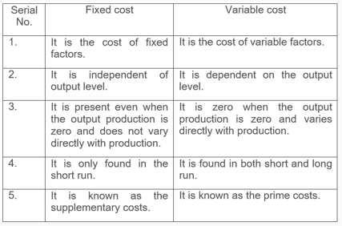

## Table of Contents

## What are variable costs?

Variable costs are expenses that change depending on how much a business produces or sells. If a company makes more products, its variable costs go up. If it makes fewer products, these costs go down. Examples of variable costs include the cost of raw materials, direct labor, and sales commissions. These costs are directly tied to the level of production or sales activity.

Understanding variable costs is important for businesses because it helps them figure out how much it costs to make each product. This information is useful for setting prices and planning how much to produce. By knowing their variable costs, businesses can make better decisions about how to manage their resources and improve their profits.

## What are fixed costs?

Fixed costs are expenses that stay the same no matter how much a business produces or sells. These costs do not change with the level of production or sales activity. Examples of fixed costs include rent for a building, salaries for employees who are paid the same amount each month, and insurance premiums. These costs are important for businesses to understand because they have to be paid even if the business is not making any money.

Knowing about fixed costs helps businesses plan their budgets and make decisions about how to operate. For example, if a business knows its fixed costs, it can figure out how many products it needs to sell to cover those costs and start making a profit. This is called the break-even point. Understanding fixed costs also helps businesses see how changes in their operations, like moving to a smaller office or reducing staff, can affect their overall expenses.

## How do variable costs change with production levels?

Variable costs go up when a business makes more products and go down when it makes fewer products. This happens because variable costs are tied directly to how much is being produced or sold. For example, if a bakery makes more cakes, it will need more flour and sugar, so its costs for these ingredients will increase.

These costs are important for businesses to keep an eye on. By understanding how variable costs change with production levels, a business can figure out how much it costs to make each product. This helps them set prices and plan how much to produce. If they can keep their variable costs low, they might be able to make more profit.

## Do fixed costs remain constant regardless of production levels?

Yes, fixed costs stay the same no matter how much a business produces or sells. This means that whether a company makes a lot of products or none at all, its fixed costs will not change. Examples of fixed costs include rent for a building, salaries for employees who get paid the same amount every month, and insurance premiums.

Understanding fixed costs is important for businesses. They need to pay these costs even if they are not making any money. By knowing their fixed costs, businesses can figure out how many products they need to sell to cover these costs and start making a profit. This is called the break-even point. Knowing fixed costs also helps businesses decide if they can save money by making changes, like moving to a smaller office or reducing staff.

## Can you provide examples of variable costs in a business?

Variable costs are costs that go up or down depending on how much a business makes or sells. For example, if a company makes more shirts, it will need more fabric. So, the cost of fabric is a variable cost because it changes with the number of shirts made. Another example is the cost of electricity used to run machines. If the machines run more to make more products, the electricity bill will be higher.

Other examples of variable costs include the cost of packaging materials and direct labor costs. If a business makes more products, it will need more boxes or bags to package them, so the cost of packaging goes up. Direct labor costs are also variable because if a business needs more workers to make more products, it will pay more in wages. Understanding these costs helps businesses know how much it costs to make each product, which is important for setting prices and planning production.

## Can you provide examples of fixed costs in a business?

Fixed costs are costs that stay the same no matter how much a business makes or sells. For example, rent is a fixed cost. If a business rents a store, it has to pay the same rent every month, even if it doesn't sell anything. Another example is salaries for employees who get paid the same amount every month. These salaries do not change based on how much the business produces or sells.

Insurance is another fixed cost. A business pays the same amount for insurance every month or year, no matter how much it makes. Property taxes are also fixed costs. They stay the same and have to be paid whether the business is busy or not. Understanding these fixed costs helps businesses plan their budgets and figure out how many products they need to sell to start making a profit.

## How do variable and fixed costs affect the pricing strategy of a product?

Variable and fixed costs both play a big role in deciding how much a business should charge for its products. Variable costs, like the cost of materials and labor, go up when a business makes more products. If these costs are high, the business might need to set a higher price to make sure it covers these costs and still makes a profit. On the other hand, if variable costs are low, the business might be able to set a lower price and still make money.

Fixed costs, like rent and salaries, stay the same no matter how much a business makes. These costs have to be paid even if the business doesn't sell anything. To cover these fixed costs, a business needs to sell enough products to make enough money. This means that the price of the product has to be high enough to cover both the variable costs of making the product and the fixed costs of running the business. By understanding both types of costs, a business can set a price that helps it make a profit while still being competitive in the market.

## What is the impact of variable and fixed costs on a company's break-even point?

Variable and fixed costs both affect a company's break-even point, which is the point where the company starts making a profit. The break-even point is reached when the total revenue from selling products equals the total costs of making and selling those products. Variable costs, like the cost of materials and labor, change with how much a company makes. If these costs are high, a company needs to sell more products to cover them and reach the break-even point. On the other hand, if variable costs are low, the company can reach the break-even point by selling fewer products.

Fixed costs, like rent and salaries, stay the same no matter how much a company makes. These costs must be covered before a company can start making a profit. If fixed costs are high, the company needs to sell more products to cover them and reach the break-even point. If fixed costs are low, the company can reach the break-even point by selling fewer products. By understanding both variable and fixed costs, a company can figure out how many products it needs to sell to break even and start making a profit.

## How can understanding variable and fixed costs help in budgeting and financial planning?

Understanding variable and fixed costs is important for budgeting and financial planning because it helps a business know how much money it needs to make to cover all its costs. Variable costs, like the cost of materials and labor, go up or down depending on how much a business makes. If a business knows its variable costs, it can plan how much it needs to produce to keep these costs under control. This helps in setting a budget that can change if the business makes more or less than expected.

Fixed costs, like rent and salaries, stay the same no matter how much a business makes. Knowing these costs helps a business plan its budget because it knows how much money it has to pay every month, no matter what. By understanding both variable and fixed costs, a business can make a financial plan that helps it save money and make more profit. It can also see how changes, like moving to a smaller office or using less material, can affect its budget and help it reach its financial goals.

## What are the challenges in accurately predicting variable costs?

Predicting variable costs can be hard because they change based on how much a business makes or sells. For example, if a business makes more products, it will need more materials, and the cost of those materials can go up or down. This makes it tricky to guess how much money will be needed for these costs in the future. Also, things like changes in the prices of raw materials or how much workers get paid can make it even harder to predict variable costs accurately.

Another challenge is that unexpected things can happen that affect variable costs. For instance, if a machine breaks down, it might cost more money to fix it or to pay workers to work overtime. Also, if a business gets a big order, it might need to buy more materials quickly, which can change the cost. All these things make it tough for a business to plan its budget and know exactly how much money it will need for variable costs.

## How do economies of scale affect variable and fixed costs?

Economies of scale happen when a business gets bigger and can make things cheaper. This affects both variable and fixed costs. For variable costs, like the cost of materials and labor, a bigger business might be able to buy things in larger amounts, which can make each item cost less. For example, if a company makes more shirts, it can buy fabric at a lower price per yard. This means the variable cost per shirt goes down as the company makes more shirts.

For fixed costs, like rent and salaries, economies of scale mean that these costs stay the same even as the business makes more products. When a business gets bigger, it can spread these fixed costs over more products. For example, if a company pays the same rent but makes twice as many products, the rent cost per product goes down. This helps the business save money and make more profit as it grows.

## What advanced strategies can businesses use to manage and optimize their variable and fixed costs?

Businesses can use advanced strategies to manage and optimize their variable and fixed costs. One way is by using technology to keep track of costs and find ways to save money. For example, a business can use software to see how much it spends on materials and labor. This helps it find cheaper suppliers or ways to use less material. Another way is by changing how much they make based on what people want. If a business knows that demand for a product will go up, it can make more of that product and buy materials in bulk to save money.

Another strategy is to look at fixed costs and see if there are ways to make them smaller. For example, a business might move to a smaller office or use less space to save on rent. It can also look at its salaries and see if there are ways to pay employees less or have them work fewer hours. By understanding both variable and fixed costs, a business can make a plan to save money and make more profit. This helps the business grow and be more successful in the long run.

## What is the Nature of Variable Costs in Algo Trading?

Variable costs in [algorithmic trading](/wiki/algorithmic-trading) are expenses that vary with the level of trading activity. These costs play a vital role in determining the overall profitability of trading operations and require careful management. Understanding variable costs is fundamental for traders aiming to optimize their trading strategies and enhance cost-efficiency.

Transaction fees are a primary component of variable costs. These fees are charged by exchanges or trading platforms each time a trade is executed. For traders operating high-frequency or large-[volume](/wiki/volume-trading-strategy) strategies, transaction fees can accumulate quickly, affecting net returns significantly. Brokerage commissions are another significant variable cost, often calculated as a percentage of the trade value or as a fixed amount per trade. These commissions incentivize brokers, but they add to the cost of executing trades.

Regulatory charges, including transaction taxes and compliance fees, also fall under variable costs. These charges vary by jurisdiction and trading activity, influencing the overall cost structure depending on the regulatory environment in which a trader operates.

The management of variable costs is crucial as they directly impact the profitability of each trade. Effective cost management includes analyzing the cost per trade and adjusting strategies to minimize unnecessary expenses. For instance, traders might choose brokers or platforms offering lower fees or negotiate better commission rates based on trading volume. Additionally, by optimizing the frequency and timing of trades, it is possible to reduce exposure to high transaction fees.

To illustrate the effect of variable costs, consider the total profit formula for a given trading strategy:

$$
\text{Total Profit} = \text{Gross Profit} - (\text{Transaction Fees} + \text{Brokerage Commissions} + \text{Regulatory Charges})
$$

In Python, traders could use a simple script to calculate and analyze the variable costs for a given set of trades:

```python
def calculate_variable_costs(trades, fee_percentage, commission_per_trade, regulatory_charge):
    transaction_fees = sum(trade['value'] * fee_percentage for trade in trades)
    brokerage_commissions = len(trades) * commission_per_trade
    total_regulatory_charges = len(trades) * regulatory_charge
    return transaction_fees + brokerage_commissions + total_regulatory_charges

# Example usage
trades = [{'value': 1000}, {'value': 2000}, {'value': 1500}]
fee_percentage = 0.001  # 0.1% fee
commission_per_trade = 5  # $5 per trade
regulatory_charge = 1  # $1 per trade

total_variable_costs = calculate_variable_costs(trades, fee_percentage, commission_per_trade, regulatory_charge)
print(f"Total Variable Costs: ${total_variable_costs}")
```

For cost-efficiency optimization, traders may employ strategies such as consolidating trades to reduce frequency, selecting lower-cost service providers, or leveraging algorithms to execute trades at optimal times. Additionally, incorporating high-performance trading systems may help minimize latency-related costs, indirectly reducing variable expenditures.

Effective management of variable costs allows algorithmic traders to achieve greater profitability and maintain competitiveness. By regularly reviewing and adjusting their trading operations, traders can ensure that their strategies remain financially viable in an ever-evolving market.

## References & Further Reading

[1]: Bergstra, J., Bardenet, R., Bengio, Y., & Kégl, B. (2011). ["Algorithms for Hyper-Parameter Optimization."](https://papers.nips.cc/paper/4443-algorithms-for-hyper-parameter-optimization) Advances in Neural Information Processing Systems 24.

[2]: ["Advances in Financial Machine Learning"](https://www.amazon.com/Advances-Financial-Machine-Learning-Marcos/dp/1119482089) by Marcos Lopez de Prado

[3]: ["Evidence-Based Technical Analysis: Applying the Scientific Method and Statistical Inference to Trading Signals"](https://www.amazon.com/Evidence-Based-Technical-Analysis-Scientific-Statistical/dp/0470008741) by David Aronson

[4]: ["Machine Learning for Algorithmic Trading"](https://github.com/stefan-jansen/machine-learning-for-trading) by Stefan Jansen

[5]: ["Quantitative Trading: How to Build Your Own Algorithmic Trading Business"](https://www.amazon.com/Quantitative-Trading-Build-Algorithmic-Business/dp/1119800064) by Ernest P. Chan