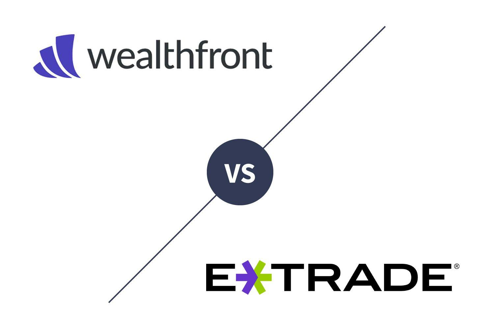

In the modern age of digital investments, platforms such as Wealthfront and E*TRADE Core Portfolios have positioned themselves as prominent leaders, reshaping how individuals engage with financial markets. As algorithmic trading continues to rapidly evolve, comprehending the subtleties of these platforms becomes increasingly crucial for investors seeking to optimize their financial strategies. This article aims to provide an insightful comparison between the investment strategies and tools offered by Wealthfront and E*TRADE Core Portfolios.

The use of algorithmic trading is central to the operations of both platforms, automating decisions and transactions to enhance efficiency and accuracy. This automation reduces the margin for human error, enabling investors to harness data-driven approaches for wealth management. Investors, whether seasoned or novice, gain significant advantages by understanding how such technologies cater to their needs. The nuanced features of Wealthfront and E*TRADE Core Portfolios offer varied benefits that can significantly impact portfolio performance.

Through this exploration, the article will highlight the key features, benefits, and potential drawbacks associated with each platform. This will empower investors to make an informed choice tailored to their specific investment goals. By the end of this article, readers will have a clear understanding of how these platforms can aid in optimizing their portfolios, allowing them to navigate the digital investment landscape more effectively.

## Table of Contents

## Overview of Wealthfront

Wealthfront is recognized as a leading platform in the robo-advisory service sector, providing automated investment management solutions that cater to a diverse range of investor needs. The platform distinguishes itself with a low-cost approach, especially appealing to millennials and first-time investors who are often more sensitive to fees. Wealthfront's primary offerings include automated portfolio rebalancing, tax-loss harvesting, and a diversified investment approach, all of which are tailored to the individual risk tolerance of its users.

Automated rebalancing is a critical feature of Wealthfront's service, ensuring that the investment portfolio maintains its target asset allocation over time. As market conditions change, the value of assets can vary, leading to a drift in the original allocation. Wealthfront's algorithms periodically evaluate the portfolio, executing trades to bring the asset composition back to the desired allocation, which helps in maintaining the risk profile of the investment strategy.

Tax-loss harvesting is another significant benefit offered by Wealthfront. This strategy involves selling securities at a loss to offset capital gains tax liabilities from other investments. By systematically applying this approach, Wealthfront potentially enhances the after-tax return on investment, a particularly valuable feature for taxable accounts.

Wealthfront's investment philosophy is grounded in modern portfolio theory, which emphasizes diversification to optimize returns for a given level of risk. The platform uses a variety of asset classes in its portfolios, including domestic and international stocks, municipal and corporate bonds, and real estate investment trusts (REITs), among others.

By leveraging sophisticated algorithms for both strategic rebalancing and tax efficiency, Wealthfront aims to maximize portfolio growth and provide a streamlined investing experience. This approach makes Wealthfront suitable for a broad spectrum of investors, particularly those who are comfortable with automated solutions and seeking cost-effective investment management without the need for active trading or stock [picking](/wiki/asset-class-picking).

The overall strategy of Wealthfront indicates a strong alignment with the needs of its target demographic. Its focus on minimal fees, coupled with automated financial services, provides an attractive option for those looking to enhance their portfolio without the complexities and costs associated with traditional investment advisory services.

## Detailed Look at E*TRADE Core Portfolios

E*TRADE Core Portfolios is an integral part of the broader E*TRADE financial services ecosystem, combining the precision of algorithms with the nuanced understanding of human advisors. This hybrid approach is designed to cater to investors seeking a balanced investment strategy that benefits from both automated efficiency and expert insights.

Personalized portfolio recommendations are a hallmark of E*TRADE Core Portfolios. Upon onboarding, investors are guided through a series of questions that help determine their risk tolerance, investment goals, and timeline. Based on this information, the platform provides a tailored portfolio that is automatically managed and adjusted as market conditions change. This automation helps ensure portfolios remain optimized without requiring continuous oversight from investors.

Central to E*TRADE's offering is the use of low-cost Exchange Traded Funds (ETFs). These funds are selected to provide diversification across asset classes while minimizing fees, ensuring that a greater portion of an investor’s capital is committed to growth. This focus on cost-efficiency can significantly impact long-term returns, as even modest fee reductions can lead to substantial financial benefits over extended investment periods.

E*TRADE Core Portfolios emphasizes the synthesis of human and algorithmic decision-making. While the algorithms provide a robust foundation for trade execution and portfolio adjustments, human advisors remain accessible to address more complex queries or provide strategic advice, particularly during times of market [volatility](/wiki/volatility-trading-strategies). This hybrid model seeks to harness the benefits of both speed and accuracy associated with algorithms, alongside the contextual understanding and adaptability that human advisors can offer.

For a diverse investor base, ranging from those new to investing to more seasoned market participants, E*TRADE Core Portfolios offers a flexible suite of options. Investors are given the choice to adjust their investment approach as their financial situations and objectives evolve, without having to migrate to a different service ecosystem. This flexibility, combined with comprehensive support and a variety of financial products, renders E*TRADE Core Portfolios an appealing option for many individuals seeking robust, yet adaptable investment management solutions.

## Algorithmic Trading and Its Role in Modern Investments

Algorithmic trading has transformed the landscape of modern investments by employing complex mathematical models and computational power to execute trades with speed and precision. Both Wealthfront and E*TRADE Core Portfolios integrate [algorithmic trading](/wiki/algorithmic-trading) to enhance investment decision-making and mitigate human error.

Wealthfront's approach is largely based on Modern Portfolio Theory (MPT) and employs automated asset allocation and rebalancing to maintain optimal portfolio efficiency. The algorithms continuously assess market conditions and each client's unique risk profile to maximize returns while minimizing risk. Key strategies such as tax-loss harvesting further optimize after-tax returns, reducing the overall tax burden on earnings.

E*TRADE Core Portfolios, on the other hand, blend algorithmic strategies with human expertise, aiming to deliver a more nuanced investment experience. This hybrid model allows the customization of portfolios through algorithm-driven recommendations, while human advisors provide oversight and additional insights. The algorithms primarily focus on selecting low-cost exchange-traded funds (ETFs) to construct diversified portfolios aligned with investor goals and risk appetites.

The advantage of using algorithmic trading lies in its ability to process vast amounts of data quickly and implement strategies that might be too complex or time-consuming for human traders. For instance, Wealthfront's algorithms can automatically rebalance a portfolio to maintain a target asset allocation, which involves buying and selling securities to restore the original portfolio mix. This process ensures that investors remain aligned with their intended risk levels, even as markets fluctuate.

Cost efficiency is another benefit, as algorithmic trading generally involves lower fees compared to traditional human-focused advisory services. Wealthfront and E*TRADE Core Portfolios both leverage technology to reduce operational costs, enabling them to offer competitive fee structures.

Algorithmic trading also contributes to performance improvements by mitigating behavioral biases that can affect human decision-making. Algorithms execute trades based on pre-set rules and data-driven predictions, eliminating emotional responses to market volatility. This systematic approach can lead to more consistent investment performance over time.

As algorithmic trading evolves, its role in investment platforms like Wealthfront and E*TRADE Core Portfolios continues to grow. Innovations in [artificial intelligence](/wiki/ai-artificial-intelligence) and [machine learning](/wiki/machine-learning) further enhance these algorithms, paving the way for more sophisticated trading strategies and better alignment with investor objectives. Ultimately, both platforms utilize algorithmic trading to deliver tailored investment solutions that align with modern investors' needs and preferences.

## Comparative Analysis of Wealthfront and E*TRADE Core Portfolios

In comparing Wealthfront and E*TRADE Core Portfolios, several critical factors arise, each playing a role in determining the suitability of these platforms for various investors.

### Fees
Fees are a significant consideration for investors, as they directly impact net returns. Wealthfront typically charges a 0.25% annual advisory fee on assets under management, with no trading commissions or hidden fees[1]. E*TRADE Core Portfolios also charges a 0.30% annual advisory fee[2]. Although the difference may appear marginal, for long-term investors or large accounts, this variance can accumulate and potentially affect overall returns.

### User Interface
User interface quality can greatly affect the user's experience. Wealthfront is renowned for its intuitive, minimalist design, offering seamless navigation and integration with other financial accounts. It provides users with clear visualizations of their financial goals and portfolio performance. In contrast, E*TRADE Core Portfolios offers a more comprehensive platform, reflecting its brokerage roots. It provides a wide array of tools and resources, which may appeal to more experienced investors seeking detailed insights yet can be overwhelming for beginners.

### Customer Support
Customer support is another pivotal [factor](/wiki/factor-investing). Wealthfront's customer service is largely automated, relying heavily on a comprehensive FAQ section and digital support. However, it lacks direct human interaction, which can be a drawback for those who prefer speaking with an advisor. E*TRADE, by contrast, offers extensive customer support, including phone consultations with financial advisors, which can be critical for investors requiring guidance beyond what algorithms can provide.

### Performance Metrics
Analyzing performance metrics requires evaluating historical returns and risk. Both platforms provide diversified portfolios comprising low-cost ETFs. Wealthfront's strategy focuses on long-term growth through tax-loss harvesting and automated rebalancing. E*TRADE's hybrid approach, combining human insight with algorithmic tactics, might slightly alter performance based on strategic asset allocations influenced by human advisors. Comparing past performance may provide insights, but it is crucial to remember that past performance is not indicative of future results.

### Risk Management and Diversification
For risk management and diversification, both platforms offer portfolios with varied asset classes tailored to match investors' risk tolerance. Wealthfront's risk parity model seeks to optimize risk-adjusted returns by balancing the risk contribution of each asset class. E*TRADE similarly diversifies portfolios, but its inclusion of human advisors adds a layer of subjective risk assessment, potentially appealing to those who prefer a personalized touch in risk strategies.

Comparing these platforms reveals different strengths and potential limitations, allowing investors to choose based on specific needs. Wealthfront may be more suitable for those who value automation, low fees, and straightforward service. E*TRADE Core Portfolios, with its more personalized service and comprehensive suite of tools, might better serve investors desiring a combination of algorithm-driven insights and direct human contact.

---

[1] Wealthfront. (n.d.). Pricing & fees. Wealthfront.
[2] E*TRADE. (n.d.). How do core portfolios work? E*TRADE.

## Pros and Cons of Each Platform

Wealthfront and E*TRADE Core Portfolios are two prominent platforms offering distinct advantages and disadvantages, which are crucial for investors to consider. Wealthfront is highly regarded for its robust automation capabilities, making it an excellent choice for investors seeking efficient and hands-off portfolio management. Its tax efficiency is also noteworthy; Wealthfront employs strategies such as tax-loss harvesting to optimize after-tax returns. However, its strong reliance on automation may result in a lack of personalized advice that some investors might require, particularly those with complex financial situations or specific investment queries.

Conversely, E*TRADE Core Portfolios offers a blend of human insight combined with technology, providing a more personalized experience for investors. This hybrid approach can cater to investors who prefer human interaction when making financial decisions. However, this added layer of personalized service comes with a higher cost structure, which might not be ideal for cost-conscious investors or those with smaller portfolios. Additionally, while it offers a variety of investment options, the cost may impact the overall returns, especially for long-term investment strategies.

When evaluating these platforms, investors should consider factors beyond automation and personalization. Customer service experience is essential, as it can greatly impact the ease with which investors navigate their financial ventures. Both platforms offer different levels of support, with E*TRADE generally recognized for its comprehensive customer service offerings, including access to financial advisors. Wealthfront, while offering support, mainly focuses on its digital services and may not match the level of personalized advisory services provided by E*TRADE.

Another consideration is the range of additional financial services. E*TRADE offers a broader array of financial products beyond its core portfolios, such as banking and more extensive trading options, which could be advantageous for investors seeking a one-stop-shop for their financial needs. Wealthfront, while comprehensive in its investment approach, is more specialized in its offerings, focusing on automated investment management without branching extensively into other financial domains.

Ultimately, understanding the pros and cons of Wealthfront and E*TRADE Core Portfolios allows investors to align their preferences with the platform that best suits their investment strategy, risk tolerance, and financial goals. Assessing these factors ensures that investors choose a platform that not only meets their current needs but also adapts to their evolving financial landscape.

## Conclusion

Choosing between Wealthfront and E*TRADE Core Portfolios requires careful consideration of personal investment goals and individual preferences. Both platforms present strong options for managing investments, yet they cater to distinct needs and priorities. 

Wealthfront excels in automation and cost-efficiency, appealing to those who appreciate algorithm-driven management and tax efficiency. With its automated rebalancing and tax-loss harvesting features, it is particularly suited to investors who prefer a hands-off approach while maintaining diversified portfolios. However, it may not provide the level of personalized advice that some investors require.

In contrast, E*TRADE Core Portfolios integrates human expertise with algorithmic strategies, creating a hybrid model that can offer more personalized recommendations. This blend of human insight and technology could be beneficial for investors seeking guidance alongside autonomous management. The platform’s diverse range of low-cost exchange-traded funds (ETFs) adds to its flexibility, although it generally comes with a higher fee structure compared to Wealthfront.

When deciding between these platforms, investors should evaluate several key factors:

1. **Investment Objectives**: Consider whether your primary focus is on cost-saving and automation or receiving personalized advice.

2. **Risk Tolerance**: Evaluate the risk management practices of each platform and determine which aligns best with your comfort level.

3. **Financial Goals**: Clarify your long-term financial targets and assess which platform's offerings align with your strategy.

By thoroughly assessing these aspects, investors can align their platform choice with their financial objectives and risk tolerance, thereby optimizing their investment strategies.

## References & Further Reading

[1]: Stein, B. (2019). ["The Wealthfront Story: How Automation Made Investing Easy."](https://riabiz.com/a/2019/12/6/after-andy-rachleff-explains-wealthfronts-corrective-to-banking-jon-stein-told-how-betterment-is-investing-heavily-in-banking-but-mindful-of-frothiness)

[2]: E*TRADE. (2020). ["E*TRADE Core Portfolios Overview."](https://investinganswers.com/reviews/etrade-core-portfolios)

[3]: Malkiel, B. G., & Ellis, C. D. (2020). ["The Elements of Investing."](https://www.amazon.com/Elements-Investing-Lessons-Every-Investor/dp/1119851416) Wiley.

[4]: Goolsbee, A., & Levitt, S. (2017). ["Strategies for the Robo-Advisor Revolution."](https://www.macmillanlearning.com/college/us/product/Microeconomics/p/1319330576) Chicago Booth Review.

[5]: ["Modern Portfolio Theory and Investment Analysis"](https://books.google.com/books/about/Modern_Portfolio_Theory_and_Investment_A.html?id=181CEAAAQBAJ) by Edwin J. Elton, Martin J. Gruber, Stephen J. Brown, and William N. Goetzmann

[6]: Lo, A. W. (2016). ["Adaptive Markets: Financial Evolution at the Speed of Thought."](https://books.google.com/books/about/Adaptive_Markets.html?id=Q4d7DwAAQBAJ) Princeton University Press.

[7]: ["The AI Book: The Artificial Intelligence Handbook for Investors, Entrepreneurs and FinTech Visionaries"](https://books.google.com/books/about/The_AI_Book.html?id=oE3YDwAAQBAJ) by Ivana Bartoletti, Anne Leslie, and Shân M. Millie

[8]: ["DIY Financial Advisor: A Simple Solution to Build and Protect Your Wealth"](https://www.amazon.com/DIY-Financial-Advisor-Solution-Protect/dp/111907150X) by Wesley R. Gray, Jack R. Vogel, and David P. Foulke