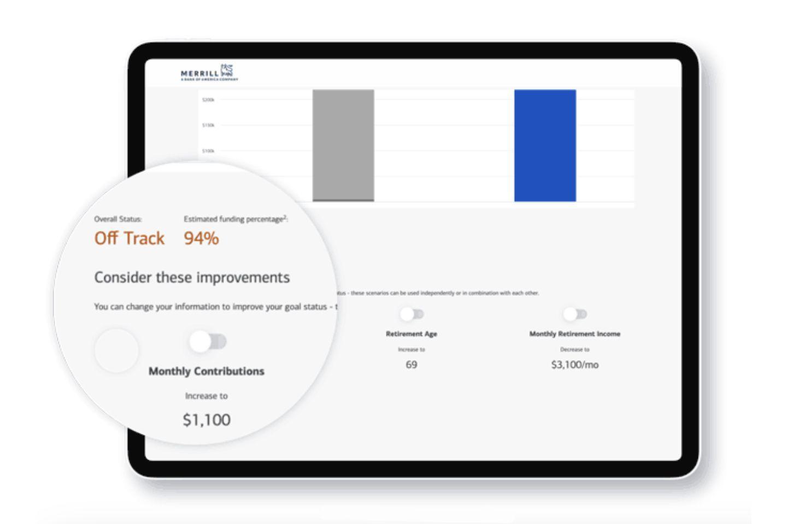

## Table of Contents

## What are Wealthfront and Merrill Guided Investing?

Wealthfront is an online investment platform that helps people manage their money. It uses something called robo-advising, which means a computer program picks and manages your investments for you. Wealthfront is good for people who want to invest but don't want to spend a lot of time doing it themselves. It's easy to use and doesn't cost much money. You just tell Wealthfront how much risk you're okay with, and it picks investments that match your goals.

Merrill Guided Investing is also a robo-advisor service, but it's offered by Merrill Lynch, which is a big bank. Like Wealthfront, it uses a computer to manage your investments based on your goals and how much risk you want to take. But, Merrill Guided Investing also lets you talk to human advisors if you need help or have questions. This might be good for people who want some computer help but also like the idea of talking to a person sometimes. It might cost a bit more than Wealthfront, but you get that extra help when you need it.

## How do the fee structures of Wealthfront and Merrill Guided Investing compare?

Wealthfront has a simple fee structure. They charge 0.25% of the money you have with them each year. This means if you have $10,000 invested, you'll pay $25 a year. Wealthfront doesn't charge you any money to start using their service, and they also don't charge you to take your money out. They make their money just from that yearly fee.

Merrill Guided Investing has a bit different fee setup. For their basic robo-advisor service, they also charge 0.25% per year, just like Wealthfront. But if you want to talk to a human advisor sometimes, you need to use their premium service. The premium service costs 0.80% per year. So, if you have $10,000 invested and use the premium service, you'll pay $80 a year. Like Wealthfront, there are no fees to start or to take your money out.

## What are the minimum investment requirements for each service?

Wealthfront has a pretty low minimum investment. You need just $500 to start using their service. This makes it easier for people who don't have a lot of money to start investing. Once you're in, you can add more money whenever you want, and there's no minimum for adding to your account.

Merrill Guided Investing is a bit different. Their basic robo-advisor service needs a minimum of $1,000 to start. If you want the premium service where you can talk to a human advisor, you need at least $20,000. So, Merrill Guided Investing might be better for people who already have a bit more money to invest.

## What types of investment accounts can be opened with Wealthfront and Merrill Guided Investing?

With Wealthfront, you can open different kinds of investment accounts. They offer a taxable investment account, which is good for saving money and paying taxes on your earnings each year. They also have retirement accounts like a Traditional IRA and a Roth IRA, which help you save for the future with some tax benefits. If you're saving for your kids' education, you can use a 529 college savings plan. And if you run a business, you can open a SEP-IRA or a Solo 401(k) to save for your own retirement.

Merrill Guided Investing also lets you open several types of accounts. They have a taxable investment account for general investing. For retirement, they offer a Traditional IRA and a Roth IRA, similar to Wealthfront. If you're saving for education, you can use a 529 plan. And for business owners, they provide a SEP-IRA. The main difference is that Merrill Guided Investing doesn't offer a Solo 401(k), which might be something to think about if you're self-employed and looking for that specific type of retirement account.

## How do the investment strategies of Wealthfront and Merrill Guided Investing differ?

Wealthfront uses a computer program to pick and manage your investments. They focus on something called diversification, which means they spread your money across lots of different types of investments to lower the risk. They mainly use ETFs, which are like baskets of different stocks or bonds. Wealthfront also uses a strategy called tax-loss harvesting, which can help you save money on taxes by selling investments that have lost value and buying similar ones. They adjust your investments based on how much risk you're okay with and what you want to achieve with your money.

Merrill Guided Investing also uses a computer to manage your investments, but they offer a choice between their basic service and a premium one where you can talk to a human advisor. Like Wealthfront, they use ETFs and focus on diversification to spread out risk. Their basic service works a lot like Wealthfront's, using algorithms to pick investments that match your goals and risk level. But with the premium service, you can get advice from a human, which might be helpful if you have questions or want a personal touch. Both services aim to grow your money over time, but Merrill Guided Investing gives you the option for that extra human help if you need it.

## What kind of tax optimization features do Wealthfront and Merrill Guided Investing offer?

Wealthfront has a feature called tax-loss harvesting that helps you save money on taxes. This means if some of your investments lose value, Wealthfront will sell them and buy similar ones. By doing this, you can use the losses to lower the taxes you owe on other gains or income. Wealthfront does this automatically and often, so it's always working to save you money. They also have something called tax-optimized direct indexing, which is another way to manage your investments to save on taxes, but it's only for people with bigger accounts.

Merrill Guided Investing also offers tax-loss harvesting, just like Wealthfront. They use their computer program to find and use losses in your investments to lower your tax bill. If you choose their premium service, you can talk to a human advisor who can give you more personal advice on how to save on taxes. Both services want to help you keep more of your money by managing taxes better, but Merrill Guided Investing gives you the option to get extra help from a person if you need it.

## How do the portfolio rebalancing methods of Wealthfront and Merrill Guided Investing compare?

Wealthfront uses a computer to keep your investments balanced. They check your account every day to make sure your money is spread out the way you want it to be. If things get out of balance, like if one type of investment grows faster than the others, Wealthfront will automatically move your money around to fix it. This helps keep your risk level the same and makes sure your investments match your goals. They do all this without you having to do anything, so it's easy for you.

Merrill Guided Investing also uses a computer to balance your portfolio, but they do it a bit differently. They check your account less often, usually every few months, to see if it needs fixing. If it does, they'll move your money around to keep it in line with your goals and how much risk you want to take. If you're using their premium service, you can also talk to a human advisor who can help decide when and how to rebalance your investments. So, while both services keep your investments balanced, Merrill Guided Investing gives you the option for personal advice if you need it.

## What are the performance histories of Wealthfront and Merrill Guided Investing?

Wealthfront has been around since 2011 and has a good track record. They use a computer to pick and manage your investments, and they say their average return has been better than the stock market over the long run. But remember, past results don't mean the same will happen in the future. It's good to look at how they've done over many years, not just one or two. Wealthfront shares information about their performance on their website, so you can see how they've done over time.

Merrill Guided Investing started a bit later, in 2017, so they don't have as long a history as Wealthfront. They also use a computer to manage your money, and they say their performance has been pretty good too. Like Wealthfront, they show their performance on their website. If you choose their premium service, you can talk to a human advisor who can help you understand how your investments are doing. Just like with Wealthfront, it's important to look at their performance over a long time to get a good idea of how they might do in the future.

## How do customer support and user experience differ between Wealthfront and Merrill Guided Investing?

Wealthfront has a user-friendly website and app that make it easy to manage your investments. You can check your account, add money, or change your settings anytime you want. If you need help, Wealthfront has customer support through email and phone, but they don't have live chat. They also have a lot of helpful articles and guides on their website to answer common questions. Overall, Wealthfront is designed for people who like to do things on their own and don't need to talk to someone a lot.

Merrill Guided Investing also has a good website and app, but it might feel a bit more complicated because it's part of a big bank. Their basic service works a lot like Wealthfront, but if you pay more for their premium service, you can talk to a human advisor. This can be helpful if you have questions or need personal advice. Merrill Guided Investing offers customer support through phone and email, and they also have a lot of educational resources. The main difference is that with Merrill, you can get that extra help from a person if you need it, which might make the user experience better for some people.

## What advanced features do Wealthfront and Merrill Guided Investing provide for expert investors?

Wealthfront has some cool features for people who know a lot about investing. They offer something called tax-optimized direct indexing, which is a way to save on taxes by managing your investments in a special way. This is only for people with bigger accounts, but it can help you keep more of your money. They also let you borrow money against your investments with their line of credit, which can be handy if you need cash but don't want to sell your investments. Plus, Wealthfront has a feature called Path, which helps you plan your financial future and see how your investments might grow over time.

Merrill Guided Investing also has some advanced stuff for expert investors. If you choose their premium service, you can talk to a human advisor who can give you personal advice on your investments. This can be really helpful if you want to make smart choices about your money. They also offer tax-loss harvesting, which helps you save on taxes by selling investments that have lost value and buying similar ones. And because Merrill is part of a big bank, you can use other banking services too, like checking accounts and credit cards, which might be useful if you want everything in one place.

## How do Wealthfront and Merrill Guided Investing handle risk management and asset allocation?

Wealthfront uses a computer to manage how much risk you take with your money. They ask you questions to find out how much risk you're okay with, and then they pick investments that match that level of risk. They spread your money across lots of different types of investments, like stocks and bonds, to lower the risk. This is called diversification. They check your account every day to make sure your investments are still balanced the way you want them. If things get out of balance, Wealthfront will automatically move your money around to fix it. This helps keep your risk level the same and makes sure your investments match your goals.

Merrill Guided Investing also uses a computer to manage your risk and pick your investments. They ask you about your risk level and goals, and then they spread your money across different investments to lower the risk. They check your account every few months to make sure everything is still balanced. If it's not, they'll move your money around to fix it. If you choose their premium service, you can talk to a human advisor who can help you decide how much risk to take and how to spread your money. This can be helpful if you want personal advice on managing your risk and choosing your investments.

## What are the pros and cons of using Wealthfront versus Merrill Guided Investing based on expert analysis?

Wealthfront is great for people who want to invest without spending a lot of time or money. It has a low fee of 0.25% a year and a low minimum of just $500 to start. Wealthfront uses a computer to manage your investments, and it checks your account every day to keep things balanced. They also have cool features like tax-loss harvesting and tax-optimized direct indexing for bigger accounts, which can help you save on taxes. But, Wealthfront doesn't let you talk to a human advisor, so if you like getting personal help, this might not be the best choice for you. Also, their customer support is only through email and phone, so if you need quick help, you might have to wait a bit.

Merrill Guided Investing is good for people who want a computer to manage their money but also want the option to talk to a human sometimes. Their basic service costs the same as Wealthfront at 0.25% a year, but you need $1,000 to start. If you want to talk to an advisor, you can pay more for their premium service, which costs 0.80% a year and needs at least $20,000 to start. Merrill checks your account every few months to keep things balanced, and they also offer tax-loss harvesting. The big plus is the personal advice you can get with the premium service, which can be really helpful. But, the higher fees and higher minimums might be a downside if you're just starting out or don't have a lot of money to invest.

## References & Further Reading

[1]: Bogle, J. C. (2017). ["The Little Book of Common Sense Investing: The Only Way to Guarantee Your Fair Share of Stock Market Returns"](https://www.amazon.com/Little-Book-Common-Sense-Investing/dp/1119404509) by John C. Bogle.

[2]: Malkiel, B. G. (2019). ["A Random Walk Down Wall Street: The Time-Tested Strategy for Successful Investing"](https://www.amazon.com/Random-Walk-Down-Wall-Street/dp/1324002182) by Burton G. Malkiel.

[3]: Statman, M. (2011). ["What Investors Really Want: Discover What Drives Investor Behavior and Make Smarter Financial Decisions"](https://www.amazon.com/What-Investors-Really-Want-Financial/dp/0071741658) by Meir Statman.

[4]: Lopez de Prado, M. (2018). ["Advances in Financial Machine Learning"](https://books.google.com/books/about/Advances_in_Financial_Machine_Learning.html?id=oU9KDwAAQBAJ) by Marcos Lopez de Prado.

[5]: Jansen, S. (2020). ["Machine Learning for Algorithmic Trading: Predictive models to extract signals from market and alternative data for systematic trading strategies with Python, 2nd Edition"](https://www.amazon.com/Machine-Learning-Algorithmic-Trading-alternative/dp/1839217715) by Stefan Jansen.