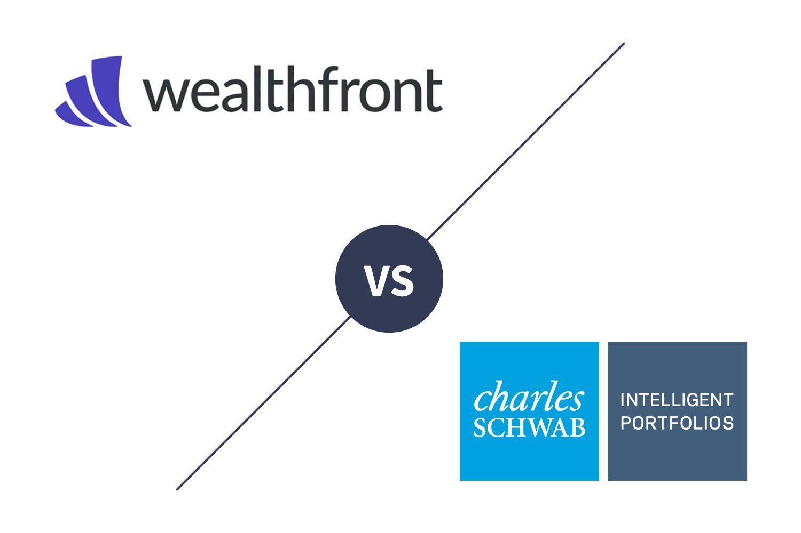

Robo-advisors and algorithmic trading represent significant advancements in the financial technology (fintech) sector, revolutionizing how individuals participate in the investment landscape. Robo-advisors are digital platforms that provide automated, algorithm-driven financial planning services with minimal human intervention. These platforms utilize advanced algorithms to construct and manage a diversified portfolio based on an investor's risk profile, financial goals, and investment timeline. Algorithmic trading, on the other hand, involves using computer programs to execute trades at high speed and frequency, optimizing the timing and price to maximize returns or minimize costs.

In recent years, the popularity of automated investment platforms has surged, attracting individual and institutional investors seeking efficiency, cost-effectiveness, and the potential for enhanced returns. These platforms cater to novice investors and seasoned professionals by offering low-cost, personalized investment strategies without the need for traditional, often expensive, human financial advisors.

Among the myriad of robo-advisors available in the market, Wealthfront and Schwab Intelligent Portfolios stand out as leading services in automated investment management. Wealthfront, one of the pioneers in this space, has established itself as a tech-driven platform known for its innovative use of algorithms and comprehensive financial planning tools. Schwab Intelligent Portfolios, part of the Charles Schwab Corporation, leverages its parent company's extensive financial expertise with automated investment solutions tailored to various investor needs.

This article aims to compare Wealthfront and Schwab Intelligent Portfolios, focusing on their algorithmic trading capabilities. By examining the underlying technologies, investment strategies, fee structures, and user experiences of each platform, potential investors can make informed choices about which service aligns best with their investment goals and preferences.

With the rapid growth and evolution of robo-advisory services, it is crucial for investors to understand the nuances and differences between available options. Making informed investment decisions can significantly impact long-term financial outcomes, emphasizing the importance of choosing a platform that not only uses advanced technology but also aligns with the investor's personal financial objectives and risk tolerance.

## Table of Contents

## Overview of Wealthfront

Wealthfront was established in 2008, initially offering investment services focused on wealthy individuals before evolving into one of the preeminent robo-advisors. It pioneered in offering automated investment solutions aimed at a broader range of investors, making sophisticated investment strategies accessible with lower fees compared to traditional financial advisory services.

The platform's investment philosophy centers around modern portfolio theory, striving for diversification across asset classes to optimize risk-adjusted returns for its clients. This philosophy is embodied in its use of low-cost exchange-traded funds (ETFs) that align with predefined investment strategies tailored to the risk tolerance and financial goals of individual clients. Wealthfront aims to maximize users' after-tax returns through strategic tax-loss harvesting and asset location strategies. 

Algorithmic trading is an integral part of Wealthfront's operation. The platform employs algorithms that automatically balance portfolios and execute tax-loss harvesting. Tax-loss harvesting is a method designed to optimize investors’ tax liabilities; Wealthfront's algorithm identifies when an asset incurs a loss and sells it to offset gains in other areas, potentially improving the portfolio’s after-tax return. The algorithms also handle rebalancing by adjusting portfolios to maintain target asset allocations as market conditions change.

Wealthfront offers a variety of services besides tax-loss harvesting, such as cash account services and the option for users to set and track financial goals, greatly enhancing the platform's utility. These services are designed to integrate seamlessly into a comprehensive investment approach, aiming to suit both the novice investors and more seasoned ones seeking automated solutions.

The customer base of Wealthfront typically includes younger millennials and tech-savvy investors who appreciate a digital-first approach to investing. The platform has built a robust infrastructure conducive to serving a user demographic that values low fees, automation, and the convenience associated with not having to actively manage a portfolio. Its tools for financial planning, such as the "Path" feature, provide users the ability to foresee their financial futures and subsequently set realistic financial goals. Wealthfront has effectively captured a diverse audience interested in combining their financial activities under one platform.

## Overview of Schwab Intelligent Portfolios

Charles Schwab introduced the Schwab Intelligent Portfolios in March 2015 as part of its strategy to leverage technology in wealth management. This platform caters to investors seeking automated investment solutions, blending the traditional values of Charles Schwab with the convenience of digital advisory services. Over the years, Schwab Intelligent Portfolios has seen considerable growth, aligning its services with evolving market demands and technological advancements to cater to a broader audience seeking low-cost investment options.

The key investment principles underpinning Schwab Intelligent Portfolios revolve around diversification, low-cost investing, and tax efficiency. The platform overarches these principles by creating portfolios that encompass a wide range of asset classes, including domestic and international equities, fixed income, real estate investment trusts (REITs), and commodities. This diversification aims to mitigate risks and enhance potential returns. Schwab emphasizes a low-cost structure by not charging advisory fees, thereby offering its services without management fees, although underlying fund expenses still apply.

Schwab Intelligent Portfolios uses [algorithmic trading](/wiki/algorithmic-trading) strategies uniquely tailored to optimize asset allocation, rebalance portfolios, and capitalize on market efficiencies. The algorithms deployed are designed for automatic portfolio adjustments based on changes in market conditions and investors' financial situations. A distinctive feature of the platform is its utilization of tax-loss harvesting for eligible accounts. This strategy systematically identifies and harvests losses to offset capital gains, potentially enhancing after-tax returns.

A notable service within Schwab Intelligent Portfolios is automatic rebalancing, which helps maintain the target asset allocation within the portfolios. The system triggers rebalancing when asset class allocations drift beyond predetermined thresholds, ensuring that portfolios remain aligned with the client's risk profile and investment goals. The platform also implements a cash optimization feature, maintaining a cash allocation to meet [liquidity](/wiki/liquidity-risk-premium) needs while aiming to preserve capital stability. This function is intended to balance risk by holding a portion of the portfolio in cash equivalents, which offers a buffer against market [volatility](/wiki/volatility-trading-strategies).

The typical demographic for Schwab Intelligent Portfolios includes individual investors who prefer a hands-off investment approach while prioritizing cost-effective solutions. It appeals to tech-savvy users comfortable with digital platforms and those looking for a strategic balance between risk and returns without the necessity for active management intervention. Schwab's customer focus emphasizes personalized service, ensuring that the robo-advisory system is adaptable to varying client needs and investment profiles. The platform is particularly attractive to those who value Schwab's established reputation and seek the integration of advanced technology with traditional investment principles.

## Algo Trading Comparison

Algorithmic trading involves using computer algorithms to execute trading orders with minimal human intervention. It's a fundamental component of modern investment platforms, allowing these systems to handle large volumes of transactions with efficiency and precision. This form of trading leverages complex mathematical models to identify and capitalize on trading opportunities, assess risks, and execute trades at optimal times.

Wealthfront and Schwab Intelligent Portfolios both utilize algorithmic trading but employ different models and strategies. Wealthfront's algorithmic approach is deeply entrenched in its investment philosophy, which focuses on passive investing, broad diversification, and long-term wealth accumulation. The algorithms primarily utilize Modern Portfolio Theory (MPT), which emphasizes creating an optimum asset allocation to maximize returns for a given level of risk. Wealthfront's strategies include automated tax-loss harvesting and rebalancing, which enhance tax efficiencies and maintain the desired portfolio allocation amidst market changes.

Conversely, Schwab Intelligent Portfolios employs a different algorithmic strategy that integrates with its brokerage services. Similar to Wealthfront, Schwab utilizes a diversified approach to investment but emphasizes cash optimization and automated rebalancing. Its algorithms are designed to maintain a specified allocation across asset classes without using direct trading commissions. Schwab focuses more on managing cash flows and liquidity within portfolios, allowing a dynamic adjustment influenced by market liquidity and volatility.

Both platforms share several similarities in their approach. They prioritize diversification and risk management by spreading investments across a wide range of asset classes. These strategies minimize potential losses while ensuring steady long-term growth. Additionally, automated rebalancing is a common feature, ensuring portfolios remain aligned with user-defined risk profiles and objectives.

However, there are discernible differences in trading frequency, asset selection, and optimization tactics. Wealthfront may employ more frequent trading, especially with its tax-loss harvesting strategy, which identifies opportunities daily to sell securities at a loss to offset gains. In contrast, Schwab typically engages in less frequent trades, focusing more on maintaining stable sector allocation and optimizing the cash component of portfolios.

Regarding asset selection, Wealthfront leans towards ETFs and index funds to implement its passive investing strategy, while Schwab offers a broader selection, including fixed income and real estate investment trusts (REITs). This difference in asset selection reflects their respective approaches to portfolio diversification and risk exposure.

When it comes to optimization tactics, Wealthfront intensively uses scenarios and historical data to optimize tax efficiencies, whereas Schwab optimizes liquidity management within its portfolios more heavily, adjusting the cash proportion in response to the user’s financial strategy and liquidity requirements.

Both platforms aim to respond adaptively to market fluctuations, though their responses differ due to their distinct strategic orientations. Wealthfront’s algorithm scores high on tax efficiency, automatically adjusting asset allocations to account for tax-loss harvesting opportunities with market shifts. Schwab's algorithm, designed to preserve liquidity, may adjust the balance of cash and equities depending on volatility, which can help cushion against rapid market downturns.

In summary, the algorithmic trading practices employed by both Wealthfront and Schwab Intelligent Portfolios highlight the diverse applications of algorithms within automated investment platforms. Their unique approaches cater to different investor needs, emphasizing the flexibility and adaptability of algorithmic trading in modern finance.

## Fee Structures and Costs

Wealthfront operates on a straightforward fee model. The platform charges a single management fee of 0.25% per annum on an investor's assets under management (AUM). This fee is applied to the total balance managed by Wealthfront and there are no additional charges for services such as tax-loss harvesting or financial planning tools provided through the platform. There are typically no hidden fees, making it a transparent option for investors.

Schwab Intelligent Portfolios, in contrast, do not charge an advisory fee. Instead, Schwab benefits financially by requiring portfolios to hold a certain percentage—typically between 6% to 30%—in cash, which is then utilized within their banking system. While this model avoids direct fees, it carries an opportunity cost for investors, as the allocated cash generally earns minimal interest compared to the potential returns of equity or bond investments. Additionally, investors in Schwab Intelligent Portfolios may be subject to fees associated with the underlying ETFs (Exchange-Traded Funds), which can affect overall costs indirectly.

Comparing these fee structures, Wealthfront offers clear-cut costs that are easy to predict and understand, while Schwab’s fee model, despite an absence of direct management fees, may limit investor returns through higher cash holdings. It's crucial for investors to be aware of both explicit and implicit costs when choosing a platform. For example, Wealthfront's 0.25% fee on a $100,000 portfolio amounts to an annual charge of $250, whereas Schwab’s indirect costs depend on the foregone returns from high cash allocations.

The impact of fees on investment returns is significant over time, particularly due to the compounding effect. In scenarios of similar market returns, even a small difference in fees can lead to substantial differences in long-term portfolio growth. For instance, with a $100,000 investment growing at an 8% annual rate, a 0.25% Wealthfront fee reduces the effective growth rate to 7.75%, resulting in approximately $16,000 less in returns over 20 years compared to a fee-free scenario. Meanwhile, the opportunity cost of holding 10% cash at a 0.5% return in Schwab’s portfolio could be even higher given the same market conditions.

In conclusion, while Wealthfront's fees are transparent and straightforward, Schwab's model may lead to indirect costs that impact long-term investment growth, notably through cash drag. Investors should carefully consider how these fees align with their investment strategy and goals.

## User Experience and Accessibility

Wealthfront and Schwab Intelligent Portfolios are prominent platforms in the automated investment domain, each offering distinct user experiences and accessibility features to their clients.

Wealthfront provides a highly intuitive user interface and a robust mobile application, designed to streamline the investment experience for both novice and seasoned investors. The platform is known for its user-centric design that emphasizes ease of navigation and efficient access to a range of tools. Wealthfront’s app is available on both iOS and Android, delivering seamless functionality that allows users to monitor their portfolios, track financial goals, and adjust investment preferences effortlessly. User feedback typically highlights the platform’s clean design, informative dashboards, and the convenience of managing investments on-the-go.

In contrast, Schwab Intelligent Portfolios offers a comprehensive digital interface that integrates well with Charles Schwab’s broader financial services ecosystem. The platform provides an accessible user experience through its website and mobile app, which are optimized for both simplicity and functionality. Schwab’s digital tools include detailed performance analytics, educational resources, and interactive features aimed at enhancing investor knowledge and engagement. The app, compatible with iOS and Android devices, supports comprehensive financial planning, giving users control over their entire financial picture.

When it comes to customer service and support, Wealthfront predominantly relies on digital channels. Although it lacks traditional in-person advisory services, it offers extensive online resources, including a help center, informational blogs, and automated advice. Wealthfront customers appreciate the convenience of quick online assistance, but some note the absence of direct human interaction as a limitation.

Schwab Intelligent Portfolios, benefitting from Charles Schwab's legacy, provides an extensive array of support options. These include 24/7 phone support and access to financial advisors across its nationwide branches. Schwab also offers a rich library of educational materials, videos, and webinars to assist users in making informed investment decisions. This comprehensive approach to customer service and education is frequently cited as a standout feature in user reviews.

The account setup and onboarding process is another area of comparison. Wealthfront is noted for its straightforward and swift onboarding, which is nearly entirely digital. New users are guided through a series of prompts to establish investment goals and risk preferences, and the account can be set up within minutes. The platform’s automated and minimalist client interaction is praised for its efficiency in the onboarding process.

Schwab Intelligent Portfolios, while also offering an efficient online setup, provides additional support for new users through optional consultations and educational resources, catering to those seeking a more guided experience. This can be particularly beneficial for individuals who might be new to investing or require additional assistance setting up their portfolios.

Overall, user testimonials for Wealthfront often commend its simplicity and the freedom it offers for self-directed investment management. Conversely, Schwab Intelligent Portfolios receives high marks for its comprehensive support, flexibility, and educational offerings, which can be especially advantageous for those who appreciate the mix of digital convenience and traditional advisory support. Both platforms continue to evolve, focusing on enhancing user experience and accessibility to meet the diverse needs of their clients.

## Performance and Returns

Analyzing the historical performance of Wealthfront and Schwab Intelligent Portfolios reveals differences in their approaches and outcomes due to varying market conditions and algorithmic strategies.

Wealthfront has consistently leveraged algorithmic trading to optimize portfolio performance through tax-loss harvesting, direct indexing, and smart beta strategies. Historical data indicates that Wealthfront's portfolios typically achieve returns correlated with passive index benchmarks, such as the S&P 500, while aiming to surpass these benchmarks by capitalizing on tax efficiencies and selective asset allocation.

Schwab Intelligent Portfolios, on the other hand, emphasizes a diversified asset allocation strategy that includes cash holdings as a buffer against volatility. Historical performance data shows that Schwab's portfolios tend to exhibit lower volatility due to their balanced inclusion of fixed-income securities and cash, leading to potentially more stable returns during market downturns but possibly underperforming during bull markets.

To compare performance under different market conditions, let's consider the role of algorithmic trading in both platforms. Wealthfront's algorithms may take advantage of market volatility to optimize tax-loss harvesting and direct indexing, potentially enhancing returns in fluctuating markets. Schwab's algorithm, focusing more on diversification and cash optimization, tends to maintain steady returns by mitigating risk through broad asset class exposure.

Risk-adjusted returns are a critical metric for evaluating investment performance. A common measure used is the Sharpe ratio, which considers both the return and risk (volatility) of an investment:

$$
\text{Sharpe Ratio} = \frac{R_p - R_f}{\sigma_p}
$$

Where $R_p$ is the portfolio return, $R_f$ is the risk-free rate, and $\sigma_p$ is the portfolio standard deviation. Typically, Wealthfront's portfolios might demonstrate a higher Sharpe ratio during volatile markets due to their proactive tax-loss harvesting efforts, while Schwab might offer a consistent Sharpe ratio due to its lower volatility approach.

Both platforms highlight the significant impact of algorithmic trading on performance. Wealthfront's strategy is inclined toward maximizing after-tax returns using complex algorithms to adjust portfolios frequently. In contrast, Schwab Intelligent Portfolios focus on maintaining portfolio balance and cash flow management, which can cushion against negative returns during uncertain economic climates.

For investors assessing risk-adjusted returns, it is essential to consider individual risk tolerance and investment timelines. Wealthfront may appeal to those seeking potentially higher returns with an understanding of increased risk and market engagement, while Schwab may be better suited for investors who prioritize stability and lower risk exposure.

Ultimately, the choice between these two platforms should reflect personal investment goals, expected market conditions, and preferences for dynamic versus passive algorithmic strategies.

## Pros and Cons

Wealthfront and Schwab Intelligent Portfolios are two prominent robo-advisors that offer distinct advantages and disadvantages for investors looking to leverage automated investment platforms. Understanding these can help potential investors make informed decisions.

### Wealthfront: Advantages
1. **Tax Efficiency**: Wealthfront offers advanced tax optimization features, such as daily tax-loss harvesting and direct indexing for high-balance accounts. These can potentially increase after-tax returns.
2. **Comprehensive Financial Planning Tools**: Wealthfront provides an array of goal-setting and planning tools that allow users to simulate different financial scenarios. This can be beneficial for users looking to plan for major life events.
3. **User-Friendly Interface**: Wealthfront is known for its intuitive and aesthetically pleasing user interface, both on its desktop site and mobile app.
4. **Low Account Minimums**: With a low minimum investment requirement, Wealthfront is accessible to a broad range of investors.

### Wealthfront: Disadvantages
1. **Limited Customization**: Although it provides a set of diversified portfolios, Wealthfront offers limited options for custom asset allocation, which might not satisfy sophisticated investors.
2. **Automated Customer Support**: While efficient, the reliance on automated and online support might not meet the needs of users preferring personalized human interaction.
3. **Fees for Extended Services**: Additional features, while robust, come at specific account balance thresholds, potentially limiting access for smaller investors.

### Schwab Intelligent Portfolios: Advantages
1. **No Advisory Fees**: Schwab Intelligent Portfolios charges no advisory fees, which can be attractive for cost-conscious investors.
2. **Comprehensive Cash Management**: The platform offers cash optimization strategies to balance liquidity needs and maximize returns.
3. **Broad Array of Accounts**: Schwab supports a wide variety of account types, including retirement and taxable accounts, making it suitable for diverse financial planning needs.
4. **Personalized Financial Advice**: Schwab provides access to human advisors, offering an added layer of personalized financial guidance.

### Schwab Intelligent Portfolios: Disadvantages
1. **Higher Cash Allocations**: The requirement to maintain a certain percentage of the portfolio in cash could potentially reduce long-term investment returns.
2. **Higher Account Minimums**: The minimum investment requirement is higher compared to other robo-advisors, possibly excluding new or small-balance investors.
3. **Complex Onboarding Process**: Some users find the account setup process to be somewhat cumbersome and time-consuming.

### Unique Benefits and Drawbacks
- **Tax Efficiencies**: Wealthfront excels in tax optimization, making it suitable for investors focused on maximizing after-tax returns.
- **Customization Options**: Schwab’s platform offers flexibility through access to human advisors, appealing to users seeking personalized investment strategies.

### Practical Tips for Choosing the Right Platform
- **Assess Cost Sensitivity**: If advisory fees are a primary concern, Schwab Intelligent Portfolios might be the better choice due to its zero-advisory-fee structure.
- **Consider Investment Goals**: Investors focused on long-term growth and tax efficiencies might prefer Wealthfront for its tax-loss harvesting and planning tools.
- **Support Preferences**: Those who value personalized advice may lean towards Schwab for its human advisor support.
- **Evaluate Minimum Investment**: Wealthfront’s lower account minimums may be attractive to new investors or those with limited initial capital.

In conclusion, both Wealthfront and Schwab Intelligent Portfolios offer distinct benefits tailored to different investor needs. Assessing individual goals and preferences will guide investors to the platform that best suits their financial objectives.

## Final Thoughts

In comparing Wealthfront and Schwab Intelligent Portfolios, several key findings emerge. Both platforms utilize sophisticated algorithmic trading strategies to enhance investment outcomes, yet they adopt distinct methodologies tailored to their respective investment philosophies. Wealthfront is known for its emphasis on tax efficiencies and a user-centric interface, while Schwab Intelligent Portfolios offers extensive financial services with no direct fees, attracting a broader demographic.

It is essential for investors to select a platform that aligns with their specific financial goals, risk tolerance, and investment horizons. Wealthfront may appeal to those seeking a comprehensive digital experience and tax-loss harvesting, whereas Schwab might be preferable for users who value personalized financial advice and broader access to traditional services. The choice between these two should not overlook the vital human element that complements technology-driven investment solutions.

As the landscape of robo-advisory services and algorithmic trading continues to evolve, trends indicate a greater integration of [artificial intelligence](/wiki/ai-artificial-intelligence) and [machine learning](/wiki/machine-learning), enhancing the capacity for more personalized and adaptive strategies. This technological progression promises to refine risk management and user engagement further.

For potential investors, the next step involves deeper exploration and careful analysis of individual needs and preferences. Consider initiating trials, consulting with financial advisors, or utilizing educational resources offered by these platforms to make informed decisions. The evolving field of automated investing holds promise for optimizing financial outcomes, making it a crucial consideration in modern investment strategy planning.

## References & Further Reading

[1]: Bergstra, J., Bardenet, R., Bengio, Y., & Kégl, B. (2011). ["Algorithms for Hyper-Parameter Optimization."](https://proceedings.neurips.cc/paper/2011/file/86e8f7ab32cfd12577bc2619bc635690-Paper.pdf) Advances in Neural Information Processing Systems 24.

[2]: Marcos Lopez de Prado. ["Advances in Financial Machine Learning"](https://www.amazon.com/Advances-Financial-Machine-Learning-Marcos/dp/1119482089). Wiley, 2018.

[3]: David Aronson. ["Evidence-Based Technical Analysis: Applying the Scientific Method and Statistical Inference to Trading Signals"](https://www.amazon.com/Evidence-Based-Technical-Analysis-Scientific-Statistical/dp/0470008741). Wiley, 2006.

[4]: Stefan Jansen. ["Machine Learning for Algorithmic Trading"](https://github.com/stefan-jansen/machine-learning-for-trading). Packt Publishing, 2018.

[5]: Ernest P. Chan. ["Quantitative Trading: How to Build Your Own Algorithmic Trading Business"](https://www.amazon.com/Quantitative-Trading-Build-Algorithmic-Business/dp/0470284889). Wiley, 2008.