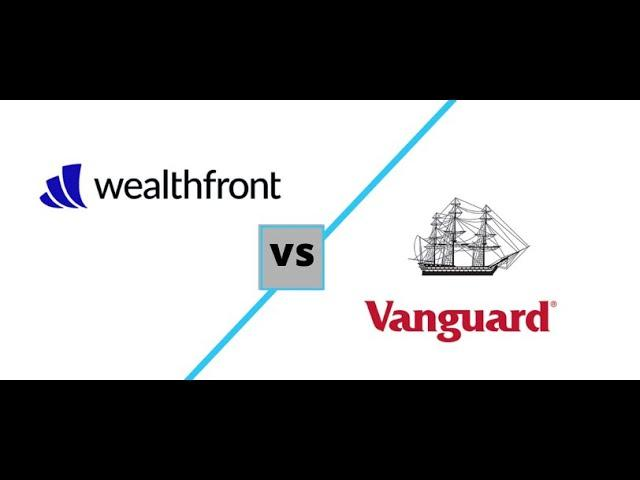

In today's financial landscape, investors are presented with a myriad of options to manage their wealth effectively. Among these, Wealthfront and Vanguard Personal Advisor stand out as two prominent platforms, each offering unique approaches to investment management. Wealthfront is renowned for its technology-driven, automated investment solutions, appealing to a new generation of investors who value digital experiences. On the other hand, Vanguard Personal Advisor combines automation with personalized human advice, leveraging its long-standing reputation in low-cost index funds to offer a robust advisory service. 

Understanding the offerings and differences between these platforms is crucial for making informed investment decisions. Wealthfront's approach emphasizes goal planning and tax optimization, while Vanguard provides integrated human support alongside its digital tools. This comprehensive article compares these platforms, including insights into algorithmic trading features, which play a pivotal role in Wealthfront's automated service. By the end, readers will gain clarity on which platform might best suit their investment needs, based on factors such as cost-effectiveness, service accessibility, and the degree of personal interaction desired.

## Table of Contents

## What Is Wealthfront?

Wealthfront is renowned as a prominent robo-advisor, offering a streamlined, technology-focused approach to portfolio management. Its hallmark lies in delivering automated investment solutions, enhanced by strategic goal planning and sophisticated tax optimization techniques. These services aim to maximize after-tax returns for investors, integrating elements such as tax-loss harvesting and a diversified asset allocation tailored to individual risk profiles.

With an invitingly low account minimum of $500, Wealthfront is accessible to a broad spectrum of investors, including those just embarking on their investment journey. This low barrier to entry democratizes access to premium financial management, previously reserved for high-net-worth individuals. Users benefit from the platform's emphasis on delivering a comprehensive digital experience, eschewing traditional personal advisor interactions. This fully automated service model caters to tech-savvy investors who prefer managing their wealth independently via a robust digital platform.

Moreover, Wealthfront's suite of financial tools extends beyond active portfolio management. The platform offers features like financial planning for significant life goals, including home ownership and retirement, through its user-friendly and intuitive interface. Wealthfront’s Path tool, for instance, provides users with personalized financial advice without any active investment required. This tool utilizes innovative predictive algorithms to offer insights into users' financial futures, helping them make informed decisions aligned with their long-term aspirations.

Overall, Wealthfront's focus on automation, low-cost accessibility, and comprehensive digital tools positions it as a versatile solution for investors seeking a modernized approach to wealth management. It serves as an ideal platform for those desiring autonomy over their investments, bolstered by technologically advanced financial strategizing.

## Understanding Vanguard Personal Advisor

Vanguard Personal Advisor Services represents a unique hybrid approach in the financial advisory market, combining the strengths of algorithmic investment tools with personalized guidance from human advisors. This dual-service model is designed to cater to a diverse range of client needs, particularly for those who seek a balanced blend of technological efficiency and expert human insight. 

Central to this hybrid service is Vanguard's emphasis on personalized financial advice, tailored meticulously to each investor's individual circumstances. This is achievable through a minimum investment requirement of $50,000, setting a foundation that enables comprehensive management and strategy development. Such a threshold ensures that each client’s needs are sufficiently robust to benefit from the integrated services offered, which include both digital portfolio management and direct interaction with Certified Financial Planners (CFPs).

Vanguard is renowned for its pioneering role in low-cost index fund management, a legacy leveraged seamlessly within its Personal Advisor Services. This has been a core strength, as the platform utilizes broad-based, low-expense ratio funds for constructing diversified client portfolios. This approach aligns investor portfolios with market performance indices, allowing for potentially stable growth with minimized costs.

Another distinguishing feature of Vanguard Personal Advisor Services is the access to ongoing consultations with financial professionals. These consultations are not sporadic but form a consistent part of the service offering, ensuring that clients receive continuous support and can adjust their investment strategies in response to life changes or economic shifts. Such comprehensive guidance from CFPs adds value through personalized insights, complementing the automated solutions embedded in the platform.

This hybrid model appeals particularly to investors who appreciate the use of cutting-edge digital tools while valuing the reassurance and nuanced understanding that personal interaction brings. For such clients, Vanguard Personal Advisor Services serves as an ideal solution, bridging the gap between fully digital platforms and traditional human-led advisory services. This comprehensive, hybrid approach is geared towards clients who are looking to optimize their financial planning through both automation and human expertise, while maintaining active participation in the decision-making process.

## Account Types and Portfolio Options

Both Wealthfront and Vanguard Personal Advisor Services provide a variety of account types to accommodate diverse investment needs, including Individual Retirement Accounts (IRAs) and standard brokerage accounts. 

### Wealthfront Offerings:
Wealthfront expands its services beyond the conventional account types by offering more specialized options such as 529 college savings plans, which help families plan financially for future education expenses, and trust accounts, which are essential for estate planning. The platform distinguishes itself by allowing for significant portfolio customization. Notably, for portfolios exceeding $100,000, investors can engage in direct indexing, a strategy that involves purchasing a broad range of securities in attempts to replicate the performance of an index while maximizing tax efficiency. Wealthfront's use of technology allows investors to efficiently tailor their portfolios to personal specifications and financial goals.

### Vanguard Personal Advisor Services:
In contrast, Vanguard Personal Advisor Services integrates its extensive background in fund management by focusing on stock and bond exchange-traded funds (ETFs), which serve as the cornerstone of many investment portfolios. Additionally, the service offers Environmental, Social, and Governance ([ESG](/wiki/esg-investing)) funds and active fund options, catering to investors with specific ethical or strategic considerations. The personalized aspect of Vanguard's approach is evident in how portfolios are crafted, as they are aligned with an individual investor's risk tolerance and long-term objectives. Human advisors work to ensure that the portfolios meet the client’s financial goals, providing a personalized touch that complements the initial algorithmically-driven portfolio construction.

By providing diverse account types and portfolio options, both Wealthfront and Vanguard Personal Advisor Services cater to a wide spectrum of investors, from those seeking technology-driven portfolio customization to those preferring personalized advice with a human touch.

## Algorithmic Trading Features

Algorithmic trading involves the use of complex algorithms to execute trading based on pre-established parameters, enabling streamlined and efficient investment management. Wealthfront, a leading robo-advisor, effectively employs [algorithmic trading](/wiki/algorithmic-trading) techniques such as automated rebalancing and tax-loss harvesting. These features are accessible even for accounts with relatively low balances, providing broad accessibility. Automated rebalancing ensures that an investor's portfolio maintains its intended asset allocation by periodically adjusting the proportions of assets. This helps in maintaining a desired risk profile and investment strategy over time. Tax-loss harvesting further enhances after-tax returns by capitalizing on investment losses to offset gains, thereby optimizing tax outcomes.

Vanguard Personal Advisor, while incorporating automated tools, primarily utilizes algorithms during the initial portfolio creation process. This process is augmented by ongoing human oversight from Certified Financial Planners, providing a balanced approach that combines algorithmic efficiency with personalized human insight. Vanguard's use of algorithms is strategically aligned with its philosophy of combining low-cost index funds with comprehensive financial advice, ensuring that portfolios are both scientifically constructed and individually tailored.

The extent to which algorithmic features are employed distinctly influences the nature of the services offered by Wealthfront and Vanguard. For Wealthfront, these features facilitate a hands-off investment experience, appealing to investors comfortable with technology-driven solutions and minimal human interaction. Understanding the impact and scope of algorithmic trading is crucial for investors, especially those who rely on automated adjustments to respond to dynamic market conditions. This knowledge enables investors to choose a platform that aligns with their preference for automated versus human-guided investment management.

## Fees and Accessibility

When evaluating the financial accessibility and fee structures of Wealthfront and Vanguard Personal Advisor, there are notable distinctions impacting investor choice. Wealthfront offers a straightforward fee model, charging a flat rate of 0.25% annually on managed assets. This low-cost management service is appealing to many investors, particularly those new to investing, due to its competitive pricing and low minimum investment requirement of $500. This accessibility enables novice investors to enter the market with less financial strain while benefiting from technology-driven portfolio management.

Conversely, Vanguard Personal Advisor presents a slightly higher fee of 0.30% per annum. While this rate is still competitive, Vanguard requires a substantial initial deposit of $50,000, which may restrict access to more affluent individuals or those with significant asset bases. However, Vanguard's cost structure is justified by the inclusion of professional financial consultations and personalized advice offered by Certified Financial Planners. This service adds significant value, particularly for investors who seek regular human interaction in managing their financial plans.

Consequently, choosing between Wealthfront and Vanguard often hinges on the investor's stage in their financial journey. For those starting with smaller budgets and seeking the benefits of automated services, Wealthfront's low initial barrier and minimal fees present an attractive option. On the other hand, investors with substantial assets who prioritize customized advice and are willing to meet the higher initial requirement may find Vanguard's integrated human advisory services more suited to their needs.

Ultimately, the decision is influenced by assessing one's financial situation and investment preferences, with each platform catering to distinct investor profiles.

## Choosing the Right Platform for You

When choosing between Wealthfront and Vanguard Personal Advisor, investors must carefully assess their personal investment goals and preferences to find the most suitable platform. Wealthfront is particularly appealing to tech-savvy individuals who are comfortable with a self-directed approach. Its platform emphasizes automation, leveraging advanced algorithms for tasks like portfolio rebalancing and tax-loss harvesting, allowing investors to benefit from a hands-off experience. This makes Wealthfront an ideal choice for those who appreciate a digital-first investment strategy and prioritize low-cost management.

On the other hand, Vanguard Personal Advisor Services offers an integrated approach combining digital tools with human advice. This platform is better suited for investors who value the guidance of experienced financial professionals. With experienced Certified Financial Planners available for consultation, investors can receive personalized strategies tailored to complex financial goals, typically requiring substantial asset management. Vanguard’s approach integrates comprehensive advice, making it a preferred choice for individuals who prioritize a blend of technology and personal interaction in their financial planning.

When deciding which platform to use, consider several critical factors beyond the basic offerings. Customer service quality can significantly impact the user experience, impacting how issues are resolved and guidance is provided. Platform usability is another crucial [factor](/wiki/factor-investing)—an intuitive and efficient interface can enhance the overall experience, making it easier to manage investments effectively. Furthermore, the integration of financial advice should align with your comfort level in managing finances; some may prefer more autonomy, while others may benefit from professional support.

Ultimately, the decision should be based on how well each platform’s features align with your investment philosophy and goals. If maximizing digital efficiency and minimizing costs are your priorities, Wealthfront might be the best fit. Conversely, if personalized advice and comprehensive financial planning are more aligned with your needs, Vanguard Personal Advisor Services may be more suitable.

Aligning your choice with specific financial goals and preferences ensures a more tailored investment journey, optimizing the potential for successful financial outcomes.

## Conclusion

Both Wealthfront and Vanguard Personal Advisor present distinct pathways for managing investments, each tailored to different investor preferences and needs. Recognizing the strengths of each platform is crucial for making decisions that align with individual financial aspirations.

Wealthfront is ideal for tech-savvy investors who prefer automation and a digital-first approach. Its robust algorithmic features, such as automated rebalancing and tax-loss harvesting, offer a seamless investment experience without the need for human intervention. The platform's low minimum deposit of $500 makes it accessible, particularly to novice investors seeking cost-effective management with a flat 0.25% fee.

Conversely, Vanguard Personal Advisor appeals to those who value human interaction and the guidance of certified financial planners. Its hybrid model combines automated strategies with personal consultations, enhancing the experience for investors with substantial asset management needs. The higher minimum investment of $50,000 and a management fee of 0.30% reflect its personalized service approach.

Investors should evaluate their risk tolerance, investment goals, and service expectations when choosing between the two. Those comfortable with self-directed, algorithmic solutions might lean towards Wealthfront, while those seeking comprehensive financial advice and interaction may find Vanguard's approach more suitable.

Making well-informed decisions in selecting an investment platform ensures optimized financial outcomes and foster future wealth growth. Building a strategy that aligns with personal investment philosophies is key to navigating today's complex financial landscape effectively.

## References & Further Reading

[1]: ["Advances in Financial Machine Learning"](https://www.amazon.com/Advances-Financial-Machine-Learning-Marcos/dp/1119482089) by Marcos Lopez de Prado

[2]: ["Evidence-Based Technical Analysis: Applying the Scientific Method and Statistical Inference to Trading Signals"](https://www.amazon.com/Evidence-Based-Technical-Analysis-Scientific-Statistical/dp/0470008741) by David Aronson

[3]: ["Machine Learning for Algorithmic Trading"](https://github.com/PacktPublishing/Machine-Learning-for-Algorithmic-Trading-Second-Edition) by Stefan Jansen

[4]: ["Quantitative Trading: How to Build Your Own Algorithmic Trading Business"](https://books.google.com/books/about/Quantitative_Trading.html?id=j70yEAAAQBAJ) by Ernest P. Chan

[5]: Bergstra, J., Bardenet, R., Bengio, Y., & Kégl, B. (2011). ["Algorithms for Hyper-Parameter Optimization."](https://proceedings.neurips.cc/paper/2011/file/86e8f7ab32cfd12577bc2619bc635690-Paper.pdf) Advances in Neural Information Processing Systems 24.