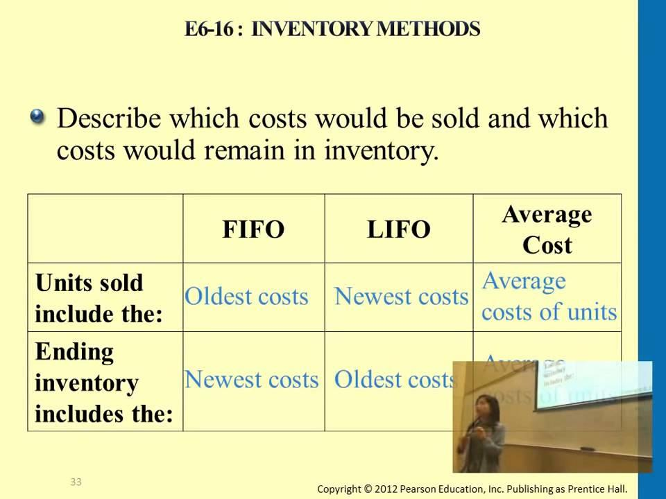

## Table of Contents

## What is the basic concept of inventory accounting?

Inventory accounting is about keeping track of the goods a business has for sale. It helps businesses know how much they have in stock and how much those items are worth. This is important because it affects how much profit a business makes. When a business buys items to sell, they record the cost of these items as inventory. As they sell these items, the cost of the sold items is moved from inventory to an expense called "cost of goods sold."

There are different ways to value inventory, like FIFO (First In, First Out) and LIFO (Last In, First Out). FIFO means the first items bought are the first ones sold. LIFO means the last items bought are the first ones sold. The method a business chooses can change how much profit they report. It's important for businesses to choose a method that fits their needs and to use it consistently. Keeping good records of inventory helps businesses make smart decisions about buying and selling, and it also helps them follow the rules for taxes and financial reporting.

## How does the Weighted Average method calculate the cost of inventory?

The Weighted Average method calculates the cost of inventory by taking the total cost of all the items in stock and dividing it by the total number of items. This gives you an average cost per item. When you sell something, you use this average cost to figure out how much it cost you to buy that item. It's called "weighted" because it considers both the cost and the quantity of each purchase, giving more weight to larger purchases.

For example, if you bought 10 items at $5 each and later bought 20 items at $6 each, you would add up the total cost ($50 + $120 = $170) and divide by the total number of items (10 + 20 = 30). This would give you a weighted average cost of $5.67 per item. When you sell an item, you would use $5.67 as the cost of that item, no matter when you bought it. This method smooths out price changes over time, making it easier to manage inventory costs.

## What is the FIFO method and how does it work?

The FIFO method stands for "First In, First Out." It's a way of keeping track of inventory where the first items you buy are the first ones you sell. Imagine you're selling apples. If you bought some apples a week ago and then bought more today, when you sell an apple, you count it as if you're selling one from the batch you bought a week ago first. This method makes sense for things that can go bad or get old, like food or fashion items, because you want to sell the older stuff before it's no longer good.

Using FIFO helps keep track of costs too. If the price of apples goes up over time, FIFO means you're selling the cheaper, older apples first. So, when you figure out how much it cost you to sell those apples, you use the lower price from when you bought them. This can make your profits look higher if prices are going up. But if prices are going down, FIFO can make your profits look lower because you're selling the more expensive, older items first.

## What is the LIFO method and how does it work?

The LIFO method stands for "Last In, First Out." It's a way of managing inventory where you sell the items you bought most recently first. Imagine you're selling pencils. If you bought some pencils a month ago and then bought more pencils yesterday, when you sell a pencil, you count it as if you're selling one from the batch you bought yesterday first. This method is useful if you want to match your current costs with your current sales, especially if the prices of your items are going up.

Using LIFO can affect how much profit you report. If the price of pencils goes up over time, LIFO means you're selling the more expensive, newer pencils first. So, when you figure out how much it cost you to sell those pencils, you use the higher price from when you bought them recently. This can make your profits look lower if prices are going up, but it can be good for taxes because you're showing less profit. However, if prices are going down, LIFO can make your profits look higher because you're selling the less expensive, newer items first.

## What are the main differences between FIFO and LIFO?

The main difference between FIFO and LIFO is the order in which items are considered sold from inventory. With FIFO, which stands for "First In, First Out," the oldest items you bought are the first ones you sell. This makes sense for things that can spoil or go out of style, like food or clothes. On the other hand, LIFO, which stands for "Last In, First Out," means you sell the newest items you bought first. This can be useful if you want to match your most recent costs with your sales, especially if prices are going up.

Another big difference is how FIFO and LIFO affect the cost of goods sold and profits. With FIFO, if prices are rising, you're selling the cheaper, older items first, which can make your profits look higher. But if prices are falling, FIFO can make your profits look lower because you're selling the more expensive, older items first. With LIFO, it's the opposite. If prices are going up, you're selling the more expensive, newer items first, which can make your profits look lower, but it can help with taxes. If prices are going down, LIFO can make your profits look higher because you're selling the less expensive, newer items first.

These differences can also affect how a business manages its inventory and plans its finances. FIFO is more common in many countries because it's seen as a better reflection of the actual flow of goods for many types of products. LIFO, while less common globally, is used more in the United States and can be beneficial for businesses in industries where prices frequently change, like oil and gas. Ultimately, the choice between FIFO and LIFO depends on the type of business, the nature of the inventory, and the financial goals of the company.

## How does the choice of inventory method affect the cost of goods sold (COGS)?

The choice of inventory method, like FIFO or LIFO, changes how much it costs to sell your stuff, which is called the cost of goods sold (COGS). With FIFO, you sell the oldest things first. If prices are going up, the stuff you sell is cheaper because you bought it a long time ago. So, your COGS is lower because you're using the old, lower prices. But if prices are going down, FIFO makes your COGS higher because you're selling the more expensive stuff you bought earlier.

On the other hand, with LIFO, you sell the newest things first. If prices are going up, the stuff you sell is more expensive because you bought it recently. This makes your COGS higher because you're using the new, higher prices. But if prices are going down, LIFO makes your COGS lower because you're selling the less expensive stuff you bought more recently. So, the method you pick can make a big difference in how much you say it costs to sell your products, and that affects how much profit you show on your [books](/wiki/algo-trading-books).

## In what scenarios would a company choose to use the Weighted Average method over FIFO or LIFO?

A company might choose the Weighted Average method if they want to smooth out the ups and downs of their inventory costs. When prices are always changing, using the Weighted Average method can make it easier to keep track of costs because it mixes all the prices together into one average price. This is helpful for businesses that deal with lots of small purchases at different prices, like a store that buys many small items throughout the year. It's also good for companies that don't want to spend a lot of time figuring out which items were bought first or last, because the Weighted Average method is simpler to use.

Another reason a company might pick the Weighted Average method is if they want to show a steady picture of their costs over time. This can make it easier to plan and predict how much money they will make. It's especially useful for businesses in industries where prices don't change a lot, or where the products are all pretty much the same, like chemicals or bulk materials. By using the Weighted Average method, the company can avoid the big swings in profit that can happen with FIFO or LIFO when prices are going up or down a lot.

## How do FIFO and LIFO affect a company's financial statements differently?

When a company uses FIFO, it affects their financial statements in a way that can make profits look higher if prices are going up. That's because FIFO means you sell the oldest stuff first, which you probably bought at a lower price. So, your cost of goods sold (COGS) is lower, and that makes your profit look bigger. But if prices are going down, FIFO can make profits look smaller because you're selling the more expensive stuff you bought earlier. Also, with FIFO, the inventory value on the balance sheet stays closer to current prices, which can make the company look more valuable.

On the other hand, using LIFO can make profits look lower if prices are going up. That's because LIFO means you sell the newest stuff first, which you probably bought at a higher price. So, your COGS is higher, and that makes your profit look smaller. But if prices are going down, LIFO can make profits look bigger because you're selling the less expensive stuff you bought more recently. With LIFO, the inventory value on the balance sheet might not reflect current prices as well, which can make the company look less valuable. This difference in how profits and inventory are shown can affect how investors and banks see the company's financial health.

## What are the tax implications of using FIFO versus LIFO?

When a business uses FIFO for their inventory, it can affect how much they pay in taxes. If prices are going up, FIFO makes the cost of goods sold (COGS) lower because they're selling the older, cheaper stuff first. This means their profit looks bigger, and they might have to pay more taxes because they're showing more money made. But if prices are going down, FIFO can make their profit look smaller, so they might pay less in taxes. It's like a seesaw: when prices go up, taxes might go up; when prices go down, taxes might go down.

On the other hand, using LIFO can have the opposite effect on taxes. If prices are going up, LIFO makes the COGS higher because they're selling the newer, more expensive stuff first. This makes their profit look smaller, and they might end up paying less in taxes because they're showing less money made. But if prices are going down, LIFO can make their profit look bigger, so they might pay more in taxes. LIFO can be a good choice for businesses that want to reduce their tax bill when prices are rising, but it's not allowed in all countries, so they need to check the rules where they are.

## How do international accounting standards (IFRS) impact the choice between FIFO, LIFO, and Weighted Average?

International Financial Reporting Standards (IFRS) affect which inventory method a business can use. IFRS doesn't let businesses use LIFO. This means if a company follows IFRS, they have to pick either FIFO or the Weighted Average method. IFRS wants businesses to show a true and fair view of their financial situation, and they think FIFO and Weighted Average do a better job at this than LIFO.

Because of this rule, companies that want to report their finances around the world usually go with FIFO or Weighted Average. FIFO can be good for businesses that sell things that can go bad or get old, like food or fashion, because it matches how they actually sell their stuff. The Weighted Average method is easier to use and can smooth out price changes, which is helpful for businesses that buy lots of things at different prices. So, IFRS makes a big difference in which method a company picks, especially if they do business in different countries.

## What are the potential impacts of inflation on the choice of inventory accounting method?

When prices are going up because of inflation, the choice of inventory accounting method can really change how a business looks financially. If a business uses FIFO, they sell the older, cheaper stuff first. This means their cost of goods sold (COGS) is lower, making their profit look bigger. When profits are bigger, they might have to pay more in taxes. So, during inflation, FIFO can make a business seem more profitable on paper, which can be good for showing investors they're doing well, but it might also mean paying more taxes.

On the other hand, if a business uses LIFO during inflation, they sell the newer, more expensive stuff first. This makes their COGS higher, which makes their profit look smaller. When profits are smaller, they might pay less in taxes. LIFO can be a good choice for businesses that want to reduce their tax bill when prices are rising. But, LIFO isn't allowed under international accounting rules (IFRS), so businesses that follow those rules have to pick FIFO or the Weighted Average method. The Weighted Average method mixes all the prices together into one average, which can smooth out the ups and downs of inflation, making it easier to predict costs and profits.

## How do advanced inventory management systems handle the implementation of FIFO, LIFO, and Weighted Average methods?

Advanced inventory management systems make it easier for businesses to use FIFO, LIFO, or the Weighted Average method by keeping track of all the details automatically. These systems remember when and how much you bought each item for, and they can figure out which items to count as sold based on the method you choose. For FIFO, the system will sell the oldest items first, so it keeps a list of everything in the order you bought it. For LIFO, it does the opposite, selling the newest items first. With the Weighted Average method, the system calculates an average cost for each type of item by mixing all the prices together, making it simple to apply this method without having to think about which items came first or last.

These systems also help with reporting and making decisions. They can show you how much your inventory is worth and how much it costs to sell your items, using the method you've picked. This helps you see how much profit you're making and can affect how much you pay in taxes. Since these systems do all the hard work for you, you don't have to spend a lot of time figuring out which items to sell or how to value your inventory. This makes it easier to choose the best method for your business, whether it's FIFO, LIFO, or Weighted Average, and to switch methods if you need to.

## What is an Overview of Accounting Methods in Algo Trading?

Algorithmic trading, characterized by high-frequency transactions, necessitates the meticulous management of financial records to ensure accuracy and compliance. In this context, inventory accounting methods such as First In, First Out (FIFO), Last In, First Out (LIFO), and Weighted Average are vital. These methods help determine the cost of goods sold (COGS), influence tax liabilities, and shape the financial portrayal of a trading entity.

1. **First In, First Out (FIFO):** FIFO entails the assumption that the earliest acquired stocks are the first to be sold. This method aligns inventory costs with recent market conditions, thus often reflecting higher net income in escalating price periods. Consequently, it might lead to increased tax obligations in such scenarios since newer inventory, purchased at higher prices, is accounted for as remaining in stock. However, in a declining market, the tax implications may be reduced.

2. **Last In, First Out (LIFO):** Conversely, LIFO assumes that the newest inventory is sold first. This method can be advantageous in inflationary settings, as it typically results in lower taxable income by matching recent costs against revenues. Nevertheless, the international restriction of LIFO by International Financial Reporting Standards (IFRS) poses challenges for globally-operating companies, as they must often revert to alternative accounting methods for international financial statements.

3. **Weighted Average:** This method involves calculating an average cost for all inventory items, proving practical when inventory items are indistinguishable. By smoothing out price fluctuations, it provides a balanced representation in financial statements, neither skewing heavily towards higher or lower end values during price variations. The formula used is:
$$
   \text{Weighted Average Cost} = \frac{\text{Total Cost of Inventory}}{\text{Total Units Available}}

$$
   This method offers simplicity and consistency, valuable traits in the fast-paced environment of [algorithmic trading](/wiki/algorithmic-trading).

The adoption of a particular accounting method can significantly impact how cost behaviors are reported and interpreted. In algorithmic trading, where transaction volumes are immense and swift, precise financial reporting helps ensure the effective operation of trading algorithms. Efficient inventory accounting not only aids in keeping track of profits and losses but also in fulfilling regulatory and tax obligations across different jurisdictions.

## What is Understanding Weighted Average Accounting?

Weighted Average accounting is a method used in inventory management where items are indistinguishable from one another, allowing a company to average out costs for their inventory. This technique is particularly beneficial in situations where inventory item prices vary over time, often due to fluctuating market conditions.

To apply Weighted Average accounting, a company calculates an average cost for all goods available for sale during an accounting period. This average cost is then assigned to the cost of goods sold (COGS) and the ending inventory. The formula for computing the weighted average cost per unit is as follows:

$$
\text{Weighted Average Cost per Unit} = \frac{\text{Total Cost of Inventory}}{\text{Total Units Available for Sale}}
$$

For instance, if a trading firm acquires 100 units at $10 each and another 150 units at $12 each, the calculation would be:

$$
\text{Weighted Average Cost per Unit} = \frac{(100 \times 10) + (150 \times 12)}{100 + 150} = \frac{1000 + 1800}{250} = 11.20
$$

Thus, each unit of inventory is assigned a cost of $11.20, regardless of the actual purchase price of specific units. This method provides a balanced approach that smoothens out price fluctuations, making it appealing for financial reporting. It reduces the impact of sharp price changes on the financial statements, presenting a neutral perspective of cost flow.

Weighted Average is appreciated for its simplicity and objectivity. It eliminates the need to track the cost of individual inventory items, which can be labor-intensive and unnecessary for businesses where individual units are indistinguishable. This makes it highly effective for algorithmic trading firms where high-frequency trading may involve vast quantities of indiscernible assets, such as shares or commodities.

Moreover, Weighted Average provides a compromise between the two more polarized methods, LIFO and FIFO. While it may not reflect the most recent market conditions like FIFO or tap deeply into cost-saving strategies during inflationary periods like LIFO, its middle-ground approach facilitates consistent and less volatile financial statements, essential for strategic planning and analysis.

Overall, the Weighted Average method offers a practical and efficient means of inventory valuation for businesses that require standardized unit costs, making it a versatile choice in many commercial environments.

## What is the concept of Last In, First Out (LIFO) and how does it work?

Last In, First Out (LIFO) is an inventory accounting method that assumes the most recently acquired items are sold or used before older inventory. This method is particularly advantageous during inflationary periods as it aligns the cost of goods sold (COGS) with the current replacement cost of inventory, thereby reducing taxable income. This reduction occurs because higher recent costs are matched against current revenues, leading to lower reported profits and, consequently, lower tax liabilities.

To illustrate, consider a scenario where a company purchases inventory as follows:

1. 100 units at $10 each
2. 100 units at $12 each (new purchase)
3. Sells 100 units

Under LIFO, the COGS for the sale would be calculated using the most recent purchase price:

$$
\text{COGS} = 100 \text{ units} \times \$12 = \$1200
$$

This calculation results in a higher COGS than if an older, lower-cost inventory value was used, hence lowering the gross profit.

However, LIFO is not permitted under the International Financial Reporting Standards (IFRS), limiting its use to countries where domestic regulations permit it, such as the United States. This restriction poses challenges for multinational corporations that prepare consolidated financial statements under IFRS. Implementing LIFO in such contexts necessitates maintaining dual inventory systems, complicating financial reporting and data management.

Despite these challenges, some firms may choose LIFO under Generally Accepted Accounting Principles (GAAP) to benefit from tax deferral opportunities during inflation. Nevertheless, the complexities of managing multiple accounting standards underscore the need for efficient accounting systems, particularly in algorithmic trading environments where the speed and accuracy of financial data are crucial.

## References & Further Reading

[1]: ["Financial Accounting and Reporting"](https://www.investopedia.com/terms/f/financialaccounting.asp) by Barry Elliott and Jamie Elliott

[2]: ["Intermediate Accounting"](https://accountingtestprep.com/intermediate-accounting-2/) by Donald E. Kieso, Jerry J. Weygandt, and Terry D. Warfield

[3]: ["Inventory Accounting: A Comprehensive Guide"](https://www.amazon.com/Inventory-Accounting-Comprehensive-Steven-Bragg/dp/0471356425) by Steven M. Bragg

[4]: ["Algorithmic Trading: Winning Strategies and Their Rationale"](https://www.amazon.com/Algorithmic-Trading-Winning-Strategies-Rationale-ebook/dp/B00CY5HC0U) by Ernest P. Chan

[5]: ["The Basics of Fifo and Lifo"](https://www.investopedia.com/articles/02/060502.asp) at the Corporate Finance Institute

[6]: ["LIFO Accounting: Use and Restrictions"](https://www.forbes.com/advisor/business/lifo-inventory-method/) at the Harvard Business Review

[7]: ["Automated Trading with R: Quantitative Research and Platform Development"](https://link.springer.com/book/10.1007/978-1-4842-2178-5) by Chris Conlan

[8]: ["Blockchain and the Future of Finance"](https://www.forbes.com/sites/kpmg/2018/09/11/blockchain-and-the-future-of-finance/) at the Journal of Financial Planning