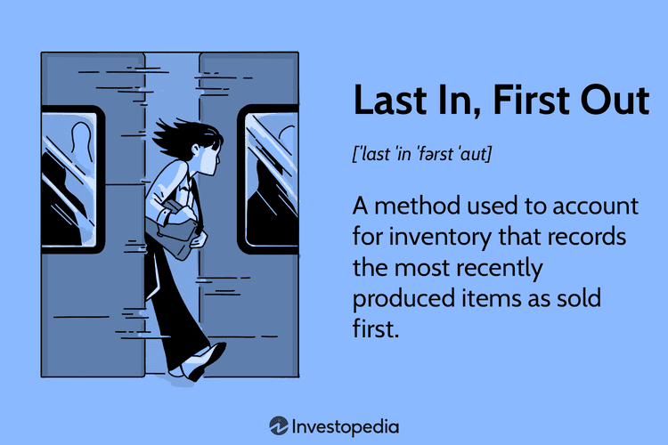

Understanding the nuances of inventory accounting is crucial for businesses, particularly those involved in algorithmic trading. Inventory accounting helps firms accurately document the cost of goods and manage their financial records. This ensures that they present a clear picture of their financial health and comply with regulatory standards.

In this article, we will examine the three primary methods of inventory accounting: Last In, First Out (LIFO), First In, First Out (FIFO), and Weighted Average. These methods serve as essential tools for measuring inventory costs, and each has distinct characteristics that can influence a trading firm’s financial analysis. For instance, the choice between LIFO and FIFO can affect the cost of goods sold (COGS), and, subsequently, a company's net income and tax liabilities, which are critical considerations for firms participating in high-frequency trading.



Moreover, we will explore how these accounting methods integrate with algorithmic trading strategies, which are fundamentally reliant on precise financial data for effective operation. The integration of inventory accounting with algo trading is vital for optimizing decision-making processes in high-speed trading environments. By reflecting accurate financial positions, these methods help in determining the optimal trading strategies under various market conditions.

By the conclusion of this article, readers will have gained insights into how choosing the appropriate accounting method can significantly impact a trading firm’s financial statements and analytical capabilities. This understanding is vital for navigating the competitive and dynamic landscape of algorithmic trading effectively.

## Table of Contents

## Overview of Accounting Methods in Algo Trading

Algorithmic trading, characterized by high-frequency transactions, necessitates the meticulous management of financial records to ensure accuracy and compliance. In this context, inventory accounting methods such as First In, First Out (FIFO), Last In, First Out (LIFO), and Weighted Average are vital. These methods help determine the cost of goods sold (COGS), influence tax liabilities, and shape the financial portrayal of a trading entity.

1. **First In, First Out (FIFO):** FIFO entails the assumption that the earliest acquired stocks are the first to be sold. This method aligns inventory costs with recent market conditions, thus often reflecting higher net income in escalating price periods. Consequently, it might lead to increased tax obligations in such scenarios since newer inventory, purchased at higher prices, is accounted for as remaining in stock. However, in a declining market, the tax implications may be reduced.

2. **Last In, First Out (LIFO):** Conversely, LIFO assumes that the newest inventory is sold first. This method can be advantageous in inflationary settings, as it typically results in lower taxable income by matching recent costs against revenues. Nevertheless, the international restriction of LIFO by International Financial Reporting Standards (IFRS) poses challenges for globally-operating companies, as they must often revert to alternative accounting methods for international financial statements.

3. **Weighted Average:** This method involves calculating an average cost for all inventory items, proving practical when inventory items are indistinguishable. By smoothing out price fluctuations, it provides a balanced representation in financial statements, neither skewing heavily towards higher or lower end values during price variations. The formula used is:
$$
   \text{Weighted Average Cost} = \frac{\text{Total Cost of Inventory}}{\text{Total Units Available}}

$$
   This method offers simplicity and consistency, valuable traits in the fast-paced environment of [algorithmic trading](/wiki/algorithmic-trading).

The adoption of a particular accounting method can significantly impact how cost behaviors are reported and interpreted. In algorithmic trading, where transaction volumes are immense and swift, precise financial reporting helps ensure the effective operation of trading algorithms. Efficient inventory accounting not only aids in keeping track of profits and losses but also in fulfilling regulatory and tax obligations across different jurisdictions.

## Understanding Weighted Average Accounting

Weighted Average accounting is a method used in inventory management where items are indistinguishable from one another, allowing a company to average out costs for their inventory. This technique is particularly beneficial in situations where inventory item prices vary over time, often due to fluctuating market conditions.

To apply Weighted Average accounting, a company calculates an average cost for all goods available for sale during an accounting period. This average cost is then assigned to the cost of goods sold (COGS) and the ending inventory. The formula for computing the weighted average cost per unit is as follows:

$$
\text{Weighted Average Cost per Unit} = \frac{\text{Total Cost of Inventory}}{\text{Total Units Available for Sale}}
$$

For instance, if a trading firm acquires 100 units at $10 each and another 150 units at $12 each, the calculation would be:

$$
\text{Weighted Average Cost per Unit} = \frac{(100 \times 10) + (150 \times 12)}{100 + 150} = \frac{1000 + 1800}{250} = 11.20
$$

Thus, each unit of inventory is assigned a cost of $11.20, regardless of the actual purchase price of specific units. This method provides a balanced approach that smoothens out price fluctuations, making it appealing for financial reporting. It reduces the impact of sharp price changes on the financial statements, presenting a neutral perspective of cost flow.

Weighted Average is appreciated for its simplicity and objectivity. It eliminates the need to track the cost of individual inventory items, which can be labor-intensive and unnecessary for businesses where individual units are indistinguishable. This makes it highly effective for algorithmic trading firms where high-frequency trading may involve vast quantities of indiscernible assets, such as shares or commodities.

Moreover, Weighted Average provides a compromise between the two more polarized methods, LIFO and FIFO. While it may not reflect the most recent market conditions like FIFO or tap deeply into cost-saving strategies during inflationary periods like LIFO, its middle-ground approach facilitates consistent and less volatile financial statements, essential for strategic planning and analysis.

Overall, the Weighted Average method offers a practical and efficient means of inventory valuation for businesses that require standardized unit costs, making it a versatile choice in many commercial environments.

## First In, First Out (FIFO) Explained

The First In, First Out (FIFO) inventory accounting method operates on the principle that the inventory acquired or produced earliest is the first to be used or sold. In this approach, the cost of goods sold is based on the costs of the earliest inventory, which can lead to different financial outcomes under varying market conditions.

When prices are rising, FIFO aligns with current market prices by typically reporting higher net incomes. This is because the cost of goods sold reflects the older, often lower cost of inventory, while the remaining inventory on the balance sheet is priced at higher market values, which can potentially result in greater profits. The representation of inventory value in financial statements under FIFO tends to be more realistic compared to other methods because the inventory left over is valued at more recent prices.

In the context of declining prices, FIFO has the advantage of reducing tax liabilities, as it shows a lower net income due to higher costs associated with the inventory sold. This occurs because the inventory sold from earlier purchases carries higher costs than more recently acquired inventory in a deflationary environment, decreasing the reported net profit.

Here's a simple illustration using Python to help visualize how FIFO inventory cost calculation works under different price scenarios:

```python
# Example FIFO calculation in Python
def calculate_fifo_cost(sales, inventory):
    """
    Calculate the cost of goods sold using FIFO method.

    :param sales: Number of items sold
    :param inventory: List of tuples (quantity, price) representing inventory in chronological order
    :return: Cost of goods sold
    """
    cost_of_goods_sold = 0
    for quantity, price in inventory:
        if sales <= 0:
            break
        sold_quantity = min(quantity, sales)
        cost_of_goods_sold += sold_quantity * price
        sales -= sold_quantity
    return cost_of_goods_sold

# Inventory (quantity, unit cost)
inventory = [(50, 100), (30, 150), (20, 200)]

# Number of items sold
sales = 80

# Calculate cost of goods sold using FIFO
fifo_cost = calculate_fifo_cost(sales, inventory)
print(f"Cost of Goods Sold using FIFO: {fifo_cost}")
```

This Python code demonstrates the FIFO method by calculating the cost of goods sold based on the sequence of inventory purchases. Given the initial inventory and the number of units sold, it uses the older price data first, aligning with the FIFO principle.

Overall, the FIFO method is particularly effective in presenting inventory and financial conditions accurately in environments of rising prices, whereas it helps in managing lower tax outcomes when prices decline. While providing clear advantages, the choice of FIFO must be part of a broader financial strategy, ensuring it aligns with both operational goals and regulatory requirements.

## Examining Last In, First Out (LIFO)

Last In, First Out (LIFO) is an inventory accounting method that assumes the most recently acquired items are sold or used before older inventory. This method is particularly advantageous during inflationary periods as it aligns the cost of goods sold (COGS) with the current replacement cost of inventory, thereby reducing taxable income. This reduction occurs because higher recent costs are matched against current revenues, leading to lower reported profits and, consequently, lower tax liabilities.

To illustrate, consider a scenario where a company purchases inventory as follows:

1. 100 units at $10 each
2. 100 units at $12 each (new purchase)
3. Sells 100 units

Under LIFO, the COGS for the sale would be calculated using the most recent purchase price:

$$
\text{COGS} = 100 \text{ units} \times \$12 = \$1200
$$

This calculation results in a higher COGS than if an older, lower-cost inventory value was used, hence lowering the gross profit.

However, LIFO is not permitted under the International Financial Reporting Standards (IFRS), limiting its use to countries where domestic regulations permit it, such as the United States. This restriction poses challenges for multinational corporations that prepare consolidated financial statements under IFRS. Implementing LIFO in such contexts necessitates maintaining dual inventory systems, complicating financial reporting and data management.

Despite these challenges, some firms may choose LIFO under Generally Accepted Accounting Principles (GAAP) to benefit from tax deferral opportunities during inflation. Nevertheless, the complexities of managing multiple accounting standards underscore the need for efficient accounting systems, particularly in algorithmic trading environments where the speed and accuracy of financial data are crucial.

## Impact of Accounting Methods on Algo Trading

In algorithmic trading, the choice of inventory accounting method—such as FIFO (First In, First Out), LIFO (Last In, First Out), or Weighted Average—plays a crucial role in shaping trading strategies. Each method impacts the calculation of cost of goods sold (COGS) differently, thereby affecting profit margins and tax liabilities. 

FIFO accounting, which assumes that the oldest inventory is sold first, can lead to higher net income in a rising price environment because it pairs older, often cheaper, inventory costs with current revenues. This can result in higher taxable income but provides a more accurate reflection of current market conditions due to its potential alignment with the latest sale prices.

Conversely, LIFO assumes the most recently acquired inventory is sold first, which can minimize taxable income during inflationary periods by assigning newer, higher inventory costs to COGS. Despite its tax advantages, LIFO's use is restricted under International Financial Reporting Standards (IFRS), which can complicate its application for globally active firms.

The Weighted Average method, often employed when inventory items are indistinguishable or interchangeable, calculates a moving average cost of inventory. This approach can smooth out price fluctuations over time, offering a stable yet less timely reflection of inventory costs in financial statements.

For algorithmic trading strategies, especially high-frequency trading ([HFT](/wiki/high-frequency-trading-strategies)), accounting method selection significantly impacts real-time data accuracy and operational performance. These strategies rely on precise, up-to-the-minute financial information to make rapid trading decisions. Therefore, real-time tracking of inventory costs and values becomes paramount.

The integration of these accounting methods requires advanced technological solutions that provide immediate data processing and reporting capabilities. For instance, Python, a prevalent language in algorithmic trading, can be leveraged to automate and optimize inventory accounting. Consider this simplified example of real-time inventory cost calculation using the Weighted Average method in Python:

```python
def calculate_weighted_average(inventory):
    total_value = sum(item['quantity'] * item['cost'] for item in inventory)
    total_quantity = sum(item['quantity'] for item in inventory)
    return total_value / total_quantity if total_quantity else 0

inventory = [{'quantity': 100, 'cost': 10}, {'quantity': 200, 'cost': 12}, {'quantity': 150, 'cost': 11}]
weighted_average_cost = calculate_weighted_average(inventory)
print("Weighted Average Cost:", weighted_average_cost)
```

Efficient data handling and accurate financial tracking are essential for aligning inventory accounting with algorithmic trading. This alignment ensures that algorithms function optimally across various market conditions, maintaining a competitive edge in high-frequency trading environments.

## Integration Challenges with Accounting Methods

Integrating traditional accounting methods with algorithmic trading presents several challenges, necessitating robust data processing systems to manage the complexity and [volume](/wiki/volume-trading-strategy) of transactions. Algorithmic trading, characterized by rapid execution and [high frequency](/wiki/high-frequency-trading), requires accurate and timely financial reporting. Therefore, choosing the appropriate inventory accounting method—whether FIFO, LIFO, or Weighted Average—significantly influences the correctness of financial data.

A major challenge in this integration is addressing discrepancies between Generally Accepted Accounting Principles (GAAP) and International Financial Reporting Standards (IFRS), particularly in global trading operations. While FIFO and Weighted Average accounting methods are accepted under both GAAP and IFRS, LIFO is prohibited by IFRS, creating compliance challenges for international firms. This inconsistency requires companies to adopt flexible accounting systems capable of simultaneously handling multiple sets of standards, thereby ensuring compliance across different jurisdictions.

Moreover, implementing blockchain technology could improve data integrity and enhance reporting accuracy. Blockchain's decentralized ledger system provides a secure and transparent method for recording transactions, making it an attractive solution for maintaining accurate inventory records. The implementation of a blockchain system could replace traditional data verification processes, ensuring that all transaction data is immutable and verifiable. This would, in turn, support algorithmic trading by enabling real-time data access and eliminating the need for reconciliations due to discrepancies in transaction records.

In addition, the use of advanced analytics and [artificial intelligence](/wiki/ai-artificial-intelligence) can support data processing systems by providing predictive insights and optimizing inventory accounting methods. For instance, [machine learning](/wiki/machine-learning) algorithms can analyze historical trading data to recommend the most suitable accounting method for specific market conditions, thus enhancing decision-making processes.

In conclusion, integrating accounting methods with algorithmic trading requires a multifaceted approach, combining robust IT infrastructure, compliance flexibility, and advanced technologies like blockchain and AI. By addressing these challenges, trading firms can ensure the accuracy and compliance of their financial reports, thereby maintaining their competitive edge in the fast-paced trading environment.

## Future Trends in Accounting for Trading Firms

Efforts to harmonize International Financial Reporting Standards (IFRS) and Generally Accepted Accounting Principles (GAAP) are continually advancing to address inconsistencies between the two systems. This ongoing harmonization process is crucial for trading firms, particularly those engaged in global operations, as it allows for more streamlined and comparable financial reporting. One significant area of focus is the treatment of inventory accounting methods—such as FIFO, LIFO, and Weighted Average—where alignment can significantly impact balance sheets and income statements on an international scale.

As the landscape of algorithmic trading evolves, the demand for automated and real-time financial reporting becomes increasingly critical. Real-time data processing enables traders to make more informed decisions by providing immediate insights into cost structures, [liquidity](/wiki/liquidity-risk-premium) positions, and market movements. Technologies like artificial intelligence and machine learning are being integrated into these reporting mechanisms to enhance accuracy, speed, and adaptability. These technologies allow for predictive analytics, which can further anticipate inventory movements and optimize trading strategies.

Future trends also indicate a growing importance of blockchain technology in accounting. Blockchain can provide immutable and transparent records, thus enhancing data integrity and reducing the chance of discrepancies. Such technological advancements are essential for maintaining accurate financial records, ensuring compliance, and fostering trust among stakeholders.

Staying competitive in the dynamic trading environment necessitates an understanding and adaptation to evolving accounting standards. As regulatory bodies continue to push for standardized practices, trading firms must ensure that their accounting methodologies and systems are not only compliant but also agile enough to adopt new practices swiftly. This adaptability will be pivotal in leveraging technological advances and meeting the complex demands of high-frequency trading environments. 

By embracing these future trends and integrating them into their operations, trading firms can achieve higher levels of precision and efficiency, ultimately sustaining their competitive edge in the financial markets.

## Conclusion

Deciding on the right inventory accounting method is crucial for the financial well-being of any trading firm, especially those involved in algorithmic trading. The chosen method greatly influences financial metrics such as cost of goods sold (COGS), taxable income, and net profitability, impacting both strategic financial analysis and reporting accuracy. Accuracy in these numbers ensures that firms can make informed decisions and maintain compliance with financial regulations.

Algorithmic trading firms must integrate these accounting methods with advanced technologies to achieve real-time financial accuracy. Technologies such as blockchain can provide enhanced data integrity and transparency, allowing for instant verification and immutability of financial records. Additionally, the use of automated systems facilitates the immediate processing and recording of transactions, which is vital for high-frequency trading where milliseconds can determine profit and loss.

As the financial landscape continues to evolve, trading firms must remain adaptable to sustain competitive advantages. This involves keeping abreast of regulatory changes, such as the ongoing efforts to harmonize International Financial Reporting Standards (IFRS) and Generally Accepted Accounting Principles (GAAP). Embracing automation and real-time data analysis will be pivotal for firms to respond dynamically to market shifts and regulatory updates. In doing so, firms not only safeguard their financial health but also enhance their strategic positioning in the competitive trading environment.

## References & Further Reading

[1]: ["Financial Accounting and Reporting"](https://www.investopedia.com/terms/f/financialaccounting.asp) by Barry Elliott and Jamie Elliott

[2]: ["Intermediate Accounting"](https://accountingtestprep.com/intermediate-accounting-2/) by Donald E. Kieso, Jerry J. Weygandt, and Terry D. Warfield

[3]: ["Inventory Accounting: A Comprehensive Guide"](https://www.amazon.com/Inventory-Accounting-Comprehensive-Steven-Bragg/dp/0471356425) by Steven M. Bragg

[4]: ["Algorithmic Trading: Winning Strategies and Their Rationale"](https://www.amazon.com/Algorithmic-Trading-Winning-Strategies-Rationale-ebook/dp/B00CY5HC0U) by Ernest P. Chan

[5]: ["The Basics of Fifo and Lifo"](https://www.investopedia.com/articles/02/060502.asp) at the Corporate Finance Institute

[6]: ["LIFO Accounting: Use and Restrictions"](https://www.forbes.com/advisor/business/lifo-inventory-method/) at the Harvard Business Review

[7]: ["Automated Trading with R: Quantitative Research and Platform Development"](https://link.springer.com/book/10.1007/978-1-4842-2178-5) by Chris Conlan

[8]: ["Blockchain and the Future of Finance"](https://www.forbes.com/sites/kpmg/2018/09/11/blockchain-and-the-future-of-finance/) at the Journal of Financial Planning