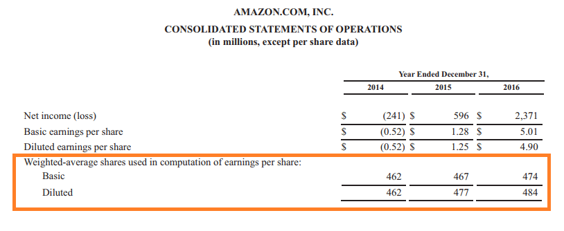

## Table of Contents

## What are weighted average shares?

Weighted average shares is a way to figure out the average number of shares a company had over a period of time. It's important because it helps in calculating earnings per share, which investors use to see how well a company is doing. To find the weighted average, you take into account how many shares were outstanding at different times during the period and give more weight to the times when there were more shares.

For example, if a company starts the year with 100 shares and then issues 50 more shares halfway through the year, the weighted average would not just be the average of 100 and 150. Instead, you would count the first half of the year with 100 shares and the second half with 150 shares. This gives you a more accurate picture of the shares outstanding over the whole year.

## What are outstanding shares?

Outstanding shares are the total number of shares of a company's stock that have been issued and are currently held by all its shareholders, including company insiders and the public. This number can change over time because of actions like issuing new shares or buying back existing ones. It's an important figure because it helps in calculating key financial metrics like market capitalization and earnings per share.

For example, if a company starts with 1 million shares and then issues another 500,000 shares, the total number of outstanding shares becomes 1.5 million. This number is crucial for investors because it tells them how many pieces the company is divided into. If the company later buys back 200,000 shares, the number of outstanding shares would then drop to 1.3 million. Keeping track of these changes helps investors understand the value of their investments and the company's overall financial health.

## How are weighted average shares calculated?

To calculate weighted average shares, you need to look at how many shares a company had at different times during a period, like a year. You can't just add up the number of shares at the beginning and the end and divide by two. Instead, you give more importance to the times when there were more shares. For example, if a company starts the year with 100 shares and then issues 50 more shares halfway through the year, you would count the first half of the year with 100 shares and the second half with 150 shares.

Here's how you do it step-by-step: First, figure out how many shares were outstanding at the start of each period within the year. Then, multiply the number of shares by the portion of the year they were outstanding. So, if the first half of the year had 100 shares, you would multiply 100 by 0.5 (half a year). If the second half had 150 shares, you would multiply 150 by 0.5. Add these two numbers together to get the weighted average shares for the year: (100 x 0.5) + (150 x 0.5) = 50 + 75 = 125. This method gives you a more accurate picture of the average number of shares over the whole year.

## How do you determine the number of outstanding shares?

The number of outstanding shares is the total number of a company's shares that are currently owned by all its shareholders. This includes shares held by the public, company insiders, and any other investors. To find this number, you can look at the company's financial statements or reports, where it is usually listed. Companies often share this information in their quarterly or annual reports, which are available to the public.

The number of outstanding shares can change over time. If a company issues new shares, the number of outstanding shares goes up. If the company buys back its own shares, the number goes down. Keeping track of these changes is important because the number of outstanding shares affects things like earnings per share and market capitalization. So, it's a good idea to check the most recent reports to get the current number of outstanding shares.

## Why is it important to understand the difference between weighted average shares and outstanding shares?

Understanding the difference between weighted average shares and outstanding shares is important because it helps investors and analysts make better financial decisions. Outstanding shares are simply the total number of shares a company has issued and that are currently held by all shareholders at any given time. This number can change if the company issues new shares or buys back existing ones. Knowing the number of outstanding shares is useful for calculating things like market capitalization, which is the total value of the company based on its stock price.

On the other hand, weighted average shares are used to figure out the average number of shares a company had over a specific period, like a year. This is important for calculating earnings per share, which shows how much profit the company made for each share of its stock. The weighted average takes into account when shares were issued or bought back during the period, giving more weight to times when there were more shares. This gives a more accurate picture of the company's performance over time, which is crucial for investors trying to understand the company's financial health and growth.

## In what financial reports can you find information about weighted average shares and outstanding shares?

You can find information about weighted average shares and outstanding shares in a company's financial reports. These reports are usually the quarterly and annual reports that companies share with the public. The quarterly reports, also called 10-Qs, give updates on the company's financial performance every three months. The annual report, or 10-K, gives a detailed look at the company's performance over the whole year. Both of these reports will list the number of outstanding shares at the end of the period and the weighted average shares for the period.

In these reports, the section called "Shareholders' Equity" or "Stockholders' Equity" is where you'll find the number of outstanding shares. This section shows how many shares are currently owned by all shareholders. The weighted average shares, which are important for calculating earnings per share, are usually found in the "Earnings Per Share" section of the report. This section explains how the company calculated its earnings per share, and it will include the weighted average number of shares used in the calculation. By looking at these parts of the reports, investors can get a clear picture of the company's stock and its financial performance over time.

## How do weighted average shares affect earnings per share (EPS)?

Weighted average shares are really important when figuring out a company's earnings per share (EPS). EPS tells investors how much money the company made for each share of its stock. To find EPS, you take the company's total earnings and divide it by the number of weighted average shares. The reason you use weighted average shares instead of just counting all the shares at the end of the year is that it gives a more accurate picture. If a company issues new shares or buys back old ones during the year, the number of shares changes. Weighted average shares take these changes into account, so the EPS calculation is fair and reflects the company's performance over the whole year.

For example, if a company starts the year with 100 shares and then issues 50 more halfway through, the weighted average would be different from just averaging 100 and 150. You would count the first half of the year with 100 shares and the second half with 150 shares. This way, the EPS calculation shows how the company's earnings were spread out over the actual number of shares that were around during the year. This helps investors understand how well the company is doing and makes it easier to compare the company's performance with other companies or over different years.

## Can the number of outstanding shares change, and if so, how?

Yes, the number of outstanding shares can change. It happens when a company decides to issue new shares or buy back its own shares. When a company issues new shares, it's like making more pieces of the company available. This can happen if the company needs more money and decides to sell more shares to investors. On the other hand, if a company buys back its own shares, it's taking some pieces off the market. This can happen if the company has extra money and wants to reduce the number of shares out there.

These changes can affect the value of the company and how much each share is worth. If a company issues more shares, the total value of the company might stay the same, but the value of each share could go down because there are more pieces to divide the company's value among. If a company buys back shares, the total value of the company might stay the same, but the value of each share could go up because there are fewer pieces to divide the company's value among. Keeping track of these changes helps investors understand how the company's decisions might affect their investments.

## What impact do stock splits and buybacks have on weighted average shares and outstanding shares?

Stock splits and buybacks can change both the number of outstanding shares and the weighted average shares. A stock split happens when a company decides to divide its existing shares into more shares. For example, in a 2-for-1 split, each share becomes two shares. This doesn't change the total value of the company, but it does increase the number of outstanding shares right away. When calculating the weighted average shares for the year, you would need to adjust the number of shares before the split to reflect the new total after the split, giving more weight to the time after the split when there are more shares.

Buybacks, on the other hand, happen when a company buys its own shares back from the market. This reduces the number of outstanding shares because there are fewer shares out there. If a company does a buyback during the year, the weighted average shares calculation will give more weight to the time before the buyback when there were more shares. Both stock splits and buybacks can affect how earnings per share (EPS) is calculated because they change the number of shares used in the calculation. Understanding these changes helps investors see how the company's decisions might affect their investments.

## How do companies use weighted average shares in financial analysis and decision-making?

Companies use weighted average shares to help them understand and show how well they are doing financially. When a company wants to figure out its earnings per share (EPS), it uses the weighted average shares. EPS is a big deal for investors because it tells them how much money the company made for each share of its stock. By using weighted average shares, the company can give a fair picture of its earnings over the whole year. This is important because if the company issued new shares or bought back old ones during the year, the number of shares changed. The weighted average takes these changes into account, so the EPS calculation is accurate and reflects the company's performance over time.

In decision-making, knowing the weighted average shares helps companies plan their financial moves. For example, if a company is thinking about issuing new shares to raise money, it can look at how this might change its weighted average shares and affect its EPS. This helps the company decide if it's a good idea or if it might make their stock look less valuable to investors. Similarly, if a company is thinking about buying back its own shares, it can see how this might increase the value of each share by reducing the weighted average shares. By understanding these impacts, companies can make smarter choices about how to grow and manage their business.

## What are the implications of a high number of outstanding shares compared to weighted average shares?

When a company has a high number of outstanding shares compared to its weighted average shares, it might mean that the company issued a lot of new shares during the year. This can happen if the company needed more money and decided to sell more shares to investors. Having more outstanding shares at the end of the year than the weighted average shows that the number of shares grew a lot over the year. This can make each share worth less because the total value of the company is spread out over more shares. Investors might see this and worry that their shares are less valuable now.

On the other hand, a high number of outstanding shares compared to weighted average shares can also affect how the company's earnings per share (EPS) is calculated. If the weighted average shares are lower than the outstanding shares, it means the company's EPS might be higher for part of the year when there were fewer shares. But at the end of the year, with more shares outstanding, the EPS might be lower. This can make it harder for investors to understand how well the company is doing. Companies need to explain these changes clearly so investors can see the full picture and make good choices about their investments.

## How can discrepancies between reported weighted average shares and actual outstanding shares affect investor perceptions and company valuation?

When there are differences between the reported weighted average shares and the actual outstanding shares, it can confuse investors and change how they see the company. If the weighted average shares are lower than the actual outstanding shares at the end of the year, it might mean the company issued a lot of new shares. This can make investors think that the value of each share is going down because the company's total value is now spread out over more shares. Investors might worry that their investment is not as valuable as they thought, and this can make them less confident in the company.

These discrepancies can also affect how the company's earnings per share (EPS) is calculated. If the weighted average shares are lower, the EPS might look higher for part of the year when there were fewer shares. But at the end of the year, with more shares outstanding, the EPS might be lower. This can make it hard for investors to understand how well the company is really doing. If the company doesn't explain these changes clearly, investors might think the company is not being open about its financial situation. This can lead to a lower company valuation because investors might not trust the company's reports and decide to sell their shares.

## What are Outstanding Shares and How Can We Understand Them?

Outstanding shares represent the total number of shares that a company has issued to shareholders, encompassing both institutional investors and insiders such as company executives and directors. This figure is pivotal in providing insights into the ownership structure of a company, reflecting the extent of public and private investment in the entity.

The count of outstanding shares is not static; it can change over time due to various corporate actions. For instance, when a company issues new shares, either through public offerings or private placements, the number of outstanding shares increases. Conversely, when a company buys back its own shares, the outstanding shares decrease as those shares are retired. Employee stock options, when exercised, also influence outstanding shares by increasing them.

Outstanding shares play a critical role in financial analysis, particularly in assessing a company's market capitalization. Market capitalization, a measure of a company's total value as perceived by the market, is calculated by multiplying the current share price by the number of outstanding shares:

$$
\text{Market Capitalization} = \text{Share Price} \times \text{Outstanding Shares}
$$

Moreover, outstanding shares are essential for determining per-share metrics, such as earnings per share (EPS). EPS is a key indicator of a company's profitability and is calculated by dividing the company’s net earnings by the average number of outstanding shares during a specific period:

$$
\text{EPS} = \frac{\text{Net Earnings}}{\text{Average Outstanding Shares}}
$$

Thus, knowing the number of outstanding shares is vital for investors, analysts, and traders, as it influences the evaluation of a company's size, investment potential, and shareholder distribution. It serves as a foundational element in assessing financial health and performance, aiding stakeholders in making informed decisions.

## What is the Concept of Weighted Average Shares?

The weighted average shares outstanding represent a refined calculation that quantifies the average number of shares a company has in the market over a specific accounting period. This number provides a more accurate and dynamic understanding of a company’s share count, reflecting changes that occur due to corporate actions such as share issuances and buybacks.

The calculation of weighted average shares is crucial for producing precise financial metrics, particularly earnings per share (EPS). EPS is a key indicator used by investors to assess a company's profitability on a per-share basis. By calculating EPS with weighted average shares, the influence of temporary changes in the number of outstanding shares is minimized, providing a clearer picture of a company's financial performance.

The weighted average shares are calculated by multiplying the number of shares outstanding by the fraction of the period they are in circulation. For example, if a company had 1,000,000 shares outstanding for six months of the year and then issued an additional 500,000 shares to be outstanding for the remaining six months, the calculation would be as follows:

$$
\text{Weighted Average Shares} = (1,000,000 \times \frac{6}{12}) + (1,500,000 \times \frac{6}{12})
$$

$$
\text{Weighted Average Shares} = 500,000 + 750,000 = 1,250,000
$$

This example demonstrates that calculating the weighted average shares acknowledges the impact of changes in share count over time, unlike the raw number of outstanding shares, which may lead to misleading financial interpretations when fluctuations are not considered.

Moreover, using weighted average shares is indispensable when assessing profitability metrics across accounting periods since it aligns more closely with the periods' reported revenue and expenses. This methodological approach ensures a more representative and fair comparison of financial performance across different time frames.

## How do you calculate weighted average shares?

Calculating weighted average shares requires a methodical approach to ensure the accuracy of financial metrics like earnings per share (EPS). This method takes into account the number of shares outstanding at different points during a financial period and adjusts for any changes.

The calculation begins by identifying each distinct period within the accounting term where the number of shares outstanding changes. For each period, multiply the number of shares outstanding by the fraction of the accounting period those shares were in circulation. This can be expressed mathematically as follows:

$$
\text{Weighted Shares for a Period} = \text{Shares Outstanding} \times \left(\frac{\text{Number of Days Shares were Outstanding}}{\text{Total Days in Period}}\right)
$$

Next, sum these weighted shares across all periods of change within the accounting term:

$$
\text{Total Weighted Shares} = \sum (\text{Weighted Shares for Each Period})
$$

To find the weighted average number of shares, divide the total weighted shares by the total number of periods considered:

$$
\text{Weighted Average Shares} = \frac{\text{Total Weighted Shares}}{\text{Number of Periods}}\]

This approach ensures that short-term fluctuations in the number of outstanding shares do not disproportionately affect financial analyses, offering a more stable and representative understanding of a company's share distribution over time.

For practical implementation, consider a simple Python snippet to calculate weighted average shares:

```python
def calculate_weighted_average_shares(periods):
    total_weighted_shares = 0
    total_days = 0

    for shares, days in periods:
        total_weighted_shares += shares * days
        total_days += days

    weighted_average_shares = total_weighted_shares / total_days
    return weighted_average_shares

# Example usage
periods = [(1000, 90), (1200, 180), (1100, 95)]  # (shares, days)
print(calculate_weighted_average_shares(periods))
```

This function takes a list of tuples, each representing a period with a specific number of shares outstanding and the days those shares were held. The output will be the weighted average shares for the specified periods, an essential figure for precise financial analysis.

## What is the comparison between outstanding and weighted average shares?

While both outstanding shares and weighted average shares are metrics related to a company's shares, they serve distinctly different purposes in financial analysis. 

Outstanding shares represent a static figure that signifies the total number of shares a company has issued and are held by shareholders at a specific point in time. This number is critical for understanding the company's size and market presence because it directly influences market capitalization, calculated as the product of the outstanding shares and the current market price per share. Market capitalization provides insight into the overall valuation of the company and its standing in the stock market. The calculation is straightforward: 

$$
\text{Market Capitalization} = \text{Outstanding Shares} \times \text{Market Price per Share}
$$

Weighted average shares, on the other hand, offer a dynamic perspective by reflecting how the number of shares has changed over a particular timeframe. This method takes into account the various transactions that may occur within the accounting period, such as new share issues, buybacks, or conversions, providing a nuanced approach to evaluating the company's performance metrics like earnings per share (EPS). By considering the timing and magnitude of these changes, weighted averages ensure that financial metrics provide a more comprehensive view of a company's profitability and financial health over the period analyzed.

The process for calculating weighted average shares involves multiplying each set of shares outstanding by the period they were held, summing these products, and then dividing by the length of the period, as represented in the formula:

$$
\text{Weighted Average Shares} = \frac{\sum (\text{Shares}_{i} \times \text{Period}_{i})}{\text{Total Period}}
$$

Here is a simple Python code snippet to demonstrate how one might calculate weighted average shares:

```python
def calculate_weighted_average_shares(shares_periods):
    total_shares = 0
    total_period = 0

    for shares, period in shares_periods:
        total_shares += shares * period
        total_period += period

    return total_shares / total_period

# Example usage with a list of (shares, period) tuples
shares_periods = [(1000, 3), (1500, 2), (1200, 5)]
weighted_avg = calculate_weighted_average_shares(shares_periods)
print(f"Weighted Average Shares: {weighted_avg}")
```

In summary, outstanding shares offer a snapshot for quick assessment of a company's size and valuation, whereas weighted average shares provide a dynamic metric that more precisely reflects changes over an accounting period. Using both metrics in tandem allows for more informed financial analysis, enhancing the accuracy of performance measurement and valuation for analysts, investors, and traders alike.

## References & Further Reading

[1]: ["Financial Modeling"](https://en.wikipedia.org/wiki/Financial_modeling) by Simon Benninga

[2]: ["Valuation: Measuring and Managing the Value of Companies"](https://www.amazon.com/Valuation-Measuring-Managing-Companies-Finance/dp/1119610885) by McKinsey & Company Inc.

[3]: ["Investment Valuation: Tools and Techniques for Determining the Value of Any Asset"](https://archive.org/details/investmentvaluat0000damo_n6k9) by Aswath Damodaran

[4]: ["Algorithmic Trading and DMA: An introduction to direct access trading strategies"](https://archive.org/details/algorithmictradi0000john) by Barry Johnson

[5]: ["Corporate Finance"](https://www.investopedia.com/terms/c/corporatefinance.asp) by Jonathan Berk, Peter DeMarzo, and Jarrad Harford

[6]: Sharpe, W. F. (1966). ["Mutual Fund Performance"](https://www.jstor.org/stable/2351741). The Journal of Business, 39(1), 119-138.

[7]: ["Handbook of Financial Analysis, Forecasting, and Modeling"](https://archive.org/details/handbookoffinanc0000shim_v1g4) by Jae K. Shim and Michael Constas