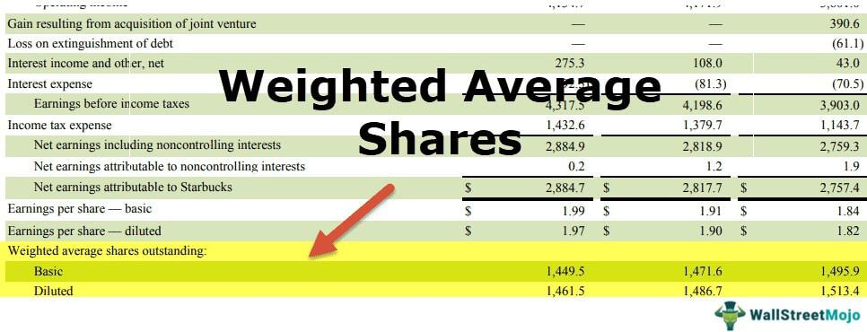

The stock market can often seem intimidating and complex, particularly when terms like 'outstanding shares' and 'weighted average shares' are thrown around. These concepts form the backbone of various financial analyses, and grasping them is fundamental for those participating in the financial markets. Outstanding shares and weighted average shares are basic yet critical components that help in evaluating a company's financial health and market position.

In this article, we aim to simplify these concepts and explore their significance in stock comparison and algorithmic trading. Understanding the number of shares a company has outstanding at any given time lays the ground for determining key financial measures like earnings per share (EPS) and market capitalization—a factor that directly relates to the company's perceived value in the financial markets.



We will explain how outstanding shares are calculated, considering any corporate actions such as stock splits, buybacks, or issuances. In contrast, weighted average shares take a nuanced approach by incorporating any fluctuations in the share count over a specific period, enabling a more accurate representation of a company's financial metrics.

These distinctions are not merely academic; they're crucial for analysts and traders when devising strategies or making investment decisions. The differences between outstanding shares and weighted average shares can significantly impact financial analysis, particularly when assessing a company's profitability or when engaging in algorithmic trading. Algorithms depend on precise data; thus, understanding these metrics is pivotal for developing accurate and robust trading strategies.

The forthcoming sections will not only cover how these shares are counted but also their practical applications, especially in the context of modern trading paradigms such as algorithmic trading. Understanding these metrics is indispensable for investors, analysts, and traders aiming to make informed decisions and adapt to the ever-evolving landscape of the financial markets.

## Table of Contents

## Understanding Outstanding Shares

Outstanding shares represent the total number of shares that a company has issued to shareholders, encompassing both institutional investors and insiders such as company executives and directors. This figure is pivotal in providing insights into the ownership structure of a company, reflecting the extent of public and private investment in the entity.

The count of outstanding shares is not static; it can change over time due to various corporate actions. For instance, when a company issues new shares, either through public offerings or private placements, the number of outstanding shares increases. Conversely, when a company buys back its own shares, the outstanding shares decrease as those shares are retired. Employee stock options, when exercised, also influence outstanding shares by increasing them.

Outstanding shares play a critical role in financial analysis, particularly in assessing a company's market capitalization. Market capitalization, a measure of a company's total value as perceived by the market, is calculated by multiplying the current share price by the number of outstanding shares:

$$
\text{Market Capitalization} = \text{Share Price} \times \text{Outstanding Shares}
$$

Moreover, outstanding shares are essential for determining per-share metrics, such as earnings per share (EPS). EPS is a key indicator of a company's profitability and is calculated by dividing the company’s net earnings by the average number of outstanding shares during a specific period:

$$
\text{EPS} = \frac{\text{Net Earnings}}{\text{Average Outstanding Shares}}
$$

Thus, knowing the number of outstanding shares is vital for investors, analysts, and traders, as it influences the evaluation of a company's size, investment potential, and shareholder distribution. It serves as a foundational element in assessing financial health and performance, aiding stakeholders in making informed decisions.

## The Concept of Weighted Average Shares

The weighted average shares outstanding represent a refined calculation that quantifies the average number of shares a company has in the market over a specific accounting period. This number provides a more accurate and dynamic understanding of a company’s share count, reflecting changes that occur due to corporate actions such as share issuances and buybacks.

The calculation of weighted average shares is crucial for producing precise financial metrics, particularly earnings per share (EPS). EPS is a key indicator used by investors to assess a company's profitability on a per-share basis. By calculating EPS with weighted average shares, the influence of temporary changes in the number of outstanding shares is minimized, providing a clearer picture of a company's financial performance.

The weighted average shares are calculated by multiplying the number of shares outstanding by the fraction of the period they are in circulation. For example, if a company had 1,000,000 shares outstanding for six months of the year and then issued an additional 500,000 shares to be outstanding for the remaining six months, the calculation would be as follows:

$$
\text{Weighted Average Shares} = (1,000,000 \times \frac{6}{12}) + (1,500,000 \times \frac{6}{12})
$$

$$
\text{Weighted Average Shares} = 500,000 + 750,000 = 1,250,000
$$

This example demonstrates that calculating the weighted average shares acknowledges the impact of changes in share count over time, unlike the raw number of outstanding shares, which may lead to misleading financial interpretations when fluctuations are not considered.

Moreover, using weighted average shares is indispensable when assessing profitability metrics across accounting periods since it aligns more closely with the periods' reported revenue and expenses. This methodological approach ensures a more representative and fair comparison of financial performance across different time frames.

## Calculating Weighted Average Shares

Calculating weighted average shares requires a methodical approach to ensure the accuracy of financial metrics like earnings per share (EPS). This method takes into account the number of shares outstanding at different points during a financial period and adjusts for any changes.

The calculation begins by identifying each distinct period within the accounting term where the number of shares outstanding changes. For each period, multiply the number of shares outstanding by the fraction of the accounting period those shares were in circulation. This can be expressed mathematically as follows:

$$
\text{Weighted Shares for a Period} = \text{Shares Outstanding} \times \left(\frac{\text{Number of Days Shares were Outstanding}}{\text{Total Days in Period}}\right)
$$

Next, sum these weighted shares across all periods of change within the accounting term:

$$
\text{Total Weighted Shares} = \sum (\text{Weighted Shares for Each Period})
$$

To find the weighted average number of shares, divide the total weighted shares by the total number of periods considered:

$$
\text{Weighted Average Shares} = \frac{\text{Total Weighted Shares}}{\text{Number of Periods}}\]

This approach ensures that short-term fluctuations in the number of outstanding shares do not disproportionately affect financial analyses, offering a more stable and representative understanding of a company's share distribution over time.

For practical implementation, consider a simple Python snippet to calculate weighted average shares:

```python
def calculate_weighted_average_shares(periods):
    total_weighted_shares = 0
    total_days = 0

    for shares, days in periods:
        total_weighted_shares += shares * days
        total_days += days

    weighted_average_shares = total_weighted_shares / total_days
    return weighted_average_shares

# Example usage
periods = [(1000, 90), (1200, 180), (1100, 95)]  # (shares, days)
print(calculate_weighted_average_shares(periods))
```

This function takes a list of tuples, each representing a period with a specific number of shares outstanding and the days those shares were held. The output will be the weighted average shares for the specified periods, an essential figure for precise financial analysis.

## Comparing Outstanding and Weighted Average Shares

While both outstanding shares and weighted average shares are metrics related to a company's shares, they serve distinctly different purposes in financial analysis. 

Outstanding shares represent a static figure that signifies the total number of shares a company has issued and are held by shareholders at a specific point in time. This number is critical for understanding the company's size and market presence because it directly influences market capitalization, calculated as the product of the outstanding shares and the current market price per share. Market capitalization provides insight into the overall valuation of the company and its standing in the stock market. The calculation is straightforward: 

$$
\text{Market Capitalization} = \text{Outstanding Shares} \times \text{Market Price per Share}
$$

Weighted average shares, on the other hand, offer a dynamic perspective by reflecting how the number of shares has changed over a particular timeframe. This method takes into account the various transactions that may occur within the accounting period, such as new share issues, buybacks, or conversions, providing a nuanced approach to evaluating the company's performance metrics like earnings per share (EPS). By considering the timing and magnitude of these changes, weighted averages ensure that financial metrics provide a more comprehensive view of a company's profitability and financial health over the period analyzed.

The process for calculating weighted average shares involves multiplying each set of shares outstanding by the period they were held, summing these products, and then dividing by the length of the period, as represented in the formula:

$$
\text{Weighted Average Shares} = \frac{\sum (\text{Shares}_{i} \times \text{Period}_{i})}{\text{Total Period}}
$$

Here is a simple Python code snippet to demonstrate how one might calculate weighted average shares:

```python
def calculate_weighted_average_shares(shares_periods):
    total_shares = 0
    total_period = 0

    for shares, period in shares_periods:
        total_shares += shares * period
        total_period += period

    return total_shares / total_period

# Example usage with a list of (shares, period) tuples
shares_periods = [(1000, 3), (1500, 2), (1200, 5)]
weighted_avg = calculate_weighted_average_shares(shares_periods)
print(f"Weighted Average Shares: {weighted_avg}")
```

In summary, outstanding shares offer a snapshot for quick assessment of a company's size and valuation, whereas weighted average shares provide a dynamic metric that more precisely reflects changes over an accounting period. Using both metrics in tandem allows for more informed financial analysis, enhancing the accuracy of performance measurement and valuation for analysts, investors, and traders alike.

## Application in Algorithmic Trading

In [algorithmic trading](/wiki/algorithmic-trading), the accurate valuation of a company's financial metrics is essential for developing effective trading strategies. Understanding both outstanding shares and weighted average shares is crucial for this purpose. Algorithms leverage these metrics to adjust portfolio valuations and implement rebalancing strategies based on anticipated market movements.

By using changes in share count, an algorithm can dynamically adapt to market conditions. For instance, a significant fluctuation in outstanding shares due to stock buybacks or new issuances can materially affect a company's market capitalization and, consequently, its stock price. Automated trading systems can adjust their strategies accordingly, ensuring that portfolio valuations remain aligned with the most current data.

The precision offered by weighted average shares is particularly beneficial in this context. This metric accounts for variations in the number of shares over a specific period, allowing algorithms to maintain accuracy in calculating essential performance indicators such as earnings per share (EPS). A miscalculation in EPS due to an oversight of these variations could lead to erroneous trading decisions. Implementing weighted averages ensures that algorithms base their operations on the most reliable data, thus enhancing decision-making processes.

In Python, calculating the weighted average shares can be streamlined using libraries like Pandas, which allows for efficient data manipulation and computation. Here's a simple example of how this might be implemented:

```python
import pandas as pd

# Example data for periods of changes in outstanding shares
data = {'Start_Period': ['2023-01-01', '2023-03-01', '2023-06-01'],
        'End_Period': ['2023-03-01', '2023-06-01', '2023-09-01'],
        'Shares_Outstanding': [1000000, 1200000, 1100000]}

# Convert to DataFrame
df = pd.DataFrame(data)
df['Start_Period'] = pd.to_datetime(df['Start_Period'])
df['End_Period'] = pd.to_datetime(df['End_Period'])

# Calculate the weighted average
df['Period_Days'] = (df['End_Period'] - df['Start_Period']).dt.days
df['Weighted_Shares'] = df['Shares_Outstanding'] * df['Period_Days']
weighted_average_shares = df['Weighted_Shares'].sum() / df['Period_Days'].sum()

print("Weighted Average Shares Outstanding:", weighted_average_shares)
```

This script computes the weighted average shares outstanding by multiplying the number of shares by the duration they were outstanding, accumulating these weighted shares, and then dividing by the total days in the period. This level of precision is imperative for algorithmic trading systems, facilitating strategies that react aptly to market changes.

Understanding and utilizing these metrics allow traders and developers to construct algorithms that not only execute trades but do so in a manner that is grounded in the most accurate valuation data available. Such practices are indispensable as the financial industry increasingly relies on automated and sophisticated trading platforms.

## Challenges and Considerations

Calculating and interpreting the metrics of outstanding shares and weighted average shares involve navigating various financial events like stock splits, buybacks, and new stock issuances. Each of these events can significantly alter the number of a company's outstanding shares, thus impacting financial metrics and requiring careful consideration.

For example, a stock split increases the number of shares without affecting the shareholder’s equity, necessitating an adjustment in the calculation of weighted average shares. Similarly, share buybacks reduce the number of outstanding shares, potentially inflating metrics like earnings per share (EPS) if not appropriately accounted for.

To achieve an accurate analysis, it is vital to understand the timing and impact of these corporate actions on the share count. Investors should be cautious of potential discrepancies or errors in company reports that can arise from complex transactions involving derivatives or convertible securities. These errors can skew the interpretation of financial metrics if not properly addressed.

Moreover, it is imperative to meticulously assess financial statements and their accompanying footnotes. Footnotes often contain critical information regarding the details of share transactions and adjustments that are not immediately evident in the primary financial statements. This information is crucial for verifying the data used in calculations and ensuring the precision of financial analyses.

Utilizing programming can aid in these complex calculations. For instance, in Python, one can automate the adjustment of share counts utilizing libraries like Pandas to handle large datasets efficiently and to implement formulas for weighted averages and other necessary calculations. Here is a simple example in Python to illustrate the calculation of weighted average shares:

```python
import pandas as pd

# Data: Date of change and the number of shares outstanding after the change
data = {'Date': ['2023-01-01', '2023-04-01', '2023-07-01'],
        'Shares Outstanding': [1000, 1500, 1200],
        'End Date': ['2023-03-31', '2023-06-30', '2023-09-30']}

# Convert to DataFrame
df = pd.DataFrame(data)

# Calculate the number of days shares were outstanding
df['Days Outstanding'] = (pd.to_datetime(df['End Date']) - pd.to_datetime(df['Date'])).dt.days

# Calculate the weighted shares
df['Weighted Shares'] = df['Shares Outstanding'] * df['Days Outstanding']

# Calculate total days in the period
total_days = df['Days Outstanding'].sum()

# Calculate the weighted average
weighted_average_shares = df['Weighted Shares'].sum() / total_days

print(f"Weighted Average Shares Outstanding: {weighted_average_shares}")
```

In summary, understanding and properly accounting for changes in outstanding shares require diligent analysis of corporate financial events and thorough examination of financial documents. This ensures the accuracy and reliability of financial metrics used in investment and trading decisions.

## Conclusion

Outstanding shares and weighted average shares are essential metrics that provide significant insights into a company's financial health and operational performance. These metrics are critical not only for calculating key figures such as market capitalization and earnings per share (EPS) but also for evaluating a company’s overall market presence and profitability. Investors and analysts benefit from a robust understanding of these concepts, as they can more accurately assess a company's value and make informed decisions. By applying these metrics effectively, investors can better gauge potential investment opportunities and risks.

As financial markets evolve towards more sophisticated trading models, grasping the fundamentals of outstanding shares and weighted average shares becomes increasingly important. In the context of algorithmic trading, where precision and timing are key, these metrics play a pivotal role. The weighted average approach offers a nuanced view that accommodates fluctuations in share counts over time, enhancing trading algorithms' ability to make more accurate valuations and predictions. This adaptability is crucial for developing trading strategies that respond effectively to market dynamics.

Thus, as the financial landscape continues to shift towards automation and complex trading systems, the importance of comprehending these fundamental concepts cannot be overstated. Grasping the intricacies of these share metrics enables investors and developers of algorithmic trading systems to stay ahead in a competitive market, ensuring decisions are grounded in accurate and meaningful data.

## References & Further Reading

[1]: ["Financial Modeling"](https://en.wikipedia.org/wiki/Financial_modeling) by Simon Benninga

[2]: ["Valuation: Measuring and Managing the Value of Companies"](https://www.amazon.com/Valuation-Measuring-Managing-Companies-Finance/dp/1119610885) by McKinsey & Company Inc.

[3]: ["Investment Valuation: Tools and Techniques for Determining the Value of Any Asset"](https://archive.org/details/investmentvaluat0000damo_n6k9) by Aswath Damodaran

[4]: ["Algorithmic Trading and DMA: An introduction to direct access trading strategies"](https://archive.org/details/algorithmictradi0000john) by Barry Johnson

[5]: ["Corporate Finance"](https://www.investopedia.com/terms/c/corporatefinance.asp) by Jonathan Berk, Peter DeMarzo, and Jarrad Harford

[6]: Sharpe, W. F. (1966). ["Mutual Fund Performance"](https://www.jstor.org/stable/2351741). The Journal of Business, 39(1), 119-138.

[7]: ["Handbook of Financial Analysis, Forecasting, and Modeling"](https://archive.org/details/handbookoffinanc0000shim_v1g4) by Jae K. Shim and Michael Constas