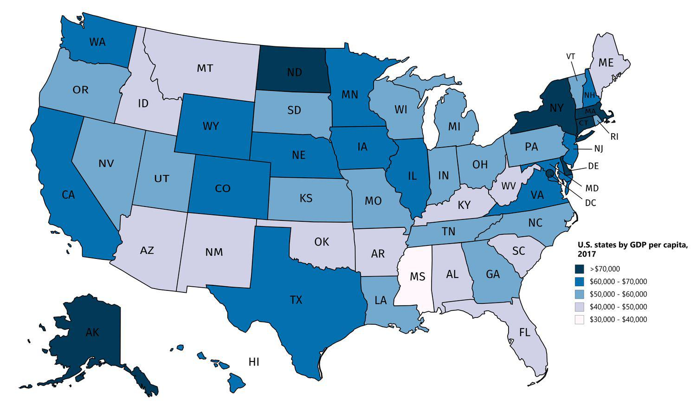

The United States, characterized by a diverse and expansive landscape, is economically segmented into distinctive regions, each contributing uniquely to the nation's prosperity. Among these, the East Coast and the West Coast emerge as two formidable economic powerhouses. The East Coast, anchored by historical cities and financial giants, contrasts with the West Coast's dynamic thrust towards technological evolution and innovation. This article seeks to deliver a comprehensive economic comparison of these two pivotal regions, underscoring their individual strengths and the specific contributions they make to the broader U.S. economy.

The East Coast, often regarded as the financial heartbeat of the nation, hosts New York City—the global financial capital. Its economy thrives on a robust finance and banking sector, bolstered by substantial activity in media, healthcare, and technology. The longstanding economic stability of the East Coast coupled with its historical significance further cements its role as a critical economic engine in the United States.

Conversely, the West Coast is renowned for its dominance in technology and entertainment. Silicon Valley serves as the epicenter for technological advancements, propelling innovations that have global implications. Additionally, the entertainment industry in Los Angeles and international trade, facilitated by strategic coastal ports, significantly contribute to the economic fabric of this region. These sectors, complemented by a strong agricultural base in California's Central Valley, form an economic environment marked by both diversity and innovation.

In the evolving landscape of financial technologies, algorithmic trading (algo trading) has emerged as a key driver, reshaping traditional practices. Algo trading is increasingly significant in financial sectors across both coasts, enhancing market efficiency and expanding reach. This integration of sophisticated algorithms in trading platforms highlights a pivotal shift in financial dynamics.

Through this exploration, we aim to elucidate the distinctive economic features of the East and West Coasts, examining how emerging technologies like algorithmic trading are not only forging efficiencies but also expanding the economic horizons of these vibrant regions.

## Table of Contents

## Overview of the East Coast Economy

The East Coast of the United States is a pivotal region in the nation's economic landscape, primarily due to its robust finance and banking sectors. New York City, often hailed as the financial capital of the world, houses major stock exchanges such as the New York Stock Exchange and NASDAQ, which are instrumental in shaping global financial markets. These institutions drive significant financial activity, attracting international investment and providing a plethora of high-income employment opportunities.

Economically, the East Coast extends beyond its prowess in finance. The region boasts a diversified GDP portfolio, with substantial contributions from media, publishing, healthcare, and technology sectors. The media and publishing industries are predominantly centered around New York City, home to several major television networks, publishing houses, and advertising agencies. This concentration of media enterprises has established the East Coast as a national hub for information dissemination and entertainment.

Healthcare is another sector where the East Coast excels, with numerous world-renowned hospitals, research institutions, and pharmaceutical companies. Cities like Boston and Philadelphia contribute significantly to advancements in medical research and biotechnology, fostering innovation and generating high-value jobs. The technology sector, while not as dominant as on the West Coast, has seen steady growth with increasing investments in tech startups and digital enterprises, especially in areas like Boston's Route 128.

Historically, the East Coast has been the cornerstone of the United States' economic development. It was among the earliest regions to industrialize, laying the foundation for economic stability and prosperity that have persisted over centuries. This historical significance translates to a longstanding economic resilience, with well-established infrastructure and robust trade connections.

In summary, the East Coast's economy is a blend of traditional industries like finance and media, combined with burgeoning sectors such as healthcare and technology. Its historical roots in commerce and industry continue to support its economic stability, making it an indispensable part of the U.S. economic framework.

## Overview of the West Coast Economy

The West Coast economy of the United States is prominently shaped by the technology and entertainment industries. Silicon Valley, located in the San Francisco Bay Area, serves as a global epicenter for technology and innovation. It hosts some of the world's largest and most influential tech companies, including Apple, Google, and Facebook, contributing significantly to the U.S. economy through technological advancements, job creation, and global market leadership. Los Angeles, another major hub on the West Coast, is recognized as the entertainment capital of the world, with Hollywood being synonymous with the film and television industry. This sector draws substantial revenue through global box office sales, television programming, and streaming services.

International trade plays a crucial role in the West Coast economy. Major port cities such as Los Angeles, Long Beach, and Seattle serve as critical gateways for the exchange of goods between the United States and Asia. These ports facilitate the import and export of manufactured goods, electronics, vehicles, and raw materials, thus bolstering economic activity and providing employment opportunities in logistics and related industries.

Agriculture is another vital component of the West Coast economy, particularly within California's Central Valley. This region is one of the most productive agricultural areas in the world, supplying a significant portion of the United States' fruits, vegetables, and nuts. The agricultural sector benefits from the region's favorable climate and advanced irrigation systems, making it a linchpin of California's economy. The diversity in agricultural production not only sustains local economies but also supports nationwide food supplies and exports.

In summary, the West Coast economy thrives on a blend of high-tech innovation, entertainment prowess, strategic international trade, and robust agricultural productivity. This combination ensures its role as a powerhouse within the broader national economic landscape.

## Key Economic Indicators

The economies of both the East and West Coasts play vital roles in the overall economic landscape of the United States, as evidenced by their contributions to the national GDP. In 2021, California's economy alone was valued at approximately $3.4 trillion, highlighting the substantial impact of the West Coast. This figure underscores the significant economic activities in the region, primarily driven by technology, entertainment, and international trade.

When considering the East Coast, its economic strength is largely due to several major metropolitan areas such as New York City, Boston, and Washington D.C. When combined, these areas create an economic powerhouse comparable to that of the entire West Coast. The East Coast's economy is bolstered by diverse sectors including finance, healthcare, and technology, which help stabilize its economic environment.

To assess the economic health of these regions, several key indicators are frequently analyzed:

1. **GDP Growth Rates**: Monitoring the year-on-year GDP growth rates offers insight into the economic expansion or contraction within each region. A higher GDP growth rate often indicates robust economic activity and effective regional economic policies.

2. **Employment Numbers**: The unemployment rate and job creation statistics are vital for understanding the labor market's health. Regions with low unemployment rates and high job growth are generally regarded as thriving economically.

3. **Industry Developments**: Tracking advancements in major industries provides a sense of the regions' adaptability and innovation. Both coasts are seeing transformations with increased integration of technology and automation across various sectors.

By examining these indicators, observers can gain a comprehensive understanding of the economic conditions and potential growth trajectories of these influential coastal economies.

## Role of Algorithmic Trading

Algorithmic trading, commonly referred to as algo trading, is reshaping financial markets by automating the process of trading securities, which enhances both efficiency and market reach. On the East Coast, particularly in financial hubs like New York City, algo trading has become an integral part of the financial sector. It is widely employed for tasks such as [arbitrage](/wiki/arbitrage) trading, whereby it exploits price differentials of the same asset in different markets, and [market making](/wiki/market-making), which involves providing [liquidity](/wiki/liquidity-risk-premium) by continuously quoting buy and sell prices.

Algo trading relies on complex algorithms to execute trades at speeds and frequencies that exceed human capabilities. These algorithms process vast amounts of market data to identify trading opportunities, optimize trade execution, and minimize transaction costs. For example, the use of [statistical arbitrage](/wiki/statistical-arbitrage), which exploits mean-reverting price series, is common in algo trading on the East Coast. Advanced algorithms analyze time series data to predict future price movements and place trades accordingly.

On the West Coast, particularly in the technology-centric regions such as Silicon Valley, the integration of financial technologies has seen tech companies adopting and innovating in algo trading. Many technology firms are incorporating [machine learning](/wiki/machine-learning) and [artificial intelligence](/wiki/ai-artificial-intelligence) to create more sophisticated trading models. These technologies allow for enhanced data analysis and pattern recognition, thus improving the decision-making process in trading.

Moreover, the West Coast's focus on technological advancements contributes to the development of new algo trading solutions. Companies are increasingly developing platforms that utilize cloud computing to handle large-scale data processing required for [algorithmic trading](/wiki/algorithmic-trading) strategies. This integration facilitates the scaling and deployment of trading strategies across various financial markets.

The growing role of algo trading on both coasts is also driven by the need for competitive edge in diverse financial environments. While the East Coast favors traditional financial strategies aligned with the region's established sector, the West Coast's inclination towards innovation pushes the boundaries of what can be achieved with algo trading. The interplay between these two approaches underscores the evolving nature of financial markets and the transformative impact of technology-driven strategies.

## Comparative Analysis

The East Coast of the United States, particularly centered around New York City, maintains a significant influence over finance and traditional industries such as manufacturing, healthcare, and media. This region benefits from a historical foundation of financial institutions and a robust infrastructure supporting various traditional industries. New York City's Wall Street is synonymous with global finance, hosting major stock exchanges and a myriad of financial services companies. This concentration of financial power underscores the East Coast's role as a major player in the national and international economic arena.

Conversely, the West Coast excels in innovation and technological advancements, largely due to the presence of Silicon Valley and numerous tech behemoths such as Apple, Google, and Facebook. The technology sector in this region not only leads in digital innovation and software development but also in integrating cutting-edge technologies into various aspects of daily life and business. The entertainment industry, with Hollywood at its center, adds another layer of economic strength, further diversifying the West Coast economy.

Both coasts have shown adaptability in rapidly evolving sectors with the integration of new technologies like algorithmic trading. On the East Coast, algorithmic trading has revolutionized financial markets by enhancing the efficiency of transactions and enabling more sophisticated trading strategies. These advancements are supported by the availability of skilled professionals in finance who are adept at leveraging technology for improved market performance.

In contrast, the West Coast's prowess in technology has led to the development and implementation of algorithmic trading through fintech startups and technology firms. These companies are creating platforms and solutions that facilitate advanced trading methodologies, which in turn influence the broader financial markets. This synergy between technology and finance highlights the West Coast's role in setting future trends in digital financial services.

The distinct economic paths of these regions are influenced by regional economic policies, talent accessibility, and global trade connections. The East Coast benefits from well-established financial regulations and a continuous influx of globally minded professionals, ensuring sustained growth in its traditional sectors. Access to elite educational institutions also provides a steady supply of talented individuals, reinforcing the economic stability of the region.

Meanwhile, the West Coast's policies promote innovation and entrepreneurship, attracting talent from around the world to its burgeoning tech industry. Furthermore, its proximity to Asia enhances trade opportunities, making it a pivotal point for international commerce. The West Coast’s open approach to global collaboration and its dynamic economic environment position it as a leader in technological and economic innovation.

In summary, while the East Coast and West Coast economies differ in their primary focuses, they are integral to the economic fabric of the United States. Each region harnesses unique strengths that contribute to the country's overall economic strategy, ensuring a comprehensive approach to growth and adaptation in a rapidly changing global market.

## Conclusion

The East and West Coast economies each hold unique positions in the U.S. economic landscape, with distinct yet complementary characteristics. The East Coast, with its prominent finance and banking sectors, exemplifies economic stability and a stronghold in traditional industries. In contrast, the West Coast is a beacon of innovation, largely driven by the burgeoning technology sector and entertainment industries. This dichotomy underscores how the two regions can drive growth in different ways, aligning synergistically to fortify the national economy.

Both the East and West Coasts are integral to the United States' economic strategy, especially in an ever-globalizing world. The East Coast's financial expertise and the West Coast's technological advancements are pivotal in fostering international collaborations and partnerships. Furthermore, the emergence of algorithmic trading acts as a catalyst for integration and efficiency across these regions. Algorithmic trading not only enhances market operations on the East Coast but also finds increasing adoption in tech-forward West Coast businesses, thereby bridging the gap between finance and technology.

Understanding the dynamics between these two economically potent regions offers valuable insights into broader economic trends and patterns that shape the United States. As globalization continues to influence economic policies and market strategies, the role of the East and West Coast economies will likely become even more prominent, underscoring their importance in a comprehensive national growth strategy. Therefore, their continued evolution and interaction will remain a cornerstone of discussions on economic progress and innovation in the United States.

## References & Further Reading

[1]: ["Machine Learning for Algorithmic Trading"](https://github.com/stefan-jansen/machine-learning-for-trading) by Stefan Jansen

[2]: ["Advances in Financial Machine Learning"](https://www.amazon.com/Advances-Financial-Machine-Learning-Marcos/dp/1119482089) by Marcos Lopez de Prado

[3]: Bergstra, J., Bardenet, R., Bengio, Y., & Kégl, B. (2011). ["Algorithms for Hyper-Parameter Optimization."](https://proceedings.neurips.cc/paper/2011/file/86e8f7ab32cfd12577bc2619bc635690-Paper.pdf) Advances in Neural Information Processing Systems 24.

[4]: ["Quantitative Trading: How to Build Your Own Algorithmic Trading Business"](https://www.amazon.com/Quantitative-Trading-Build-Algorithmic-Business/dp/1119800064) by Ernest P. Chan

[5]: ["Evidence-Based Technical Analysis: Applying the Scientific Method and Statistical Inference to Trading Signals"](https://www.amazon.com/Evidence-Based-Technical-Analysis-Scientific-Statistical/dp/0470008741) by David Aronson