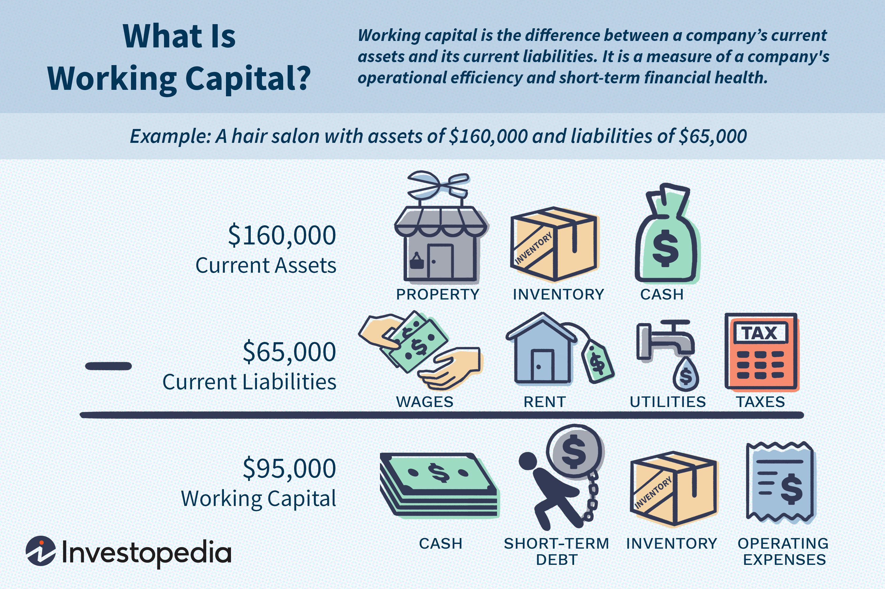

Working capital management is a crucial aspect of financial strategy across various industries, notably in the retail and technology sectors. Effective management of working capital, which comprises current assets minus current liabilities, ensures that a company has sufficient liquidity to meet its short-term obligations and fund its operations. In the retail sector, substantial investments in inventory and the need for efficient cash flow management are paramount. Retail companies must carefully balance purchasing, storing, and selling inventory to maintain optimal working capital levels, especially during peak shopping seasons when consumer demand fluctuates significantly.

In contrast, the technology sector presents unique financial dynamics. Software companies typically require less working capital than hardware manufacturers. This disparity arises because software firms often benefit from recurring revenue models through subscriptions and minimal inventory requirements, whereas hardware manufacturers endure substantial upfront costs associated with production and inventory. Consequently, technology businesses must tailor their working capital strategies to their specific operational needs and financial environments.



A technological advancement influencing financial management practices, particularly in the technology sector, is algorithmic trading (algo trading). Algo trading utilizes complex algorithms to automate and optimize trading decisions, improving efficiency in financial operations and cash management. By leveraging big data and advanced computation, algo trading can aid tech companies in making quicker and more informed financial decisions, enhancing overall financial strategy.

Efficient working capital management, particularly with technological integration like algo trading, is vital for maintaining competitiveness and ensuring sustainable growth in both the retail and technology sectors. This strategic approach allows companies to adapt to market changes, optimize their financial operations, and make informed business decisions that support long-term objectives.

## Table of Contents

## Understanding Working Capital

Working capital is a crucial component in the financial health and operational efficiency of a business. It represents the difference between a company's current assets and current liabilities, serving as a measure of its short-term financial health and operational efficiency. Mathematically, working capital can be expressed as:

$$
\text{Working Capital} = \text{Current Assets} - \text{Current Liabilities}
$$

Current assets include cash, accounts receivable, inventory, and other assets that are expected to be converted into cash within a year. Current liabilities are obligations the company needs to settle within the same timeframe, such as accounts payable and short-term debt.

The importance of working capital cannot be overstated. Efficient working capital management ensures that a company has sufficient cash flow to meet its short-term liabilities and operational costs. It allows businesses to maintain smooth operations, manage unexpected financial challenges, and sustain growth and development. Inadequate working capital, on the other hand, can lead to financial distress, hindering the company's ability to invest in growth opportunities and ultimately affecting long-term sustainability.

Working capital requirements can vary significantly across different industries. These variations are largely influenced by the business model, the operating cycle, and the specific financial dynamics of each industry. For instance, retail businesses typically require significant investment in inventory, impacting their working capital needs. Retailers often experience substantial seasonal fluctuations, necessitating a more dynamic approach to managing working capital.

In contrast, technology sectors, especially software companies, may operate with lower working capital. These companies often have fewer tangible assets tied up in inventory and equipment compared to their hardware counterparts. The rapid pace of technological adoption and product development cycles also influences the working capital strategies in this sector. As business models evolve, especially with the integration of Software as a Service (SaaS) and cloud computing, the working capital dynamics continue to shift, highlighting the need for adaptable financial strategies tailored to industry-specific conditions.

## Working Capital in the Retail Sector

The retail sector is inherently dependent on inventory management, which plays a critical role in determining its working capital needs. Working capital, defined as the difference between a company's current assets and current liabilities, is a vital financial metric for retail businesses, where maintaining a delicate balance between supply and demand is crucial for success.

In retail, inventory constitutes a significant portion of current assets. Effective inventory management directly impacts cash flow and [liquidity](/wiki/liquidity-risk-premium). Retail businesses must ensure optimal inventory levels to meet customer demand without overcommitting resources, which can lead to excess stock and increased holding costs. Conversely, inadequate inventory levels can result in lost sales and decreased customer satisfaction. Therefore, the management of inventory is pivotal in maintaining a healthy working capital.

The operating cycle in retail refers to the time it takes for a company to purchase inventory, sell it, and collect cash from sales. This cycle consists of three main stages: inventory acquisition, sales generation, and accounts receivable collection. Efficient management of the operating cycle enhances cash flow management by reducing the time and cost associated with each phase. For instance, shortening the inventory turnover period and accounts receivable days can free up cash, thus optimizing working capital.

Seasonal fluctuations significantly influence working capital requirements in the retail sector. During peak shopping seasons, such as holidays, retailers often experience increased demand, necessitating higher inventory levels. This surge in inventory amplifies the need for additional working capital to finance stock purchases and extended payment terms with suppliers. Retailers must strategically plan for these periods by securing sufficient financing or credit lines to support higher working capital needs without adversely affecting their cash flow.

Overall, working capital management in the retail sector demands careful coordination and strategic planning, taking into account inventory management, operating cycle efficiency, and seasonal demand variations. By optimizing these elements, retailers can ensure they have the necessary liquidity to support ongoing operations and seize growth opportunities.

## Working Capital in the Technology Sector

Working capital management in the technology sector presents unique challenges and opportunities, particularly when contrasting software companies with hardware manufacturers. These differences primarily arise from the nature of their products, revenue models, and cost structures.

Software companies typically operate with lower working capital requirements compared to their hardware counterparts. This is primarily due to the intangible nature of their products and services, such as software licenses or subscriptions, which do not necessitate large inventories. Software companies often generate revenue through models such as Software as a Service (SaaS), where customers pay ongoing fees for access. This model allows for predictable and recurring revenue streams, reducing the need for significant cash buffers. Moreover, the cost structure of software companies is heavily weighted towards research and development and human resources, which do not burden working capital in the same way as physical inventory would.

Conversely, hardware companies are more dependent on substantial working capital due to the need for physical inventories and the capital-intensive nature of manufacturing processes. These companies must maintain inventories of raw materials, work-in-progress, and finished goods, tying up significant capital. The production and distribution of tangible products necessitate facilities, equipment, and logistics, all of which contribute to higher working capital requirements.

Technological advancements such as SaaS and cloud computing have further influenced working capital strategies within the tech sector. SaaS companies benefit from cloud computing's scalability and low overhead costs, allowing them to streamline operations and reduce fixed asset investments. The shift towards cloud-based solutions reduces the necessity for maintaining physical infrastructures, enabling companies to reallocate resources towards innovation and customer acquisition.

In essence, the technology sector showcases a distinct dichotomy in working capital management. Software enterprises leverage the low capital intensity of their business models to maintain minimal working capital, while hardware manufacturers inherently require more substantial capital to support their operational needs. This dynamic underscores the importance of tailored working capital strategies that reflect the specific demands and growth trajectories of each segment within the technology industry.

## Algo Trading in the Tech Sector

Algorithmic trading, commonly known as algo trading, constitutes the use of automated and pre-programmed trading instructions to execute orders in financial markets. In the tech sector, algo trading plays a pivotal role by enhancing the precision and speed of transactions, thus optimizing financial operations and cash management for tech companies. The integration of sophisticated algorithms allows for the automated buying and selling of assets, leveraging market conditions, and reducing manual intervention, leading to potential improvements in financial efficiency.

The adoption of algo trading within tech companies can significantly optimize their financial operations. Algorithms can process massive datasets at high speeds, identifying patterns and executing trades that capitalize on these insights. This automated process enables companies to manage liquidity more effectively, ensuring optimal cash flow and reducing the holding of non-performing assets. Additionally, it minimizes the risks associated with human error and the latency involved in manual trading, thus leading to more accurate and efficient cash management strategies.

However, integrating algo trading into corporate finance strategies involves both potential benefits and risks. On the benefit side, tech companies can achieve greater market access, enhanced efficiency in trade execution, and lower transaction costs. This is facilitated by algorithms that are capable of analyzing market data in real-time and executing trades based on pre-set conditions, such as price thresholds or market trends. Moreover, the use of [machine learning](/wiki/machine-learning) in algo trading can further refine algorithms' decision-making abilities, leading to improved trade outcomes over time.

Conversely, there are inherent risks associated with algo trading, primarily revolving around technology and market dynamics. The reliance on complex algorithms means that any errors in code or unforeseen market conditions can lead to significant financial losses. Furthermore, the competitive edge in algo trading can diminish quickly as more players enter the market, requiring continuous updates and enhancements to maintain its effectiveness. Market [volatility](/wiki/volatility-trading-strategies) can also exacerbate these risks, as algorithms might react unexpectedly to conditions they were not programmed to handle.

In conclusion, while algo trading offers substantial advantages in optimizing financial operations and enhancing cash management in the tech sector, it is crucial to balance these benefits against the associated risks. Effective implementation requires continuous monitoring and refinement of algorithms to adapt to evolving market conditions and technological advancements. As tech companies increasingly integrate such technologies into their financial strategies, staying abreast of regulatory changes and technological innovations becomes imperative to maximize the benefits of algo trading while minimizing its inherent risks.

## Implications for Business Strategy

Working capital strategies are crucial in shaping long-term business planning in both the retail and technology sectors. These strategies ensure that companies maintain sufficient liquidity to meet their short-term obligations while also investing in growth opportunities. In the retail sector, efficient working capital management translates into better inventory control and cash flow optimization, directly impacting operational efficiency. Retailers must carefully align their purchasing and sales cycles to avoid excess inventory and ensure liquidity for strategic investments.

In contrast, technology companies, particularly those in software, often have lower working capital requirements due to their intangible product offerings. These firms focus on optimizing receivables and payables to sustain innovation and market expansion. Strategic working capital management in tech involves balancing operational agility with investment in research and development, which is essential for maintaining competitive advantage in a rapidly evolving industry.

Algo trading, a technological advancement impacting financial management, plays a pivotal role in enhancing competitiveness by promoting agile financial management. By employing sophisticated algorithms to automate trading and financial operations, companies can significantly reduce response times to market changes, optimize asset allocation, and improve overall financial efficiency. This agility facilitates more precise cash flow projections and scenario analysis, enabling businesses to swiftly adapt their strategies to evolving market conditions.

Python can be employed to create basic predictive models that simulate working capital needs under various market scenarios, aiding decision-making. Below is a simple example of a model estimating cash requirements for a business using Python:

```python
import numpy as np

def simulate_cash_flow(initial_cash, npv_growth_rate, time_periods):
    cash_flows = [initial_cash]
    for _ in range(time_periods):
        cash_flow = cash_flows[-1] * (1 + npv_growth_rate * np.random.normal())
        cash_flows.append(max(cash_flow, 0))  # Ensure cash flow doesn't go negative
    return cash_flows

# Example usage
initial_cash = 1000000  # Initial cash in USD
npv_growth_rate = 0.05  # Assumed net present value growth rate
time_periods = 12  # 12 months to simulate

predicted_cash_flows = simulate_cash_flow(initial_cash, npv_growth_rate, time_periods)
print(predicted_cash_flows)
```

This model simulates cash flow over a specified period, considering potential growth rates and variance. Such simulations can be essential for both retail and tech companies to anticipate potential cash shortfalls or surpluses and adjust their strategies accordingly.

Looking forward, trends such as increasing digitalization, the rise of e-commerce, and advancements in financial technologies will continue to challenge traditional working capital management strategies. Retailers will need to integrate more sophisticated forecasting tools and data analytics to anticipate consumer demand and manage inventory efficiently. Concurrently, technological firms must remain vigilant of the rapid tech evolution, balancing innovation with the necessity for sound cash management.

The integration of AI and machine learning in financial operations, including algo trading, promises improved predictive capabilities that could further transform working capital management. Companies that adapt to these innovations by developing more responsive and data-driven financial strategies will be better positioned to maintain their competitive edge in dynamic markets.

## Conclusion

In comparing the working capital needs of the retail and technology sectors, several key differences emerge. The retail industry, heavily reliant on physical inventory, often requires higher levels of working capital to manage stock, handle seasonal fluctuations, and sustain cash flow during peak shopping periods. This reliance makes efficient inventory management crucial to avoid overstocking or stockouts, both of which can adversely impact financial performance.

Conversely, the technology sector, particularly software companies, tends to operate with relatively lower working capital. This difference can be attributed to the nature of software products, which typically lack physical inventory, and the widespread use of business models such as Software as a Service (SaaS). These models facilitate predictable revenue streams and reduce the need for substantial upfront capital, thus allowing for a leaner working capital strategy. Hardware manufacturers within the tech sector, however, may experience different requirements due to the necessity of managing physical goods.

The strategic importance of efficient working capital management cannot be overstated. For both sectors, effectively managing current assets and liabilities ensures liquidity, supports operational efficiency, and enhances the ability to invest in growth opportunities. Furthermore, integrating technological advancements, such as [algorithmic trading](/wiki/algorithmic-trading) in financial management, can optimize cash flow, improve forecasting accuracy, and enhance decision-making processes.

As businesses continue to operate in an ever-evolving economic landscape, ongoing adaptation and innovation in working capital practices are essential. Companies must stay responsive to technological changes, market dynamics, and consumer behavior shifts. By doing so, they can maintain competitive advantage, ensure financial stability, and position themselves for sustainable growth in an increasingly competitive environment.

## References & Further Reading

[1]: ["Advances in Financial Machine Learning"](https://www.amazon.com/Advances-Financial-Machine-Learning-Marcos/dp/1119482089) by Marcos Lopez de Prado

[2]: ["Quantitative Trading: How to Build Your Own Algorithmic Trading Business"](https://www.amazon.com/Quantitative-Trading-Build-Algorithmic-Business/dp/1119800064) by Ernest P. Chan

[3]: ["Machine Learning for Algorithmic Trading"](https://github.com/stefan-jansen/machine-learning-for-trading) by Stefan Jansen

[4]: ["Corporate Finance, 12th Edition"](https://www.amazon.com/CORPORATE-FINANCE-JEFFREY-BRADFORD-STEPHEN/dp/9390727928) by Stephen A. Ross, Randolph W. Westerfield, and Jeffrey Jaffe

[5]: ["Principles of Corporate Finance"](https://www.wallstreetmojo.com/corporate-finance/) by Richard A. Brealey, Stewart C. Myers, and Franklin Allen